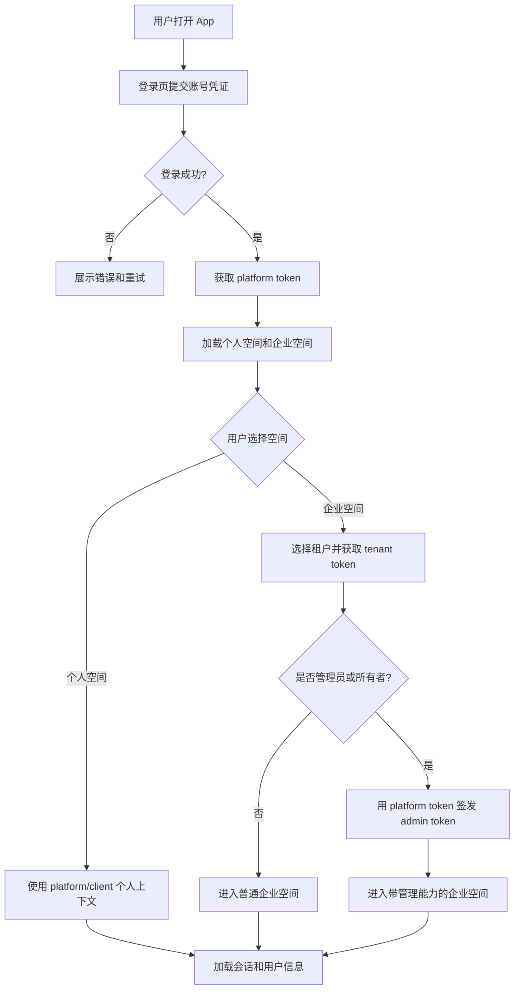
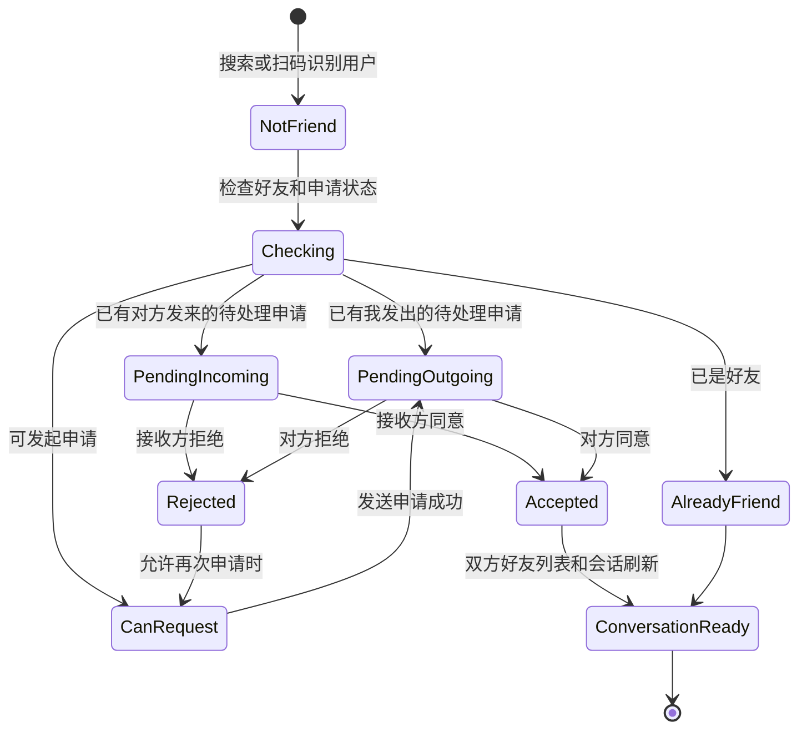
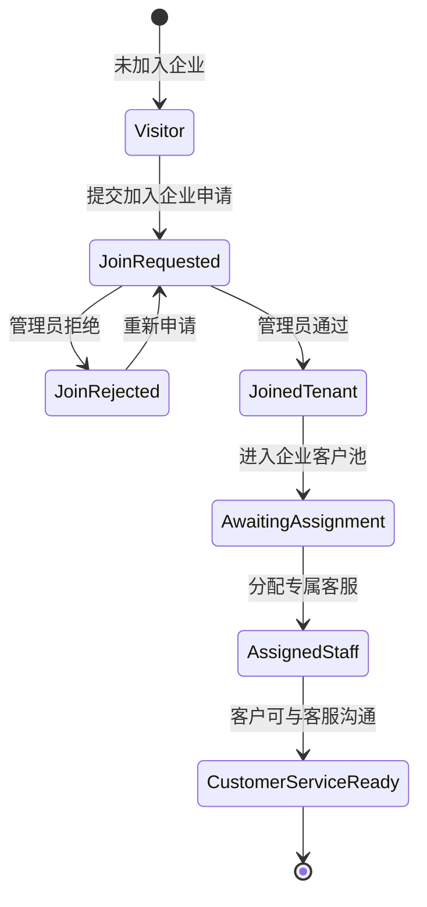
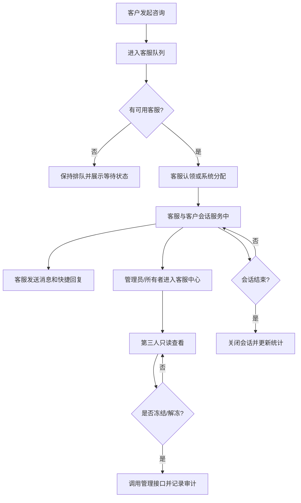
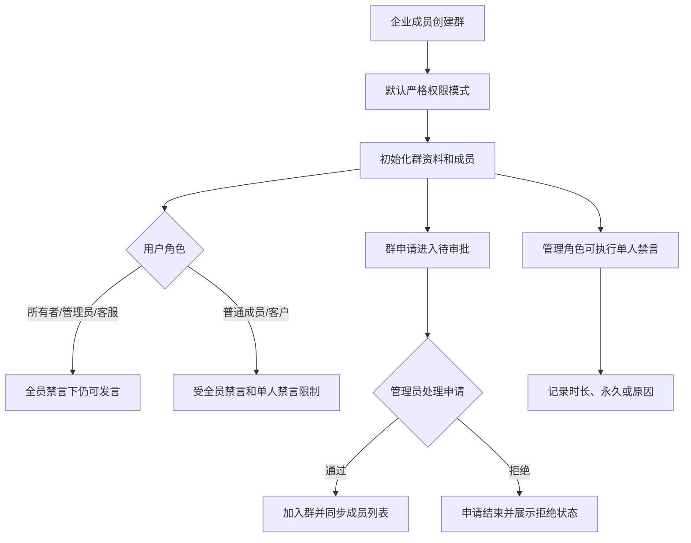
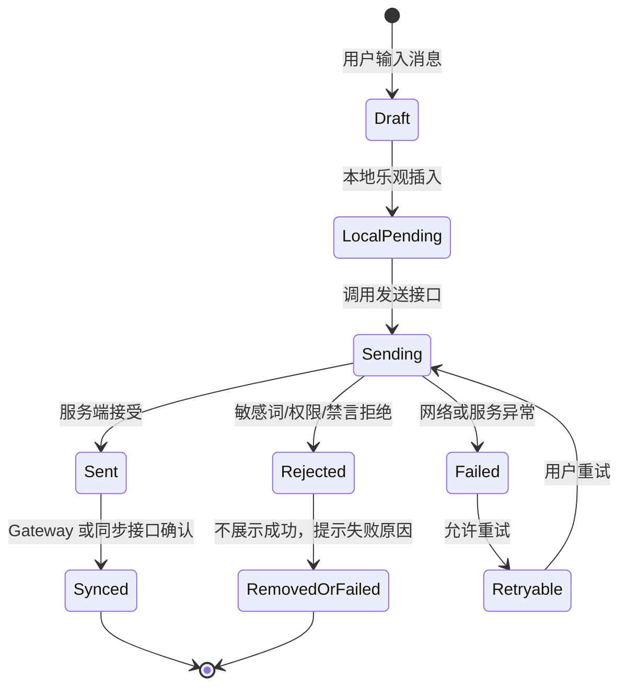
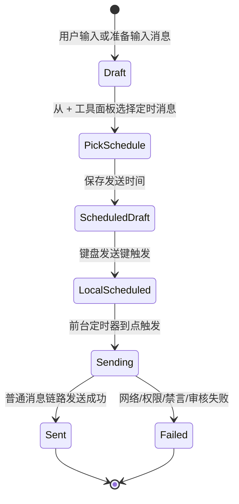
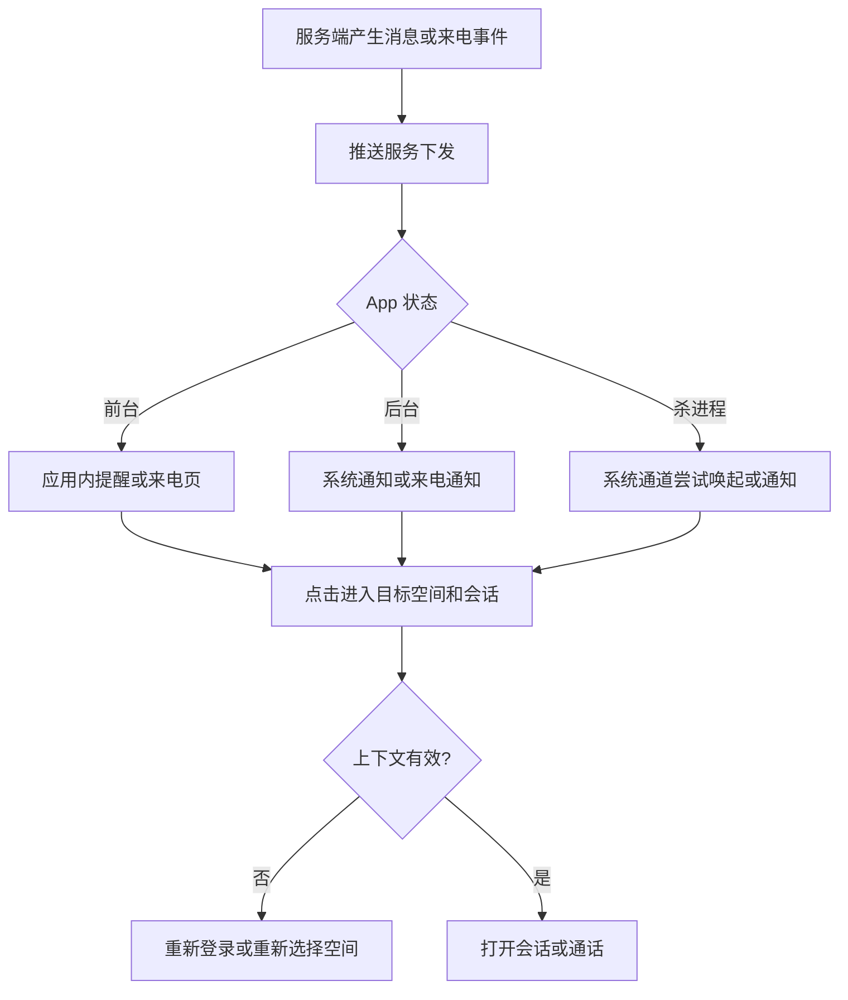

# LPP 需求规格说明书

更新时间：2026-05-22

最后核对方式：基于当前 Flutter 代码目录、路由、接口调用和测试文件静态盘点。本文档不把未执行真机验收的能力写成已验收。

## 1. 产品定位

LPP 是一个集成企业 IM、好友社交、在线客服、客户经营和企业管理的移动端应用。当前仓库交付对象是 Flutter 移动端 App，直接运行和验收优先 Android 真机。

系统包含两条业务线：

| 业务线 | 目标 | 主要对象 |
| --- | --- | --- |
| IM 业务线 | 支持个人空间、企业空间、好友、群聊、组织通讯录和企业成员沟通。 | 客户、普通成员、客服、管理员、所有者 |
| 在线客服业务线 | 支持客户接待、客服状态、排队、客户画像、工单、风险治理和管理监控。 | 客户、客服、管理员、所有者 |

## 2. 用户与空间

### 2.1 空间类型

| 空间 | 说明 | 当前要求 |
| --- | --- | --- |
| 个人空间 | 平台账号的个人聊天空间。 | 可登录、可进入、可展示会话。 |
| 企业员工空间 | 企业内部员工使用的空间。 | 支持组织、群、客户、客服和工作台能力。 |
| 企业客户空间 | 客户加入企业后形成的企业上下文。 | 不能看到内部管理入口。 |
| 在线客服临时会话 | 访客或客户进入客服接待线程。 | 与普通 IM 复用聊天承载，但权限和状态独立。 |

### 2.2 角色定义

| 角色 | 说明 | 核心边界 |
| --- | --- | --- |
| 客户 | 企业外部客户或加入企业的客户身份。 | 不能访问内部工作台、客户池、组织治理和审计。 |
| 普通成员 | 企业内部基础员工。 | 使用基础聊天、组织通讯录和权限内客户沟通。 |
| 技术支持 | 企业内部技术角色。 | 当前按企业成员能力处理，具体差异后续细化。 |
| 客服 | 处理客户会话和客户服务。 | 可以接待客户，不能替代管理员做企业治理。 |
| 管理员 | 企业管理角色。 | 可管理客户、申请、群、会话、审计和部分配置。 |
| 所有者 | 企业最高权限。 | 拥有全局管理、治理和配置能力。 |

### 2.3 权限原则

- 服务端权限校验是最终边界，客户端只负责入口展示和体验控制。
- 管理员/所有者查看客服与客户会话时是第三人只读视角，不能发言。
- 客户画像、交易、工单、投诉和风控信息必须按角色控制字段可见性。
- admin API 必须使用 admin token，不能使用普通 tenant token。

## 3. 角色视图与功能边界

需求规格必须同时支持三种阅读方式：

- 按模块阅读：登录、聊天、好友、群、客服、工作台、通话、推送。
- 按角色阅读：客户、普通成员、客服、管理员、所有者分别能看到什么页面、做什么操作、不能做什么。
- 按端侧阅读：App iOS、App Android、PC 客服客户端分别承载哪些能力、哪些能力只做轻量展示或暂不交付。

角色视图是验收入口之一。任何新增页面、入口、按钮或操作权限，都必须说明影响哪些角色。

### 3.1 客户视图

| 界面/入口 | 应展示能力 | 不应展示能力 | 验收重点 |
| --- | --- | --- | --- |
| 登录与空间选择 | 个人空间、已加入企业空间。 | admin 工作台、企业治理入口。 | 客户账号进入后不暴露内部入口。 |
| 首页会话 | 好友会话、群会话、客服会话、未读。 | 客服接待队列、客户池、审计入口。 | 会话标题、头像、未读和空间隔离正确。 |
| 聊天窗口 | 发送消息、媒体、收藏、翻译对方消息、通话入口。 | 第三人查看、冻结会话、客服接管。 | 消息状态和失败提示准确。 |
| 通讯录 | 好友、群、可见企业联系人。 | 组织治理、客户管理、成员审批。 | 客户文案不使用内部管理语义。 |
| 在线客服 | 发起咨询、查看客服消息、评价或关闭入口。 | 客服状态管理、接管、分配客服。 | 临时会话和普通 IM 权限区分。 |

### 3.2 普通成员视图

| 界面/入口 | 应展示能力 | 不应展示能力 | 验收重点 |
| --- | --- | --- | --- |
| 首页会话 | 企业内部会话、群聊、权限内客户会话。 | 所有者工作台、客户池全量治理。 | 企业空间和个人空间隔离。 |
| 通讯录 | 企业成员、组织、群、好友。 | 管理审批、操作审计、风险治理。 | 组织和客户入口按权限展示。 |
| 群聊 | 群消息、群资料、成员查看。 | 高级群治理能力，除非被授权。 | 客户在群内也按普通成员权限处理。 |
| 客户沟通 | 与权限内客户沟通。 | 客户标签经营、客户分配、客服绩效。 | 不越权查看客户画像敏感字段。 |

### 3.3 客服视图

| 界面/入口 | 应展示能力 | 不应展示能力 | 验收重点 |
| --- | --- | --- | --- |
| 客服工作台 | 在线状态、忙闲、接待中、排队、快捷回复。 | 企业全局配置、所有者治理。 | 状态切换和接待列表同步。 |
| 客服聊天窗口 | 与客户发言、查看客户基础资料、快捷回复、结束服务。 | 查看无权限客户、管理其他客服绩效。 | 客服发言与管理员只读查看区分。 |
| 客户画像 | 客户基础信息、服务所需标签、工单摘要。 | 超出授权的交易敏感字段。 | 字段空值不显示假数据。 |
| 群聊 | 参与被授权群，企业严格群默认可发言。 | 不默认拥有邀请客户或群治理权。 | 客服邀请权限由独立群设置控制。 |

### 3.4 管理员视图

| 界面/入口 | 应展示能力 | 不应展示能力 | 验收重点 |
| --- | --- | --- | --- |
| 管理员工作台 | 客户运营、服务运营、风控治理、群组运营、企业管理分类。 | 所有者专属不可授权配置。 | 分类、卡片和权限一致。 |
| 客户管理 | 客户列表、标签筛选、详情、分配客服、申请状态。 | 使用个人好友标签冒充企业共享标签。 | 标签筛选和客户详情标签口径一致。 |
| 客服中心 | 查看客服人员、客户会话、在线客服会话；人员展示账号在线状态和接待状态。 | 作为第三人发言或替客服接待。 | 会话详情必须是只读视角；账号在线状态缺字段时不得本地猜测。 |
| 群组运营 | App 端提供群组监管和应急处置，PC/后续接口承载完整成员、禁言、解散和风险治理。 | 管理客户私有群。 | 管理范围只针对企业官方管理的群；App 不把复杂治理伪装成已完成能力。 |
| 风控治理 | 风险会话、会话审计、操作审计。 | 伪造审计数据或本地假统计。 | 接口无数据时显示空态或不可用。 |

### 3.5 所有者视图

| 界面/入口 | 应展示能力 | 不应展示能力 | 验收重点 |
| --- | --- | --- | --- |
| 所有者工作台 | 全局客户运营、服务运营、风控治理、群组运营、企业管理。 | 无。 | 与管理员相比拥有更高配置和治理权限。 |
| 企业管理 | 企业信息、公告、成员、配置。 | 使用普通 client token 调 admin API。 | admin token 域隔离。 |
| 服务运营 | 客服中心，包含客服人员、客户会话和在线客服会话。 | 把在线客服和客户会话割裂成两个孤立工作台。 | 统一客服中心口径；管理员/所有者只读监管。 |
| 客户经营 | 客户列表、标签筛选、分配客服、客户画像和工单。 | 展示未授权敏感字段。 | 字段按角色脱敏。 |
| 发布治理 | 查看缺口、风险、测试状态。 | 把未执行验收写成已通过。 | 与版本交付报告一致。 |

## 4. 端侧视图与能力边界

LPP 的业务能力应保持统一，但不同端的承载方式不同。需求文档不为 iOS、Android、Web、Windows 各写一套重复需求，而是采用“主需求统一 + 端侧差异说明”的方式维护。

### 4.1 端侧定义

| 端侧 | 定位 | 当前文档口径 |
| --- | --- | --- |
| App Android | 当前优先运行和验收端。 | 所有移动端能力优先以 Android 真机验收为准。 |
| App iOS | 移动端正式交付目标之一。 | 需求与 Android 基本一致，但推送、后台、权限、通话需要单独验收。 |
| PC 客服客户端 | 在线客服、IM、客户画像、工单和客服效率工具的高效率承载端。 | 已新增 `lpp_pc_client` 独立工程，采用 Electron + React + TypeScript；不部署线上 Web 站点，不做 macOS 客户端。 |

### 4.2 端侧能力矩阵

| 功能域 | App Android | App iOS | PC 客服客户端 | 端侧说明 |
| --- | --- | --- | --- | --- |
| 登录与空间选择 | 支持 | 支持 | 支持 | 登录、空间和 token 域规则保持一致。 |
| 快速登录测试页 | 仅测试环境 | 仅测试环境 | 可选 | 不作为生产能力。 |
| 首页会话 | 支持 | 支持 | 支持 | PC 可采用多栏布局，App 使用列表优先。 |
| 聊天窗口 | 支持 | 支持 | 支持 | PC 可同时展示会话列表、聊天区、客户资料侧栏。 |
| 消息搜索与收藏跳转 | 支持 | 支持 | 支持 | PC 更适合高级筛选，App 保持轻量入口。 |
| 快捷翻译 | 支持 | 支持 | 支持 | 默认只翻译对方消息。 |
| 好友与扫码 | 支持 | 支持 | 部分支持 | 扫码主要由 App 承载，PC 可支持输入码或链接。 |
| 通讯录与组织 | 支持 | 支持 | 支持 | PC 可增强组织树和批量操作。 |
| 群聊 | 支持 | 支持 | 支持 | 基础群聊一致。 |
| 群治理 | 支持核心操作 | 支持核心操作 | 后续扩展 | 完整治理不进入 PC 客服客户端一期主链路。 |
| 在线客服接待 | 支持轻量接待 | 支持轻量接待 | 支持完整工作台 | App 负责移动接入、接管、回复、关闭和重点信息查看；PC 负责三栏/多栏接待、队列管理、客户上下文常驻、SLA 和团队协同。 |
| 会话管理 | 支持管理入口和只读查看 | 支持管理入口和只读查看 | 后续扩展 | 管理员/所有者完整管理视图不进入 PC 一期。 |
| 客户管理 | 支持核心查询和操作 | 支持核心查询和操作 | 后续扩展 | 客户标签、分配客服和客户状态需要多端口径一致。 |
| 客户画像 | 摘要展示 | 摘要展示 | 完整侧栏/详情页 | App 展示基础资料、标签、账户概况、历史交易概况、临时订单和工单摘要；PC 展示完整客户全景、交易、资金、会话、工单、触达、KYC/合规、IB/设备。 |
| 工单信息 | 摘要和跳转 | 摘要和跳转 | 完整列表和详情 | 工单主处理建议放 PC，App 做查看和轻处理。 |
| 风控与审计 | 核心查看 | 核心查看 | 后续扩展 | 审计和风控以 PC 高效率查询为主，但不进入客服客户端一期。 |
| 音视频通话 | 支持 | 支持 | 视方案支持 | App 需重点验证后台、锁屏、音频路由；PC 需独立技术方案。 |
| 推送和来电通知 | JPush/FCM/厂商通道 | APNs | Electron 系统通知 | 每个端的通知机制不同，必须分别验收。 |

### 4.3 端侧设计原则

- 同一业务状态在不同端必须使用同一服务端口径，不能出现 App 显示已处理、PC 显示待处理。
- App 端优先移动场景：快速查看、即时沟通、轻量审批、移动接待、扫码、通话和通知。
- PC 端优先工作台场景：客服接待效率、客户画像、工单处理、批量筛选、审计追溯、管理配置。
- 在线客服场景中，App 不照搬 PC 三栏大屏；App 只承载轻量接待、快速回复、快速接管和重点资料查看，PC 承载完整客服工作台。
- App 不承载完整交易明细表、资金流水明细表、大量工单处理流、报表生成、批量筛选、完整运营分析、质检和审计追溯；这些能力可在 App 做入口或摘要，完整能力放 PC。
- 端侧差异不能改变服务端权限边界，不能让某个端绕过角色权限。
- 当前仓库主要实现 Flutter App；PC 客服客户端由 `lpp_pc_client` 独立工程承接，一期聚焦客服主工作台，管理员/所有者完整管理后台后续扩展。

### 4.4 单条需求写法要求

后续新增或调整需求时，每条需求必须包含以下字段：

```text
适用角色：
适用端：
角色差异：
端侧差异：
验收标准：
待验证/依赖：
```

如果某个功能只在特定角色或特定端可见，必须在需求条目中明确写出；不能只在 UI 或代码里隐含。

## 5. 需求清单

### REQ-AUTH-001 登录与空间选择

目标：用户可以通过邮箱、手机号、绿泡泡号或测试快速登录进入个人空间或企业空间。

适用角色：全部。

适用端：App Android、App iOS、PC 客服客户端。

端侧差异：App 端优先移动登录和快速进入；PC 端登录后更偏向工作台和多栏管理界面。快速登录测试页仅用于测试环境。

主流程：

1. 用户进入登录页。
2. 选择登录方式并提交账号凭证。
3. 客户端获取 platform token。
4. 用户选择个人空间或企业空间。
5. 客户端获取当前空间业务 token 并进入首页。

验收标准：

- 邮箱、绿泡泡号登录可用。
- 进入租户空间后能加载会话和当前用户信息。
- 退出登录有 loading 和失败提示。
- 快速登录只作为测试能力，不应作为正式生产入口暴露。

未完成/待验证：

- 手机验证码链路、异常账号、弱网退出登录需要真机回归。
- 长期登录态和设备级凭证策略需要服务端进一步明确。

### REQ-AUTH-002 Token 域隔离

目标：平台、客户端业务、管理端接口使用不同 token 域，避免越权。

适用角色：全部，重点管理员和所有者。

适用端：App Android、App iOS、PC Web、PC Windows。

端侧差异：token 域隔离规则各端一致，具体安全存储方式按端侧技术方案分别实现。

规则：

- `/api/platform/v1/*` 使用 platform token。
- `/api/client/v1/*`、`/ws/client`、`/hubs/voicecall` 使用 tenant access token。
- `/api/admin/v1/*` 使用 admin access token。
- admin token 由 platform token 为目标租户签发。
- 客户端通过 `SpaceContext` 维护当前空间、空间类型、用户、租户 token 和 `membershipRole`，角色判断不得只依赖页面入口。

验收标准：

- 普通 tenant token 不调用 admin API。
- admin 401 后清理缓存并重新签发。
- API 日志和调试报告不输出 token 明文。

### REQ-CHAT-001 会话列表

目标：用户进入首页后看到当前空间的会话列表、未读、置顶、免打扰和最后消息。

适用角色：全部。

适用端：App Android、App iOS、PC Web、PC Windows。

端侧差异：App 使用轻量会话列表；PC 可使用会话列表、聊天区、资料侧栏的多栏布局。

验收标准：

- 支持直接会话、群聊、客户会话展示。
- 在线客服访客临时会话 `temp_session` 不进入普通消息列表；客服只能从“客服工作台 > 在线客服”查看排队和进行中临时会话。
- 会话按当前空间隔离。
- 会话列表支持本地缓存优先展示和远端刷新。
- 长列表滚动性能需要建立基线。

待验证：

- 500 条以上会话的滚动性能。
- 多端同步后的顺序、未读和重复消息。

### REQ-CHAT-002 消息收发

目标：用户可以在单聊、群聊和客服线程中发送和查看消息。

消息类型：

- 文本
- 定时文本消息
- 图片
- 视频
- 语音
- 文件
- 名片
- 通话记录
- 回复/转发/收藏相关消息
- 客户端普通群发：从消息首页 `+` 进入，选择当前账号自己的好友和所在群聊，逐个复用普通单聊/群聊发送能力，不属于企业群发或客服工作台能力。

验收标准：

- 消息发送使用本地乐观插入。
- 发送中、发送成功、发送失败、重试和删除状态明确。
- 服务端敏感词或权限拒绝时，客户端不能误显示成功。
- 媒体上传失败可提示并允许重试。
- 客户端普通群发支持搜索、选择多个好友/群聊、逐项显示发送中/成功/失败；单个目标失败不影响其他目标继续发送。
- 聊天输入区右侧固定只展示表情和 `+`；输入文本后不在输入栏右侧显示发送按钮，普通发送由键盘右下角发送键触发。
- 聊天输入区 `+` 工具面板提供定时消息入口；选择未来时间后，输入区展示发送时间，定时发送同样由键盘右下角发送键触发。
- 定时消息在服务端定时任务接口上线前仅作为前台本地能力，不作为可靠离线投递承诺。

待验证：

- 大文件、弱网、断网恢复、多端重复发送。
- 客户端普通群发需要双账号/多群联调验证群禁言、非成员、无权限等服务端拒绝态。
- 图片、视频、语音文件在不同 Android 设备上的选择和预览。
- 定时消息的后台、杀进程、换设备、多端同步和失败回执依赖服务端支持。

### REQ-CHAT-003 搜索、收藏和翻译

目标：用户可以搜索消息、收藏消息、跳转原消息，并快速翻译对方消息。

验收标准：

- 搜索结果可定位到原消息。
- 收藏列表可进入关联消息或会话。
- 快捷翻译只翻译对方消息，不翻译自己的消息。
- 无可翻译内容时展示明确空态。

待验证：

- 超长历史分页定位。
- 翻译接口失败和语言识别失败。
- 收藏跳原消息在消息已删除或分页未加载时的处理。

### REQ-CONTACT-001 好友申请闭环

目标：搜索或扫码加好友后，发送方和接收方状态一致，申请通过后双方会话体现。

主流程：

1. 用户通过搜索或扫码识别目标用户。
2. 客户端检查双方是否已是好友、是否已有待处理申请。
3. 发送好友申请。
4. 接收方在新朋友/申请页处理。
5. 通过后双方好友列表更新，并出现或刷新会话。

验收标准：

- 已好友时不重复发起申请。
- 已处理申请返回 409 时客户端按已处理状态兜底。
- 通过后发送方和接收方状态一致。

待验证：

- 双账号真机流程。
- 重复申请、拒绝后再申请、多端同时处理。

### REQ-CONTACT-002 通讯录与组织

目标：按角色展示好友、企业成员、组织、客户、群和申请入口。

验收标准：

- 客户不能看到内部组织治理和客户池。
- 普通成员看到基础组织和权限内客户。
- 管理员/所有者看到管理入口。
- 客户侧文案保留通讯录心智，不暴露内部管理语义。
- 个人空间展示好友、新朋友、群、收藏和最近联系人；员工空间按角色展示组织、客户、群和申请入口。
- 客户空间区分社交模式和隔离模式，隔离模式下不展示添加好友能力。

### REQ-CUSTOMER-001 客户管理

目标：管理员和所有者能查看客户列表、客户详情、企业归属、申请状态、分配客服和企业共享客户标签。

验收标准：

- 客户管理承载待分配客户，不再需要单独工作台卡片。
- 客户管理需要支持客户分页查询、客户统计看板，并按已分配/未分配两个维度分别统计和分页查询。
- 支持按企业共享标签筛选客户。
- 客户详情中的管理标签不是个人好友标签。
- 分配客服结果需要反映在客户列表或详情。

待验证/依赖：

- 服务端客户标签保存接口稳定性。
- 客户企业状态、申请中、已加入、已分配客服等字段口径。
- 客户分页元信息、已分配/未分配筛选口径和客户统计接口。

### REQ-CUSTOMER-002 客户画像与工单

目标：客户注册或加入企业后，客服、管理员、所有者可以在权限范围内查看客户画像和工单信息。

适用角色：客服、管理员、所有者。

适用端：App Android、App iOS、PC Web、PC Windows。

端侧差异：App 展示客户画像摘要、关键标签、账户概况、历史交易概况、临时订单数据和工单摘要；PC 展示完整客户详情页和常驻上下文侧栏，包含总览、交易记录、资金流水、会话、工单、触达、KYC/合规、IB/设备。

画像字段：

- 姓名、等级、KYC、风险、账户余额、累计入金、净入金、语言、来源、标签。
- 交易概况：订单数、交易产品、胜率、最近交易时间、账户状态、注册日期、IB。
- 临时订单数据：当前临时/持仓/挂单订单的单号、产品、方向、手数、价格、浮盈亏、状态和开仓时间；无数据时显示空态，不造假。
- 工单信息：当前工单、历史工单、处理状态、负责人、更新时间。

验收标准：

- App 端轻量展示，PC 端可作为完整侧栏和客户详情页设计。
- 敏感字段按角色脱敏。
- 无字段时不能显示假数据。
- App 无临时订单时显示“暂无临时订单”；PC 可在完整订单表中提供筛选、详情和风险提示。

依赖：

- 服务端统一客户画像、交易、工单字段。
- 角色级字段可见性规则。

### REQ-GROUP-001 群聊与群资料

目标：支持群聊、群资料、群成员、群公告、群二维码、群备注和群申请。

验收标准：

- 群成员列表可查看。
- 管理员/所有者可查看企业群成员信息。
- 客户作为群内普通成员时不自动获得邀请和管理权限。
- 群申请审批后状态同步。

### REQ-GROUP-002 企业群治理

目标：企业创建群默认使用严格权限模式，支持群治理能力。

治理能力：

- 全员禁言。
- 单人禁言，包含时长、永久禁言和原因。
- 管理员设置。
- 转让群主。
- 解散群聊。
- 群申请审批。

验收标准：

- 全员禁言时管理员、所有者、客服可发言。
- 普通成员和客户禁言规则符合服务端权限。
- 单人禁言同步到多端。

待验证：

- 多角色、多端、服务端拒绝场景。

### REQ-CS-001 客服工作台

目标：客服可以处理待接入、我的会话、在线状态、快捷回复和客户资料。

适用角色：客服。

适用端：App Android、App iOS、PC Web、PC Windows。

端侧差异：App 支持移动轻量接待和状态切换；PC 支持完整接待队列、客户资料常驻侧栏、工单协同、SLA、团队监控和高频快捷操作。

验收标准：

- 客服可切换在线、忙碌、离线。
- 可认领、接管、关闭会话。
- 客服会话聊天页顶部展示接待状态条：AI 接待中显示“AI 正在接待 + 人工接管”，人工接待中显示“我正在接待/某客服正在接待”；人工转 AI 接待本期暂不做，App 不展示入口。
- App 聊天页轻量上下文展示客户姓名、VIP/风险/来源、AI 接待状态、SLA 倒计时；输入区支持快捷话术、知识库、图片/附件、翻译、表情、定时发送和 AI 建议回复。
- App 需要展示客户正在输入、发送失败、合规检查结果、无权限和接口不可用空态。
- PC 默认进入普通消息；在线客服独立为一级入口并采用三栏/多栏高密度形态：左侧队列，中间聊天，右侧客户上下文面板常驻。工作台保留为角色化业务工具入口，按客服、管理员、所有者权限展示客户管理、客服中心、群组监管和企业群发等能力。
- 可查看客户资料卡。
- 快捷回复可拉取和使用。
- 客服工作台当前包含在线客服、客户服务、效能三类视图。
- 客服可以发起客户直连会话、转接直连客户会话，并可进入快捷回复页面；客服工作台不提供企业群发入口。
- 企业群发消息是管理能力，不是客服能力；仅所有者/管理员可在管理工作台或企业管理入口发起，由服务端以企业默认官方账号或指定官方账号异步发送给全体人员、企业员工、企业客户或官方群，并记录实际操作人审计。
- 在线客服访客临时会话以在线客服入口为唯一列表入口；排队、进行中、VIP 和搜索筛选均在在线客服完成，进入聊天页时必须携带客服线程上下文。会话超时作为在线客服会话的状态提示展示，超时判定和关闭原因以后端为准。
- 在线客服页需要支持“当前接待 / 历史会话”切换。历史会话包含访客关闭、客服关闭、超时关闭、系统关闭、已归档等终态会话，只读查看，不允许发送、接入、接管或关闭。
- 进入在线客服工作台只读取状态和会话列表，不自动改变客服接待状态；只有客服明确点击在线、忙碌、短暂离开或离线时，才更新自己的在线客服接待状态。App 和 PC 多端登录时，该状态按同一客服账号和企业空间统一。

待验证：

- 多客服并发接管。
- 真实排队策略、SLA、超时未响应。
- 接管失败和关闭失败的 UI 状态。

### REQ-CS-002 管理端客服中心

目标：管理员和所有者可以在工作台客服中心查看客服人员、客户会话和在线客服会话，进行只读监管。

适用角色：管理员、所有者。

适用端：App Android、App iOS、PC Web、PC Windows。

端侧差异：App 支持移动端只读查看和重点状态；PC 支持筛选、追溯、审计联动和更高密度运营视图。

验收标准：

- 客服中心入口放在服务运营分类。
- 页面包含“客服人员 + 会话”结构，会话分为“客户会话”和“在线客服”两个 Tab。
- 客服人员列表需要展示双状态：账号在线状态、在线客服接待状态。
- 客户会话和在线客服会话均需要支持分页查询和统计，统计不能使用当前页列表本地推断。
- 管理员/所有者进入会话详情是第三人只读视角，不能发送消息。
- App 管理端不提供替客服接待、发言、接管、关闭、冻结/解冻等干预操作。
- 管理端客户列表、客户详情、画像卡、企业共享标签、分配客服和客服会话列表均使用 admin API。

待验证：

- 服务端是否稳定返回客服账号在线状态、客户会话待回复/负载统计、客户会话分页/统计、在线客服会话分页/统计。
- 审计日志字段是否完整。

### REQ-CS-20260610-001 在线客服历史对话、统计与搜寻

目标：系统保存所有已结束的在线客服对话记录，客服可查看本人接待历史，管理员/所有者可查看全量历史、完整对话内容、统计和导出报表。

适用角色：客服、管理员、所有者。

适用端：PC 客服客户端优先，App 可保留轻量查看。

边界：本需求只覆盖在线客服业务线的 `temp_session` 和有客服业务属性的 `im_direct`，不包含普通 IM 私聊和普通群聊。

页面位置：PC 主入口为 `数据中心 > 在线客服 > 历史对话`。统计与搜寻必须放在同一个历史对话页面，不拆成独立“统计分析”页面；工作台只保留概览和跳转，在线客服接待页只保留当前聊天内搜索。

查询条件必须包含：

- 时间范围：`from`、`to`。
- 客户 ID：`customerId`。
- 注册客户用户 ID：`customerUserId`。
- 访客用户 ID：`visitorUserId`。
- 关键字：`keyword`。
- 渠道：`threadType=temp_session/im_direct`。
- 会话状态：`status`。
- 指派客服：`assignedStaffUserId`。
- 曾参与客服：`staffUserId`。
- 语言：`locale`。
- 会话 ID：`conversationId`。
- 发送人：`senderUserId`。
- 来源：`sourcePlatform`、`sourceChannel`、UTM。
- 地区：`country`、`region`。
- 满意度评分、SLA 风险、处理时长，用统计接口或导出字段支撑。

验收标准：

- `历史对话` 页面顶部展示统计摘要，包含对话总量、平均处理时长、满意度评分、地区分布、来源分布等核心指标。
- 统计摘要下方展示同页筛选区，支持时间范围、客户 ID、关键字、渠道、状态、客服、地区、来源等条件组合查询。
- 历史列表支持按条件组合查询、分页和清空筛选。
- 完整对话内容包含消息流、转接记录、关闭原因、评分、备注和时间线。
- 历史会话只读，不允许接入、接管、关闭或发送。
- 导出入口位于同一页面，按当前筛选条件导出历史对话明细和统计报表。

### REQ-CS-20260610-002 转接对话给另一位客服

目标：客服在对话进行中可把当前在线客服会话转交给指定同事，并附加转接备注。

适用角色：客服。

适用端：PC 客服客户端优先，App 可按轻量入口支持。

验收标准：

- 转接入口位于聊天头部、会话列表右键或客户上下文协作区。
- 转接弹窗支持选择目标客服，展示在线状态、负载、技能组和语言能力。
- 转接备注写入内部时间线和审计，不对客户展示。
- 被转接方收到通知并可预览完整历史。
- 客户侧看到礼貌系统提示，不看到内部备注。

### REQ-CS-20260610-003 管理员和所有者实时监控客服对话

目标：管理员和所有者可同步查看所有客服正在进行中的在线客服对话，支持筛选、多窗口并排和必要的运营介入。

适用角色：管理员、所有者。

适用端：PC 客服客户端管理视图优先。

验收标准：

- 入口位于 `工作台 > 客服中心 > 实时监控`。
- 支持按客服、状态、渠道、来源、SLA 风险和关键字筛选。
- 支持 2 到 4 个会话详情并排查看。
- 默认只读；改派、冻结、解冻、强制关闭等动作按权限展示并写入审计。
- 不使用“主管”作为产品角色口径。

### REQ-CS-20260610-004 统计对话

目标：在 `历史对话` 页面内提供多维度在线客服统计能力，支持每日、每周、每月、自定义日期范围和报表导出。

适用角色：管理员、所有者；客服是否可查看个人数据需企业配置确认。

适用端：PC `数据中心 > 在线客服 > 历史对话`。

验收标准：

- 统计不新增独立一级页面，不放入在线客服接待工作区。
- 指标包含对话量、各客服接待数量、平均首次回复时长、平均处理时长、满意度评分、来源渠道分布、地区分布、SLA 风险和转接次数。
- 与历史对话列表共用同一套筛选条件，支持按时间、渠道、客服、来源、地区、状态筛选。
- 离线聚合指标展示最近更新时间。
- 支持 `cs_sessions` 和 `cs_staff_daily_stats` 导出。

### REQ-CS-20260610-005 查看客户正在输入的文字

目标：当客户在输入框打字但尚未发送时，客服端可实时看到客户正在撰写的内容，以便提前准备回复。

适用角色：客服。

适用端：PC 在线客服聊天区优先，App 可轻量展示。

验收标准：

- 输入预览展示在聊天输入区上方，最多 2 到 3 行。
- 超时未更新自动清除，默认 5 秒。
- 输入预览不落库、不进历史、不进搜索、不进报表。
- 客户端隐私条款需要覆盖该能力。
- 客服输入状态给客户侧只显示“正在输入...”，不展示客服草稿内容。

### REQ-CS-20260610-006 查看客户是否已读及已读时间

目标：客服可看到客户是否已读客服发送的消息，以及客户已读时间。

适用角色：客服。

适用端：PC 在线客服聊天区优先。

验收标准：

- 客服自己发出的消息显示未读、已读或已读时间未知。
- 有 `lastReadAt/readAt` 时显示具体时间。
- 历史老数据为 null 时不得显示 1970 或假时间。
- 已读计算以服务端 `lastReadSeq` 和消息 `conversationSeq` 为准。

### REQ-CS-20260610-007 客服静默撤回已发送信息

目标：客服可对在线客服会话内已发送消息执行静默撤回，撤回后客户侧完全不可见，不显示任何“已撤回”提示。

适用角色：客服；具备 `message.recall_any` 权限的管理角色可按审计规则操作。

适用端：PC 在线客服聊天区优先。

边界：只允许在线客服会话使用，普通 IM 私聊和群聊不支持静默撤回。

验收标准：

- 消息右键菜单提供撤回入口，并有二次确认。
- 撤回成功后所有客户侧历史、同步和实时消息流都移除该消息。
- 客户侧不显示撤回占位。
- 管理端审计仍可追溯。
- 普通撤回和静默撤回的 UI 处理明确区分。

### REQ-CS-20260610-008 客户超时关闭后继续对话

目标：当对话因超时自动关闭后，客户仍可通过 Widget 继续对话，并保留先前对话记录。

适用角色：访客客户、客服。

适用端：Widget 客户端负责继续对话入口，PC 客服客户端负责响应重开后的会话状态。

验收标准：

- Widget 终态页展示 `继续对话`。
- 继续对话成功后替换新的 `visitorToken` 并重连。
- 同一访客复访可通过 `resumeRecentSession=true` 复用或重开最近会话。
- PC 端不主动重开会话，只根据服务端状态刷新队列和详情。
- 时间线展示 `reopened` 事件，历史消息连续可见。

设计方案：见 [PC 在线客服八项能力 DDD 与 UI/UX 设计](设计方案/PC在线客服八项能力DDD与UIUX设计.md)。

### REQ-WB-001 管理员和所有者工作台

目标：管理员和所有者按运营流程使用统一分类工作台。

分类：

| 分类 | 入口 |
| --- | --- |
| 客户运营 | 客户管理、加入企业申请、客户增长 |
| 服务运营 | 客服中心 |
| 风控治理 | 风险会话、会话审计、操作审计 |
| 群组运营 | 群组监管 |
| 企业管理 | 企业公告、企业配置 |

验收标准：

- 管理员和所有者使用相同分类标准。
- 具体卡片按权限展示。
- 卡片应有分类说明和清晰业务命名。
- 普通企业成员进入工作台时只展示轻量企业入口；客服进入客服工作台；管理员/所有者进入管理工作台。

### REQ-RISK-001 风控与审计

目标：管理员和所有者可以查看风险会话、超时未响应、会话审计和操作审计。

验收标准：

- 风险会话偏异常识别。
- 会话审计偏历史追溯。
- 操作审计记录操作者、对象、动作、时间、原因和设备来源。
- 敏感词拦截不能让客户端误显示发送成功。

依赖：

- 服务端风险识别、敏感词拦截、超时统计和审计日志接口。

### REQ-CALL-001 音视频通话

目标：支持语音通话、视频通话、来电提醒、接听、拒绝、挂断和通话记录消息。

适用角色：全部具备通话权限的用户。

适用端：App Android、App iOS，PC Web 和 PC Windows 需独立方案确认。

端侧差异：App 重点验收系统权限、后台、锁屏、音频路由和来电通知；PC 端如支持通话，需要单独定义浏览器/桌面权限、设备选择、窗口行为和通知策略。

验收标准：

- WebRTC 通话可建立。
- 通话记录进入消息。
- 音频采集优先开启回声抑制、降噪、自动增益和单声道。
- 后台、锁屏、小窗、音频路由必须真机验收。

待验证：

- 双真机、弱网、VPN、后台、锁屏、厂商系统。

### REQ-PUSH-001 推送与后台通知

目标：支持消息通知、来电通知、前台、后台、杀进程和通知点击跳转。

适用角色：全部。

适用端：App Android、App iOS、PC Web、PC Windows。

端侧差异：Android 使用 JPush/FCM/厂商通道，iOS 使用 APNs，PC 客服客户端使用 Electron 系统通知。

验收标准：

- 前台可显示应用内提醒。
- 后台可显示系统通知。
- 点击通知进入正确空间和会话。
- 来电通知不丢失关键操作。

待验证：

- JPush/FCM 在 Android 真机上的到达率和点击跳转。

### REQ-PROFILE-001 个人资料与账号设置

目标：用户可以查看和维护自己的基础资料、头像、绿泡泡号、隐私设置、登录设备、黑名单、密码和账号注销相关能力。

适用角色：全部。

适用端：App Android、App iOS、PC Web、PC Windows。

端侧差异：App 端承担完整个人设置入口；PC 端可复用同一账号设置能力，但布局可采用侧栏或弹窗。

能力范围：

- 查看和编辑个人资料：昵称、头像、性别、生日、地区、签名、简介等。
- 设置绿泡泡号。
- 修改密码。
- 查看和管理登录设备。
- 维护朋友权限：是否允许手机号搜索、绿泡泡号搜索、好友申请、资料可见范围。
- 查看和移除黑名单用户。
- 提交意见反馈。
- 发起账号注销，以及在可恢复期内取消注销。

验收标准：

- 资料保存成功后刷新当前用户资料。
- 头像上传失败不应覆盖旧头像。
- 隐私设置保存失败要保留用户当前输入并提示重试。
- 黑名单移除后列表刷新。
- 登录设备删除失败不应本地假删除。
- 账号注销和取消注销必须有二次确认和明确结果提示。

待验证：

- 注销状态恢复、登录设备踢出、隐私设置对搜索和好友申请的真实影响，需要双账号和服务端联调验证。

### REQ-SETTINGS-001 应用设置与本地偏好

目标：用户可以配置通知、显示、字体、语言、自动翻译、网络诊断、聊天背景、聊天通用设置和聊天记录管理。

适用角色：全部。

适用端：App Android、App iOS、PC Web、PC Windows。

端侧差异：通知权限、字体缩放、后台通知和系统权限按端侧实现；业务设置字段应保持同一服务端口径。

验收标准：

- 通知设置读取和保存使用服务端设置接口。
- 自动翻译设置影响聊天页快捷翻译行为。
- 线路切换启动逻辑：默认主站为 `主站1`，主站不带 `configline/configfile`；App 启动时按“当前站点 configfile、其他缓存可切换站点 configfile、S3 兜底 configfile”的顺序拉取最新可切换站点列表，任一 configfile 成功后更新本地缓存。
- 线路可用性选择：拉到新站点列表后，总体列表为“主站1 + 新可切换站点”，按该顺序检测可用站点，自动选择第一个检测可用的站点作为实际当前站点；不固定优先主站。
- 线路切换展示：用户弹窗/页面只展示“主站1 + 本地缓存的其他可切换站点”，S3 只作为兜底 configfile，不展示为可选站点。
- 网络诊断只展示诊断结果，不泄漏 token。
- 聊天记录管理、背景和字体设置应不影响消息数据完整性。
- 多语言切换后主要页面文案刷新，不出现明显混语。

待验证：

- 通知设置在 Android 真机、iOS、PC 通知机制上的实际生效结果需要分别验收。

### REQ-ENTERPRISE-001 企业空间管理

目标：企业空间内的管理员和所有者可以查看和维护企业信息、企业功能开关、官方账号、成员、邀请和加入企业流程。

适用角色：管理员、所有者；普通成员按权限只读或不可见。

适用端：App Android、App iOS、PC Web、PC Windows。

端侧差异：App 支持核心企业管理；PC 应更适合批量成员管理、邀请和配置审计。

能力范围：

- 查看企业信息。
- 所有者编辑企业信息。
- 查看和调整企业功能开关，例如好友模式、加入审批模式、客服模式、临时会话。
- 查看官方账号信息。
- 查看成员列表。
- 修改成员角色。
- 移除成员。
- 邀请成员加入企业。
- 普通成员或客户可按入口搜索企业、提交加入申请、使用邀请码加入。

验收标准：

- 企业信息和功能开关修改后刷新显示。
- 成员角色修改、移除成员必须按服务端权限处理。
- 邀请和加入企业申请状态需要可追踪。
- 退出企业必须二次确认。

待验证：

- 成员角色修改后的权限刷新、邀请链接有效期、加入申请多端状态需要联调。

### REQ-NOTICE-001 企业公告与通知内容

目标：用户可以查看企业公告列表和公告详情；管理员/所有者在工作台中拥有企业公告管理入口。

适用角色：全部可按权限查看；管理员和所有者可进入管理入口。

适用端：App Android、App iOS、PC Web、PC Windows。

验收标准：

- 公告列表可加载、刷新和进入详情。
- 公告详情加载失败展示错误态。
- 企业公告管理入口应受角色权限控制。

待验证：

- 公告发布、撤回、已读统计和多端同步需要服务端接口确认。

### REQ-PRESENCE-001 在线状态

目标：客户端展示联系人或会话成员在线状态，并允许用户设置自己的状态。

适用角色：全部。

适用端：App Android、App iOS、PC Web、PC Windows。

验收标准：

- 支持批量查询在线状态。
- 支持单个用户在线状态查询。
- 支持设置自定义状态。
- Gateway 收到在线状态变化后刷新本地状态。

待验证：

- 多端登录、离线延迟、后台状态和客服在线状态之间的口径需要服务端确认。

## 6. 非功能需求

### 6.1 安全

- 所有 token、cookie、密码、验证码不得明文出现在日志和报告。
- 客户隐私和交易信息默认最小可见。
- 管理操作必须有审计。

### 6.2 性能

- 会话列表、聊天页、客户列表、群成员列表必须支持长列表。
- 图片、语音、视频、文件需要缓存或流式加载策略。
- 当前尚未建立性能基线，不得标记为性能已验收。

### 6.3 稳定性

- 网络错误不能误清 token。
- WebSocket 断线后需要重连和增量同步。
- 重复点击、并发审批、并发接管必须有防护。

### 6.4 可维护性

- 每个非简单改动必须同步检查 ECC 文档。
- 功能矩阵状态必须有代码、接口、测试或真机证据。

## 7. 当前版本范围

本节用于避免“需求写了很多，但不知道当前版本是否必须交付”的问题。状态以功能矩阵和版本交付报告为准。

### 7.1 当前版本必须交付

| 范围 | 必须达到的结果 | 验收方式 |
| --- | --- | --- |
| 登录与空间 | 测试账号可登录，能进入个人空间或企业空间，退出登录有 loading 和失败态。 | Android 真机 + 自动化 |
| 会话列表 | 当前空间会话可加载，未读、标题、头像、最后消息不混空间。 | Android 真机 |
| 基础消息 | 文本消息可发送、失败可提示、敏感词或权限拒绝不误显示成功。 | 双账号 + API |
| 定时消息 | `+` 工具面板可选择定时消息，设置后展示发送时间，使用键盘右下角发送键触发；当前版本只保证前台当前会话内触发。 | 组件测试 + 真机点测 |
| 好友申请 | 搜索或扫码加好友形成发送方、接收方状态闭环。 | 双账号真机 |
| 群聊基础 | 创建群、查看群资料、查看成员、发送群消息。 | 多角色真机 |
| 客服基础接待 | 客服可查看队列、接待客户、关闭会话。 | 客服账号 + 客户账号 |
| 管理员/所有者工作台 | 工作台入口、分类、客户管理、客服中心、群组监管入口按权限展示。 | 多角色 |
| admin token 安全 | 管理接口不使用普通 tenant token。 | 自动化 + 代码审查 |

### 7.2 当前版本部分交付

| 范围 | 当前版本要求 | 不作为当前版本完成条件 |
| --- | --- | --- |
| 客户画像 | App 展示摘要，缺字段显示空态；不显示假数据。 | 完整交易明细、完整工单处理流。 |
| 客户标签 | 支持企业共享标签展示、筛选、保存的客户端接入。 | 后端无接口时不做本地假筛选。 |
| 群治理 | 支持严格默认权限、全员禁言、单人禁言、申请审批。 | 企业群和客户自建群的服务端范围若未区分，需标记依赖。 |
| 客服中心 | 管理员/所有者只读查看客服人员、客户会话和在线客服会话。 | 转派、强制关闭、批量操作。 |
| 风控审计 | 有入口、空态、接口接入点。 | 服务端风险识别和完整审计数据。 |
| 通话 | App 端基础语音/视频通话可用性验证。 | PC 通话、所有厂商后台保活完整闭环。 |
| 推送 | Android 真机消息通知和来电通知专项验证。 | 全厂商到达率承诺。 |

### 7.3 后续版本范围

| 范围 | 后续目标 |
| --- | --- |
| PC 客服客户端 | 完整客服接待、客户画像侧栏、工单、桌面通知、多窗口客服、设备选择、通话策略。 |
| 工单系统 | 工单创建、分派、处理、关闭、评价、统计。 |
| 风控策略 | 敏感词、辱骂识别、联系方式索要识别、超时未响应、风险干预闭环。 |
| 报表和绩效 | 服务效率、响应时长、接待量、客户增长、风险趋势。 |

## 8. 角色权限矩阵

图例：`可操作` 表示可查看并执行操作；`只读` 表示可查看但不能修改或发言；`不可见` 表示不应展示入口；`依配置` 表示受企业配置、群设置或服务端权限控制。

| 功能 | 客户 | 普通成员 | 客服 | 管理员 | 所有者 |
| --- | --- | --- | --- | --- | --- |
| 登录与空间选择 | 可操作 | 可操作 | 可操作 | 可操作 | 可操作 |
| 个人/企业会话 | 可操作 | 可操作 | 可操作 | 可操作 | 可操作 |
| 客服临时会话发言 | 可操作 | 依配置 | 可操作 | 只读 | 只读 |
| 第三人查看客服会话 | 不可见 | 不可见 | 不可见 | 只读 | 只读 |
| 好友申请 | 依企业好友模式 | 可操作 | 可操作 | 可操作 | 可操作 |
| 组织通讯录 | 受限查看 | 可查看 | 可查看 | 可查看 | 可查看 |
| 客户管理 | 不可见 | 不可见 | 受限查看 | 可操作 | 可操作 |
| 企业共享客户标签 | 不可见 | 不可见 | 受限查看 | 可操作 | 可操作 |
| 客户画像 | 自己相关 | 不可见 | 受限查看 | 可查看 | 可查看 |
| 工单信息 | 自己相关 | 不可见 | 可操作或只读 | 可查看 | 可查看 |
| 群聊发言 | 可操作 | 可操作 | 可操作 | 可操作 | 可操作 |
| 群成员查看 | 依群设置 | 依群设置 | 依群设置 | 可查看 | 可查看 |
| 群治理 | 不可见 | 依配置 | 依配置 | 可操作 | 可操作 |
| 全员禁言下发言 | 不可发言 | 不可发言 | 可发言 | 可发言 | 可发言 |
| 单人禁言 | 不可见 | 不可见 | 依配置 | 可操作 | 可操作 |
| 客服状态 | 不可见 | 不可见 | 可操作 | 可查看 | 可查看 |
| 客服接管/关闭 | 不可见 | 不可见 | 可操作 | 只读或依配置 | 只读或依配置 |
| 风险会话 | 不可见 | 不可见 | 不可见 | 可查看 | 可查看 |
| 会话审计 | 不可见 | 不可见 | 不可见 | 可查看 | 可查看 |
| 操作审计 | 不可见 | 不可见 | 不可见 | 可查看 | 可查看 |
| 企业配置 | 不可见 | 不可见 | 不可见 | 依授权 | 可操作 |

## 9. 页面级需求

页面级需求用于补足“模块需求无法指导 UI、测试和权限验收”的缺口。当前页面路径以 Flutter 代码现状为参考，后续路由变化需要同步更新。

| 页面 | 入口 | 适用角色 | 适用端 | 关键展示 | 关键操作 | 空态/错误态 |
| --- | --- | --- | --- | --- | --- | --- |
| 登录页 | App 启动未登录 | 全部 | App/PC | 登录方式、账号输入、密码/验证码、Logo 触发测试入口 | 登录、快速登录、收起键盘 | 账号错误、网络失败、loading |
| 快速登录页 | 登录页 Logo 连点 | 测试环境全部 | App | 分组测试账号、姓名、邮箱/手机/绿泡泡号、企业/客服信息 | 直接登录 | 登录失败、账号缺字段 |
| 空间选择页 | 登录后多空间 | 全部 | App/PC | 个人空间、企业空间、角色、未读 | 选择空间 | 无空间、token 失效 |
| 会话列表页 | 首页 | 全部 | App/PC | 会话标题、头像、未读、最后消息、空间 | 进入会话、刷新、搜索 | 无会话、加载失败 |
| 聊天页 | 会话列表/搜索/通知 | 全部 | App/PC | 消息列表、输入区、快捷操作、定时消息、翻译、收藏、通话 | 发消息、媒体、定时发送、收藏、翻译、通话 | 无消息、发送失败、无权限、定时任务不可用 |
| 客户端群发页 | 消息首页 `+` 菜单 | 全部 | App/PC | 消息内容、好友目标、群聊目标、搜索、逐项结果 | 选择目标、逐个发送普通单聊/群聊消息 | 无好友/群聊、部分失败、全部失败、无权限、群禁言 |
| 搜索页 | 会话/全局搜索 | 全部 | App/PC | 用户、会话、消息结果 | 跳转用户/会话/原消息 | 无结果、分页失败 |
| 通讯录页 | 底部/侧栏入口 | 全部 | App/PC | 好友、企业成员、组织、群、申请入口 | 搜索、查看详情、申请处理 | 无权限、无数据 |
| 好友申请页 | 通讯录/通知 | 全部 | App/PC | 收到/发出的申请、状态、来源 | 发送、接受、拒绝 | 已处理、重复申请 |
| 加入企业申请页 | 通讯录/企业管理 | 管理员/所有者 | App/PC | 加入企业申请人、状态、来源 | 通过、拒绝 | 已处理、并发处理 |
| 我的客户页 | 通讯录/客户入口 | 普通成员、客服 | App/PC | 分配给自己的客户、客户状态 | 搜索、进入资料或会话 | 无客户、加载失败 |
| 最近联系人页 | 通讯录 | 全部 | App/PC | 最近联系用户或会话 | 进入资料或会话 | 无最近联系人 |
| 群资料页 | 群聊天右上角 | 群成员/管理角色 | App/PC | 群名、成员、公告、二维码、设置 | 查看成员、修改资料、退出 | 群不存在、权限不足 |
| 群公告页 | 群资料/群设置 | 群成员/管理角色 | App/PC | 公告列表、公告内容 | 查看、管理角色新增/编辑/删除 | 无公告、权限不足 |
| 群二维码页 | 群资料 | 群成员/管理角色 | App/PC | 群二维码、群信息 | 展示、分享 | 二维码生成失败 |
| 群已读回执页 | 群消息 | 群成员/管理角色 | App/PC | 已读/未读成员 | 查看回执 | 回执不可用、成员为空 |
| 群管理页 | 群资料/工作台 | 群管理员/管理员/所有者 | App/PC | 群权限、禁言、申请、成员角色 | 全员禁言、单人禁言、审批、解散 | 服务端拒绝、并发变更 |
| 群管理员页 | 群管理 | 群主/管理员/所有者 | App/PC | 群管理员列表、可选成员 | 添加、移除管理员 | 权限不足、并发变更 |
| 转让群主页 | 群管理 | 群主 | App/PC | 可转让成员 | 转让群主 | 二次确认、服务端拒绝 |
| 客服工作台 | 客服入口 | 客服 | App/PC | 待接入、接待中、在线状态、快捷回复 | 接待、接管、关闭、切换状态 | 无会话、接管失败 |
| 快捷回复页 | 客服工作台/聊天输入 | 客服 | App/PC | 快捷回复列表、分类或搜索 | 选择、插入、发送 | 无快捷回复、加载失败 |
| 客户资料卡 | 聊天/客服/客户管理 | 客服/管理员/所有者 | App/PC | 基础资料、标签、风险、工单摘要 | 编辑标签、分配客服、跳转详情 | 无注册资料、接口不可用 |
| 客户管理页 | 工作台客户运营 | 管理员/所有者 | App/PC | 客户列表、企业状态、分配客服、标签 | 搜索、标签筛选、分配客服 | 无客户、无标签、无权限 |
| 客服中心页 | 工作台服务运营 | 管理员/所有者 | App/PC | 客服人员双状态、客户会话、在线客服会话、客服中心概览 | 只读查看会话 | 无客服、无会话、统计不可用 |
| 管理员工作台 | 企业空间管理入口 | 管理员 | App/PC | 客户运营、服务运营、风控治理、群组运营、企业管理 | 进入卡片 | 无权限、接口失败 |
| 所有者工作台 | 企业空间管理入口 | 所有者 | App/PC | 全量分类和配置入口 | 进入卡片、企业配置 | admin token 失败 |
| 风控审计页 | 工作台风控治理 | 管理员/所有者 | App/PC | 风险会话、会话审计、操作审计 | 筛选、查看详情 | 无数据、接口未开通 |
| 个人主页 | 底部我的 | 全部 | App/PC | 当前用户资料、账号入口、二维码、设置入口 | 查看资料、进入设置、退出登录 | 资料加载失败 |
| 个人资料页 | 个人主页 | 全部 | App/PC | 头像、昵称、绿泡泡号、签名、生日、地区等 | 编辑资料、上传头像、设置绿泡泡号 | 保存失败、头像上传失败 |
| 设置页 | 个人主页 | 全部 | App/PC | 通知、显示、语言、自动翻译、隐私、账号、安全、关于 | 修改设置、进入子页面 | 配置保存失败 |
| 聊天通用设置页 | 设置页 | 全部 | App/PC | 聊天偏好、本地聊天行为 | 修改本地聊天偏好 | 保存失败 |
| 聊天背景页 | 设置页/聊天设置 | 全部 | App/PC | 背景选择、预览 | 设置背景 | 本地资源不可用 |
| 聊天记录管理页 | 设置页 | 全部 | App/PC | 聊天记录管理入口和说明 | 清理或管理本地记录 | 不得误删服务端事实 |
| 隐私设置页 | 设置页 | 全部 | App/PC | 搜索权限、好友申请、资料可见范围 | 保存隐私设置 | 保存失败、权限不生效 |
| 登录设备页 | 设置页 | 全部 | App/PC | 当前登录设备、历史设备 | 删除设备 | 删除失败、当前设备保护 |
| 黑名单页 | 设置页 | 全部 | App/PC | 已拉黑用户 | 移除黑名单 | 列表为空、移除失败 |
| 意见反馈页 | 设置页/关于页 | 全部 | App/PC | 反馈类型、内容、联系方式 | 提交反馈 | 内容为空、提交失败 |
| 企业管理页 | 工作台/企业入口 | 管理员/所有者 | App/PC | 企业信息、功能开关、成员、邀请、官方账号 | 编辑企业信息、成员管理、邀请 | admin token 失败、权限不足 |
| 企业成员页 | 企业管理 | 管理员/所有者 | App/PC | 成员列表、角色、加入时间 | 修改角色、移除成员 | 权限不足、并发变更 |
| 官方账号页 | 企业管理 | 管理员/所有者 | App/PC | 企业官方账号信息 | 查看配置 | 配置未开通 |
| 企业邀请页 | 企业管理 | 管理员/所有者 | App/PC | 邀请方式、邀请码或链接 | 创建邀请 | 创建失败、过期 |
| 加入企业页 | 空间/邀请入口 | 全部 | App/PC | 企业搜索、邀请码、申请状态 | 搜索企业、提交申请、接受邀请 | 企业不存在、申请中 |
| 公告列表/详情页 | 通知/企业入口 | 全部 | App/PC | 公告标题、内容、时间、发布方 | 查看详情 | 无公告、加载失败 |
| 在线状态 | 会话/通讯录 | 全部 | App/PC | 在线、离线、自定义状态 | 设置状态、刷新状态 | 状态延迟、Gateway 断开 |
| 通话页/来电页 | 聊天通话入口/通知 | 有通话权限用户 | App | 来电人、通话状态、音频路由、计时 | 接听、拒绝、挂断、切换摄像头 | 权限拒绝、连接失败 |

## 10. 字段级规格

字段级规格用于约束后端、前端、测试对同一数据的理解。字段名以当前客户端和接口依赖文档为参考；服务端正式合同恢复后，应以 `api-contracts` 目录为准。

### 10.1 通用字段规则

| 规则 | 要求 |
| --- | --- |
| ID 字段 | 不在 UI 中直接暴露，调试和服务端交接可保留。 |
| 时间字段 | UI 使用本地时区展示，接口保留 ISO 8601。 |
| 头像字段 | 空值显示默认头像，不显示破图。 |
| 金额字段 | 需要明确币种、精度和脱敏规则，不允许前端猜手续费或净值口径。 |
| 枚举字段 | 未识别枚举显示保守文案，不导致页面崩溃。 |
| 敏感字段 | 手机、邮箱、交易、KYC、风险字段按角色脱敏。 |

### 10.2 会话列表字段

| 字段 | 展示名 | 类型 | 来源 | 空值显示 | 角色可见性 |
| --- | --- | --- | --- | --- | --- |
| `conversationId` | 会话 ID | string | 会话接口 | 不展示 | 内部使用 |
| `conversationType` | 会话类型 | enum | 会话接口 | 未知会话 | 全部 |
| `title` | 会话标题 | string | 会话接口/用户资料 | 默认标题 | 全部 |
| `avatarUrl` | 头像 | string | 会话接口/用户资料 | 默认头像 | 全部 |
| `lastMessage.preview` | 最后一条消息 | string | 会话接口 | 暂无消息 | 全部 |
| `lastMessage.sentAt` | 最后时间 | datetime | 会话接口 | 空 | 全部 |
| `unreadCount` | 未读数 | int | 会话接口/本地同步 | 0 | 全部 |
| `isPinned` | 置顶 | bool | 会话接口/本地设置 | false | 全部 |
| `isMuted` | 免打扰 | bool | 会话接口/本地设置 | false | 全部 |
| `peerUserType` | 对方类型 | enum | 会话接口 | 普通用户 | 全部 |

### 10.3 消息字段

| 字段 | 展示名 | 类型 | 来源 | 空值显示 | 角色可见性 |
| --- | --- | --- | --- | --- | --- |
| `messageId` | 消息 ID | string | 服务端/本地临时 | 不展示 | 内部使用 |
| `localId` | 本地 ID | string | 客户端 | 不展示 | 内部使用 |
| `senderUserId` | 发送人 | string | 消息接口 | 未知用户 | 当前会话成员 |
| `messageType` | 消息类型 | enum | 消息接口 | 不支持的消息 | 当前会话成员 |
| `content` | 文本内容 | string | 消息接口 | 空消息 | 当前会话成员 |
| `mediaUrl` | 媒体地址 | string | 消息接口 | 加载失败 | 当前会话成员 |
| `sentAt` | 发送时间 | datetime | 消息接口 | 空 | 当前会话成员 |
| `status` | 发送状态 | enum | 本地/服务端 | 未知状态 | 当前发送方 |
| `scheduledAt` | 定时发送时间 | datetime | 客户端本地/待服务端接口 | 不展示 | 当前发送方 |
| `isRecalled` | 是否撤回 | bool | 消息接口 | false | 当前会话成员 |
| `translatedText` | 翻译内容 | string | 翻译接口 | 不展示 | 当前用户本地视图 |

### 10.4 客户字段

| 字段 | 展示名 | 类型 | 来源 | 空值显示 | 角色可见性 |
| --- | --- | --- | --- | --- | --- |
| `userId` | 客户 ID | string | admin/client 用户接口 | 不展示 | 管理角色内部使用 |
| `displayName` | 客户姓名 | string | 用户资料 | 未命名客户 | 客服/管理员/所有者 |
| `lppId` | 绿泡泡号 | string | 用户资料 | `-` | 客服/管理员/所有者 |
| `email` | 邮箱 | string | 用户资料 | `-` | 按角色脱敏 |
| `mobile` | 手机 | string | 用户资料 | `-` | 按角色脱敏 |
| `tenantStatus` | 企业状态 | enum | 客户管理接口 | `-` | 管理员/所有者 |
| `assignedStaffUserId` | 分配客服 | string | 客户管理接口 | 未分配 | 管理员/所有者 |
| `tags` | 企业共享标签 | string[] | admin 客户接口 | 暂无标签 | 客服受限/管理员/所有者 |
| `avatarUrl` | 头像 | string | 用户资料 | 默认头像 | 客服/管理员/所有者 |

### 10.5 客户画像和工单字段

| 字段 | 展示名 | 类型 | App 显示 | PC 显示 | 角色可见性 |
| --- | --- | --- | --- | --- | --- |
| `level` | 等级 | string | 摘要 | 完整 | 客服/管理员/所有者 |
| `kycStatus` | KYC | enum | 摘要 | 完整 | 管理员/所有者，客服按授权 |
| `riskLevel` | 风险 | enum | 摘要 | 完整 | 客服/管理员/所有者 |
| `accountBalance` | 账户余额 | money | 可脱敏摘要 | 完整或脱敏 | 按角色和企业配置 |
| `totalDeposit` | 累计入金 | money | 可隐藏 | 完整或脱敏 | 管理员/所有者，客服按授权 |
| `netDeposit` | 净入金 | money | 可隐藏 | 完整或脱敏 | 管理员/所有者，客服按授权 |
| `language` | 语言 | string | 展示 | 展示 | 客服/管理员/所有者 |
| `source` | 来源 | string | 展示 | 展示 | 客服/管理员/所有者 |
| `orderCount` | 总订单 | int | 摘要 | 完整 | 客服/管理员/所有者 |
| `lastTradeAt` | 最近交易时间 | datetime | 摘要 | 完整 | 管理员/所有者，客服按授权 |
| `temporaryOrders` | 临时订单数据 | list | 摘要列表 | 完整列表和详情 | 客服/管理员/所有者，按授权脱敏 |
| `tickets` | 工单 | list | 摘要/跳转 | 列表和详情 | 客服/管理员/所有者 |

### 10.6 客服线程字段

| 字段 | 展示名 | 类型 | 来源 | 空值显示 | 角色可见性 |
| --- | --- | --- | --- | --- | --- |
| `threadId` | 线程 ID | string | 客服接口 | 不展示 | 内部使用 |
| `threadType` | 线程类型 | enum | 客服接口 | 未知类型 | 客服/管理员/所有者 |
| `customerUserId` | 客户 | string | 客服接口 | 未知客户 | 客服/管理员/所有者 |
| `assignedStaffUserId` | 当前客服 | string | 客服接口 | 未分配 | 客服/管理员/所有者 |
| `status` | 线程状态 | enum | 客服接口 | 未知状态 | 客服/管理员/所有者 |
| `queuedAt` | 入队时间 | datetime | 客服接口 | 空 | 客服/管理员/所有者 |
| `lastMessageAt` | 最近消息 | datetime | 客服接口 | 空 | 客服/管理员/所有者 |
| `unreadCount` | 未读 | int | 客服接口 | 0 | 客服 |
| `isFrozen` | 是否冻结 | bool | 管理接口 | false | 管理员/所有者 |

### 10.7 群成员和审计字段

| 字段 | 展示名 | 类型 | 来源 | 空值显示 | 角色可见性 |
| --- | --- | --- | --- | --- | --- |
| `groupId` | 群 ID | string | 群接口 | 不展示 | 内部使用 |
| `memberUserId` | 成员 | string | 群成员接口 | 未知成员 | 群成员/管理员/所有者 |
| `memberRole` | 群角色 | enum | 群成员接口 | 普通成员 | 群成员/管理员/所有者 |
| `muteUntil` | 禁言到期 | datetime/null | 群治理接口 | 未禁言 | 管理角色/本人 |
| `muteReason` | 禁言原因 | string | 群治理接口 | `-` | 管理角色/本人 |
| `auditActor` | 操作者 | string | 审计接口 | 未知 | 管理员/所有者 |
| `auditAction` | 操作 | enum | 审计接口 | 未知操作 | 管理员/所有者 |
| `auditTarget` | 操作对象 | string | 审计接口 | 未知对象 | 管理员/所有者 |
| `auditReason` | 原因 | string | 审计接口 | `-` | 管理员/所有者 |
| `auditCreatedAt` | 操作时间 | datetime | 审计接口 | 空 | 管理员/所有者 |

### 10.8 个人资料、设置和企业字段

| 字段 | 展示名 | 类型 | 来源 | 空值显示 | 角色可见性 |
| --- | --- | --- | --- | --- | --- |
| `loginName` | 登录名 | string | 用户资料 | 不展示或 `-` | 本人/管理视角按权限 |
| `userNo` | 用户编号 | int/string | 用户资料 | `-` | 本人/管理视角按权限 |
| `signature` | 签名 | string | 用户资料 | 暂无签名 | 本人/好友可见范围 |
| `gender` | 性别 | enum | 用户资料 | 未设置 | 本人/好友可见范围 |
| `birthday` | 生日 | date | 用户资料 | 未设置 | 本人/好友可见范围 |
| `location` | 地区 | string | 用户资料 | 未设置 | 本人/好友可见范围 |
| `bio` | 简介 | string | 用户资料 | 暂无简介 | 本人/好友可见范围 |
| `privacy.searchableByMobile` | 手机号搜索 | bool | 隐私设置 | false | 本人 |
| `privacy.searchableByLppId` | 绿泡泡号搜索 | bool | 隐私设置 | true | 本人 |
| `privacy.allowFriendRequest` | 允许好友申请 | bool | 隐私设置 | true | 本人 |
| `notificationSettings` | 通知设置 | object | 设置接口 | 默认设置 | 本人 |
| `deviceId` | 登录设备 | string | 平台账号设备接口 | 不展示 | 本人 |
| `tenantName` | 企业名称 | string | 企业信息接口 | 未命名企业 | 企业成员/管理角色 |
| `tenantCode` | 企业编码 | string | 企业信息接口 | `-` | 企业成员/管理角色 |
| `tenantFeature.friendMode` | 好友模式 | enum | 企业功能接口 | 默认模式 | 管理员/所有者 |
| `tenantFeature.joinApprovalMode` | 加入审批模式 | enum | 企业功能接口 | 手动审批 | 管理员/所有者 |
| `tenantFeature.customerServiceMode` | 客服模式 | enum | 企业功能接口 | 默认模式 | 管理员/所有者 |
| `announcementId` | 公告 ID | string | 公告接口 | 不展示 | 内部使用 |
| `announcementTitle` | 公告标题 | string | 公告接口 | 未命名公告 | 按公告范围 |
| `presenceStatus` | 在线状态 | enum | presence 接口/Gateway | 未知 | 会话和通讯录可见 |

## 11. 核心业务流程图

以下流程图用于约束跨角色、跨端和前后端状态闭环。流程图中的服务端校验不可由客户端本地判断替代。

### 11.1 登录、空间选择和 token 域



### 11.2 好友申请闭环



### 11.3 加入企业、客户归属和分配客服



### 11.4 客服接待和管理端只读查看



### 11.5 群创建和严格权限



### 11.6 消息发送和服务端拒绝



### 11.6A 定时消息发送



约束：

- 当前客户端实现只保证 App 前台且聊天页未销毁时的本地定时触发。
- 可靠的离线定时发送、取消、编辑、多端同步和失败回执必须由服务端定时消息接口承载。

### 11.7 推送和来电通知



## 12. 配置项需求

配置项需要由服务端持久化，客户端只展示和提交配置，不应通过本地开关制造业务事实。

| 配置项 | 作用范围 | 默认建议 | 可配置角色 | 客户端表现 |
| --- | --- | --- | --- | --- |
| 企业社交模式 | 企业 | 关闭或按企业开通 | 所有者/管理员 | 控制员工是否可加企业外好友。 |
| 加好友模式 | 企业/个人 | 需要确认 | 所有者/管理员/用户 | 控制是否允许搜索、扫码、自动通过。 |
| 加入企业审批模式 | 企业 | 手动审批 | 所有者/管理员 | 控制客户加入企业申请流程。 |
| 客服分配模式 | 企业 | 自动优先，允许手动调整 | 所有者/管理员 | 控制新客户分配客服。 |
| 客服状态策略 | 企业 | 客服手动切换 | 所有者/管理员 | 控制在线、忙碌、离线和接待上限。 |
| 企业群默认权限 | 企业 | 最严格权限 | 所有者/管理员 | 新建企业群默认限制邀请和治理权限。 |
| 客服邀请客户入群 | 群/企业 | 关闭，单独配置 | 所有者/管理员 | 客服是否能邀请客户入企业群。 |
| 全员禁言白名单 | 群 | 所有者、管理员、客服 | 所有者/管理员 | 控制禁言下仍可发言角色。 |
| 单人禁言 | 群 | 开启 | 所有者/管理员 | 支持时长、永久和原因。 |
| 会话冻结策略 | 企业/会话 | 仅管理端可操作 | 所有者/管理员 | 冻结后客户和客服端必须有明确提示。 |
| 敏感词拦截 | 企业 | 服务端拦截 | 所有者/管理员 | 发送失败并展示合规提示。 |
| 风险会话识别 | 企业 | 服务端识别 | 所有者/管理员 | 工作台展示风险列表和统计。 |

## 13. 异常、空态和边界场景

| 场景 | 客户端要求 | 不允许行为 |
| --- | --- | --- |
| 401 token 失效 | 尝试刷新或引导重新登录。 | 无限重试、清错空间、误删本地数据。 |
| 403 无权限 | 隐藏或禁用操作，展示无权限提示。 | 继续发起管理操作或展示内部数据。 |
| 409 已处理 | 刷新最新状态，按已处理结果兜底。 | 重复提示失败导致用户误操作。 |
| 500 服务端错误 | 展示可重试错误，记录 requestId。 | 显示成功或吞掉错误。 |
| 网络断开 | 保留本地可读数据，发送进入失败/待重试。 | 清空列表或误退出登录。 |
| 重复点击 | 按钮 loading 或防抖。 | 产生重复申请、重复审批、重复接管。 |
| 数据被他人处理 | 刷新状态并展示“已被处理”。 | 覆盖服务端最终状态。 |
| 当前空间切换 | 清理空间内缓存视图，重新加载空间数据。 | 混用个人空间和企业空间数据。 |
| 客户未注册 | 画像显示“未注册或暂无资料”。 | 显示默认交易金额或假 KYC。 |
| 客户未加入企业 | 客户管理显示企业为 `-` 或申请状态。 | 显示已分配客服。 |
| 申请未审批 | 显示“申请中”。 | 当作已加入企业。 |
| 无客户标签 | 标签筛选空态显示“暂无客户标签”。 | 使用个人好友标签替代企业标签。 |
| 无可翻译消息 | 显示“暂无可翻译的消息”。 | 翻译自己消息或空白结果。 |
| 会话被冻结 | 发言端展示不可发送原因。 | 静默丢消息。 |
| 客服离线 | 客户侧显示等待或排队。 | 假装已接入。 |
| 通话权限拒绝 | 引导打开系统权限。 | 反复弹错误或崩溃。 |
| 推送点击空间失效 | 进入空间选择或登录。 | 打开错误会话。 |

## 14. 验收优先级

| 优先级 | 范围 | 说明 |
| --- | --- | --- |
| P0 | 登录、空间、会话、消息、好友申请、客服基础接待、admin token 安全 | 不通过则不能交付。 |
| P1 | 客户管理、客户标签、群治理、工作台分类、管理端只读会话 | 影响主要业务闭环，需修复或明确延期。 |
| P2 | 客户画像、工单摘要、风控审计、服务效率统计、推送来电通知 | 影响管理效率和服务体验，可按阶段交付。 |
| P3 | PC 完整工作台、批量操作、复杂报表、性能深度优化 | 后续版本规划。 |

## 15. 需求到交付物的映射

| 需求内容 | 对应交付文档 |
| --- | --- |
| 产品范围、角色、端侧、流程 | 本文档 |
| 功能状态、完成度、缺口 | [功能矩阵和实现情况](02-功能矩阵和实现情况.md) |
| 技术实现、模块边界、数据流 | [技术方案](03-技术方案.md) |
| 接口合同和服务端依赖 | [接口与服务端依赖](05-接口与服务端依赖.md)、[服务端接口合同](api-contracts/README.md) |
| 自动化、人工验收、真机测试 | [测试验收方案](04-测试验收方案.md) |
| 发布风险和阻塞项 | [发布风险与检查清单](06-发布风险与检查清单.md)、[版本交付报告](12-版本交付报告.md) |
