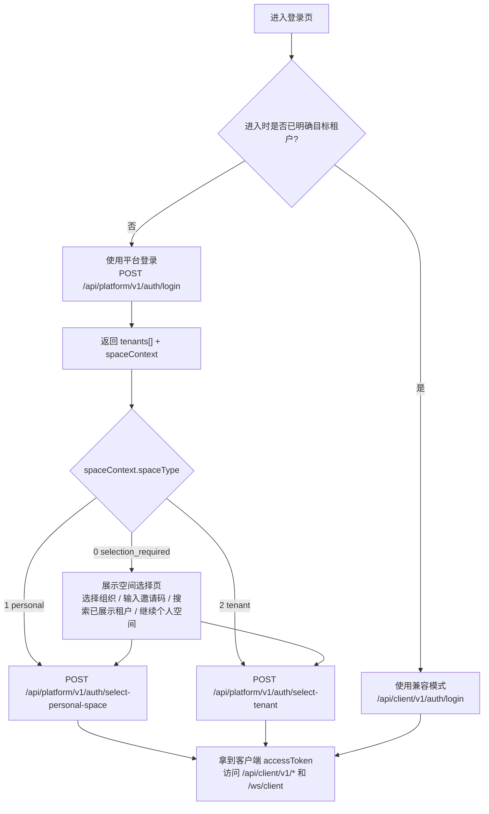

# ZTChat 开发者接入文档

版本:3.0 | 更新日期:2026-05-22

欢迎接入 ZTChat 即时通讯平台。本文档面向 APP / Web 客户端开发者,以及第三方系统集成方。

> 各分文档顶部以 `> 文档校对快照:YYYY-MM-DD` 标注其与源码对齐时的快照日期;最近一次校对的具体范围以各分文档顶部标注为准。

## 快速开始

```text
1. 注册或登录平台账号
2. 平台登录，获取 `platformToken`、`tenants[]` 和 `spaceContext`
3. 进入个人空间时，调用 `POST /api/platform/v1/auth/select-personal-space`
4. 进入租户空间时，调用 `POST /api/platform/v1/auth/select-tenant`
5. 用返回的客户端 `accessToken` 调用 `/api/client/v1/*`
6. 连接 `/ws/client` 接收实时消息；跨空间新消息会收到 `space.notice`，切换到目标空间后再拉取具体内容
7. `/api/open/v1/*` 仅接受租户空间 Token，不接受平台 Token 或个人空间引导态
```

## 文档目录

主文档(必读):

| 文档 | 说明 | 适用对象 |
|---|---|---|
| [client-api.md](./client-api.md) | 平台认证、租户内 REST API、Gateway 接入、访客 Widget、统一客服工作台 | APP / Web / 桌面端 |
| [client-api-reference.md](./client-api-reference.md) | 客户端 REST API 字段、枚举、匿名响应与接口速查 | APP / Web / 桌面端 |
| [admin-api.md](./admin-api.md) | 管理后台认证、统一客服中心、租户后台、音视频运维、AI 服务配置中心、平台管理 | 管理后台 / 私有化部署集成方 |
| [admin-api-reference.md](./admin-api-reference.md) | 管理后台接口、字段、状态、枚举速查 | 管理后台 / 私有化部署集成方 |
| [voice-video-call.md](./voice-video-call.md) | 音视频通话(WebRTC + SignalR)接入 | 需要实时音视频能力的客户端 |
| [voice-video-call-reference.md](./voice-video-call-reference.md) | 音视频通话 Hub 方法、事件、字段、状态速查 | 需要实时音视频能力的客户端 |
| [screen-share.md](./screen-share.md) | 屏幕共享(`getDisplayMedia` / Android `MediaProjection` / iOS `ReplayKit` Broadcast Extension)接入差异点 | 需要屏幕共享能力的客户端 |
| [open-platform.md](./open-platform.md) | BOT / Webhook / 主动发消息 | 第三方系统集成方 |
| [open-platform-reference.md](./open-platform-reference.md) | 开放平台接口字段、Webhook 结构、枚举与错误码速查 | 第三方系统集成方 |
| [field-enum-reference.md](./field-enum-reference.md) | 跨文档共享的枚举值表、补遗字段表 | 所有接入方 |
| [followme.md](./followme.md) | 端到端业务流程引导 | 所有接入方 |

辅助文件:

| 文件 | 说明 |
|---|---|
| [friend-invite-qr.html](./friend-invite-qr.html) | "扫码加好友"客户端 SDK 示例页 |
| [payloads/](./payloads/) | 真实响应示例（辅助参考，不承担字段定义职责） |

## 字段字典、枚举与接口速查索引

| 文档 | 字段字典 / 术语表 | 枚举表 | 接口速查 |
|---|---|---|---|
| [client-api.md](./client-api.md) | 第 18 节 | 第 19 节 | [client-api-reference.md](./client-api-reference.md) |
| [admin-api.md](./admin-api.md) | 结合 [field-enum-reference.md](./field-enum-reference.md) | [admin-api-reference.md](./admin-api-reference.md) | [admin-api-reference.md](./admin-api-reference.md) |
| [open-platform.md](./open-platform.md) | 第 9 节 | 第 10 节 | [open-platform-reference.md](./open-platform-reference.md) |
| [voice-video-call.md](./voice-video-call.md) | (集中在 reference) | (集中在 reference) | [voice-video-call-reference.md](./voice-video-call-reference.md) |

统一补遗入口:

- [field-enum-reference.md](./field-enum-reference.md)
  这里集中补齐了 `3rddocs` 里原本分散或遗漏的字段与枚举,包括 `joinMethod`、`membershipStatus`、`userType`、`deviceType`、消息类型、音视频状态、AI 服务相关枚举(`ragFusionStrategy` 等)、Webhook 投递状态等。

## 文档风格约定

- 主说明文档优先做到"单文档闭环":接口字段、响应 `data` 字段、常用状态值应直接写在正文里;过长或跨多份主文档复用的字段集中放在 [field-enum-reference.md](./field-enum-reference.md)
- `payloads/` 下的 JSON 仅作为示例,不再承担字段定义职责
- 统一响应包默认写法为 `{ code, message, requestId, data }`;`code` 字段成功时为 `"OK"`,失败时为大写蛇形错误码(详见对应分文档)
- 列表容器形式:直接数组、`{ items, nextCursor }`、`{ items, totalCount }`、分桶容器(如客服线程列表的 `{ queueItems, activeItems }`)
- 枚举与状态优先写成显式值表,例如 `0=member`、`1=admin`
- 当主文档为了篇幅不展开完整 DTO 时,再由 `*-reference.md` 和 [field-enum-reference.md](./field-enum-reference.md) 承接速查
- 文档**面向第三方开发者**——内部命名(类名、文件路径、数据库表名、commit hash 等)不会出现在本目录任何文件中;所有描述均以对外可观察的行为契约为准

## 多租户模型

| 概念 | 说明 |
|---|---|
| 平台账号 | 全局唯一身份主体，拥有全局唯一 `lpp_id`，可用手机号或邮箱注册 |
| 租户 | 独立企业空间，拥有独立成员、组织与业务数据 |
| 租户内用户 | 平台账号加入某个租户后，在该租户下生成的投影身份 |
| 个人空间 | 平台账号在未加入任何租户或主动不进入租户时使用的基础空间；企业绑定模式下个人空间不可用 |
| 平台 Token | 用于平台级操作，如查看已加入租户、输入邀请码、选择进入个人空间或租户空间 |
| 客户端业务 Token | 用于 `/api/client/v1/*`、`/ws/client` 与 `/hubs/voicecall`；个人空间和租户空间都会换取这一类 Token |
| 访客 Token | 仅用于 `/api/widget/v1/*`；由 Widget 创建会话、刷新、关闭或重开会话时返回 |
| 企业绑定模式 | 可选的部署模式，启用后禁止自建租户、禁止加入/退出租户、禁止个人空间，用户只能在预分配的租户中操作 |

## 推荐认证流程

```text
平台注册或平台登录
  ↓
返回 platformToken + 已加入且已激活的 tenants[] + spaceContext
  ↓
根据 spaceContext 决定进入个人空间 / 指定租户 / 组织选择页
  ↓
调用 select-personal-space 或 select-tenant
  ↓
返回客户端业务 accessToken + refreshToken + tenantId + userId
  ↓
调用业务接口 / 连接实时网关
```

补充：

- 当用户同时拥有多个企业空间时，如果上次进入的是某个仍然有效的企业空间，平台登录后 `spaceContext` 会默认指向这个上次空间
- 当用户停留在 A 空间时，B 空间来了新消息，Gateway 只会推送 `space.notice` 全局提醒，不会直接透出消息正文
- 如需展示空间级红点或总未读计数，可使用平台接口 `GET /api/platform/v1/my/spaces/unread-summary`
- 建议客户端在个人空间和企业空间首页都提供一个固定"我的备忘"入口：进入后可用当前空间的 `userId` 调用 `POST /api/client/v1/direct-chats` 创建/复用自聊会话
- 企业绑定模式下，`select-personal-space` 会返回 `PERSONAL_SPACE_DISABLED` 错误；单租户用户登录后 `spaceContext` 自动指向唯一租户，多租户用户需要手动选择

默认情况下，APP / Web / 桌面端应优先采用上面的"平台登录 -> 选择租户"流程。

仅当客户端在进入登录页之前就已经明确知道目标租户时，才建议使用"租户内登录（兼容模式）"。典型场景包括：

- 企业专属入口或独立子域名，进入时已绑定唯一租户
- 邀请链接、门户跳转页、SSO 落地页，进入时已拿到目标租户 ID
- 单租户部署或内网系统，客户端不会面对"一个人属于多个组织"的选择

## 登录链路决策图



快速判断：

- 不知道用户属于哪个企业，或者用户可能属于多个企业：走平台登录
- 已经通过入口、链接、子域名、SSO 明确锁定企业：可走租户内登录（兼容模式）

## 功能覆盖概览

### 认证与安全

| 能力 | 说明 |
|---|---|
| 平台注册 / 登录 | 跨租户账号体系，支持密码登录与邮箱/手机号验证码登录 |
| 空间选择 | 平台 Token 可换个人空间 Token 或租户空间 Token |
| 租户内登录（兼容） | 单租户或已知租户 ID 场景；支持密码登录与邮箱/手机号验证码登录 |
| 企业绑定模式 | 可选部署模式；启用后禁止自建租户、禁止加入/退出租户、禁止个人空间；单租户用户登录自动选择，多租户用户需手动选择 |
| 客户端配置查询 | `GET /api/platform/v1/client-config` 返回 `enterpriseBindingMode` 和 `tenantSearchEnabled` 状态 |
| 刷新令牌 | `POST /auth/refresh` 使用 refreshToken 换新 accessToken；`POST /auth/refresh-platform-token` 刷新平台 Token |
| 验证码发送保护 | 同标识冷却、同标识 / 同 IP 小时与日限额；未知登录目标静默成功 |
| 找回密码 | 短信/邮件验证码重置 |
| 修改密码 | 成功后撤销全部会话 |
| 图形验证码 | 失败次数达到阈值后触发 |
| 账号注销 / 取消注销 | 平台账号注销申请与冷却期内取消 |

### 租户与组织

| 能力 | 说明 |
|---|---|
| 创建租户 | 当前统一由管理后台承载；APP / 普通平台用户入口已禁用；企业绑定模式下返回 `TENANT_CREATION_DISABLED` |
| 邀请加入 / 申请加入 | 两种加入租户方式；默认都需要租户管理员或所有者审批成员加入；企业绑定模式下返回 `JOIN_DISABLED_IN_BINDING_MODE`。邀请码的生成/查看/撤销自 2026-05-31 起 **客服(2)及以上** 即可(原为管理员/所有者) |
| **员工入职邀请**(2026-06-03) | 创建邀请码时可带 `targetMembershipRole`(1=技术/2=客服/3=管理员)，接受后**直接落地为该员工角色**，无需所有者事后改角色。防提权:只能签发<自己的角色，Owner(4) 永不可经邀请码授予。详见 [client-api.md §4.3](client-api.md) 与 [tenant-join-invite-permissions §4.4](tenant-join-invite-permissions-2026-05-31.md) |
| 邀请预览 / 企业码预览 / 撤销申请 | 邀请页可预览组织名称、组织说明等信息(`GET /invitations/{code}`)；企业码可凭 `GET /tenants/by-code/{code}` 预览企业信息后再加入(不受 `isListed` 限制)；申请人可主动撤销待审批申请 |
| 成员与角色管理 | 成员、管理员、所有者 |
| 退出组织 | 普通成员/管理员可主动退出；最后一个所有者不可直接退出；企业绑定模式下返回 `LEAVE_DISABLED_IN_BINDING_MODE` |
| 组织基础信息维护 | 支持维护组织名称、组织说明、Logo、行业、联系人等资料 |
| 部门树 | 多级组织架构与成员归属，支持主部门/岗位维护 |
| 租户展示控制 | 管理后台可设置租户是否出现在搜索结果；默认不展示，仅可通过邀请码进入 |
| 租户搜索（企业绑定模式） | 企业绑定模式下可通过关键词搜索已展示租户；非绑定模式返回 `TENANT_SEARCH_DISABLED` |
| 租户功能开关 | `GET/PUT /tenant/features` 查询和更新租户功能配置 |

### IM 核心

| 能力 | 说明 |
|---|---|
| 单聊 / 群聊 | 会话、置顶、免打扰、草稿 |
| 消息类型 | 客户端发送支持 `text` / `markdown` / `image` / `video` / `voice` / `file` / `contact_card` / `call_log` / `location`；历史回放中可能出现系统 `event` |
| 消息操作 | 发送、撤回、仅自己删除、转发、收藏；支持按文字/图片/视频等分类浏览收藏 |
| 已读回执 | 单聊对端已读、群已读列表 |
| 搜索与翻译 | 消息搜索、用户搜索、文本翻译（`/translate/message`、`/translate/text`） |
| 在线状态 | REST 查询 + `presence.changed` 实时推送；支持自定义状态文本 |
| 黑名单 | 屏蔽/取消屏蔽用户，查询黑名单列表 |
| 隐私设置 | 好友请求策略、个人资料可见性 |
| 语音转文字 | `POST /messages/voice-to-text` 将语音消息转为文本 |
| 反馈提交 | 用户可提交投诉、建议、Bug 反馈 |

### 实时连接

| 能力 | 路径 |
|---|---|
| IM Gateway | `/ws/client` |
| Voice & Video Hub | `/hubs/voicecall` |

### 访客客服

| 能力 | 说明 |
|---|---|
| Widget 嵌入 | 网页嵌入式客服组件，匿名访客发起临时会话 |
| 访客会话管理 | 创建会话、上传媒体、发送消息、请求转人工、评价、关闭/重开；`refresh/close/reopen` 后需替换为新 `visitorToken` |
| 统一客服工作台 | 客服端主入口为 `/api/client/v1/customer-service/workbench/*`，统一处理 `temp_session` 和 `direct_customer` 两类线程；仅 `userType=2` 且 `membershipRole>=2(customer_service)` 可访问 |
| AI 客服 | 可配置 AI 自动应答，支持知识库检索增强；访客创建会话时若启用 AI 则自动进入 AI 应答模式，访客可请求转人工 |
| 知识库管理 | 管理后台可创建/更新/删除知识库及文档，支持文档导入与分块索引重建；AI 应答时自动检索知识库片段 |
| 后台管理 | 管理后台主入口为 `/api/admin/v1/customer-service/center/*`，统一处理线程池、客服状态、转派和强制关闭；`/customer-service/temp-sessions/*` 主要保留给访客临时会话专属配置、知识库、AI 与兼容路径 |
| 客服主动群发 | 管理后台 `/api/admin/v1/customer-service/broadcasts/*`，把同一条消息一次性发给全租户成员、某群成员（逐人私聊）或群内群发；需 `customer_service.broadcast.send` 权限 |

### 开放平台

| 能力 | 说明 |
|---|---|
| BOT / App | 创建应用、轮转密钥 |
| Webhook | `message.created` / `message.read`；回调地址必须是公开可达的 `http/https`，不能使用 `localhost`、回环或私网地址 |
| 订阅配置 | `PUT /apps/{appId}/subscriptions` 配置事件订阅 |
| 投递日志 | `GET /apps/{appId}/deliveries` 查询 Webhook 投递记录与状态 |
| 主动发消息 | 当前支持 `text` / `markdown` / `image` / `video` |
| BOT 媒体上传 | 与应用绑定，跨应用不可复用 |

### 平台管理（超级管理员）

| 能力 | 说明 |
|---|---|
| 租户生命周期 | 创建、审批、拒绝、暂停、恢复、归档（软删除）、永久删除租户 |
| 永久删除租户 | 先查询删除计划（关联数据检查），确认无阻塞项后执行物理删除；需租户已归档且关联数据清零 |
| 批量审批 | 批量审批待审核租户 |
| 租户配额与功能 | 更新租户用户上限、群组上限、存储配额、功能开关 |
| 租户用户管理 | 查询/创建/更新/禁用/启用/删除租户内用户，重置用户密码 |
| 客服角色分配 | 为租户用户分配客服角色 |
| 租户加入请求 | 查看/审批/拒绝租户加入请求 |
| 平台用户管理 | 查询/更新平台用户信息 |
| 平台统计 | 租户数、用户数、状态分布等汇总统计 |
| 存储统计 | 各租户存储用量统计 |

## 通用约定

- HTTP 响应统一为 `{ code, message, requestId, data }`
- 字段命名为 `camelCase`
- 未登录的租户级认证接口可用 `X-Tenant-Id` 指定租户
- 管理后台登录同样要求显式租户上下文，当前通过请求头 `X-Tenant-Id` 指定租户
- 媒体上传使用 `multipart/form-data`，字段名固定为 `file`
- 会话列表采用游标分页，消息历史采用 `beforeSeq + limit`

## 常见错误码

### 认证与授权

| 错误码 | HTTP | 说明 |
|---|---|---|
| `AUTH_INVALID_CREDENTIALS` | 401 | 平台登录凭证错误 |
| `AUTH_INVALID_TOKEN` | 401 | 租户内登录凭证错误 |
| `AUTH_REQUIRED` | 401 | 未提供认证令牌 |
| `AUTH_PLATFORM_TOKEN_REQUIRED` | 401 | 需要平台 Token |
| `AUTH_VISITOR_TOKEN_REQUIRED` | 401 | 需要访客 Token |
| `AUTH_FORBIDDEN` | 403 | 无权执行此操作 |
| `AUTH_CAPTCHA_REQUIRED` | 428 | 需要图形验证码 |
| `AUTH_VERIFICATION_REQUIRED` | 428 | 需要短信/邮件验证码 |
| `SPACE_TENANT_REQUIRED` | 403 | 当前操作需要租户空间，不支持个人空间 |
| `TENANT_CONTEXT_REQUIRED` | 401 | 缺少租户上下文 |

### 验证码

| 错误码 | HTTP | 说明 |
|---|---|---|
| `VERIFY_TOO_FREQUENT` | 429 | 验证码请求过于频繁，需等待冷却 |
| `VERIFY_HOURLY_LIMIT` | 429 | 验证码发送达到小时限额 |
| `VERIFY_DAILY_LIMIT` | 429 | 验证码发送达到日限额 |
| `VERIFY_IP_LIMIT` | 429 | 当前 IP 验证码发送达到小时限额 |
| `VERIFY_CODE_REQUIRED` | 400 | 未提供验证码 |
| `VERIFY_CODE_INVALID` | 400 | 验证码无效或已过期 |

### 租户与组织

| 错误码 | HTTP | 说明 |
|---|---|---|
| `TENANT_NOT_FOUND` | 404 | 租户不存在 |
| `TENANT_NOT_MEMBER` | 403 | 不是租户成员 |
| `TENANT_NOT_ACTIVE` | 403 | 租户未激活 |
| `TENANT_SUSPENDED` | 403 | 租户已暂停 |
| `TENANT_LAST_OWNER` | 409 | 当前租户必须至少保留一个所有者 |
| `TENANT_CREATION_DISABLED` | 403 | 企业绑定模式下禁止创建租户 |
| `TENANT_SEARCH_DISABLED` | 403 | 租户搜索仅在企业绑定模式下可用 |
| `TENANT_REQUIRED` | 400 | 企业绑定模式下必须指定 tenantId |
| `TENANT_NOT_ARCHIVED` | 400 | 永久删除前租户必须先归档 |
| `TENANT_PERMANENT_DELETE_BLOCKED` | 400 | 租户仍有关联数据，无法永久删除 |
| `TENANT_CODE_CONFIRM_MISMATCH` | 400 | 永久删除时租户编码确认不匹配 |
| `INVITATION_TARGET_MISMATCH` | 403 | 当前账号与定向邀请目标不匹配 |
| `JOIN_DISABLED_IN_BINDING_MODE` | 403 | 企业绑定模式下禁止加入租户 |
| `LEAVE_DISABLED_IN_BINDING_MODE` | 403 | 企业绑定模式下禁止退出租户 |
| `PERSONAL_SPACE_DISABLED` | 403 | 企业绑定模式下个人空间不可用 |
| `DEPARTMENT_HAS_CHILDREN` | 400 | 删除部门前需先移除子部门 |
| `DEPARTMENT_HAS_MEMBERS` | 400 | 删除部门前需先移除部门成员 |

### 消息与会话

| 错误码 | HTTP | 说明 |
|---|---|---|
| `MSG_MEMBER_FORBIDDEN` | 403 | 不是会话成员 |
| `MSG_CONVERSATION_FROZEN` | 403 | 会话被冻结 |
| `MSG_CONVERSATION_NOT_FOUND` | 404 | 会话不存在 |
| `MSG_NOT_FOUND` | 404 | 消息不存在 |
| `MSG_BODY_INVALID` | 400 | 消息体缺失或格式错误 |
| `MSG_INVALID_TYPE` | 400 | 不支持的消息类型 |
| `MSG_TYPE_UNSUPPORTED` | 400 | 消息类型不受支持（开放平台） |
| `MSG_CLIENT_MSG_ID_REQUIRED` | 400 | 缺少客户端消息 ID |
| `MSG_DUPLICATE_CLIENT_MSG_ID` | 409 | 客户端消息 ID 重复 |
| `MSG_SEQ_CONFLICT` | 409 | 消息序号并发冲突，请重试 |
| `MSG_GROUP_MUTED` | 403 | 群组全员禁言中，仅管理员可发言 |
| `MSG_MEMBER_MUTED` | 403 | 当前用户在群组中被禁言 |
| `MSG_USER_MUTED` | 403 | 当前用户被禁言 |

### 群组

| 错误码 | HTTP | 说明 |
|---|---|---|
| `GROUP_NOT_FOUND` | 404 | 群组不存在 |
| `GROUP_TYPE_REQUIRED` | 400 | 目标会话不是群组类型 |
| `GROUP_NOT_OWNER` | 403 | 仅群主可执行此操作 |
| `GROUP_CANNOT_KICK_OWNER` | 403 | 不能移除群主 |
| `GROUP_CANNOT_KICK_SELF` | 400 | 不能踢出自己，请使用退出 |
| `GROUP_OWNER_CANNOT_LEAVE` | 403 | 群主需先转让所有权才能退出 |
| `GROUP_MEMBER_NOT_FOUND` | 404 | 群成员不存在 |
| `GROUP_PERMISSION_DENIED` | 403 | 管理员不能移除其他管理员 |
| `GROUP_INVALID_ROLE` | 400 | 角色值必须为 `admin` 或 `member` |
| `GROUP_INVALID_MEMBERS` | 400 | 一个或多个邀请用户不存在或已禁用 |
| `GROUP_TRANSFER_SELF` | 400 | 不能将所有权转让给自己 |

### 收藏

| 错误码 | HTTP | 说明 |
|---|---|---|
| `FAVORITE_EXISTS` | 409 | 消息已收藏 |
| `FAVORITE_NOT_FOUND` | 404 | 收藏不存在 |
| `FAVORITE_CONVERSATION_MISMATCH` | 400 | 消息不属于指定会话 |
| `FAVORITE_CATEGORY_INVALID` | 400 | 收藏分类无效 |

### 开放平台

| 错误码 | HTTP | 说明 |
|---|---|---|
| `BOT_APP_NOT_FOUND` | 404 | BOT 应用不存在 |
| `BOT_APP_CODE_EXISTS` | 409 | BOT 应用编码已存在 |
| `BOT_APP_CONVERSATION_FORBIDDEN` | 403 | BOT 应用未被授权访问此会话 |
| `BOT_APP_CALLBACK_URL_INVALID` | 400 | 回调地址无效（格式错误、私网地址等） |
| `BOT_DELIVERY_DUPLICATE` | 409 | 幂等键重复 |

### 客服

| 错误码 | HTTP | 说明 |
|---|---|---|
| `CUSTOMER_SERVICE_TRANSFER_SAME_STAFF` | 400 | 转派来源和目标客服不能相同 |
| `CUSTOMER_SERVICE_STAFF_NOT_FOUND` | 404 | 客服人员不存在或未激活 |

### 通用

| 错误码 | HTTP | 说明 |
|---|---|---|
| `RATE_LIMITED` | 429 | 请求频率过高 |
| `USER_NOT_FOUND` | 404 | 用户不存在 |
| `FEEDBACK_INVALID_TYPE` | 400 | 反馈类型必须为 `complaint`、`suggestion` 或 `bug` |
| `PRESENCE_STATUS_TOO_LONG` | 400 | 自定义状态文本最长 100 字符 |
| `PRIVACY_INVALID_FRIEND_REQUEST` | 400 | 好友请求策略值无效 |
| `PRIVACY_INVALID_VISIBILITY` | 400 | 个人资料可见性值无效 |
