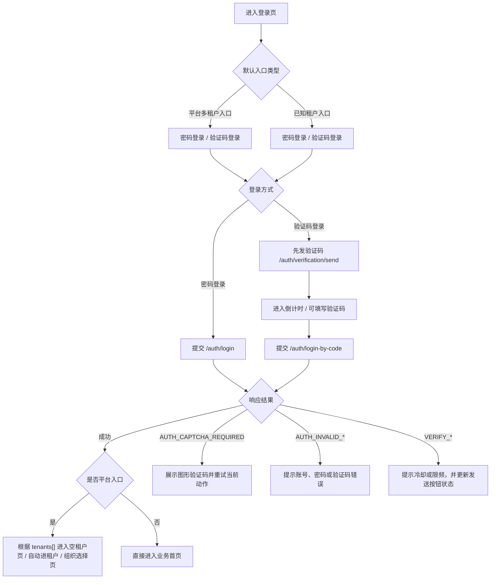
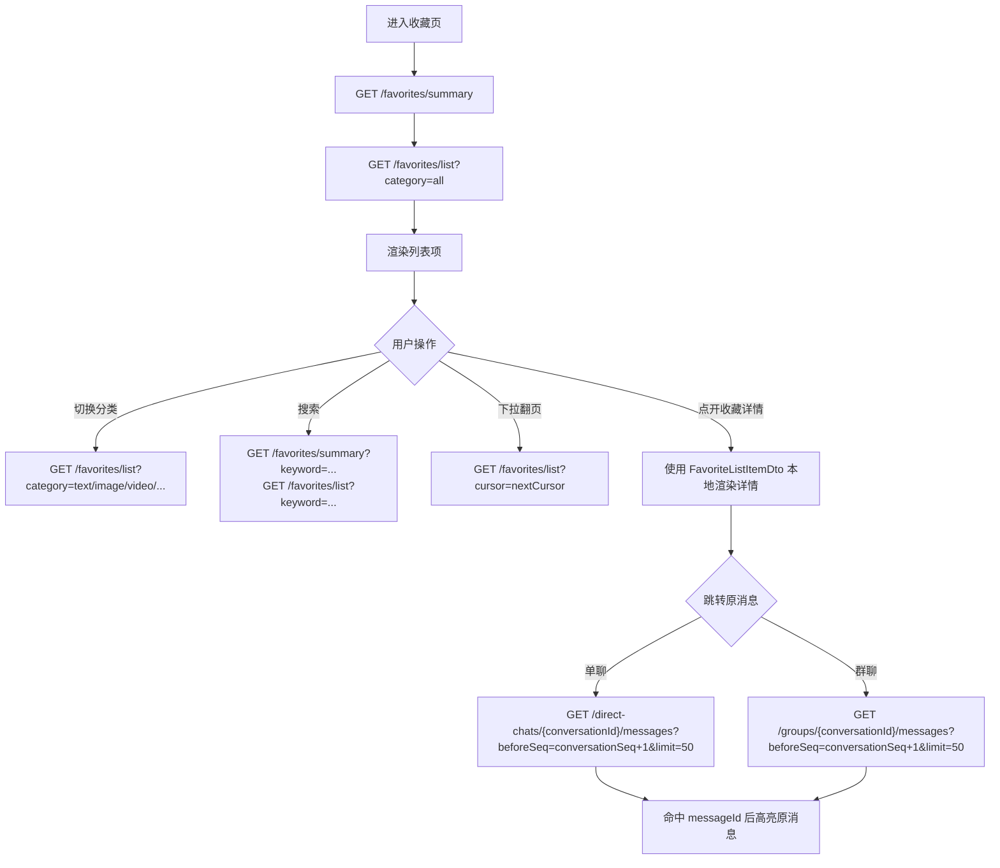

# 客户端 REST API 文档

> 文档校对快照：2026-05-22(2026-06-10 增量校对:客服域 —— 输入预览/已读时间/静默撤回/转接/复访续聊/自动话术配置/会话备注/报表导出)

本文档以当前对外契约为准，覆盖：

- 平台级认证与空间选择：`/api/platform/v1/*`
- 租户级客户端接口：`/api/client/v1/*`
- 访客 Widget 接口：`/api/widget/v1/*`
- Gateway 实时连接：`/ws/client`、`/ws/widget`

字段与枚举补遗总表见 [field-enum-reference.md](./field-enum-reference.md)。

## 0. 通用约定

### 0.1 统一响应包

除 Gateway Hub 外，绝大多数 HTTP 接口统一返回：

```json
{
  "code": "OK",
  "message": "success",
  "requestId": "01...",
  "data": {}
}
```

例外说明（客户端必须分别处理）：

- Widget `sessionId` 归属校验失败时，服务端直接返回 ASP.NET 默认的 `403 Forbidden`，**不带统一响应壳、不带 `code` 字段**（响应体为空 / text/plain），不要按 `code=WIDGET_SESSION_MISMATCH` 解析
- `POST /api/v1/notifications/devices`、`DELETE /api/v1/notifications/devices/{deviceId}` 成功时返回 `204 No Content`，没有 `data`
- `GET /api/v1/notifications/devices` 返回**裸数组**（直接是 `DeviceRegistrationDto[]`），不是 `{code, data:[...]}`
- 一些一次性的辅助接口（媒体直链 `/media/{mediaId}` 等）会返回原始字节流

### 0.2 Header 与上下文

| Header | 说明 |
|---|---|
| `Authorization: Bearer {token}` | 平台 Token、客户端业务 Token，或 Widget 场景下的 `visitorToken` |
| `X-Tenant-Id` | 仅在“未登录的租户级认证接口”中使用，用于指定租户 |
| `X-Device-Id` | 可选，未登录场景下透传设备 ID；已登录时以 JWT 中的 `device_id` 为准 |
| `X-Request-Id` | 可选，自定义请求追踪 ID |

### 0.3 媒体上传

- Content-Type：`multipart/form-data`
- 文件字段名：`file`
- 标准客户端上传入口：`POST /api/client/v1/media/upload`
- 访客 Widget 上传入口：`POST /api/widget/v1/media/upload`
- 响应 `data` 字段固定为：

| 字段 | 类型 | 说明 |
|---|---|---|
| `mediaId` | GUID | 媒体 ID |
| `mediaKind` | string | 媒体类型：`image`、`video`、`voice`、`file` |
| `url` | string | 媒体访问地址 |
| `relativePath` | string | 相对存储路径 |
| `fileName` | string | 原始文件名 |
| `mimeType` | string | MIME 类型 |
| `sizeBytes` | long | 文件大小 |
| `thumbnailUrl` | string? | 缩略图地址；图片 / 视频通常有值，其它类型通常为 `null` |

### 0.4 分页与范围

- 会话列表：游标分页（`cursor` + `limit`）
- 消息历史：`beforeSeq` + `limit`
- 多数列表接口默认上限为 50，消息历史实际会被服务端限制到 `1..100`


## 1. 平台认证接口

Base URL：`/api/platform/v1`

平台认证不依赖租户上下文，用于注册平台账号、登录、查看已加入租户、选择进入个人空间或租户空间。

注意：

- `select-personal-space`、`select-tenant`、`refresh-platform-token` 只接受当前仍有效的 `platformToken`
- 已换取出来的客户端 `accessToken` 不能反过来调用这些平台换票接口
- Widget 的 `visitorToken` 也不能调用这些平台接口

详细字段速查、匿名响应、枚举和值域汇总见 [client-api-reference.md](./client-api-reference.md)。

### 1.0 Token 层级与续期流程

平台侧采用三层 Token，客户端按自身形态选择开启哪些层：

```
┌───────────────────────────────────────────────────────────────┐
│ deviceSessionToken（设备会话凭证，前缀 ds_）                    │
│   - 不透明字符串，存系统安全区（iOS Keychain / Android 安全存储）│
│   - 90 天无活动失效；每次换票顺延                               │
│   - 不轮换；用途：移动端冷启动免密换 platformToken             │
└──────────────┬────────────────────────────────────────────────┘
               │ POST /auth/device-session/exchange
               ↓
┌───────────────────────────────────────────────────────────────┐
│ platformRefreshToken（平台刷新凭证，前缀 prt_）                 │
│   - 不透明字符串，Web 建议存 HttpOnly Cookie                   │
│   - 滑动 30 天 / 绝对 60 天                                     │
│   - 每次换票必定轮换：必须用新值覆盖旧值                        │
│   - 用途：platformToken 过期时静默换新                         │
└──────────────┬────────────────────────────────────────────────┘
               │ POST /auth/refresh-platform-token-by-refresh-token
               ↓
┌───────────────────────────────────────────────────────────────┐
│ platformToken（平台访问令牌，JWT，默认 6 小时）                 │
│   - 调用所有平台接口与换取空间 Token                           │
└───────────────────────────────────────────────────────────────┘
```

各形态推荐组合：

| 客户端形态 | 建议开启 | 登录时如何请求 |
|---|---|---|
| 移动 App（推荐三层全开） | ds_ + prt_ + JWT | `trustDevice=true` + `issueRefreshToken=true`，并带设备指纹 |
| Web / PC | prt_ + JWT | `issueRefreshToken=true`、`trustDevice=false` |
| 临时 / 公共设备 | 仅 JWT | 两者都不传，6 小时后强制重登 |

关键约定：

- `platformToken` 默认有效期为 6 小时（响应 `expiresIn` 以秒返回，通常为 `21600`）。客户端应在到期前主动续期，不要等到 `401` 才发现。
- `platformRefreshToken` **每次换票都会轮换**，客户端必须用响应里的新值覆盖本地存储。**Web 端必须串行化续期**：并发提交多个续期请求会被判定为凭证复用而撤销该账号全部会话。
- 改密码、被踢设备、账号注销等动作会让该账号已签发的 `platformToken` 在短时间内全部失效，同时撤销对应的刷新 / 设备凭证，客户端需引导用户重新登录。
- 三层均为**可选开启**：登录时不传 `issueRefreshToken` / `trustDevice` 的旧客户端只会拿到 `platformToken`，行为与不启用这些能力时一致。

续期端点见 §1.4.1（用刷新凭证续期）、§1.4.1A（用现有 JWT 续期）、§1.4.5（设备会话换票）。

### 1.1 `POST /auth/register`

注册平台账号。`mobile` 和 `email` 至少提供一个。

该接口根据平台是否启用企业绑定模式（`enterpriseBindingMode`）以及目标租户的审批策略，返回两种不同结构的响应：**platform-result**（平台结果）或 **tenant-result**（租户结果）。详见下方"响应变体"说明。

请求体：

```json
{
  "displayName": "Alice",
  "password": "P@ssw0rd",
  "mobile": "13800000000",
  "email": "alice@example.com",
  "captchaToken": null,
  "captchaAnswer": null,
  "verificationCode": null,
  "tenantId": null
}
```

| 字段 | 类型 | 必填 | 说明 |
|---|---|---|---|
| `displayName` | string | 是 | 平台显示名 |
| `password` | string | 是 | 平台密码 |
| `mobile` | string | 条件 | 手机号；与 `email` 至少提供一个 |
| `email` | string | 条件 | 邮箱；与 `mobile` 至少提供一个 |
| `captchaToken` | string? | 否 | 当图形验证码挑战触发时必填 |
| `captchaAnswer` | string? | 否 | 当图形验证码挑战触发时必填 |
| `verificationCode` | string? | 否 | 当默认验证设置要求短信或邮件验证码时必填 |
| `tenantId` | GUID? | 条件 | 目标租户 ID；仅在企业绑定模式下必填。通过 `/tenants/search-for-register` 搜索获得 |

#### 响应变体

注册接口的 `data` 字段根据以下条件返回不同结构：

| 条件 | 返回变体 | 说明 |
|---|---|---|
| 企业绑定模式**未启用** | platform-result | 标准注册，返回平台 Token |
| 企业绑定模式**已启用** + 目标租户 `joinApprovalMode=auto` | tenant-result | 自动通过，直接返回租户级 Token |
| 企业绑定模式**已启用** + 目标租户 `joinApprovalMode=manual` | platform-result（`pendingApproval=true`） | 需人工审批，返回平台 Token，加入申请处于待审批状态 |

#### 变体 1：platform-result

当企业绑定模式未启用，或企业绑定模式已启用但目标租户需要人工审批时，返回此变体。

响应 `data`：

```json
{
  "platformUserId": "019daaaa-bbbb-7ccc-dddd-eeeeeeeeeeee",
  "lppId": "lpp_ab12cd34",
  "displayName": "Alice",
  "platformToken": "jwt-platform-token",
  "expiresIn": 3600,
  "spaceContext": {
    "spaceType": 1,
    "tenantId": null
  },
  "pendingApproval": false
}
```

| 字段 | 类型 | 说明 |
|---|---|---|
| `platformUserId` | GUID | 平台用户 ID |
| `lppId` | string | 平台用户全局唯一 `lpp_id` |
| `displayName` | string | 平台显示名 |
| `platformToken` | string | 平台级 JWT |
| `expiresIn` | int | 平台 Token 过期秒数 |
| `spaceContext` | object | 空间偏好对象 |
| `pendingApproval` | bool | 是否有待审批的租户加入申请。默认 `false`；企业绑定模式下人工审批时为 `true` |

其中 `spaceContext` 字段为：

| 字段 | 类型 | 说明 |
|---|---|---|
| `spaceType` | short | 空间类型：固定为 `1`（personal） |
| `tenantId` | GUID? | 固定为 `null` |

说明：

- 默认模式下 `pendingApproval` 始终为 `false`，`spaceContext.spaceType` 固定为 `1`（个人空间）
- 企业绑定模式 + 人工审批时，`pendingApproval` 为 `true`，表示已自动创建加入申请，等待租户管理员审批
- 客户端收到 `pendingApproval=true` 时，应提示用户"注册成功，加入企业申请已提交，等待审批"
- 此变体返回的是 `platformToken`，后续可调用 `select-personal-space` 进入个人空间

#### 变体 2：tenant-result

当企业绑定模式已启用，且目标租户配置了 `joinApprovalMode=auto`（自动通过）时，返回此变体。注册完成后用户直接成为租户成员，无需额外的空间选择步骤。

响应 `data`：

```json
{
  "tenantId": "019daaaa-0000-7000-0000-000000000001",
  "userId": "019daaaa-0000-7000-0000-000000000002",
  "platformUserId": "019daaaa-0000-7000-0000-000000000003",
  "lppId": "lpp_ab12cd34",
  "displayName": "Alice",
  "accessToken": "jwt-tenant-token",
  "refreshToken": "opaque-refresh-token",
  "expiresIn": 3600,
  "spaceContext": {
    "spaceType": 2,
    "tenantId": "019daaaa-0000-7000-0000-000000000001"
  }
}
```

| 字段 | 类型 | 说明 |
|---|---|---|
| `tenantId` | GUID | 租户 ID |
| `userId` | GUID | 租户内用户 ID |
| `platformUserId` | GUID | 平台用户 ID |
| `lppId` | string | 平台用户全局唯一 `lpp_id` |
| `displayName` | string | 平台显示名 |
| `accessToken` | string | 租户级业务 JWT，可直接用于 `/api/client/v1/*` 和 `/ws/client` |
| `refreshToken` | string | 刷新令牌 |
| `expiresIn` | int | 访问令牌有效期（秒） |
| `spaceContext` | object | 空间偏好对象 |

其中 `spaceContext` 字段为：

| 字段 | 类型 | 说明 |
|---|---|---|
| `spaceType` | short | 空间类型：固定为 `2`（tenant） |
| `tenantId` | GUID | 目标租户 ID |

说明：

- 此变体的响应结构与 `POST /auth/select-tenant` 的响应一致（`TenantAuthResponse`）
- 客户端收到此变体后，可直接使用 `accessToken` 访问租户级接口，无需再调用 `select-tenant`
- 注册时系统会自动完成：创建平台账号、创建租户成员关系（Active）、投影租户内用户、签发租户会话

#### 客户端判断逻辑

客户端可通过检查响应 `data` 中是否存在 `accessToken` 字段来区分两种变体：

- 存在 `accessToken` → tenant-result，直接进入租户首页
- 存在 `platformToken` → platform-result，根据 `pendingApproval` 决定后续流程：
  - `pendingApproval=false`：标准注册成功，引导进入空间选择
  - `pendingApproval=true`：注册成功但加入企业待审批，提示等待并可进入个人空间

### 1.2 `POST /auth/login`

平台登录，返回平台 Token、当前已加入且处于激活状态的租户列表，以及建议进入的空间上下文。

请求体：

```json
{
  "identifier": "alice@example.com",
  "password": "P@ssw0rd",
  "loginType": "email"
}
```

| 字段 | 类型 | 必填 | 说明 |
|---|---|---|---|
| `identifier` | string | 是 | 邮箱、手机号，或显式/自动识别的 `lpp_id` |
| `password` | string | 是 | 密码 |
| `loginType` | string | 否 | `auto`、`email`、`mobile`、`lpp_id` |
| `captchaToken` | string? | 否 | 当图形验证码挑战触发时必填 |
| `captchaAnswer` | string? | 否 | 当图形验证码挑战触发时必填 |
| `issueRefreshToken` | bool | 否 | 默认 `false`；置 `true` 时额外返回 `platformRefreshToken`（见 §1.0） |
| `trustDevice` | bool | 否 | 默认 `false`；置 `true` 时额外返回 `deviceSession`，需同时携带设备指纹字段 |
| `deviceId` | GUID? | `trustDevice=true` 时必填 | 客户端生成并持久化的设备 ID |
| `deviceName` | string? | 否 | 设备显示名，用于设备列表展示（如 `iPhone 15 Pro`） |
| `devicePlatform` | string? | 否 | `ios`、`android`、`web`、`pc` |
| `deviceModel` | string? | 否 | 设备型号 |
| `appVersion` | string? | 否 | 客户端版本号 |

响应 `data`：

```json
{
  "platformUserId": "...",
  "lppId": "lpp_ab12cd34",
  "displayName": "Alice",
  "userType": null,
  "platformToken": "jwt-platform-token",
  "expiresIn": 21600,
  "spaceContext": {
    "spaceType": 0,
    "tenantId": null
  },
  "tenants": [
    {
      "tenantId": "...",
      "tenantCode": "acme",
      "tenantName": "Acme Corp",
      "logoUrl": null,
      "membershipRole": 0
    }
  ],

  "platformRefreshToken": "prt_xxx",
  "platformRefreshTokenExpiresAt": "2026-07-21T08:00:00Z",
  "deviceSession": {
    "deviceSessionToken": "ds_xxx",
    "issuedAt": "2026-05-22T08:00:00Z",
    "inactiveExpiresAt": "2026-08-20T08:00:00Z"
  }
}
```

三层 Token 字段说明（详见 §1.0）：

| 字段 | 何时返回 | 说明 |
|---|---|---|
| `platformRefreshToken` | `issueRefreshToken=true` | 平台刷新凭证（前缀 `prt_`），用于 §1.4.1 续期 |
| `platformRefreshTokenExpiresAt` | 同上 | 绝对过期时间 |
| `deviceSession.deviceSessionToken` | `trustDevice=true` | 设备会话凭证（前缀 `ds_`），用于 §1.4.5 冷启动换票 |
| `deviceSession.issuedAt` / `inactiveExpiresAt` | 同上 | 签发时间 / 90 天无活动失效时间（每次换票顺延） |

不传 `issueRefreshToken` / `trustDevice` 时，上述三个字段不会出现，响应与仅返回 `platformToken` 的旧行为一致。

`membershipRole`：`0=成员`、`1=技术支持`、`2=客服`、`3=管理员`、`4=所有者`

`userType`：

- 当 `spaceContext.spaceType=1`（personal）时固定返回 `1`
- 当 `spaceContext.spaceType=2`（tenant）时，按推荐进入租户内的用户类型返回：`1=客户`、`2=员工/客服`
- 当 `spaceContext.spaceType=0`（selection_required）时返回 `null`

`spaceContext`：

- `spaceType=0`：需要客户端展示空间选择页
- `spaceType=1`：建议进入个人空间
- `spaceType=2`：建议进入 `tenantId` 对应租户

补充：

- 如果用户同时加入了多个企业空间，并且上次进入的是某个仍然有效的企业空间，那么这里会默认返回 `spaceType=2 + tenantId=上次进入租户`
- 只有当上次空间失效，或当前存在多个可选空间但没有可直接恢复的上次空间时，才会回到 `spaceType=0`

#### `POST /auth/login-by-code`

平台验证码登录，请求成功后同样返回平台 Token 和 `tenants[]`。

请求体：

```json
{
  "identifier": "alice@example.com",
  "verificationCode": "123456",
  "loginType": "email",
  "captchaToken": null,
  "captchaAnswer": null
}
```

| 字段 | 类型 | 必填 | 说明 |
|---|---|---|---|
| `identifier` | string | 是 | 邮箱或手机号 |
| `verificationCode` | string | 是 | 登录验证码 |
| `loginType` | string | 否 | `auto`、`email`、`mobile` |
| `captchaToken` | string? | 否 | 当图形验证码挑战触发时必填 |
| `captchaAnswer` | string? | 否 | 当图形验证码挑战触发时必填 |

说明：

- `loginType=auto` 时会按 `identifier` 是否包含 `@` 自动判定邮箱；若以 `lpp_` 开头则按 `lpp_id` 处理；否则按手机号逻辑走
- 当前平台验证码登录仅支持邮箱或手机号，不支持 `lpp_id`

#### 平台验证码接口

| 端点 | 方法 | 说明 |
|---|---|---|
| `/auth/verification/settings` | GET | 获取平台账号验证码开关，内部使用默认平台租户配置 |
| `/auth/verification/send` | POST | 发送平台注册 / 登录验证码 |

`POST /auth/verification/send` 请求体：

```json
{
  "identifier": "alice@example.com",
  "channel": "email",
  "purpose": "login",
  "captchaToken": null,
  "captchaAnswer": null
}
```

说明：

- `channel` 仅支持 `sms`、`email`
- 平台侧 `purpose` 支持 `register`、`login`、`reset_password`，以及 `deactivate`、`change_mobile`、`change_email`（用于账号管理流程；前 3 个属于未登录可用，后 3 个需要平台 Token）
- 发送限制：同一标识 + 用途 60 秒冷却；同一标识每小时最多 5 次、每天最多 20 次；同一 IP 每小时最多 10 次、每天最多 30 次
- 当 `purpose=login` 或 `reset_password` 且目标账号不存在时，接口会静默返回成功，但不会真正生成或发送验证码
- 非法 `channel` 返回 `400 VERIFY_INVALID_CHANNEL`；非法 `purpose` 返回 `400 VERIFY_INVALID_PURPOSE`

### 1.3 `POST /auth/select-personal-space`

进入个人空间，换取客户端业务 Token。需要平台 Token。

请求体：无

响应 `data`：

| 字段 | 类型 | 说明 |
|---|---|---|
| `tenantId` | GUID | 当前实现中的默认个人空间租户 ID |
| `userId` | GUID | 个人空间投影用户 ID |
| `platformUserId` | GUID | 平台用户 ID |
| `lppId` | string | 平台用户全局唯一 `lpp_id` |
| `displayName` | string | 平台显示名 |
| `accessToken` | string | 客户端业务 JWT |
| `refreshToken` | string | 刷新令牌 |
| `expiresIn` | int | 访问令牌有效期（秒） |
| `spaceContext` | object | 固定返回 `{ spaceType: 1, tenantId: null }` |

说明：

- 该接口会记住“上次进入空间 = 个人空间”
- 返回的是标准客户端 Token，因此可直接访问 `/api/client/v1/*`
- 该接口只接受当前有效的 `platformToken`；不能使用租户 `accessToken` 或 `visitorToken`

### 1.4 `POST /auth/select-tenant`

选择租户，换取租户级 Token。需要平台 Token。

请求体：

```json
{ "tenantId": "..." }
```

响应 `data`：

| 字段 | 类型 | 说明 |
|---|---|---|
| `tenantId` | GUID | 租户 ID |
| `userId` | GUID | 租户内用户 ID |
| `platformUserId` | GUID | 平台用户 ID |
| `lppId` | string | 平台用户全局唯一 `lpp_id` |
| `displayName` | string | 平台显示名 |
| `accessToken` | string | 客户端业务 JWT |
| `refreshToken` | string | 刷新令牌 |
| `expiresIn` | int | 访问令牌有效期（秒） |
| `spaceContext` | object | 固定返回 `{ spaceType: 2, tenantId }` |

说明：

- 该接口会为本次租户会话生成新的 `device_id` 并写入 JWT
- 后续所有 `/api/client/v1/*` 与 `/ws/client` 使用这里返回的 `accessToken`
- 该接口只接受当前有效的 `platformToken`；不能使用已有租户 `accessToken` 或 `visitorToken`

### 1.4.1 `POST /auth/refresh-platform-token-by-refresh-token`

用 `platformRefreshToken`（前缀 `prt_`，见 §1.0）静默换发新的平台 Token。**无需** `Authorization` 头——刷新凭证本身就是凭证。这是 Web / PC 端续期的推荐路径。

请求体：

| 字段 | 类型 | 必填 | 说明 |
|---|---|---|---|
| `platformRefreshToken` | string | 是 | 当前有效的平台刷新凭证 |

响应 `data`：

| 字段 | 类型 | 说明 |
|---|---|---|
| `platformUserId` | GUID | 平台用户 ID |
| `lppId` | string? | 平台用户全局唯一 `lpp_id`；未设置时为 `null` |
| `displayName` | string | 平台显示名 |
| `platformToken` | string | 新的平台级 JWT |
| `expiresIn` | int | 新 Token 有效期（秒） |
| `platformRefreshToken` | string | **轮换后的新刷新凭证，必须覆盖本地旧值** |
| `platformRefreshTokenExpiresAt` | string | 新刷新凭证的绝对过期时间 |

说明：

- 每次调用都会轮换刷新凭证；客户端必须以响应里的新 `platformRefreshToken` 覆盖存储
- **必须串行化调用**：用同一个刷新凭证并发续期会触发复用检测，撤销该账号全部会话
- Web 端建议把刷新凭证存于 HttpOnly Cookie，启动时若存在则先调用本接口
- 错误码：`REFRESH_TOKEN_REQUIRED`（400，未传凭证）、`REFRESH_TOKEN_NOT_FOUND`（401，凭证无效）、`REFRESH_TOKEN_EXPIRED`（401，滑动 30 天或绝对 60 天到期）、`REFRESH_TOKEN_REUSE_DETECTED`（401，复用检测命中——属高危信号，应清除本地全部凭证并重新登录）

### 1.4.1A `POST /auth/refresh-platform-token`

兼容路径：用当前仍有效的 `platformToken`（放在 `Authorization` 头）换发新的平台 Token，不依赖刷新凭证。

请求体：无

响应 `data`：

| 字段 | 类型 | 说明 |
|---|---|---|
| `platformUserId` | GUID | 平台用户 ID |
| `lppId` | string? | 平台用户全局唯一 `lpp_id`；未设置时为 `null` |
| `displayName` | string | 平台显示名 |
| `platformToken` | string | 新的平台级 JWT |
| `expiresIn` | int | 新 Token 有效期（秒） |

说明：

- 适用于未开启刷新凭证、只持有 `platformToken` 的客户端
- 必须在 `platformToken` 仍有效时调用；已过期则需重新登录
- 账号被禁用时返回 `403`
- 该接口只接受平台 Token，不接受租户 `accessToken` 或 Widget `visitorToken`

### 1.4.2 `GET /my/admin-tenants`

列出当前 APP 账号"可登录管理后台"的租户。命中 `tenant_owner` / `tenant_admin` / `ops_operator` / `customer_service` / `audit_operator` / `config_operator` 任一角色,或当前账号是平台超管 (`platform_admin`)。需要平台 Token。

请求体：无

响应 `data`：`AdminAccessibleTenantDto[]`

| 字段 | 类型 | 说明 |
|---|---|---|
| `tenantId` | GUID | 租户 ID |
| `tenantCode` | string | 租户 code |
| `tenantName` | string | 租户名称 |
| `roleCodes` | string[] | 该账号在此租户被授予的"可进后台"角色码列表;平台超管返回 `["platform_admin"]` |

说明：

- 仅返回 `Status = Active` 的租户
- APP UI 应根据返回数据决定是否展示"进入管理后台"入口
- 角色码可用于前端在进入前预先提示用户身份(如"以客服身份进入")

### 1.4.3 `POST /auth/admin-token`

凭平台 Token 换发指定租户的"管理后台 Token"(`token_type = tenant`),APP 端可用此 Token 直接调用所有 `/api/admin/v1/*` 接口。

**切换租户语义**：同一 APP 设备(`deviceId`)同时只持有一个有效的管理后台会话。换发新 Token 时,会自动撤销该 `(platformUserId, deviceId)` 在**其它租户**下仍活跃的 admin session。

请求体：

| 字段 | 类型 | 说明 |
|---|---|---|
| `tenantId` | GUID | 目标租户 ID(必须来自 `/my/admin-tenants` 返回列表) |

响应 `data`：`AdminTokenIssueResponse`

| 字段 | 类型 | 说明 |
|---|---|---|
| `tenantId` | GUID | 目标租户 ID |
| `tenantCode` | string? | 租户 code |
| `tenantName` | string? | 租户名称 |
| `userId` | GUID | 当前账号在该租户的 User ID |
| `displayName` | string | 显示名 |
| `accessToken` | string | 管理后台 Access Token(JWT,`token_type=tenant`) |
| `refreshToken` | string | 管理后台 Refresh Token |
| `expiresIn` | int | Access Token 有效期(秒,通常 21600 = 6 小时) |
| `roleCodes` | string[] | 当前用户的角色码 |
| `permissionCodes` | string[] | 当前用户的权限码 |
| `isPlatformAdministrator` | bool | 是否平台超管 |
| `spaceContext` | object | `{ spaceType, tenantId }`,固定为 Tenant 空间 |

说明：

- 该接口只接受平台 Token,且每分钟有调用次数限制(同 login)
- 调用前应先查 `/my/admin-tenants` 确认账号确有管理角色;无管理角色账号直接调本接口会返回 `403 ADMIN_FORBIDDEN`
- 拿到的 `accessToken` 与现有 `/api/admin/v1/auth/login` 颁发的 Token 完全等价
- **Token 刷新走 `/api/client/v1/auth/refresh` 标准 refresh 流程**(用 `refreshToken` 换新 access + 新 refresh,旧 refresh 失效),不需要重新调 `admin-token`
- 仅当 `refreshToken` 也过期(30 天)、或切换到另一个租户时,才需要重新调本接口
- 错误码:`ADMIN_FORBIDDEN`(无管理角色,403)、`AUTH_NO_TENANT_USER`(账号不在该租户,403)、`TENANT_NOT_ACTIVE`(租户未激活,403)

### 1.4.4 `POST /account/sign-out`

APP 端"退出登录"。撤销当前 `deviceId` 下该 APP 账号的**所有 session**(平台 session + 任何租户下通过 `admin-token` 签出的 admin session)。

请求头:必须携带 `X-Device-Id`(或在 JWT claim 中带 `device_id`)。

请求体：无

响应 `data`：

| 字段 | 类型 | 说明 |
|---|---|---|
| `deviceId` | GUID | 当前设备 ID |
| `revokedSessionCount` | int | 已撤销的 session 数量 |
| `revokedAt` | string | 撤销时间 (ISO 8601) |

说明：

- 客户端在用户点"退出"时应调用此端点,然后清空本地存储的所有 Token
- 服务端会同步发出 `auth.force_logout` 事件,其他在线连接会强制断开
- 不会影响该账号在其它设备的 session

### 1.4.5 `POST /auth/device-session/exchange`

移动端冷启动时，用本地持久化的 `deviceSessionToken`（前缀 `ds_`，见 §1.0）免密换发新的平台 Token。**无需** `Authorization` 头——设备会话凭证本身就是凭证。

请求体：

| 字段 | 类型 | 必填 | 说明 |
|---|---|---|---|
| `deviceSessionToken` | string | 是 | 系统安全区存储的设备会话凭证 |
| `issueRefreshToken` | bool | 否 | 默认 `false`；置 `true` 时一并返回新的 `platformRefreshToken` |

响应 `data`：

| 字段 | 类型 | 说明 |
|---|---|---|
| `platformUserId` | GUID | 平台用户 ID |
| `lppId` | string? | 平台用户全局唯一 `lpp_id`；未设置时为 `null` |
| `displayName` | string | 平台显示名 |
| `platformToken` | string | 新的平台级 JWT |
| `expiresIn` | int | 新 Token 有效期（秒） |
| `platformRefreshToken` | string? | 仅当 `issueRefreshToken=true` 时返回 |
| `platformRefreshTokenExpiresAt` | string? | 同上 |

说明：

- 推荐冷启动流程：读取本地 `deviceSessionToken` → 调本接口拿 `platformToken` → 再调 §1.3/§1.4 选择空间 → 进入业务
- 设备会话凭证在 90 天无活动后失效，每次成功换票顺延有效期；不轮换，无需覆盖本地值
- 错误码：`DEVICE_SESSION_TOKEN_REQUIRED`（400，未传凭证）、`DEVICE_SESSION_NOT_FOUND`（401，凭证不存在）、`DEVICE_SESSION_REVOKED`（401，被踢 / 改密 / 管理员强制下线，建议向用户说明原因）、`DEVICE_SESSION_EXPIRED`（401，90 天未活动）。任一情况都应清除本地凭证并跳转登录页

### 1.5 `GET /my/spaces/unread-summary`

按平台账号汇总所有空间的未读红点。需要平台 Token。

响应 `data`：

| 字段 | 类型 | 说明 |
|---|---|---|
| `spaces` | `SpaceUnreadSummaryDto[]` | 各空间未读概览 |
| `unreadSpaceCount` | int | 当前有未读的空间数 |
| `totalUnreadConversationCount` | int | 所有空间合计有未读的会话数 |
| `totalUnreadMessageCount` | int | 所有空间合计未读消息数 |

`SpaceUnreadSummaryDto`：

| 字段 | 类型 | 说明 |
|---|---|---|
| `spaceType` | short | `1=personal`，`2=tenant` |
| `tenantId` | GUID? | 个人空间为 `null`，企业空间为目标租户 ID |
| `spaceName` | string | 空间显示名；个人空间当前固定为“个人空间” |
| `tenantCode` | string? | 企业空间租户编码；个人空间为 `null` |
| `logoUrl` | string? | 空间 Logo / 头像 |
| `unreadConversationCount` | int | 该空间中有未读的会话数 |
| `unreadMessageCount` | int | 该空间未读消息总数 |
| `hasUnread` | bool | 是否存在未读 |

### 1.6 平台 Token 下的租户操作 / 账号管理

| 端点 | 方法 | 说明 |
|---|---|---|
| `/my/tenants` | GET | 获取我加入的激活租户列表 |
| `/my/spaces/unread-summary` | GET | 获取所有空间的未读红点汇总 |
| `/tenants/search?keyword=` | GET | 搜索"已激活且允许展示"的租户，最多返回 50 条 |
| `/tenants` | POST | 已禁用；租户创建改由管理后台 `/api/admin/v1/platform/tenants` 承载 |
| `/invitations/{code}` | GET | 预览邀请对应的租户信息，平台 Token 可选 |
| `/invitations/{code}/accept` | POST | 接受邀请码加入租户 |
| `/tenants/{tenantId}/join-request` | POST | 提交加入申请 |
| `/tenants/by-code/{code}` | GET | 凭企业码预览企业信息(只读),用于"输码→确认→加入" |
| `/tenants/join-by-code` | POST | 通过企业码申请加入租户 |
| `/my/join-requests` | GET | 查询我提交过的加入申请 |
| `/my/join-requests/{requestId}` | DELETE | 撤销尚未处理的加入申请 |
| `/account/deactivate` | POST | 申请注销当前平台账号；进入 7 天冷静期 |
| `/account/deactivate/cancel` | POST | 在冷静期内撤销注销 |
| `/account/mobile` | PUT | 修改绑定手机号，返回脱敏后手机号 |
| `/account/email` | PUT | 修改绑定邮箱，返回脱敏后邮箱 |
| `/account/devices` | GET | 列出当前账号的登录设备 |
| `/account/devices/{deviceId}` | DELETE | 远端踢出某个设备（被踢出的会话会收到 `auth.force_logout`，`reason=device_revoked`） |

详细请求 / 响应字段见第 22 章（设备登录抢占）、第 20 章（账号管理新接口）。

#### `POST /tenants`

说明：

- 当前实现已对 APP / 普通平台用户禁用，返回 `403`
- 最终态中，租户创建统一由管理后台平台管理员接口负责
- APP 无租户态应引导输入邀请码、输入企业码、申请加入，或进入个人空间

#### `POST /tenants/join-by-code`

通过企业码（`tenant_code`）申请加入租户。需要平台 Token。

请求体：

```json
{
  "tenantCode": "企业码",
  "message": "可选的申请说明"
}
```

行为说明：

- 如果该租户配置了 `joinApprovalMode = "auto"`（自动通过），则直接加入并返回租户 Token，响应 `data` 字段为：

```json
{
  "tenantId": "租户 ID",
  "userId": "当前租户内用户 ID",
  "platformUserId": "平台用户 ID",
  "lppId": "lpp_xxxxxxxx",
  "displayName": "当前显示名",
  "accessToken": "jwt-tenant-token",
  "refreshToken": "refresh-token",
  "expiresIn": 3600,
  "spaceContext": {
    "spaceType": 2,
    "tenantId": "租户 ID"
  }
}
```
- 如果该租户配置了 `joinApprovalMode = "manual"`（默认），则创建待审批申请，返回 `{ "status": "pending", "message": "join request submitted, awaiting approval" }`
- 自动通过时，系统会自动建立默认官方账号关系、客服分配关系及对应服务会话；后台后续可再改绑当前负责客服
- 企业码即 `tenant_code`，可在管理后台租户详情页查看和复制

> ⚠️ **`join-by-code` 是"加入动作",不是"查询"。** `manual` 审批的租户返回的 `data` 是 `{status:"pending",...}`,**不包含企业名/Logo**——这是正常的待审批响应,不是"查询为空"。若要在加入前展示企业信息,请先调下面的 `GET /tenants/by-code/{code}` 预览。

#### `GET /tenants/by-code/{code}`

凭企业码**预览**企业信息(只读,不写库、不创建申请),用于"用户输企业码 → 展示企业信息确认 → 再调 `join-by-code`"的流程。需要平台 Token。

- 企业码 `tenant_code` **精确匹配、大小写不敏感**;
- **不受 `isListed` 限制**——与 `join-by-code` 对齐:能用企业码加入的企业,就能用企业码预览(即便它没设为公开展示);
- 不存在或非 `Active` → `404 TENANT_NOT_FOUND`;企业码留空 → `400 TENANT_CODE_REQUIRED`;无 Token → `401`。

响应 `data`(`TenantCodePreviewDto`):

```json
{
  "tenantId": "租户 ID",
  "tenantCode": "mouse-corp",
  "tenantName": "Mouse 测试企业",
  "logoUrl": "https://.../media/xxxx",
  "tenantDescription": "企业简介",
  "industry": "tech",
  "memberCount": 48,
  "joinApprovalMode": "manual",
  "alreadyMember": false
}
```

- `joinApprovalMode`:`auto` = 加入即生效;`manual` = 加入后需管理员/客服审批。客户端可据此提示用户"申请后需等待审批"还是"可直接加入"。
- `alreadyMember`:当前登录账号是否已是该企业成员。为 `true` 时,客户端应把按钮从"申请加入"改为"进入企业"。

推荐流程:`GET /tenants/by-code/{code}`(展示确认)→ 用户点确认 → `POST /tenants/join-by-code`(提交)。

#### `POST /invitations/{code}/accept`

当前接口需要平台 Token。

说明：

- 接口会完成“加入租户”动作
- 成功时直接返回可用的租户态认证结果，响应 `data` 字段为：

```json
{
  "tenantId": "租户 ID",
  "userId": "当前租户内用户 ID",
  "platformUserId": "平台用户 ID",
  "lppId": "lpp_xxxxxxxx",
  "displayName": "当前显示名",
  "accessToken": "jwt-tenant-token",
  "refreshToken": "refresh-token",
  "expiresIn": 3600,
  "spaceContext": {
    "spaceType": 2,
    "tenantId": "租户 ID"
  }
}
```
- `accessToken` 可直接用于后续 `/api/client/v1/*` 与 `/ws/client`
- 返回的 `spaceContext` 固定为租户空间
- 如果邀请是定向邀请，当前登录平台账号的邮箱或手机号必须与邀请目标匹配

#### `GET /invitations/{code}`

说明：

- 用于邀请落地页在真正接受前先展示租户名称、Logo、行业、过期时间等信息
- 当前会同时返回组织说明，便于邀请落地页展示企业简介
- 平台 Token 可不传；如果传了平台 Token，响应还会额外标记当前账号是否已是成员、是否匹配定向邀请
- **2026-06-04 起**响应新增 `targetMembershipRole`（`1=技术支持`、`2=客服`、`3=管理员`，`null`=普通成员）——员工入职邀请可在接受前就告诉用户"你将以 客服 身份加入"。无角色的普通邀请该字段为 `null`

#### `POST /tenants/{tenantId}/join-request`

请求体：

```json
{ "message": "希望加入贵组织" }
```

说明：

- 提交后默认进入待审批状态
- 需要该租户管理员或所有者调用 `/api/client/v1/tenant/join-requests/{requestId}/approve` 才会真正加入
- 提交后服务端会主动向管理员侧投递 `tenant.join_request.created` 事件（含管理后台实时连接、移动端推送，以及订阅了该事件的 Webhook 应用）——管理端不需要轮询 `/tenant/join-requests` 端点
- 自动审批模式（`features.tenant_join_approval_mode=auto`）下会立即发出 `tenant.join_request.approved` 事件，且申请人无需手动调用任何端点即可使用新的租户身份

#### `DELETE /my/join-requests/{requestId}`

说明：

- 仅能撤销当前平台账号自己提交、且状态仍为 `pending` 的申请
- 成功后申请状态变为 `cancelled`
- 会触发 `tenant.join_request.cancelled` 实时事件，管理员侧的待办列表会同步刷新

### 1.7 平台公开端点（无需鉴权）

以下端点挂载在 `/api/platform/v1` 下，无需任何 Token 即可调用。

| 端点 | 方法 | 说明 |
|---|---|---|
| `/tenants/search-for-register` | GET | 注册前搜索可加入的租户（仅企业绑定模式下可用） |
| `/client-config` | GET | 获取客户端配置（企业绑定模式状态） |

#### `GET /tenants/search-for-register`

注册前搜索可加入的租户。仅在企业绑定模式启用时可用；未启用时返回 `403`（错误码 `TENANT_SEARCH_DISABLED`）。

认证：无需鉴权

请求参数（Query String）：

| 字段 | 类型 | 必填 | 说明 |
|---|---|---|---|
| `keyword` | string? | 否 | 搜索关键词；按租户名称或租户码模糊匹配（不区分大小写）。为空或长度 < 2 时返回空列表 |

响应 `data`（`TenantRegisterSearchResultDto[]`）：

| 字段 | 类型 | 说明 |
|---|---|---|
| `tenantId` | GUID | 租户 ID |
| `tenantCode` | string | 租户编码（企业码） |
| `tenantName` | string | 租户名称 |
| `logoUrl` | string? | 租户 Logo 地址 |
| `industry` | string? | 行业 |
| `memberCount` | int | 当前成员数 |

说明：

- 仅返回状态为 Active 且 `isListed = true` 的租户
- 结果数量上限为 20 条
- 该接口用于企业绑定模式下的注册流程：用户先搜索目标企业，再发起注册并关联到该租户

#### `GET /client-config`

获取客户端全局配置，当前主要用于判断是否启用了企业绑定模式。

认证：无需鉴权

请求参数：无

响应 `data`（`ClientConfigResponse`）：

| 字段 | 类型 | 说明 |
|---|---|---|
| `enterpriseBindingMode` | bool | 是否启用企业绑定模式 |
| `tenantSearchEnabled` | bool | 是否允许注册前搜索租户（当前与 `enterpriseBindingMode` 同步） |

说明：

- 客户端应在注册/登录页加载时调用此接口，根据 `enterpriseBindingMode` 决定是否展示"搜索企业"入口
- 当 `enterpriseBindingMode = true` 时，注册流程需要用户先选择目标企业（通过 `/tenants/search-for-register` 搜索），再完成注册
- 当 `enterpriseBindingMode = false` 时，走标准注册流程，注册后默认进入个人空间


## 2. 客户端接入流程

```text
1. `POST /api/platform/v1/auth/register` 或 `POST /api/platform/v1/auth/login`
2. 读取返回的 `tenants[]` 与 `spaceContext`
3. 若进入个人空间，调用 `POST /api/platform/v1/auth/select-personal-space`
4. 若进入租户空间，调用 `POST /api/platform/v1/auth/select-tenant`
5. 使用返回的 `accessToken` 访问 `/api/client/v1/*`
6. 使用同一个 `accessToken` 连接 `/ws/client`
```

说明：

- 这是默认推荐流程，适用于大多数普通 APP / Web 客户端
- 如果用户可能同时属于多个租户，客户端应先完成平台登录，再根据 `spaceContext` 和 `tenants[]` 决定进入个人空间还是选择租户
- 如果 `tenants[]` 为空，客户端通常应支持三种动作：输入邀请码、搜索后台允许展示的租户并提交申请、直接进入个人空间

`spaceContext.spaceType` 约定：

- `0`：`selection_required`，需要客户端展示空间选择页
- `1`：`personal`，建议直接进入个人空间
- `2`：`tenant`，建议直接进入 `spaceContext.tenantId` 对应租户

## 2.1 如何选择登录链路

| 场景 | 推荐链路 |
|---|---|
| 用户进入时不知道自己属于哪个租户 | 先走 `/api/platform/v1/auth/login`，再调 `/api/platform/v1/auth/select-tenant` |
| 用户可能属于多个租户，需要登录后选择组织 | 先走平台登录 |
| 企业专属入口、子域名、邀请页、SSO 落地页，进入时已确定目标租户 | 可直接走 `/api/client/v1/auth/login` 兼容模式 |
| 单租户部署，客户端永远只服务一个固定租户 | 可直接走 `/api/client/v1/auth/login` 兼容模式 |


## 3. 租户内认证接口（兼容模式）

Base URL：`/api/client/v1`

这些接口用于“已知租户上下文”的传统租户内登录/注册场景，包含密码登录和验证码登录。

如果你的客户端是一个面向多企业的通用应用，而用户登录后还需要自己选择企业/组织，请不要把这一组接口当成默认登录入口；默认入口应是第 2 节的“平台登录 -> 选择租户”流程。

租户来源优先级：

1. JWT 内的 `tenant_id`
2. `X-Tenant-Id`
3. 服务默认租户（仅用于本地/初始化环境，不建议客户端依赖）

### 3.1 `POST /auth/register`

请求体：

```json
{
  "loginName": "alice",
  "password": "P@ssw0rd",
  "displayName": "Alice",
  "mobile": "13800000000",
  "email": "alice@example.com",
  "captchaToken": null,
  "captchaAnswer": null,
  "verificationCode": "123456"
}
```

| 字段 | 类型 | 必填 | 说明 |
|---|---|---|---|
| `loginName` | string | 条件 | 登录名；若缺省且提供了 email，则会回退为 email |
| `password` | string | 是 | 密码 |
| `displayName` | string | 是 | 显示名 |
| `mobile` | string? | 否 | 手机号 |
| `email` | string? | 否 | 邮箱 |
| `captchaToken` | string? | 否 | 当图形验证码校验开启时必填 |
| `captchaAnswer` | string? | 否 | 当图形验证码校验开启时必填 |
| `verificationCode` | string? | 否 | 当租户开启短信/邮件注册校验时必填 |
| `tenantId` | GUID? | 否 | 显式指定目标租户（未带 `X-Tenant-Id` header 时使用） |
| `tenantCode` | string? | 否 | 显式指定目标租户的企业码，与 `tenantId` 二选一 |

响应 `data`：

```json
{ "userId": "..." }
```

### 3.2 `POST /auth/login`

请求体：

```json
{
  "loginName": "alice@example.com",
  "password": "P@ssw0rd",
  "deviceId": null,
  "deviceName": "Chrome on macOS",
  "deviceType": "web",
  "captchaToken": null,
  "captchaAnswer": null,
  "loginType": "email",
  "tenantId": null,
  "tenantCode": null
}
```

| 字段 | 类型 | 必填 | 说明 |
|---|---|---|---|
| `loginName` | string | 是 | 实际可传登录名 / 邮箱 / 手机号 |
| `password` | string | 是 | 密码 |
| `deviceId` | GUID? | 否 | 设备 ID；不传则服务端生成 |
| `deviceName` | string? | 否 | 设备展示名 |
| `deviceType` | string? | 否 | `web`、`ios`、`android`、`desktop` |
| `captchaToken` | string? | 否 | 当图形验证码校验开启时必填 |
| `captchaAnswer` | string? | 否 | 当图形验证码校验开启时必填 |
| `loginType` | string | 否 | `login_name`、`email`、`mobile`、`lpp_id`，默认 `login_name` |
| `tenantId` | GUID? | 否 | 显式指定目标租户。未带 `X-Tenant-Id` header 且未在子域名上锁定租户时可用 |
| `tenantCode` | string? | 否 | 显式指定目标租户的企业码，与 `tenantId` 二选一 |

#### 设备登录抢占（`AUTH_DEVICE_BOUND_RECENTLY_ACTIVE`）

当同一 `deviceId` 在很短的时间内被另一个账号活跃使用过（即"设备未让出"），客户端再用此 `deviceId` 登录新账号时会被服务端短暂拒绝，HTTP `409`，错误码 `AUTH_DEVICE_BOUND_RECENTLY_ACTIVE`，响应壳形如：

```json
{
  "code": "AUTH_DEVICE_BOUND_RECENTLY_ACTIVE",
  "message": "该设备最近被 a***@example.com 使用过 (last_seen=2026-05-14T08:13:42Z),请稍后再试或更换设备。",
  "requestId": "01...",
  "data": {
    "maskedLoginName": "a***@example.com",
    "lastSeen": "2026-05-14T08:13:42Z"
  }
}
```

| 字段 | 类型 | 说明 |
|---|---|---|
| `maskedLoginName` | string | 上一个使用者的登录名脱敏值 |
| `lastSeen` | DateTimeOffset | 上一个使用者最近一次活跃时间 |

客户端建议：

- 提示用户"该设备刚被 `maskedLoginName` 使用，请稍候再试或换设备"
- 短暂等待后再次重试，等待时间过后服务端会自动放行；接管成功时旧账号在 `/ws/client` 的连接会收到 `auth.force_logout`，`reason=device_claimed_by_other_user`
- 第三方 SDK 不应不停轮询此接口；建议给用户一个"重试"按钮并增加节流

响应 `data`：

```json
{
  "userId": "...",
  "userType": 1,
  "accessToken": "jwt-tenant-token",
  "refreshToken": "opaque-refresh-token",
  "expiresIn": 3600
}
```

| 字段 | 类型 | 说明 |
|---|---|---|
| `userId` | GUID | 当前租户内用户 ID |
| `userType` | short | 用户类型：`1=客户`、`2=员工/客服`、`3=访客` |
| `accessToken` | string | 租户级业务 JWT |
| `refreshToken` | string | 刷新令牌 |
| `expiresIn` | int | 访问令牌有效期（秒） |

#### `POST /auth/login-by-code`

租户内验证码登录，成功后直接返回可用的租户级 Token。

请求体：

```json
{
  "loginName": "alice@example.com",
  "verificationCode": "123456",
  "deviceId": null,
  "deviceName": "Chrome on macOS",
  "deviceType": "web",
  "captchaToken": null,
  "captchaAnswer": null,
  "loginType": "email"
}
```

| 字段 | 类型 | 必填 | 说明 |
|---|---|---|---|
| `loginName` | string | 是 | 邮箱或手机号 |
| `verificationCode` | string | 是 | 登录验证码 |
| `deviceId` | GUID? | 否 | 设备 ID；不传则服务端生成 |
| `deviceName` | string? | 否 | 设备展示名 |
| `deviceType` | string? | 否 | `web`、`ios`、`android`、`desktop` |
| `captchaToken` | string? | 否 | 当图形验证码校验开启时必填 |
| `captchaAnswer` | string? | 否 | 当图形验证码校验开启时必填 |
| `loginType` | string | 否 | 仅支持 `email`、`mobile`；不传时会按 `loginName` 是否包含 `@` 自动推断 |
| `tenantId` | GUID? | 否 | 显式指定目标租户 |
| `tenantCode` | string? | 否 | 显式指定目标租户的企业码 |

说明：

- 验证码登录当前仅支持邮箱或手机号，不支持 `login_name`
- 成功后返回的 `data` 字段仍为 `userId`、`userType`、`accessToken`、`refreshToken`、`expiresIn`
- 设备绑定规则与密码登录一致：若未传 `deviceId`，服务端会生成新设备记录；建议客户端保持稳定 `deviceId`
- 会话签发和 `refreshToken` 刷新逻辑与密码登录相同

### 3.3 `POST /auth/refresh`

请求体：

```json
{ "refreshToken": "..." }
```

响应 `data`：

```json
{
  "userId": "...",
  "userType": 1,
  "accessToken": "jwt-tenant-token",
  "refreshToken": "opaque-refresh-token",
  "expiresIn": 3600
}
```

### 3.4 `POST /auth/reset-password`

请求体：

```json
{
  "identifier": "alice@example.com",
  "verificationCode": "123456",
  "newPassword": "NewP@ssw0rd",
  "loginType": "email"
}
```

| 字段 | 类型 | 必填 | 说明 |
|---|---|---|---|
| `identifier` | string | 是 | 登录名 / 邮箱 / 手机号 |
| `verificationCode` | string | 是 | 验证码 |
| `newPassword` | string | 是 | 新密码，最少 6 位 |
| `loginType` | string | 是 | `login_name`、`email`、`mobile`、`lpp_id` |

说明：

- 成功后会撤销该用户所有未吊销会话，需重新登录

### 3.5 `POST /auth/change-password`

请求体：

```json
{
  "oldPassword": "OldP@ssw0rd",
  "newPassword": "NewP@ssw0rd"
}
```

响应 `data`：

```json
{ "changed": true }
```

说明：

- 成功后会吊销当前用户所有活跃会话
- 同时更新 `password_changed_at`

### 3.6 验证码与图形验证码

| 端点 | 方法 | 说明 |
|---|---|---|
| `/auth/verification/settings` | GET | 获取当前租户验证码开关 |
| `/auth/verification/send` | POST | 发送短信/邮件验证码 |
| `/auth/captcha/check` | GET | 检查当前 IP/账号是否需要图形验证码 |
| `/auth/captcha/generate` | POST | 生成图形验证码题目 |

`GET /auth/captcha/check` 支持可选查询参数：

- `loginName`：登录标识（登录名 / 邮箱 / 手机号）。传入后服务端会同时按当前 IP 和该账号判断是否需要图形验证码；不传时仅按当前 IP 判断。

#### `POST /auth/verification/send`

请求体：

```json
{
  "identifier": "alice@example.com",
  "channel": "email",
  "purpose": "register",
  "captchaToken": null,
  "captchaAnswer": null
}
```

说明：

- `channel` 仅支持 `sms`、`email`
- 租户侧 `purpose` 只支持 `register`、`login`、`reset_password`，默认 `register`（其它值会返回 `400 VERIFY_INVALID_PURPOSE`）
- 帐号自服务相关用途（`deactivate`、`change_mobile`、`change_email`）仅在平台侧 `/api/platform/v1/auth/verification/send` 可用，不能在租户侧使用
- 发送限制：同一标识 + 用途 60 秒冷却；同一标识每小时最多 5 次、每天最多 20 次；同一 IP 每小时最多 10 次、每天最多 30 次
- 验证码短期内有效，过期后需要重新发送
- 当 `purpose=login` 或 `reset_password` 且目标账号不存在时，接口会静默返回成功，但不会真正生成或发送验证码
- `captchaToken` / `captchaAnswer` 仅在图形验证码挑战触发时需要传入

### 3.7 登录页前端状态建议

这一节适用于平台登录页和租户内登录页。差异只在于接口前缀不同：

- 平台多租户入口：`/api/platform/v1/auth/*`
- 已知租户入口：`/api/client/v1/auth/*`

推荐页签：

- 密码登录
- 验证码登录

推荐页面流转：



推荐 UI 状态：

- 初始态：默认聚焦账号输入框；如果产品主推验证码登录，可以默认选中“验证码登录”
- 发送中：点击“发送验证码”后立即禁用按钮并显示 loading，直到接口返回
- 倒计时中：发送成功后按钮进入 60 秒倒计时，文案可显示“59s 后重新发送”
- 可重发：倒计时结束后恢复按钮，但建议保留最近一次发送目标，避免用户误改
- 登录提交中：点击登录后禁用当前页签的主按钮，避免重复提交
- 图形验证码态：收到 `AUTH_CAPTCHA_REQUIRED` 后展示图形验证码题目；用户填写后重试原请求
- 频控错误态：收到 `VERIFY_TOO_FREQUENT`、`VERIFY_HOURLY_LIMIT`、`VERIFY_DAILY_LIMIT`、`VERIFY_IP_LIMIT`、`VERIFY_IP_DAILY_LIMIT` 时，按钮应保持禁用或进入更长冷却提示
- 普通失败态：密码错误、验证码错误统一提示“账号或验证码不正确”一类的弱枚举文案，避免向外暴露账号是否存在

推荐字段映射：

- 密码登录账号框：
  平台入口使用 `identifier`
  租户入口使用 `loginName`
- 验证码登录账号框：
  平台入口使用 `identifier`
  租户入口使用 `loginName`
- 验证码输入框：
  平台和租户都使用 `verificationCode`
- 登录方式推断：
  邮箱输入传 `loginType=email`
  手机号输入传 `loginType=mobile`
  平台入口也可不传，让后端按 `identifier` 自动推断

推荐交互规则：

1. 账号输入变化后，发送验证码倒计时不应自动清零；只有真正重新发送成功后才重置为 60 秒
2. 验证码登录页建议要求先输入合法邮箱或手机号，再允许点“发送验证码”
3. 如果当前页签是验证码登录，且发码返回成功，即使目标账号不存在，前端也应保持统一提示，不显示“账号不存在”
4. 图形验证码成功通过后，只重试被拦截的那一个动作，不要自动重复整个页面初始化请求
5. 密码登录和验证码登录应共享同一个“账号”输入值，减少用户切换页签时重复输入

平台入口成功后的页面建议：

- `spaceContext.spaceType = 1`：可直接调用 `select-personal-space` 进入个人空间
- `spaceContext.spaceType = 2`：可直接调用 `select-tenant` 进入对应组织
- `spaceContext.spaceType = 0`：展示空间选择页，允许“选择组织 / 输入邀请码 / 搜索已展示租户并申请加入 / 继续个人空间”
- `tenants.length = 0` 时，不应默认引导 APP 侧创建租户

租户入口成功后的页面建议：

- 直接进入当前租户首页
- 如果是邀请落地页或企业专属入口，可在登录成功后回到登录前目标页


## 4. 租户管理接口

Base URL：`/api/client/v1`，需要租户级 Token。

### 4.1 租户信息

| 端点 | 方法 | 说明 |
|---|---|---|
| `/tenant/info` | GET | 获取当前租户信息 |
| `/tenant/info` | PUT | 更新租户信息 |
| `/tenant/leave` | POST | 当前用户主动退出当前租户 |

`GET /tenant/info` 响应 `data` 字段：

| 字段 | 类型 | 说明 |
|---|---|---|
| `tenantId` | GUID | 租户 ID |
| `tenantCode` | string | 租户编码 |
| `tenantName` | string | 租户名称 |
| `logoUrl` | string? | Logo |
| `tenantDescription` | string? | 组织说明 / 企业简介 |
| `domain` | string? | 域名 |
| `industry` | string? | 行业 |
| `scale` | string? | 规模 |
| `isListed` | bool | 是否允许出现在租户搜索结果中 |
| `status` | short | 租户状态 |
| `memberCount` | int | 当前成员数 |
| `createdAt` | DateTimeOffset | 创建时间 |

`PUT /tenant/info` 可更新字段：

- `tenantName`
- `logoUrl`
- `tenantDescription`
- `domain`
- `industry`
- `scale`
- `contactName`
- `contactMobile`
- `contactEmail`

`POST /tenant/leave` 说明：

- 当前用户会退出当前租户，并撤销该租户下的活跃会话
- 同时会移除该用户在该租户下的群成员身份和部门归属
- 最后一个所有者不能直接退出；需先让其他成员成为所有者

### 4.2 成员管理

| 端点 | 方法 | 说明 |
|---|---|---|
| `/tenant/members` | GET | 获取租户成员列表，仅员工/客服可访问 |
| `/tenant/members/{userId}` | DELETE | 移除成员 |
| `/tenant/members/{userId}/role` | PUT | 修改成员角色 |

`membershipRole`：`0=成员`、`1=技术支持`、`2=客服`、`3=管理员`、`4=所有者`

说明：

- 绿泡泡模式下，客户（`userType=1`）不能查看企业成员列表
- 该接口返回的是租户成员关系，不包含官方服务号等系统投影用户
- **2026-06-04 起**，`/tenant/members` 返回的每个成员（`TenantMemberDto`，见 reference §4.2）附带 `lppId`（绿泡泡号，对应平台账号的全局唯一 `lpp_id`；未设置时为 `null`），供通讯录展示

### 4.3 邀请管理

| 端点 | 方法 | 说明 |
|---|---|---|
| `/tenant/invitations` | POST | 创建邀请 |
| `/tenant/invitations` | GET | 获取邀请列表 |
| `/tenant/invitations/{invitationId}` | DELETE | 撤销邀请 |

创建邀请请求体：

```json
{
  "maxUses": 10,
  "expireHours": 168,
  "targetIdentifier": null,
  "targetMembershipRole": 2
}
```

说明：

- 邀请管理接口(创建/列表/撤销)需 **客服 / 管理员 / 所有者** 角色(`membershipRole >= 2`)。**2026-05-31 起放宽**:原为仅管理员/所有者(`>= 3`),现客服(2)也可管理邀请码;技术(1)、普通成员(0)仍不可,调用返回 `403 TENANT_PERMISSION_DENIED`("only customer service, admin or owner can manage invitations")
- `targetIdentifier` 为空时为通用邀请
- 非空时服务端会将邀请标记为定向邀请
- `GET /tenant/invitations` 与 `DELETE /tenant/invitations/{invitationId}` 同样为客服/管理员/所有者可调用

#### 员工入职邀请 `targetMembershipRole`（2026-06-03 新增）

`targetMembershipRole` 为**可选**字段。设置后，被邀请人**接受邀请即直接成为对应员工角色**，无需所有者事后到成员管理里改角色——这就是"注册员工"的服务端闭环。

| 取值 | 含义 | 接受后效果 |
|---|---|---|
| 省略 / `null` / `0` | 普通成员（旧行为） | 落地为成员(`membershipRole=0`)，`userType=customer` |
| `1` | 技术支持 | 落地为技术(1)，`userType=staff(2)` |
| `2` | 客服 | 落地为客服(2)，`userType=staff(2)` |
| `3` | 管理员 | 落地为管理员(3)，`userType=staff(2)` |
| `4` | 所有者 | **不允许**，返回 `400 INVITATION_ROLE_INVALID`（所有权转移只能走 `PUT /tenant/members/{userId}/role`） |

**防提权规则（重要）**：创建者只能签发**严格低于自己角色**的邀请。

- 客服(2)：只能签发普通成员邀请（省略/`null`/`0`）。请求 `>=2` → `403 INVITATION_ROLE_TOO_HIGH`
- 管理员(3)：可签发 技术(1) / 客服(2)。请求 `>=3` → `403 INVITATION_ROLE_TOO_HIGH`
- 所有者(4)：可签发 技术(1) / 客服(2) / 管理员(3)。请求 `4` → `400 INVITATION_ROLE_INVALID`

兼容性：旧客户端不传该字段 = 旧行为（落普通成员），完全向后兼容。`InvitationDto` 响应也新增同名字段 `targetMembershipRole`（`null` 表示普通成员邀请）。
**注意**：角色只在**邀请码**路径生效；租户码加入 `POST /tenants/join-by-code` 与加入申请审批 `POST /tenant/join-requests/{id}/approve` 仍恒为普通成员（不开放自助选角色）。

### 4.4 加入申请审批

| 端点 | 方法 | 说明 |
|---|---|---|
| `/tenant/join-requests` | GET | 获取租户内申请列表 |
| `/tenant/join-requests/{requestId}/approve` | POST | 通过申请 |
| `/tenant/join-requests/{requestId}/reject` | POST | 拒绝申请 |

拒绝申请请求体：

```json
{ "rejectReason": "当前人数已满" }
```

说明：

- 这三组审批接口仅管理员或所有者可调用
- 如果申请人此前离开过该租户，审批通过时会复用原租户内身份并重新激活 membership，而不是重复创建

### 4.5 租户功能特性

| 端点 | 方法 | 说明 |
|---|---|---|
| `/tenant/features` | GET | 获取当前租户功能特性 |
| `/tenant/features` | PUT | 更新租户功能特性（仅所有者） |

#### `GET /tenant/features`

响应 `data`：

```json
{
  "friendMode": "social",
  "joinApprovalMode": "manual",
  "customerServiceMode": "auto",
  "designatedServiceStaffId": null,
  "tempSessionEnabled": false
}
```

| 字段 | 类型 | 说明 |
|---|---|---|
| `friendMode` | string | 社交模式：`social`（开放社交）或 `isolation`（客户隔离） |
| `joinApprovalMode` | string | 加入审批模式：`manual`（人工审核，默认）或 `auto`（自动通过） |
| `customerServiceMode` | string | 客服分配模式：`auto`（自动轮询，默认）或 `designated`（指定客服） |
| `designatedServiceStaffId` | GUID? | 指定客服的用户 ID；仅 `customerServiceMode=designated` 时有值，其余情况为 `null` |
| `tempSessionEnabled` | bool | 是否启用临时会话（访客客服）功能 |

#### `PUT /tenant/features`

更新当前租户的功能特性配置。仅所有者（`membershipRole=4`）可调用，支持部分更新（只传需要修改的字段）。

请求体：

```json
{
  "joinApprovalMode": "auto",
  "customerServiceMode": "designated",
  "designatedServiceStaffId": "019daaaa-bbbb-7ccc-dddd-eeeeeeeeeeee",
  "friendMode": "social",
  "tempSessionEnabled": true
}
```

| 字段 | 类型 | 必填 | 说明 |
|---|---|---|---|
| `joinApprovalMode` | string? | 否 | 加入审批模式：`manual` 或 `auto` |
| `customerServiceMode` | string? | 否 | 客服分配模式：`auto` 或 `designated` |
| `designatedServiceStaffId` | GUID? | 条件 | 指定客服的用户 ID；当 `customerServiceMode=designated` 时必填 |
| `friendMode` | string? | 否 | 社交模式：`social` 或 `isolation` |
| `tempSessionEnabled` | bool? | 否 | 是否启用临时会话功能 |

响应 `data`：

```json
{ "updated": true }
```

说明：

- 仅租户空间可用
- 仅所有者（`membershipRole=4`）可调用；非所有者调用返回 `403`（错误码 `TENANT_PERMISSION_DENIED`）
- 请求体中只需传入要修改的字段，未传入的字段保持原值不变
- `friendMode` 影响客户端搜索用户、好友申请等行为
- `social` 模式下客户可以互相搜索和加好友
- `isolation` 模式下客户之间不可见，只能与员工/客服互动
- `joinApprovalMode` 影响通过企业码或申请加入时是否需要审批
- `customerServiceMode` 影响客户加入租户后的客服分配策略
- 当 `customerServiceMode=designated` 时，必须同时提供 `designatedServiceStaffId`，否则返回 `400`（错误码 `TENANT_DESIGNATED_SERVICE_STAFF_REQUIRED`）
- `tempSessionEnabled` 控制是否对外开放 Widget 客服入口

### 4.6 企业公告

| 端点 | 方法 | 说明 |
|---|---|---|
| `/announcements` | GET | 获取当前租户已发布的企业公告 |

响应 `data` 为数组，每项字段：

| 字段 | 类型 | 说明 |
|---|---|---|
| `announcementId` | GUID | 公告 ID |
| `title` | string | 标题 |
| `content` | string | 内容 |
| `priority` | string | 优先级：`normal` 或 `important` |
| `publishedAt` | DateTimeOffset? | 发布时间 |
| `expiresAt` | DateTimeOffset? | 过期时间 |

说明：

- 仅返回已发布且未过期的公告，最多 50 条
- 按优先级和发布时间倒序排列
- `targetScope=role` 的公告会按当前用户 `userType + membershipRole` 过滤，仅命中目标角色时返回
- 仅租户空间可用


## 5. 组织架构接口

Base URL：`/api/client/v1/departments`

| 端点 | 方法 | 说明 |
|---|---|---|
| `/` | GET | 获取部门树 |
| `/` | POST | 创建部门 |
| `/{departmentId}` | PUT | 更新部门 |
| `/{departmentId}` | DELETE | 删除部门 |
| `/{departmentId}/members` | GET | 部门成员列表 |
| `/{departmentId}/members` | POST | 添加成员 |
| `/{departmentId}/members/{userId}` | PUT | 更新成员主部门标记或岗位 |
| `/{departmentId}/members/{userId}` | DELETE | 移除成员 |

创建部门请求体：

```json
{
  "departmentName": "研发部",
  "departmentCode": "rd",
  "parentId": null,
  "leaderUserId": "..."
}
```

添加部门成员请求体：

```json
{
  "userId": "...",
  "isPrimary": true,
  "position": "高级工程师"
}
```

更新部门成员请求体：

```json
{
  "isPrimary": true,
  "position": "技术负责人"
}
```

说明：

- 除 `GET` 外，部门相关写接口仅管理员或所有者可调用
- 设置某个成员为主部门时，服务端会自动取消该成员在同租户下其他部门的主部门标记
- 删除部门前，该部门下不能仍有子部门或成员


## 6. 个人资料与社交关系

### 6.1 个人资料

| 端点 | 方法 | 说明 |
|---|---|---|
| `/profile/me` | GET | 获取当前用户资料 |
| `/profile/me` | PUT | 更新资料 |
| `/profile/me/lpp-id` | PUT | 修改当前平台用户的全局 `lpp_id` |
| `/users/{userId}/profile` | GET | 获取其他用户公开资料 |

说明：

- 只要客户端先通过 `select-personal-space` 或 `select-tenant` 拿到标准客户端 Token，`/profile/me` 都可以工作

`GET /profile/me` 响应 `data` 字段：

| 字段 | 类型 | 说明 |
|---|---|---|
| `userId` | GUID | 当前空间内用户 ID |
| `userNo` | long | 用户编号 |
| `loginName` | string | 登录名 |
| `lppId` | string? | 平台全局唯一 `lpp_id` |
| `displayName` | string | 显示名 |
| `userType` | short | 用户类型：`1=客户`、`2=员工/客服`、`3=访客` |
| `avatarUrl` | string? | 头像 |
| `signature` | string? | 个性签名 |
| `gender` | string | `unset` / `male` / `female` / `other` |
| `birthday` | string? | 生日，格式 `yyyy-MM-dd` |
| `location` | string? | 所在地 |
| `bio` | string? | 简介 |
| `mobile` | string? | 手机号；部分场景会脱敏 |
| `email` | string? | 邮箱；部分场景会脱敏 |
| `tapTapText` | string? | 拍一拍自定义文案，最多 20 字符 |
| `createdAt` | DateTimeOffset | 创建时间 |

#### `GET /profile/me/assigned-staff`

获取当前客户分配到的客服信息。

响应 `data`：

| 字段 | 类型 | 说明 |
|---|---|---|
| `userId` | GUID | 当前负责客服用户 ID |
| `displayName` | string | 当前负责客服显示名 |
| `avatarUrl` | string? | 当前负责客服头像 |
| `membershipRole` | short | 当前负责客服在租户内的成员角色 |

说明：

- 仅当当前用户是客户且已分配客服时返回对象
- 当前用户未分配客服时，`data=null`
- 当前用户是员工/客服时，`data=null`

`PUT /profile/me` 可更新：

- `displayName`
- `avatarUrl`
- `signature`
- `gender`
- `birthday`
- `location`
- `bio`
- `tapTapText`

`PUT /profile/me/lpp-id` 修改用户自定义 ID：

- 请求体：`{ "lppId": "myCustomId" }`
- 响应 `data`：`{ "changed": true }`
- 注册时系统自动生成 `lpp_xxxxxxxx` 格式的 ID，用户可修改一次
- 修改规则：字母开头，6-20 位，仅允许字母、数字、下划线
- 修改后不可再改；平台全局唯一
- 可用于登录（`loginType: "lpp_id"`）

`GET /users/{userId}/profile` 查看他人资料：

- 响应 `data` 字段与 `GET /profile/me` 相同（`UserProfileDto`）
- 查看他人资料时，`mobile` 和 `email` 会脱敏显示
- 如果目标用户设置了 `profileVisibility=nobody`，返回 `403`（错误码 `PROFILE_PRIVACY_HIDDEN`）
- 如果目标用户设置了 `profileVisibility=friends`，且当前用户不是好友，返回 `403`（错误码 `PROFILE_PRIVACY_FRIENDS_ONLY`）
- 在客户隔离模式（`friendMode=isolation`）下，客户不能查看其他客户的资料

### 6.2 好友

| 端点 | 方法 | 说明 |
|---|---|---|
| `/friends` | GET | 好友列表 |
| `/friends/request` | POST | 发送好友申请 |
| `/friends/requests` | GET | 待处理好友申请 |
| `/friends/requests/{requestId}/handle` | POST | 处理申请 |
| `/friends/{friendUserId}` | PUT | 修改备注名/分组/标签/备注/来源 |
| `/friends/{friendUserId}` | DELETE | 删除好友 |
| `/friends/{friendUserId}/profile-extra` | GET | 好友资料详情（备注、标签、来源 + 受隐私控制的扩展资料） |
| `/friends/{friendUserId}/common-groups` | GET | 与该好友的共同群聊 |
| `/friends/invite-qr` | POST | 发放「加我为好友」二维码 token |
| `/friends/invite-qr` | GET | 我名下仍有效的二维码列表 |
| `/friends/invite-qr/{tokenId}` | DELETE | 撤销自己发放的二维码（幂等） |
| `/friends/invite-qr/{token}/preview` | GET | 扫码后预览发码人资料 |
| `/friends/invite-qr/{token}/accept` | POST | 扫码加好友 |

处理好友申请请求体：

```json
{ "action": "accept" }
```

或：

```json
{ "action": "reject" }
```

说明：

- 好友、好友申请、黑名单在平台用户存在时，统一落在个人空间主图谱中保存；企业空间只是按当前空间解析可见投影
- 因此：
  - 在个人空间加好友后，进入企业空间时仍会复用这段好友关系
  - 在个人空间拉黑后，企业空间的客户直聊也会同步受限
- `action` 仅支持 `accept` 和 `reject`
- `GET /friends/requests` 当前返回的列表只包含待处理申请，因此 `status` 目前固定为 `pending`

#### 加好友二维码

服务端只负责发放/校验 token，**不生成二维码图片**——`POST /friends/invite-qr` 返回的 `qrPayload`（形如 `ztchat://friend-invite?token=XXXX`）由前端自行编码成二维码。扫码 = 由扫码人向发码人发起一次普通好友申请（完整经过隐私设置、黑名单、隔离模式、群禁止加好友、反向自动接受等逻辑），**发码人仍需同意**，所以 token 除了「让人发现发码人」之外不授予任何权限。

`POST /friends/invite-qr` 请求体（字段均可选）：

```json
{ "ttlHours": 168, "maxUses": 0, "message": "扫码加我" }
```

- `ttlHours`：有效期小时数，取值 `[1,720]`，缺省 `168`（7 天）
- `maxUses`：最多可被接受的扫码次数，取值 `[0,1000]`，`0`=不限，缺省 `0`
- `message`：扫码后默认附言（最长 500 字，自动 trim）

响应 `data`（`FriendInviteQrDto`）：

```json
{
  "tokenId": "...", "token": "A1B2C3D4E5F6A7B8",
  "qrPayload": "ztchat://friend-invite?token=A1B2C3D4E5F6A7B8",
  "maxUses": 0, "usedCount": 0, "message": "扫码加我",
  "status": "active", "expiresAt": "...", "createdAt": "..."
}
```

`GET /friends/invite-qr/{token}/preview` 响应 `data`（`FriendInviteQrPreviewDto`）：

```json
{
  "inviterUserId": "...", "inviterDisplayName": "Alice", "inviterAvatarUrl": null,
  "message": "扫码加我", "expiresAt": "...",
  "expired": false, "alreadyFriends": false
}
```

- `expired=true`：token 已过期 / 已撤销 / 已用尽（不报错，前端提示「二维码已失效」）
- `alreadyFriends=true`：扫码人已是发码人好友，前端可跳过「申请」步骤
- 未知 token → `404 FRIEND_QR_NOT_FOUND`

`POST /friends/invite-qr/{token}/accept` 请求体（可空，可整个不传）：

```json
{ "message": "你好" }
```

`message` 缺省时使用发码人在 `POST /friends/invite-qr` 里设置的默认附言。响应 `data`：

```json
{ "requestId": "..." }
```

`requestId` 是新建（或反向命中后自动接受）的好友申请 ID。错误码：

| 错误码 | HTTP | 含义 |
|---|---|---|
| `FRIEND_QR_NOT_FOUND` | 404 | token 不存在 |
| `FRIEND_QR_REVOKED` | 410 | 已被发码人撤销 |
| `FRIEND_QR_EXPIRED` | 410 | 已过期 |
| `FRIEND_QR_EXHAUSTED` | 409 | 已达到使用上限 |
| `FRIEND_QR_SELF` | 400 | 用自己的码加自己 |
| `FRIEND_QR_INVITER_NOT_FOUND` | 404 | 发码人账号已不存在 |
| `FRIEND_QR_FORBIDDEN` | 403 | 撤销了不属于自己的 token |
| 其余 | — | 同 `POST /friends/request`（`FRIEND_ALREADY_EXISTS`、`FRIEND_BLOCKED`、`FRIEND_PRIVACY_*`、`FRIEND_ISOLATION_MODE` 等） |

`GET /friends/invite-qr` 只返回当前用户名下 `status=active` 且未过期的 token，按 `createdAt` 倒序。`DELETE /friends/invite-qr/{tokenId}` 撤销自己的 token（幂等），响应 `{ "tokenId": "..." }`。

`POST /friends/invite-qr` 与 `POST /friends/invite-qr/{token}/accept` 受限流策略 `FriendInviteQr` 约束（按已登录用户：滑动窗口 20 次 / 5 分钟）。
- `friendUserId` / `blockedUserId` / 申请里的 `fromUserId`、`toUserId`：
  - 优先返回当前空间可见的用户投影 ID
  - 如果当前企业空间没有该人的租户投影，则回退为个人空间投影 ID

#### `PUT /friends/{friendUserId}` 请求体

| 字段 | 类型 | 说明 |
|---|---|---|
| `remarkName` | string? | 备注名 |
| `groupName` | string? | 好友分组名 |
| `tags` | string[]? | 好友标签；数组覆盖式写入 |
| `note` | string? | 私人备注（与 `remarkName` 区分，仅自己可见） |
| `source` | string? | 添加来源标记 |

字段约定：

- 字段缺失或传 `null` = 保持原值不动
- 传 `""`（空字符串）或 `[]`（空数组）= 清空对应字段

#### `GET /friends/{friendUserId}/profile-extra`

好友资料详情。响应 `data`（`FriendDetailDto`）：

| 字段 | 类型 | 说明 |
|---|---|---|
| `friendUserId` | GUID | 好友用户 ID |
| `displayName` | string | 显示名 |
| `avatarUrl` | string? | 头像 |
| `remarkName` | string? | 我给该好友起的备注名 |
| `groupName` | string? | 好友分组名 |
| `note` | string? | 我对该好友的私人备注 |
| `tags` | string[] | 我给该好友打的标签 |
| `source` | string? | 添加来源 |
| `addedAt` | string? | 首次加为好友的时间 |
| `createdAt` | string | 关系记录创建时间 |
| `userType` | short | 该好友在当前空间的用户类型 |
| `mobile` | string? | 手机号；受好友隐私设置控制，可能为 `null` |
| `email` | string? | 邮箱；受隐私设置控制 |
| `signature` | string? | 个性签名；受隐私设置控制 |
| `bio` | string? | 简介；受隐私设置控制 |
| `location` | string? | 地区；受隐私设置控制 |
| `genderValue` | short? | 性别值；受隐私设置控制 |
| `birthday` | string? | 生日（`YYYY-MM-DD`）；受隐私设置控制 |
| `lppId` | string? | 平台全局唯一 `lpp_id`（平台级，无隐私门控） |

说明：

- `remarkName` / `groupName` / `note` / `tags` / `source` 由当前用户通过 `PUT /friends/{friendUserId}` 维护，仅自己可见
- `mobile` / `email` / `signature` / `bio` / `location` / `genderValue` / `birthday` 受好友本人的隐私设置控制，不可见时返回 `null`

#### `GET /friends/{friendUserId}/common-groups`

与该好友的共同群聊。响应 `data`：`{ items: FriendCommonGroupDto[] }`

| 字段 | 类型 | 说明 |
|---|---|---|
| `conversationId` | GUID | 群会话 ID |
| `title` | string? | 群名称 |
| `avatarUrl` | string? | 群头像 |
| `memberCount` | int | 群成员数 |
| `lastMessageAt` | string? | 最近一条消息时间 |

按 `lastMessageAt` 倒序排列。

### 6.3 黑名单

| 端点 | 方法 | 说明 |
|---|---|---|
| `/blocklist` | GET | 黑名单列表 |
| `/blocklist` | POST | 拉黑用户 |
| `/blocklist/{blockedUserId}` | DELETE | 取消拉黑 |

`GET /blocklist` 响应 `data`（`BlockedUserDto[]`）：

| 字段 | 类型 | 说明 |
|---|---|---|
| `blockedUserId` | GUID | 被拉黑用户 ID |
| `displayName` | string | 显示名 |
| `avatarUrl` | string? | 头像 |
| `createdAt` | DateTimeOffset | 拉黑时间 |

`POST /blocklist` 拉黑请求体：

```json
{ "blockedUserId": "..." }
```

响应 `data`：

```json
{ "blockedUserId": "..." }
```

`DELETE /blocklist/{blockedUserId}` 响应 `data`：

```json
{ "blockedUserId": "..." }
```


## 7. 会话与消息接口

### 7.1 会话列表

`GET /conversations`

查询参数：

| 参数 | 类型 | 说明 |
|---|---|---|
| `cursor` | string? | 游标 |
| `limit` | int? | 默认 50 |
| `type` | string? | `direct` 或 `group`（仅用于在 IM 列表内再过滤；见下方说明） |
| `pinnedOnly` | bool? | 仅置顶会话 |

> **会话边界（2026-06-03 起）**：本接口是**纯 IM 会话列表**，只返回 `direct`（单聊）与 `group`（群聊）。
> 在线客服的临时会话（`temp_session`，即 Web Widget 访客会话）**不再出现在这里**——它们属于客服工作台，
> 请改用 `/customer-service/workbench/threads`、`/customer-service/temp-sessions/*` 等客服接口获取。
> 传 `type=temp_session`（或其它未识别值）会返回空列表，而不会再泄漏客服会话。
> 注意：IM 客服 direct 线程（用户联系品牌/客服且双方是 1v1 单聊）本身就是真实 `direct` 会话，**仍会**出现在本列表中，
> 可通过会话的 `serviceMode`（见 [字段与枚举参考](field-enum-reference.md)）区分是否为客服流。

当前 `data` 不是纯数组，而是：

```json
{
  "items": [],
  "nextCursor": "2026-04-09T03:05:54.8613734+00:00"
}
```

说明：

- `items` 为本页会话列表
- `nextCursor` 为下一页游标；为空表示没有下一页
- `items[]` 中每个会话对象包含这些字段：

| 字段 | 类型 | 说明 |
|---|---|---|
| `conversationId` | GUID | 会话 ID |
| `conversationType` | string | 会话类型：`direct` 或 `group`（本接口不再返回 `temp_session`） |
| `title` | string | 会话标题；单聊为对端昵称，群聊为群名称 |
| `avatarUrl` | string? | 会话头像 |
| `lastMessage` | object? | 最后一条消息摘要；为空表示暂无消息 |
| `draft` | object? | 草稿预览；为空表示无草稿 |
| `unreadCount` | int | 未读消息数 |
| `lastReadSeq` | long | 当前用户最后已读会话序号 |
| `lastMessageSeq` | long | 当前会话最新消息序号 |
| `isPinned` | bool | 是否置顶 |
| `isMuted` | bool | 是否免打扰 |
| `peerUserId` | GUID? | 单聊对端用户 ID；群聊时为 `null` |
| `peerUserType` | short? | 单聊对端的用户类型：`1=客户`、`2=员工/客服`、`3=访客`；群聊时为 `null` |
| `memberCount` | int? | 群成员数；单聊时为 `null` |
| `ownerUserId` | GUID? | 群主用户 ID；单聊时为 `null` |
| `tempSession` | object? | 历史保留字段；本接口已不返回临时会话，故恒为 `null`（临时会话请走客服接口） |

其中：

- `lastMessage` 包含 `messageId`、`messageType`、`preview`、`sentAt`
- `draft` 包含 `draftText`、`updatedAt`

### 7.2 单聊接口

Base URL：`/api/client/v1/direct-chats`

| 端点 | 方法 | 说明 |
|---|---|---|
| `/` | POST | 创建或获取单聊 |
| `/{chatId}` | GET | 单聊详情 |
| `/{chatId}/messages` | POST | 发送消息 |
| `/{chatId}/messages` | GET | 历史消息 |
| `/{chatId}/read` | POST | 标记已读 |
| `/{chatId}/read-status` | GET | 查询对端已读状态(含已读时间) |
| `/{chatId}/pin` | PUT | 置顶 |
| `/{chatId}/mute` | PUT | 免打扰 |
| `/{chatId}/typing` | POST | 正在输入预览(2026-06-10 起可带未发送内容,实时转发对端) |
| `/{chatId}/files` | GET | 聊天文件列表 |
| `/{chatId}/draft` | PUT | 保存草稿 |
| `/{chatId}/draft` | DELETE | 删除草稿 |

创建单聊请求体：

```json
{ "peerUserId": "..." }
```

说明：

- `peerUserId` 可以传当前登录用户自己的 `userId`，用于创建“给自己发消息”的备忘单聊
- 自聊会话会作为单成员单聊保存，`peerUserId` 仍返回当前用户自己的 `userId`
- 会话列表和单聊详情中的标题会显示当前用户昵称，便于客户端直接作为“我的备忘”入口使用
- `POST /direct-chats` 对同一组参与者是幂等的；客户端可以在每次点击“我的备忘”时直接调用，用返回的 `chatId` 进入会话，无需先本地判断是否已创建

发送单聊消息请求体：

```json
{
  "clientMsgId": "local-001",
  "messageType": "text",
  "body": { "text": "hello" },
  "replyToMessageId": null
}
```

历史消息、搜索结果和 Gateway `msg.new` 中，消息对象还会额外返回：

- `replyToMessageId`
- `forwardFromMessageId`
- `mentions`

#### 单聊高级端点

`GET /{chatId}/read-status` 查询对端已读状态，响应 `data`（`PeerReadStatusDto`）：

| 字段 | 类型 | 说明 |
|---|---|---|
| `peerLastReadSeq` | long | 对端最后已读消息序号 |
| `peerLastReadAt` | DateTimeOffset? | 对端最后已读时间；未读过时为 `null`。2026-06-10 起取自专用 `last_read_at`(只在对端调标记已读时推进,不再被置顶/免打扰等无关写入刷新);历史老会话从未上报过已读的为 `null`,请按"未知"渲染 |

`POST /{chatId}/typing` 正在输入预览(2026-06-10 升级,详见 [customer-service-suite-2026-06-10.md](./customer-service-suite-2026-06-10.md) §5)：

- 请求体可省略(等价 `preview=null`,表示停止输入);带内容时:`{ "preview": "输入框中尚未发送的文字" }`(服务端截断 500 字符)
- 响应 `data`：`{ "chatId": "...", "userId": "..." }`
- 效果:会话其他成员在 `/ws/client` 收到 `msg.typing` 实时帧(`data` 含 `conversationId, senderUserId, preview, isTyping, at`);瞬时信号,不落库、不进历史
- 调用方必须是会话成员,否则 `403 MSG_MEMBER_FORBIDDEN`

`GET /{chatId}/files` 聊天文件列表：

查询参数：

| 参数 | 类型 | 必填 | 说明 |
|---|---|---|---|
| `mediaKind` | string? | 否 | 按媒体类型过滤：`image`、`video`、`voice`、`file` |
| `limit` | int? | 否 | 返回数量上限，默认 50，范围 `1..200` |

响应 `data` 为 `ChatFileDto[]`，每项字段：

| 字段 | 类型 | 说明 |
|---|---|---|
| `mediaId` | GUID | 媒体 ID |
| `mediaKind` | string | 媒体类型：`image`、`video`、`voice`、`file` |
| `fileName` | string | 原始文件名 |
| `mimeType` | string | MIME 类型 |
| `sizeBytes` | long | 文件大小（字节） |
| `url` | string | 文件访问地址 |
| `createdAt` | DateTimeOffset | 上传时间 |

`PUT /{chatId}/draft` 保存草稿请求体：

```json
{ "draftText": "未发送的消息内容" }
```

| 字段 | 类型 | 必填 | 说明 |
|---|---|---|---|
| `draftText` | string | 是 | 草稿文本内容 |

`DELETE /{chatId}/draft` 删除草稿：

- 无请求体
- 响应 `data`：`{ "chatId": "..." }`

### 7.3 群聊接口

Base URL：`/api/client/v1/groups`

#### 群生命周期

| 端点 | 方法 | 说明 |
|---|---|---|
| `/` | POST | 创建群 |
| `/{groupId}` | GET | 群详情 |
| `/{groupId}` | PUT | 修改群信息 |
| `/{groupId}` | DELETE | 解散群 |

创建群请求体：

```json
{
  "title": "项目联调群",
  "avatarUrl": null,
  "memberUserIds": ["..."]
}
```

#### 群消息

| 端点 | 方法 | 说明 |
|---|---|---|
| `/{groupId}/messages` | POST | 发送群消息 |
| `/{groupId}/messages` | GET | 获取历史消息 |
| `/{groupId}/read` | POST | 标记已读 |
| `/{groupId}/read-receipts` | GET | 获取群已读回执 |
| `/{groupId}/typing` | POST | 正在输入占位接口 |

发送群消息请求体：

```json
{
  "clientMsgId": "local-002",
  "messageType": "text",
  "body": { "text": "@Bob 你好" },
  "replyToMessageId": null,
  "mentions": [
    { "userId": "...", "offset": 0, "length": 4 }
  ]
}
```

说明：

- `mentions` 只在群消息发送时有意义
- 历史消息、搜索结果和 Gateway `msg.new` 会把 `replyToMessageId`、`forwardFromMessageId`、`mentions` 一并回传

#### 群成员

| 端点 | 方法 | 说明 |
|---|---|---|
| `/{groupId}/members` | GET | 成员列表 |
| `/{groupId}/members` | POST | 邀请成员 |
| `/{groupId}/members/{userId}` | DELETE | 移除成员 |
| `/{groupId}/leave` | POST | 退群 |
| `/{groupId}/transfer-owner` | POST | 转让群主 |
| `/{groupId}/members/{targetUserId}/role` | PUT | 设置管理员角色 |
| `/{groupId}/members/{targetUserId}/mute` | PUT | 设置成员禁言 |
| `/{groupId}/members/{targetUserId}/alias` | PUT | 设置群内昵称(群备注名)。**2026-06-06 起** |

`GET /{groupId}/members` 响应 `data` 为 `GroupMemberDto[]`，每项字段：

| 字段 | 类型 | 说明 |
|---|---|---|
| `userId` | GUID | 成员用户 ID |
| `displayName` | string | 显示名 |
| `avatarUrl` | string? | 头像 |
| `role` | string | 角色：`owner`、`admin`、`member` |
| `joinedAt` | DateTimeOffset | 加入时间 |
| `groupAlias` | string? | **群内昵称(群备注名)**,**2026-06-06 起**。`null`=未设置;展示时**回退到 `displayName`**(即客户端渲染规则为 `groupAlias ?? displayName`)。不影响该用户在其他群/全局的显示名 |

`GET /{groupId}/members` 有**两道独立、叠加生效**的可见性控制，常被混淆，务必区分：

1. **能不能调用此端点（由 `allowMemberViewMemberList` 控制）**：群设置里 `allowMemberViewMemberList=false` 时，普通成员调用直接返回 `403 GROUP_MEMBER_LIST_RESTRICTED`，只有群主 / 群管理员能拉；`=true` 时普通成员才可拉列表。
2. **拉到列表里能出现谁（B2B 客户隐私隔离，与上面那个开关无关）**：当**请求者本人是客户**（`userType=1`）且**不是群主 / 群管理员**时，返回结果只包含**企业员工（`userType=2`）+ 自己**，**同群的其他客户一律隐藏**——防止客户 A 知道客户 B 也在跟这家企业沟通。这是刻意设计，优先级高于第 1 条开关。

因此：**把 `allowMemberViewMemberList` 打开 ≠ 客户能看到同群其他客户。** 开关放行的只是"查看成员列表这个动作"；"外部客户之间互相不可见"是恒定生效的隔离规则。群主 / 群管理员（含员工管理员）不受第 2 条裁剪，可见完整名册。

> **群内昵称(群备注名)——2026-06-06 起已支持。** `GET /{groupId}/members` 每项新增 `groupAlias`(可空):它是**只在本群展示**的覆盖名,**不影响**该用户的全局 `displayName` 或其在其他群的展示。客户端渲染成员名时用 `groupAlias ?? displayName`。设置端点见下方 `PUT /{groupId}/members/{targetUserId}/alias`。

`POST /{groupId}/transfer-owner` 转让群主请求体：

```json
{ "newOwnerUserId": "019daaaa-bbbb-7ccc-dddd-eeeeeeeeeeee" }
```

| 字段 | 类型 | 必填 | 说明 |
|---|---|---|---|
| `newOwnerUserId` | GUID | 是 | 新群主用户 ID |

`PUT /{groupId}/members/{targetUserId}/role` 设置角色请求体：

```json
{ "role": "admin" }
```

| 字段 | 类型 | 必填 | 说明 |
|---|---|---|---|
| `role` | string | 是 | 目标角色，仅支持 `admin` 或 `member` |

`PUT /{groupId}/members/{targetUserId}/mute` 设置成员禁言请求体：

```json
{
  "muteMode": 1,
  "muteUntil": "2026-04-06T00:00:00Z"
}
```

| 字段 | 类型 | 必填 | 说明 |
|---|---|---|---|
| `muteMode` | short | 是 | 禁言模式：`0=取消禁言`、`1=禁言` |
| `muteUntil` | DateTimeOffset? | 否 | 禁言截止时间；为 `null` 时表示永久禁言 |

`PUT /{groupId}/members/{targetUserId}/alias` 设置群内昵称(群备注名)请求体：

```json
{ "alias": "财务-小王" }
```

| 字段 | 类型 | 必填 | 说明 |
|---|---|---|---|
| `alias` | string? | 否 | 群内昵称;`null`/空/纯空白=**清除**(回退到 `displayName`)。上限 **64** 字符,超长返回 `400 GROUP_ALIAS_TOO_LONG` |

**谁能改(服务端强制):**

- **本人**:`targetUserId` 传自己的 `userId` → 改自己的群内昵称,只需是本群在群成员。
- **群主 / 群管理员**:可代改成员的群内昵称。但**管理员不能改另一个管理员或群主的**(`403 GROUP_PERMISSION_DENIED`),只有群主能改管理员的——与"改角色 / 禁言"同款层级约束。
- 非本群成员 / 已退群成员调用 → `404 GROUP_MEMBER_NOT_FOUND`。

成功响应 `data` 为 `{ groupId, targetUserId, alias }`(`alias` 已规范化:清除时为 `null`)。设置后 `GET /{groupId}/members` 对应成员的 `groupAlias` 即更新。

> 注意:群内昵称是**个人/本群偏好**,**不广播** `group.settings.updated` 实时事件(那个事件只覆盖群设置 / 全员禁言 / 群名群头像变更)。其他成员下次拉成员列表时看到新昵称即可。

#### 群设置与公告

| 端点 | 方法 | 说明 |
|---|---|---|
| `/{groupId}/settings` | GET | 群权限设置 |
| `/{groupId}/settings` | PUT | 更新群权限设置 |
| `/{groupId}/mute-mode` | PUT | 全员禁言模式 |
| `/{groupId}/announcements` | GET | 公告列表 |
| `/{groupId}/announcements` | POST | 创建公告 |
| `/{groupId}/announcements/{announcementId}` | PUT | 修改公告 |
| `/{groupId}/announcements/{announcementId}` | DELETE | 删除公告 |
| `/{groupId}/join-requests` | GET | 入群申请列表（仅群主/管理员） |
| `/{groupId}/join-requests` | POST | 提交入群申请（`requireApproval=true` 时） |
| `/{groupId}/join-requests/{requestId}/approve` | POST | 审批通过入群申请 |
| `/{groupId}/join-requests/{requestId}/reject` | POST | 拒绝入群申请 |

`GET /{groupId}/settings` 响应 `data`（`GroupSettingsDto`）：

| 字段 | 类型 | 说明 |
|---|---|---|
| `allowMemberInvite` | bool | 是否允许普通成员邀请新成员 |
| `allowMemberModifyTitle` | bool | 是否允许普通成员修改群名称 |
| `allowMemberAtAll` | bool | 是否允许普通成员 @所有人 |
| `allowMemberViewMemberList` | bool | 是否允许普通成员查看成员列表 |
| `allowQrCodeJoin` | bool | 是否允许通过二维码加入 |
| `requireApproval` | bool | 加群是否需要审批 |
| `allowMemberAddFriend` | bool | 是否允许群内成员互加好友 |

`PUT /{groupId}/settings` 更新群权限设置请求体（支持部分更新，只传需要修改的字段）：

```json
{
  "allowMemberInvite": true,
  "allowMemberModifyTitle": false,
  "allowMemberAtAll": false,
  "allowMemberViewMemberList": true,
  "allowQrCodeJoin": true,
  "requireApproval": true,
  "allowMemberAddFriend": true
}
```

| 字段 | 类型 | 必填 | 说明 |
|---|---|---|---|
| `allowMemberInvite` | bool? | 否 | 是否允许普通成员邀请新成员 |
| `allowMemberModifyTitle` | bool? | 否 | 是否允许普通成员修改群名称 |
| `allowMemberAtAll` | bool? | 否 | 是否允许普通成员 @所有人 |
| `allowMemberViewMemberList` | bool? | 否 | 是否允许普通成员查看成员列表 |
| `allowQrCodeJoin` | bool? | 否 | 是否允许通过二维码加入 |
| `requireApproval` | bool? | 否 | 加群是否需要审批 |
| `allowMemberAddFriend` | bool? | 否 | 是否允许群内成员互加好友 |

`PUT /{groupId}/mute-mode` 全员禁言请求体：

```json
{ "muteMode": 1 }
```

| 字段 | 类型 | 必填 | 说明 |
|---|---|---|---|
| `muteMode` | short | 是 | 全员禁言模式：`0=关闭`、`1=全员禁言`（群主和管理员不受限） |

`GET /{groupId}/announcements` 响应 `data` 为 `GroupAnnouncementDto[]`，每项字段：

| 字段 | 类型 | 说明 |
|---|---|---|
| `announcementId` | GUID | 公告 ID |
| `conversationId` | GUID | 所属群会话 ID |
| `publisherUserId` | GUID | 发布者用户 ID |
| `publisherDisplayName` | string? | 发布者显示名 |
| `title` | string? | 公告标题 |
| `content` | string | 公告内容 |
| `isPinned` | bool | 是否置顶 |
| `createdAt` | DateTimeOffset | 创建时间 |
| `updatedAt` | DateTimeOffset | 更新时间 |

创建公告请求体：

```json
{
  "title": "版本更新通知",
  "content": "本周五发布 v2.0",
  "isPinned": false
}
```

| 字段 | 类型 | 必填 | 说明 |
|---|---|---|---|
| `title` | string? | 否 | 公告标题 |
| `content` | string | 是 | 公告内容 |
| `isPinned` | bool | 否 | 是否置顶，默认 `false` |

修改公告请求体：

```json
{
  "title": "版本更新通知（修订）",
  "content": "改为下周一发布",
  "isPinned": true
}
```

| 字段 | 类型 | 必填 | 说明 |
|---|---|---|---|
| `title` | string? | 否 | 公告标题 |
| `content` | string? | 否 | 公告内容 |
| `isPinned` | bool? | 否 | 是否置顶 |

说明：

- 公告接口仅群主或管理员可调用（创建、修改、删除）
- 普通成员可查看公告列表
- 公告列表按置顶优先、创建时间倒序排列

`GET /{groupId}/join-requests` 响应 `data` 为 `GroupJoinRequestDto[]`，每项字段：

| 字段 | 类型 | 说明 |
|---|---|---|
| `requestId` | GUID | 申请 ID |
| `conversationId` | GUID | 群会话 ID |
| `userId` | GUID | 申请人用户 ID |
| `userDisplayName` | string? | 申请人显示名 |
| `userAvatarUrl` | string? | 申请人头像 |
| `message` | string? | 申请说明 |
| `status` | string | 申请状态：`pending`、`approved`、`rejected` |
| `createdAt` | DateTimeOffset | 申请时间 |

`POST /{groupId}/join-requests` 提交入群申请请求体：

```json
{ "message": "希望加入群聊" }
```

| 字段 | 类型 | 必填 | 说明 |
|---|---|---|---|
| `message` | string? | 否 | 申请说明 |

`POST /{groupId}/join-requests/{requestId}/approve` 审批通过：

- 无请求体
- 响应 `data`：`{ "requestId": "..." }`

`POST /{groupId}/join-requests/{requestId}/reject` 拒绝入群申请请求体：

```json
{ "rejectReason": "当前群人数已满" }
```

| 字段 | 类型 | 必填 | 说明 |
|---|---|---|---|
| `rejectReason` | string? | 否 | 拒绝原因 |

#### 群个人设置

| 端点 | 方法 | 说明 |
|---|---|---|
| `/{groupId}/pin` | PUT | 置顶 |
| `/{groupId}/mute` | PUT | 免打扰 |
| `/{groupId}/draft` | PUT | 保存草稿 |
| `/{groupId}/draft` | DELETE | 删除草稿 |
| `/{groupId}/files` | GET | 聊天文件 |

`PUT /{groupId}/draft` 保存草稿请求体：

```json
{ "draftText": "未发送的消息内容" }
```

| 字段 | 类型 | 必填 | 说明 |
|---|---|---|---|
| `draftText` | string | 是 | 草稿文本内容 |

`GET /{groupId}/files` 聊天文件列表：

查询参数：

| 参数 | 类型 | 必填 | 说明 |
|---|---|---|---|
| `mediaKind` | string? | 否 | 按媒体类型过滤：`image`、`video`、`voice`、`file` |
| `limit` | int? | 否 | 返回数量上限，默认 50，范围 `1..200` |

响应 `data` 为 `ChatFileDto[]`，每项字段：

| 字段 | 类型 | 说明 |
|---|---|---|
| `mediaId` | GUID | 媒体 ID |
| `mediaKind` | string | 媒体类型：`image`、`video`、`voice`、`file` |
| `fileName` | string | 原始文件名 |
| `mimeType` | string | MIME 类型 |
| `sizeBytes` | long | 文件大小（字节） |
| `url` | string | 文件访问地址 |
| `createdAt` | DateTimeOffset | 上传时间 |

### 7.4 消息通用接口

| 端点 | 方法 | 说明 |
|---|---|---|
| `/messages/{messageId}/recall` | POST | 撤回消息(对端显示"[消息已撤回]"占位) |
| `/messages/{messageId}/recall-silent` | POST | 🆕 2026-06-10 客服静默撤回(详见下) |
| `/messages/{messageId}/delete` | POST | 仅自己删除 |
| `/messages/forward` | POST | 转发消息 |
| `/media/upload` | POST | 上传媒体文件 |

`POST /messages/{messageId}/recall-silent` 静默撤回(2026-06-10,详见 [customer-service-suite-2026-06-10.md](./customer-service-suite-2026-06-10.md) §7):

- 仅限**客服会话**(temp_session 会话或绑定客服直聊线程的会话);普通单聊/群聊调用返回 `400 SILENT_RECALL_NOT_ALLOWED`
- 效果:消息在所有端历史/同步/回放中**整行消失,无任何撤回占位**;实时帧 `msg.recalled` 带 `silent: true`,客户端收到后应直接移除气泡且不显示提示
- 权限:消息发送者本人,或持 `message.recall_any` 权限的角色;无时间窗限制
- 旧端点 `/recall` 行为不变(`msg.recalled` 帧 `silent: false`)

### 7.5 消息体结构

请求体中的 `body` 与实际消息返回共享同一结构：

```json
{
  "text": "Hello world",
  "image": null,
  "video": null,
  "voice": null,
  "file": null,
  "contactCard": null,
  "callLog": null,
  "location": null
}
```

支持的 `messageType`：

- `text`
- `markdown`
- `image`
- `video`
- `voice`
- `file`
- `contact_card`
- `call_log`
- `location`

补充说明：

- 上述列表是客户端可主动发送的类型
- 历史消息和部分系统消息回放中，服务端还可能返回 `event`
- 当 `messageType=event` 时，`body.event` 会携带结构化系统事件信息；普通文本预览仍放在 `body.text`

消息读取侧还会带以下元信息：

| 字段 | 类型 | 说明 |
|---|---|---|
| `replyToMessageId` | GUID? | 当前消息回复的目标消息 ID |
| `forwardFromMessageId` | GUID? | 当前消息由哪条消息转发而来 |
| `mentions` | array? | 群消息中的 @ 提及列表；单聊通常为 `null` |

图片/视频/语音/文件消息发送规则：

1. 先调用 `/media/upload`
2. 将返回的 `/media/{mediaId}` 填入 `body.image.url` / `body.video.url` / `body.voice.url` / `body.file.url`
3. 服务端会在同一会话内绑定该媒体资源

`MediaResourceDto` 常见字段：

| 字段 | 类型 | 说明 |
|---|---|---|
| `url` | string | 受保护媒体地址 |
| `fileName` | string? | 文件名 |
| `mimeType` | string? | MIME |
| `sizeBytes` | long? | 大小 |
| `width` | int? | 图片/视频宽度 |
| `height` | int? | 图片/视频高度 |
| `durationSeconds` | int? | 音视频时长 |
| `thumbnailUrl` | string? | 缩略图地址 |


## 8. 收藏、草稿、搜索、通知、翻译

### 8.1 收藏

| 端点 | 方法 | 说明 |
|---|---|---|
| `/favorites` | GET | 兼容模式收藏列表，仅返回基础收藏记录 |
| `/favorites/list` | GET | 收藏页主列表，支持分类、搜索、分页 |
| `/favorites/summary` | GET | 收藏分类汇总，便于渲染“全部 / 文字 / 图片 / 视频 ...”标签 |
| `/favorites` | POST | 收藏消息 |
| `/favorites/{favoriteId}` | DELETE | 取消收藏 |

`GET /favorites` 响应 `data`（`FavoriteDto[]`，兼容模式）：

| 字段 | 类型 | 说明 |
|---|---|---|
| `favoriteId` | GUID | 收藏记录 ID |
| `messageId` | GUID | 消息 ID |
| `conversationId` | GUID | 会话 ID |
| `note` | string? | 收藏备注 |
| `createdAt` | DateTimeOffset | 收藏时间 |

`POST /favorites` 请求体：

| 字段 | 类型 | 必填 | 说明 |
|---|---|---|---|
| `messageId` | GUID | 是 | 要收藏的消息 ID |
| `conversationId` | GUID | 是 | 消息所属会话 ID |
| `note` | string? | 否 | 收藏备注 |

`POST /favorites` 响应 `data`（`FavoriteDto`）：与 `GET /favorites` 单条结构相同。

`DELETE /favorites/{favoriteId}` 响应 `data`：`{ "favoriteId": "..." }`

推荐客户端优先使用 `/favorites/list` + `/favorites/summary` 来实现收藏页。

`GET /favorites/list` 查询参数：

- `keyword?`：按收藏备注、消息内容、发送人、会话标题检索
- `category?`：`all` `text` `image` `video` `voice` `file` `other`
- `conversationId?`：仅看某个会话下的收藏
- `cursor?`：上一页最后一条记录的 `favoritedAt`
- `limit?`：默认 `20`，范围 `1..100`

`GET /favorites/list` 返回 `CursorPage<FavoriteListItemDto>`，`FavoriteListItemDto` 字段：

| 字段 | 类型 | 说明 |
|---|---|---|
| `favoriteId` | GUID | 收藏记录 ID |
| `messageId` | GUID | 消息 ID |
| `conversationId` | GUID | 所属会话 ID |
| `conversationSeq` | long | 消息在会话内的顺序号 |
| `conversationType` | string | 会话类型：`direct`、`group` |
| `conversationTitle` | string | 会话标题 |
| `conversationAvatarUrl` | string? | 会话头像 |
| `senderUserId` | GUID | 发送者用户 ID |
| `senderDisplayName` | string | 发送者显示名 |
| `senderAvatarUrl` | string? | 发送者头像 |
| `messageType` | string | 消息类型 |
| `favoriteCategory` | string | 收藏分类：`text`、`image`、`video`、`voice`、`file`、`other` |
| `preview` | string | 消息预览文本 |
| `body` | `MessageBodyDto` | 消息正文结构体 |
| `note` | string? | 收藏备注 |
| `isRecalled` | bool | 原消息是否已撤回 |
| `sentAt` | DateTimeOffset | 消息发送时间 |
| `favoritedAt` | DateTimeOffset | 收藏时间 |

`GET /favorites/summary` 查询参数：

- `keyword?`：按收藏备注、消息内容、发送人、会话标题检索（与 `/favorites/list` 联动）
- `conversationId?`：仅统计某个会话下的收藏

`GET /favorites/summary` 响应 `data`（`FavoriteSummaryDto`）：

| 字段 | 类型 | 说明 |
|---|---|---|
| `totalCount` | int | 总收藏数 |
| `textCount` | int | 文字类收藏数 |
| `imageCount` | int | 图片类收藏数 |
| `videoCount` | int | 视频类收藏数 |
| `voiceCount` | int | 语音类收藏数 |
| `fileCount` | int | 文件类收藏数 |
| `otherCount` | int | 其他类收藏数 |

说明：

- 收藏分类按消息内容类型自动归类，不需要单独维护分类表
- `text` 分类会同时包含 `messageType=text` 和 `messageType=markdown`
- 当前仅返回“当前用户仍可访问、且未被自己删除”的收藏消息
- `contact_card`、`call_log`、`location` 归入 `other` 分类

前端接入建议：

- 收藏列表页初始化时，先调用 `/favorites/summary` 渲染“全部 / 文字 / 图片 / 视频 ...”标签，再调用 `/favorites/list?category=all`
- 切换分类标签时，重新请求 `/favorites/list?category=...`
- 搜索框输入关键字时，可携带 `keyword` 重新请求 `/favorites/list` 和 `/favorites/summary`
- 滚动翻页时，直接把上一页返回的 `nextCursor` 作为下一次 `/favorites/list?cursor=...` 的参数
- 收藏详情页通常不需要单独的详情接口；`FavoriteListItemDto` 已包含 `preview`、`body`、`senderDisplayName`、`conversationTitle`、`messageType`、`sentAt` 等展示字段

推荐页面流转：



“查看原消息”推荐实现：

1. 收藏列表项或详情页点击“查看原消息”时，先读取当前项的 `conversationType`、`conversationId`、`conversationSeq`、`messageId`
2. `conversationType=direct` 时进入 `/direct-chats/{conversationId}`；`conversationType=group` 时进入 `/groups/{conversationId}`
3. 首次定位请求建议使用 `beforeSeq=conversationSeq+1`
4. 服务端历史接口会返回“小于 `beforeSeq`”的消息，因此这样可以稳定带回目标消息本身
5. 客户端在返回列表中找到匹配的 `messageId` 后，滚动到该条并做一次高亮

补充说明：

- 当前没有单独的“按 `messageId` 读取单条消息”接口，回跳原消息应基于 `conversationId + conversationSeq + messageId` 实现
- 如果目标消息已经被撤回，收藏列表项里的 `isRecalled` 会是 `true`，详情页应展示“消息已撤回”
- 如果消息已不再可见，例如当前用户已失去会话访问权，服务端不会继续在 `/favorites/list` 中返回该收藏
- 如果首次 `limit` 太小导致聊天页还要继续向前翻，可以继续用历史接口向前分页，但推荐首次定位时直接使用 `50`

前端 UI 状态清单：

- 首次加载中：收藏页进入后可先渲染搜索框与分类标签骨架屏，列表区域显示 6 到 10 条占位项
- 全部收藏为空：当 `/favorites/summary.totalCount=0` 时，建议展示“暂无收藏内容”，并提示用户可在聊天里长按或更多操作中收藏消息
- 某分类为空：当当前 `category` 下列表为空但 `totalCount>0` 时，建议展示“这个分类下还没有收藏”
- 搜索无结果：当带 `keyword` 查询且列表为空时，建议展示“没有找到相关收藏”，并保留当前关键词与分类条件
- 已撤回消息：当 `isRecalled=true` 时，列表和详情页都应以“消息已撤回”替换原始预览文案，同时保留发送人、会话、收藏时间等元信息
- 原消息不可见：如果用户已失去该会话访问权，这条收藏通常不会继续出现在 `/favorites/list`；若客户端仍持有旧本地缓存，点击后应提示“原消息已不可访问”
- 跳转原消息未命中：如果首次 `beforeSeq=conversationSeq+1` 没有在返回列表里找到 `messageId`，建议自动继续向前翻几页；仍未命中时提示“暂时无法定位到原消息”
- 翻页到底：当 `nextCursor=null` 时，前端应停止继续请求，并展示“已经到底了”或静默结束
- 删除收藏成功：从详情页或列表页取消收藏后，应同步更新当前列表、分类统计和本地选中态

推荐交互细节：

- 图片、视频、文件收藏建议优先根据 `body` 渲染缩略图、文件名、大小等结构化信息，而不是只显示 `preview`
- 收藏详情页建议展示“发送人”“会话”“发送时间”“收藏时间”“备注”四组信息，便于用户判断上下文
- 如果支持编辑备注，更新成功后应直接刷新当前列表项，避免列表和详情页字段不一致

### 8.2 草稿

| 端点 | 方法 | 说明 |
|---|---|---|
| `/drafts` | GET | 获取全部会话草稿 |

`GET /drafts` 响应 `data`（`DraftDto[]`）：

| 字段 | 类型 | 说明 |
|---|---|---|
| `conversationId` | GUID | 会话 ID |
| `draftText` | string | 草稿文本内容 |
| `updatedAt` | DateTimeOffset | 最后更新时间 |

### 8.3 搜索

| 端点 | 方法 | 说明 |
|---|---|---|
| `/search/messages` | GET | 按关键词搜索消息 |
| `/search/users` | GET | 按精准标识搜索用户 |

查询参数：

`GET /search/messages`

| 字段 | 类型 | 必填 | 说明 |
|---|---|---|---|
| `keyword` | string | 否 | 消息关键词；当前公开接口允许为空 |
| `conversationId` | GUID | 否 | 限定某个会话内搜索 |

响应 `data` 字段：

`/search/messages` 返回 `MessageItemDto[]`

| 字段 | 类型 | 说明 |
|---|---|---|
| `messageId` | GUID | 消息 ID |
| `conversationId` | GUID | 所属会话 ID |
| `conversationSeq` | long | 会话内顺序号 |
| `senderUserId` | GUID | 发送者用户 ID |
| `messageType` | string | 消息类型，如 `text` / `image` / `file` / `event` |
| `body` | `MessageBodyDto` | 消息正文；按 `messageType` 返回对应结构 |
| `isRecalled` | bool | 是否已撤回 |
| `sentAt` | DateTimeOffset | 发送时间 |
| `replyToMessageId` | GUID? | 回复目标消息 ID |
| `forwardFromMessageId` | GUID? | 转发来源消息 ID |
| `mentions` | `MentionDto[]?` | 提及列表 |
| `clientMsgId` | string? | 客户端消息 ID |
| `appId` | GUID? | 机器人 / 应用发送时的应用 ID |

`GET /search/users`

| 字段 | 类型 | 必填 | 说明 |
|---|---|---|---|
| `keyword` | string | 是 | 精准搜索关键词，仅支持 `lppId` / 手机号 / 邮箱的精确匹配 |

响应 `data` 字段：

`/search/users` 返回 `SearchUserDto[]`

| 字段 | 类型 | 说明 |
|---|---|---|
| `userId` | GUID | 用户 ID |
| `displayName` | string | 显示名 |
| `avatarUrl` | string? | 头像地址 |
| `signature` | string? | 个性签名 |
| `lppId` | string? | 平台全局唯一 lpp_id |
| `userType` | short | 用户类型 |
| `matchType` | string | 匹配方式（`lpp_id`、`mobile`、`email`） |
| `lppId` | string? | 平台全局唯一 lpp_id |
| `userType` | short | `1=客户`、`2=员工/客服` |
| `matchType` | string | 命中的字段类型：`lppId` / `mobile` / `email` |

说明：

- 个人空间下：`/search/users` 会按平台账号做全局精准搜索，并返回个人空间投影用户 ID
- 租户空间下：`/search/users` 只在当前租户内搜索，并继续受 `friendMode`、客户/员工角色限制
- 当前实现不再支持租户内模糊搜人
- 客户视角下：
  - 可精准搜索员工/客服
  - `social` 模式下可精准搜索其他客户
  - `isolation` 模式下搜不到其他客户

### 8.4 通知设置

| 端点 | 方法 | 说明 |
|---|---|---|
| `/notification-settings` | GET | 获取通知设置 |
| `/notification-settings` | PUT | 更新通知设置 |

`GET /notification-settings` 响应 `data` 字段：

| 字段 | 类型 | 说明 |
|---|---|---|
| `globalMute` | bool | 是否全局静音 |
| `dndStartTime` | string? | 免打扰开始时间，格式 `HH:mm` |
| `dndEndTime` | string? | 免打扰结束时间，格式 `HH:mm` |
| `soundEnabled` | bool | 是否开启提示音 |
| `vibrationEnabled` | bool | 是否开启振动 |
| `previewEnabled` | bool | 是否展示通知预览 |

默认值：

- 首次未配置时，服务端默认返回 `globalMute=false`
- `dndStartTime=null`、`dndEndTime=null`
- `soundEnabled=true`
- `vibrationEnabled=true`
- `previewEnabled=true`

`PUT /notification-settings` 请求字段：

| 字段 | 类型 | 必填 | 说明 |
|---|---|---|---|
| `globalMute` | bool? | 否 | 是否全局静音 |
| `dndStartTime` | string? | 否 | 免打扰开始时间，建议格式 `HH:mm` |
| `dndEndTime` | string? | 否 | 免打扰结束时间，建议格式 `HH:mm` |
| `soundEnabled` | bool? | 否 | 是否开启提示音 |
| `vibrationEnabled` | bool? | 否 | 是否开启振动 |
| `previewEnabled` | bool? | 否 | 是否展示通知预览 |

返回与更新规则：

- 成功时返回 `{ "updated": true }`
- 仅更新本次传入的字段
- `dndStartTime` / `dndEndTime` 若传入无法解析的值，当前服务端会按 `null` 保存

### 8.5 翻译

| 端点 | 方法 | 说明 |
|---|---|---|
| `/translate/message` | POST | 翻译指定消息 |
| `/translate/text` | POST | 翻译任意文本 |

#### `POST /translate/message`

请求体：

| 字段 | 类型 | 必填 | 说明 |
|---|---|---|---|
| `messageId` | GUID | 是 | 要翻译的消息 ID |
| `targetLanguage` | string | 是 | 目标语言代码，如 `zh-CN`、`en` |
| `model` | string? | 否 | 翻译模型：`fast`（默认）或 `quality` |

#### `POST /translate/text`

请求体：

| 字段 | 类型 | 必填 | 说明 |
|---|---|---|---|
| `content` | string | 是 | 要翻译的文本内容 |
| `targetLanguage` | string | 是 | 目标语言代码 |
| `model` | string? | 否 | 翻译模型：`fast`（默认）或 `quality` |

两个翻译接口的响应 `data`（`TranslationResultDto`）：

| 字段 | 类型 | 说明 |
|---|---|---|
| `originalText` | string | 原始文本 |
| `translatedText` | string | 翻译后文本 |
| `targetLanguage` | string | 目标语言代码 |
| `model` | string | 实际使用的翻译模型 |

当前支持模式：

- `fast`
- `quality`


## 9. 在线状态与同步

### 9.1 Presence

| 端点 | 方法 | 说明 |
|---|---|---|
| `/presence/{userId}` | GET | 查询单个用户在线状态 |
| `/presence/batch` | POST | 批量查询在线状态 |
| `/presence/status` | PUT | 设置自定义状态 |
| `/presence/offline` | POST | 主动下线当前设备/会话 |

#### `GET /presence/{userId}`

响应 `data`（`PresenceDto`）：

| 字段 | 类型 | 说明 |
|---|---|---|
| `userId` | GUID | 用户 ID |
| `isOnline` | bool | 是否在线 |
| `customStatus` | string? | 自定义状态 |
| `devices` | `PresenceDeviceDto[]` | 在线设备列表 |

`PresenceDeviceDto` 子对象：

| 字段 | 类型 | 说明 |
|---|---|---|
| `deviceId` | GUID? | 设备 ID |
| `nodeId` | string | 节点 ID |
| `platform` | string | 平台标识 |
| `lastSeenAt` | DateTimeOffset | 最后活跃时间 |

#### `POST /presence/batch`

请求体：

```json
{ "userIds": ["uuid1", "uuid2", "..."] }
```

| 字段 | 类型 | 必填 | 说明 |
|---|---|---|---|
| `userIds` | GUID[] | 是 | 要查询的用户 ID 列表 |

响应 `data`（`PresenceDto[]`）：与 `GET /presence/{userId}` 相同结构的数组。

#### `PUT /presence/status`

请求体：

```json
{ "customStatus": "忙碌中" }
```

| 字段 | 类型 | 必填 | 说明 |
|---|---|---|---|
| `customStatus` | string? | 否 | 自定义状态文本，最多 100 字符；传 `null` 或空字符串清除状态 |

响应 `data`：

```json
{ "updated": true }
```

**⚠️ 接口职责**：本接口仅设置 **IM 通用 Presence**（所有登录用户可用，存 Redis 7 天），用于在好友列表、聊天头像旁显示自定义状态文本。**它不影响客服派单**。

**严格字段校验**：从 L4-R 起，本接口的 body **只接受 `customStatus` 一个字段**。如果请求里出现 `onlineQueueAcceptEnabled`、`serviceStatus`、`maxConcurrentSessions`、`queueAcceptEnabled` 等字段，会返回 `400 PRESENCE_STATUS_UNKNOWN_FIELDS`，并在错误消息里提示：

> 客服接待状态请改调 `PUT /api/client/v1/customer-service/reception/status`；`/presence/status` 只负责 IM 显示状态 (customStatus)，不影响客服派单。

历史上前端会把客服"暂停接单"按钮接到这里，但因为本接口当时静默丢弃未知字段，导致 UI 看似切换成功、派单引擎完全没感知。新版本会显式拒绝，避免再次踩坑。

#### `POST /presence/offline`

请求体：无

响应 `data`：

```json
{ "offline": true }
```

说明：主动下线当前设备/会话。

注意：

- REST 与 Gateway 实时事件统一使用 `isOnline`

### 9.2 `GET /sync`

按“全局同步游标”返回当前用户可见会话中的增量消息。

请求参数：

| 参数 | 类型 | 说明 |
|---|---|---|
| `sinceSeq` | long? | 上次同步返回的全局游标；为空表示首次同步 |
| `limit` | int? | 单次最多拉取条数，范围 `1..200` |

响应 `data`：

```json
{
  "conversations": [
    {
      "conversationId": "019d6e2c-2c08-7c4f-b34b-6b07e8428dc0",
      "messages": [
        {
          "messageId": "019d6e2c-2f74-7f6b-8e33-aa913d1c96f7",
          "conversationId": "019d6e2c-2c08-7c4f-b34b-6b07e8428dc0",
          "conversationSeq": 3,
          "senderUserId": "019d6e2c-2c8c-77f5-81d6-b3c471d26366",
          "messageType": "text",
          "body": { "text": "hello", "image": null, "video": null, "voice": null, "file": null },
          "isRecalled": false,
          "sentAt": "2026-04-08T17:38:02.7658616+00:00",
          "replyToMessageId": null,
          "forwardFromMessageId": null,
          "mentions": null
        }
      ],
      "lastReadSeq": 2
    }
  ],
  "nextSinceSeq": 123
}
```

说明：

- `sinceSeq` / `nextSinceSeq` 使用的是全局同步游标，不是 `conversationSeq`
- 即使本次没有更多页，只要返回了消息，客户端也应把本次 `nextSinceSeq` 作为下一次同步起点
- `data` 顶层字段固定为 `conversations` 和 `nextSinceSeq`
- `conversations[]` 中每项包含 `conversationId`、`messages`、`lastReadSeq`
- `messages[]` 中每条消息包含 `messageId`、`conversationId`、`conversationSeq`、`senderUserId`、`messageType`、`body`、`isRecalled`、`sentAt`、`replyToMessageId`、`forwardFromMessageId`、`mentions`、`clientMsgId?`、`appId?`


## 10. Gateway 接入

Hub 路径：`/ws/client`

认证方式：

- `Authorization: Bearer {tenant-access-token}`
- 或 `?access_token={tenant-access-token}`（SignalR WebSocket 场景）

上行方法：

| 方法 | 参数 | 说明 |
|---|---|---|
| `SendAsync` | `SendMessageRequest` | 统一发消息入口，按会话类型路由 |
| `ReadAsync` | `conversationId, readSeq` | 标记已读 |
| `HeartbeatAsync` | `platform` | 心跳与在线刷新 |

### 10.1 `msg.new`

下行事件名：`msg.new`

返回包结构：

```json
{
  "event": "msg.new",
  "traceId": "01...",
  "sentAt": "2026-04-08T11:39:59Z",
  "data": {
    "tenantId": "...",
    "messageId": "...",
    "conversationId": "...",
    "conversationSeq": 1,
    "messageType": "text",
    "body": { "text": "hello", "image": null, "video": null, "voice": null, "file": null },
    "senderUserId": "...",
    "deviceId": null,
    "appId": null,
    "replyToMessageId": null,
    "forwardFromMessageId": null,
    "mentions": null,
    "sentAt": "2026-04-08T11:39:59Z",
    "isRecalled": false,
    "conversationType": "direct",
    "sourceType": "im"
  }
}
```

说明：

- `appId` 仅在 BOT 发消息场景下可能非空
- `conversationSeq` 是会话内消息序号
- `replyToMessageId` / `forwardFromMessageId` / `mentions` / `sentAt` / `isRecalled` 与历史消息 DTO 保持同一语义
- **`conversationType` / `sourceType`（2026-06-03 新增）**：让客户端无需再查会话即可直接对 `msg.new` 分流在线客服(widget)与 IM。
  - `sourceType`：消息来源类型，二值 —— `"widget"`(在线客服访客会话) / `"im"`(普通 IM，含单聊与群聊)。客户端分流就一行：`isWidget = msg.sourceType === "widget"`。
  - `conversationType`：`direct`(单聊) / `group`(群聊) / `temp_session`(widget 访客会话)；与 `/sync`、会话列表的同名字段一致。`sourceType` 与它的对应关系是 `temp_session → widget`、`direct/group → im`。
  - 两字段由 Gateway 在推送时从会话类型补齐，对所有 `msg.new`（单聊/群聊/转发/系统消息/客服）一致生效。`recall`、`msg.read` 等其它下行事件不带这两个字段。
  - 注意：**“能否拉黑 / 转接 / 坐席归属 / 接待是否进行中”是会话级属性，不在消息帧里**，请从会话或客服接口获取。`msg.new` 只回答"这条消息来自 widget 还是 IM"。

### 10.2 `space.notice`

下行事件名：`space.notice`

当用户当前连接在 A 空间，但 B 空间来了新消息时，Gateway 会向当前连接推送一个“跨空间全局提醒”，但不会直接返回消息正文。

```json
{
  "event": "space.notice",
  "traceId": "01...",
  "sentAt": "2026-04-14T08:18:22Z",
  "data": {
    "noticeType": "message",
    "spaceType": 2,
    "tenantId": "...",
    "requiresSwitch": true,
    "targetUnreadConversationCount": 1,
    "targetUnreadMessageCount": 1,
    "unreadSpaceCount": 1,
    "totalUnreadConversationCount": 1,
    "totalUnreadMessageCount": 1
  }
}
```

说明：

- `noticeType` 当前固定为 `message`
- `spaceType=2` 表示目标是某个企业空间；`spaceType=1` 表示目标是个人空间
- 该事件不包含 `body`、`messageType`、`conversationId` 等具体消息内容
- `targetUnreadConversationCount` / `targetUnreadMessageCount` 表示目标空间当前的未读计数
- `unreadSpaceCount` / `totalUnreadConversationCount` / `totalUnreadMessageCount` 表示当前平台账号的跨空间未读汇总
- 客户端应在用户点击切换空间后，再调用对应空间的 `/api/client/v1/*`、`/sync`、会话列表或消息历史接口获取详情

### 10.3 `presence.changed`

下行事件名：`presence.changed`

```json
{
  "event": "presence.changed",
  "traceId": "01...",
  "sentAt": "2026-04-05T10:20:31Z",
  "data": {
    "userId": "...",
    "isOnline": true,
    "customStatus": "In a meeting"
  }
}
```

说明：

- 仅广播给该用户的好友
- 触发时机：首次上线、所有连接断开、修改自定义状态
- 顶层事件包固定包含 `event`、`traceId`、`sentAt`、`data`

`presence.changed` 的 `data` 字段为：

| 字段 | 类型 | 说明 |
|---|---|---|
| `userId` | GUID | 状态发生变化的用户 ID |
| `isOnline` | bool | 是否在线 |
| `customStatus` | string? | 自定义状态文本 |

### 10.4 `msg.read`

下行事件名：`msg.read`

当同一会话中有用户标记已读时，服务端向该会话的其他在线成员推送已读回执。

```json
{
  "event": "msg.read",
  "traceId": "01...",
  "sentAt": "2026-04-08T12:00:01Z",
  "data": {
    "tenantId": "019daaaa-0000-7000-0000-000000000001",
    "conversationId": "019daaaa-0000-7000-0000-000000000010",
    "userId": "019daaaa-0000-7000-0000-000000000002",
    "readSeq": 42
  }
}
```

`data` 字段：

| 字段 | 类型 | 说明 |
|---|---|---|
| `tenantId` | GUID | 租户 ID |
| `conversationId` | GUID | 会话 ID |
| `userId` | GUID | 执行已读操作的用户 ID |
| `readSeq` | long | 已读到的消息序号；该用户已读到此序号及之前的所有消息 |
| `readAt` | DateTimeOffset? | 🆕 2026-06-10 对方上报已读的服务器时间(已读时间展示来源);旧帧无此字段时为 `null` |

说明：

- 客户端收到后可更新对应会话的已读状态指示器（如"对方已读"标记）
- `readSeq` 表示该用户在此会话中已读到的最大消息序号

### 10.5 `msg.recalled`

下行事件名：`msg.recalled`

当某条消息被发送者撤回时，服务端向该会话的所有在线成员推送撤回通知。

```json
{
  "event": "msg.recalled",
  "traceId": "01...",
  "sentAt": "2026-04-08T12:05:30Z",
  "data": {
    "tenantId": "019daaaa-0000-7000-0000-000000000001",
    "messageId": "019daaaa-0000-7000-0000-000000000099",
    "conversationId": "019daaaa-0000-7000-0000-000000000010",
    "conversationSeq": 15,
    "operatorUserId": "019daaaa-0000-7000-0000-000000000002"
  }
}
```

`data` 字段：

| 字段 | 类型 | 说明 |
|---|---|---|
| `tenantId` | GUID | 租户 ID |
| `messageId` | GUID | 被撤回的消息 ID |
| `conversationId` | GUID | 会话 ID |
| `conversationSeq` | long | 被撤回消息在会话中的序号 |
| `operatorUserId` | GUID | 执行撤回操作的用户 ID |
| `silent` | bool | 🆕 2026-06-10 静默撤回标志;旧帧无此字段时按 `false` 处理 |

说明：

- `silent === false`(或缺省):客户端将对应消息替换为"消息已撤回"占位提示
- `silent === true`:**直接移除该消息气泡,不渲染任何撤回提示**(含通知栏摘要);该消息此后也不会出现在历史/同步结果里(客服静默撤回,见 §7.4)
- `conversationSeq` 可用于精确定位本地消息列表中的目标消息

### 10.5a `msg.typing` 🆕 2026-06-10

下行事件名：`msg.typing`(IM 单聊正在输入预览;widget 渠道对应帧为 `temp_session.typing`)

会话成员调用 `POST /direct-chats/{chatId}/typing` 时,其他成员收到本帧。瞬时信号:不落库、不进历史、可能因网络抖动丢帧(下一次击键会再发),客户端收到 `isTyping=false` 或超时(建议 5 秒)即清除指示。

`data` 字段:

| 字段 | 类型 | 说明 |
|---|---|---|
| `conversationId` | GUID | 会话 ID |
| `senderUserId` | GUID | 正在输入的用户 |
| `preview` | string? | 输入框中尚未发送的内容(服务端截断 500 字符);`null` = 停止输入 |
| `isTyping` | bool | 是否仍在输入 |
| `at` | DateTimeOffset | 服务器时间 |

### 10.6 `auth.force_logout`

下行事件名：`auth.force_logout`

当用户的会话被强制撤销时（如设备被移除、账号注销申请），服务端向该连接推送强制登出通知，推送后立即断开该连接。

```json
{
  "event": "auth.force_logout",
  "traceId": "01...",
  "sentAt": "2026-04-08T13:00:00Z",
  "data": {
    "platformUserId": "019daaaa-0000-7000-0000-000000000003",
    "deviceId": "019daaaa-0000-7000-0000-000000000088",
    "reason": "device_revoked",
    "revokedAt": "2026-04-08T13:00:00Z",
    "deactivateRequestedAt": null,
    "cooldownEndsAt": null
  }
}
```

`data` 字段：

| 字段 | 类型 | 说明 |
|---|---|---|
| `platformUserId` | GUID? | 平台用户 ID |
| `deviceId` | GUID? | 被撤销的设备 ID；账号注销场景下为 `null`（撤销所有设备） |
| `reason` | string | 强制登出原因 |
| `revokedAt` | DateTimeOffset | 会话撤销时间 |
| `deactivateRequestedAt` | DateTimeOffset? | 账号注销申请时间；仅 `reason=account_deactivated` 时有值 |
| `cooldownEndsAt` | DateTimeOffset? | 注销冷却期结束时间；仅 `reason=account_deactivated` 时有值 |

`reason` 当前值域：

| 值 | 说明 |
|---|---|
| `device_revoked` | 用户在其他设备上主动移除了当前设备 |
| `account_deactivated` | 用户申请了账号注销，所有会话被撤销 |
| `device_claimed_by_other_user` | 同一 `deviceId` 被另一账号接管登录（设备登录抢占，详见第 22 章） |

说明：

- 收到此事件后，Gateway 会立即断开当前连接，客户端无需主动断开
- 客户端应清除本地 Token 并跳转到登录页
- `reason=account_deactivated` 时，客户端可根据 `cooldownEndsAt` 提示用户在冷却期内可取消注销
- 同一场景还会以 `auth.session.revoked` 事件名推送一份等价内容（过渡期两个事件名同时下发），客户端订阅其一即可，处理动作相同；建议**不要重连**

### 10.7 `temp_session.assigned`

下行事件名：`temp_session.assigned`

当临时会话被分配给客服人员时推送。推送目标为该租户下的客服连接和对应访客的 Widget 连接。

```json
{
  "event": "temp_session.assigned",
  "traceId": "01...",
  "sentAt": "2026-04-08T14:00:00Z",
  "data": {
    "tenantId": "019daaaa-0000-7000-0000-000000000001",
    "sessionId": "019daaaa-0000-7000-0000-000000000050",
    "staffUserId": "019daaaa-0000-7000-0000-000000000005"
  }
}
```

`data` 字段：

| 字段 | 类型 | 说明 |
|---|---|---|
| `tenantId` | GUID | 租户 ID |
| `sessionId` | GUID | 临时会话 ID |
| `staffUserId` | GUID | 被分配的客服用户 ID |

说明：

- 触发场景：自动分配、手动认领（claim）、接管（takeover）
- 客服端收到后应刷新工作台线程列表
- 访客端收到后可更新"正在为您服务的客服"提示

### 10.8 `temp_session.closed`

下行事件名：`temp_session.closed`

当临时会话被关闭时推送。推送目标为该租户下的客服连接和对应访客的 Widget 连接。

```json
{
  "event": "temp_session.closed",
  "traceId": "01...",
  "sentAt": "2026-04-08T15:00:00Z",
  "data": {
    "tenantId": "019daaaa-0000-7000-0000-000000000001",
    "sessionId": "019daaaa-0000-7000-0000-000000000050",
    "status": "closed",
    "reasonCode": "staff_closed",
    "reasonText": null,
    "closedAt": "2026-04-08T15:00:00Z"
  }
}
```

`data` 字段：

| 字段 | 类型 | 说明 |
|---|---|---|
| `tenantId` | GUID | 租户 ID |
| `sessionId` | GUID | 临时会话 ID |
| `status` | string | 会话最终状态 |
| `reasonCode` | string? | 关闭原因代码 |
| `reasonText` | string? | 关闭原因文本说明 |
| `closedAt` | DateTimeOffset? | 关闭时间 |

说明：

- 触发场景：客服主动关闭、访客关闭、管理员强制关闭、超时自动关闭
- 客服端收到后应将该会话从活跃列表移至已关闭列表
- 访客端收到后应展示会话结束提示，并可引导评价

### 10.9 `temp_session.rated`

下行事件名：`temp_session.rated`

当访客对临时会话进行评价时推送。推送目标为该租户下的客服连接。

```json
{
  "event": "temp_session.rated",
  "traceId": "01...",
  "sentAt": "2026-04-08T15:10:00Z",
  "data": {
    "tenantId": "019daaaa-0000-7000-0000-000000000001",
    "sessionId": "019daaaa-0000-7000-0000-000000000050",
    "rating": 5,
    "tags": ["响应快", "态度好"],
    "comment": "非常满意",
    "ratedAt": "2026-04-08T15:10:00Z"
  }
}
```

`data` 字段：

| 字段 | 类型 | 说明 |
|---|---|---|
| `tenantId` | GUID | 租户 ID |
| `sessionId` | GUID | 临时会话 ID |
| `rating` | int | 评分（1-5） |
| `tags` | string[]? | 评价标签 |
| `comment` | string? | 评价文本 |
| `ratedAt` | DateTimeOffset | 评价时间 |

说明：

- 仅在访客提交评价后触发
- 客服端收到后可在工作台中展示评价结果

### 10.10 `tenant.join_request.reviewed`

下行事件名：`tenant.join_request.reviewed`

当租户管理员审核（拒绝）加入申请时，向申请人推送审核结果。

```json
{
  "event": "tenant.join_request.reviewed",
  "traceId": "01...",
  "sentAt": "2026-04-08T16:00:00Z",
  "data": {
    "tenantId": "019daaaa-0000-7000-0000-000000000001",
    "requestId": "019daaaa-0000-7000-0000-000000000060",
    "platformUserId": "019daaaa-0000-7000-0000-000000000003",
    "status": "rejected",
    "rejectReason": "当前人数已满",
    "reviewedAt": "2026-04-08T16:00:00Z"
  }
}
```

`data` 字段：

| 字段 | 类型 | 说明 |
|---|---|---|
| `tenantId` | GUID | 租户 ID |
| `requestId` | GUID | 加入申请 ID |
| `platformUserId` | GUID | 申请人的平台用户 ID |
| `status` | string | 审核结果；当前固定为 `rejected` |
| `rejectReason` | string? | 拒绝原因 |
| `reviewedAt` | DateTimeOffset | 审核时间 |

说明：

- 当前仅在拒绝申请时推送此事件；通过申请时不推送（通过后用户直接成为成员）
- 推送目标为申请人的平台级连接（通过 `platformUserId` 路由）
- 客户端收到后可更新"我的加入申请"列表状态

> **补充**:租户加入申请的创建 / 审批 / 取消等生命周期事件，除本节描述的 `/ws/client` 实时事件外，还会同时进入移动端推送和已订阅该事件的 Webhook 应用；`/ws/client` 一侧仍以本节描述的 `tenant.join_request.reviewed` 为准，保持向后兼容。Webhook 侧详见 [open-platform.md](./open-platform.md)。

### 10.10.1 好友申请实时事件(`friend.request.*`)

好友申请的生命周期事件会通过移动端推送，以及本租户内订阅了对应事件的 Webhook 应用送达；`/ws/client` 客户端也会收到通知，事件名形态如下:

```json
{
  "event": "friend.request.accepted",
  "data": {
    "requestId": "0192...",
    "status": "accepted",
    "type": "friend_request_result"
  }
}
```

| 事件名 | 时机 | 接收人 |
|---|---|---|
| `friend.request.created` | 对方提交好友申请 | 申请的接收方 |
| `friend.request.accepted` | 接收方同意申请 | 原申请人 |
| `friend.request.rejected` | 接收方拒绝申请 | 原申请人 |

> **重要**:接收人按其当前所在租户解析——对方在当前租户内若有有效身份则推到该身份，否则回退到其个人空间身份。这意味着同一好友请求结果可能投递到对方不同空间的设备上，集成方按业务 ID(`requestId`)做幂等即可。

### 10.10.2 群组加入申请实时事件(`group.join_request.*`)

`requireApproval=true` 的群组提交、审批通过、拒绝时,会通过统一总线向**群主/管理员**(申请提交时)或**申请人**(结果通知时)同时下发 push + webhook。当前**不进入 `/ws/client` 实时通道**,仅进入移动端 push、Admin SignalR 和 webhook。

事件类型与 payload 详见 [open-platform.md §12.3](./open-platform.md)。

### 10.10.3 `group.settings.updated`（2026-06-06 新增）

下行事件名：`group.settings.updated`

群管理设置 / 全员禁言 / 群名群头像发生变更时推送。**会话级**事件——服务端按 `conversationId` 扇出给该群**全部在群成员**（`joinState=1`）的 `/ws/client` 在线连接（不含触发变更的操作者本人所在连接以外的设备也会收到，因为这是会话级广播而非"排除发送者"语义）。

触发端点（任一成功后即推送一帧）：

| 端点 | 覆盖字段 |
|---|---|
| `PUT /api/client/v1/groups/{groupId}/settings` | 7 项群设置开关（可邀请 / 可改群名 / @所有人 / 看成员列表 / 二维码进群 / 入群审批 / 可互加好友） |
| `PUT /api/client/v1/groups/{groupId}/mute-mode` | 全员禁言 `muteMode` |
| `PUT /api/client/v1/groups/{groupId}`（群名/头像） | `title` / `avatarUrl` |

```json
{
  "event": "group.settings.updated",
  "traceId": "01...",
  "sentAt": "2026-06-06T12:00:00Z",
  "data": {
    "conversationId": "019daaaa-0000-7000-0000-000000000099",
    "operatorUserId": "019daaaa-0000-7000-0000-000000000005",
    "title": "研发群",
    "avatarUrl": "https://.../g.png",
    "muteMode": "normal",
    "settings": {
      "allowMemberInvite": true,
      "allowMemberModifyTitle": false,
      "allowMemberAtAll": false,
      "allowMemberViewMemberList": true,
      "allowQrCodeJoin": true,
      "requireApproval": false,
      "allowMemberAddFriend": true
    },
    "updatedAt": "2026-06-06T12:00:00Z"
  }
}
```

`data` 字段：

| 字段 | 类型 | 说明 |
|---|---|---|
| `conversationId` | GUID | 发生变更的群会话 ID |
| `operatorUserId` | GUID | 执行变更的操作者用户 ID |
| `title` | string | 变更后的群名（始终回传当前值，空名为 `""`） |
| `avatarUrl` | string? | 变更后的群头像 URL，未设置为 `null` |
| `muteMode` | string | 全员禁言模式：`normal` / `all_muted` |
| `settings` | object | 变更后的完整群设置（字段同 `GET /groups/{groupId}/settings`） |
| `updatedAt` | DateTimeOffset | 变更时间 |

说明：

- 这是一帧**完整快照**：客户端可以直接用 `data` 覆盖本地群详情缓存，也可以仅把它当作"缓存失效"信号、随后重新拉 `GET /groups/{groupId}` 或 `GET /groups/{groupId}/settings`。
- **best-effort**：若某连接错过此帧（断线、刚重连等），客户端仍应在进入群设置页 / 进入群聊页 / App 回前台 / WebSocket 重连后主动拉一次群详情兜底。
- **关键动作（发言、邀请成员、@所有人 等）务必以服务端校验为准**——本帧只用于多端 UI 一致，不替代服务端鉴权。
- 同一类设置变更**不进入** Webhook / Admin SignalR / 移动端 push（与 `group.join_request.*` 相反）——它纯粹是 `/ws/client` 的多端同步信号。

### 10.11 `customer_service.assigned`

下行事件名：`customer_service.assigned`

当客户的客服归属发生变更时推送。推送目标为该客户的平台级连接。

```json
{
  "event": "customer_service.assigned",
  "traceId": "01...",
  "sentAt": "2026-04-08T17:00:00Z",
  "data": {
    "tenantId": "019daaaa-0000-7000-0000-000000000001",
    "customerUserId": "019daaaa-0000-7000-0000-000000000020",
    "platformUserId": "019daaaa-0000-7000-0000-000000000003",
    "staffUserId": "019daaaa-0000-7000-0000-000000000005",
    "staffDisplayName": "客服小王",
    "transferConversation": true,
    "changedAt": "2026-04-08T17:00:00Z"
  }
}
```

`data` 字段：

| 字段 | 类型 | 说明 |
|---|---|---|
| `tenantId` | GUID | 租户 ID |
| `customerUserId` | GUID | 客户的租户内用户 ID |
| `platformUserId` | GUID | 客户的平台用户 ID |
| `staffUserId` | GUID | 新分配的客服用户 ID |
| `staffDisplayName` | string? | 新客服的显示名 |
| `transferConversation` | bool | 是否同时转移了服务会话 |
| `changedAt` | DateTimeOffset | 变更时间 |

说明：

- 触发场景：管理员在后台改绑客户的负责客服
- 客户端收到后可更新"我的客服"信息展示

### 10.12 `voicecall.incoming`

下行事件名：`voicecall.incoming`

跨节点来电通知。主叫先调 `POST /api/client/v1/voicecall/sessions` 让服务端选一台 relay 节点、预创建通话；主叫在那台 relay 上调 `StartCall`；Gateway 把 `voicecall.incoming` 推给被叫的 `/ws/client` 连接（带同一个 `relayUrl`），被叫据此连同一台 relay 调 `AnswerCall`。

```json
{
  "event": "voicecall.incoming",
  "traceId": "01...",
  "sentAt": "2026-05-12T09:30:00Z",
  "data": {
    "callId": "019d7a00-1234-7890-abcd-ef0123456789",
    "callerUserId": "019daaaa-0000-7000-0000-000000000003",
    "callerDisplayName": "张三",
    "relayUrl": "https://relay-2.example.com/hubs/voicecall",
    "mediaMode": "audio-video",
    "callerVideoProfile": "720p"
  }
}
```

`data` 字段：

| 字段 | 类型 | 说明 |
|---|---|---|
| `callId` | GUID | 通话 ID — 被叫用它调 `AnswerCall(callId, sdpOffer)` |
| `callerUserId` | GUID | 主叫用户 ID |
| `callerDisplayName` | string | 主叫显示名（来电 UI 用） |
| `relayUrl` | string | 被叫需要连的 relay 的 SignalR hub 地址，与主叫同一台 |
| `mediaMode` | string | `"audio"` 或 `"audio-video"`——主叫是否打算开视频 |
| `callerVideoProfile` | string? | 主叫声明的视频档位（`360p`/`720p`/`1080p`），可能为 null |

说明：

- 来电事件**不携带 caller SDP**——被叫的 `AnswerCall` 自己出 offer、relay 回 answer
- 移动端离线时仍会收到 `PushScenario.Call` 的 APNs/FCM 离线推送（`data` 含 `callId`/`callerUserId`/`nodeId`）
- 通话信令的其余事件（`CallRinging`/`CallAnswered`/`CallEnded`/`DtmfReceived`）在 `relayUrl` 指向的 `/hubs/voicecall` 连接上，不在 `/ws/client` 上 — 详见 [voice-video-call.md](./voice-video-call.md)

### 10.13 Widget Gateway 接入

Hub 路径：`/ws/widget`

认证方式：

- `Authorization: Bearer {visitorToken}`
- 或 `?access_token={visitorToken}`（SignalR WebSocket 场景）

`/ws/widget` 是访客 Widget 专用的实时连接入口，使用 `POST /{tenantCode}/sessions` 返回的 `visitorToken` 进行认证。

上行方法：

| 方法 | 参数 | 返回值 | 说明 |
|---|---|---|---|
| `HeartbeatAsync` | `platform` (string) | `{ code, data: { connectionId } }` | 心跳保活，刷新访客连接注册 |

`HeartbeatAsync` 说明：

- `platform` 参数标识客户端平台类型，如 `"web"`、`"ios"`、`"android"`
- 返回标准响应包，`data.connectionId` 为当前连接 ID
- 访客客户端应定期调用此方法保持连接活跃
- 认证失败时抛出 `AUTH_VISITOR_TOKEN_REQUIRED` 错误

下行事件：

Widget 连接可接收以下服务端推送事件：

| 事件名 | 说明 |
|---|---|
| `msg.new` | 新消息推送（与 §10.1 结构相同） |
| `msg.read` | 已读回执推送（与 §10.4 结构相同,🆕 含 `readAt`） |
| `msg.recalled` | 消息撤回推送（与 §10.5 结构相同,🆕 含 `silent`;`silent=true` 时直接移除气泡不显示提示） |
| `temp_session.assigned` | 临时会话分配客服（与 §10.7 结构相同） |
| `temp_session.closed` | 临时会话关闭（与 §10.8 结构相同） |
| `temp_session.rated` | 临时会话评价（与 §10.9 结构相同） |
| `temp_session.typing` | 🆕 2026-06-10 对方正在输入预览;`data` 含 `sessionId, conversationId, senderUserId, senderType("visitor"/"staff"), preview, isTyping, at`。给访客展示客服输入状态时建议只显示"正在输入…"指示器 |
| `temp_session.transferred` | 🆕 2026-06-10 会话被转接;`data` 含 `sessionId, fromStaffUserId, toStaffUserId, reason`。访客端可忽略(服务端已落礼貌系统消息) |


## 11. 访客 Widget 接口

Base URL：`/api/widget/v1`

Widget 接口用于网页嵌入式客服组件，允许匿名访客与租户客服进行临时会话。

### 11.1 公开接口（无需鉴权）

#### `GET /{tenantCode}/config`

获取 Widget 公开配置。

响应 `data`：

| 字段 | 类型 | 说明 |
|---|---|---|
| `tenantId` | GUID | 租户 ID |
| `tenantCode` | string | 租户编码 |
| `defaultLocale` | string | 默认语言 |
| `supportedLocales` | string[] | 支持的语言列表 |
| `widgetConfig` | object | Widget 前端配置（标题、副标题、主色、位置等） |
| `categories` | string[] | 可选会话分类列表 |

#### `POST /{tenantCode}/sessions`

创建访客临时会话。

请求体：

```json
{
  "fingerprint": "browser-fp-abc123",
  "customerId": null,
  "customerName": null,
  "customerSign": null,
  "locale": "zh-CN",
  "from": "homepage",
  "ref": "banner-ad",
  "category": "售前咨询",
  "skillGroup": null,
  "priority": null,
  "visitorName": "访客小明",
  "visitorMobile": null,
  "visitorEmail": null,
  "sourceUrl": "https://example.com/products",
  "pageTitle": "产品页",
  "initialMessage": "你好，我想了解一下产品",
  "metadata": null
}
```

| 字段 | 类型 | 必填 | 说明 |
|---|---|---|---|
| `fingerprint` | string? | 否 | 浏览器指纹，用于访客去重 |
| `customerId` | string? | 否 | 外部客户 ID |
| `customerName` | string? | 否 | 外部客户名称 |
| `customerSign` | string? | 否 | 客户身份签名（启用签名校验时必填） |
| `locale` | string? | 否 | 语言偏好 |
| `from` | string? | 否 | 来源标签 |
| `ref` | string? | 否 | 引荐标签 |
| `category` | string? | 否 | 会话分类 |
| `skillGroup` | string? | 否 | 指定技能组 |
| `priority` | string? | 否 | 优先级 |
| `visitorName` | string? | 否 | 访客显示名 |
| `visitorMobile` | string? | 否 | 访客手机号 |
| `visitorEmail` | string? | 否 | 访客邮箱 |
| `sourceUrl` | string? | 否 | 来源页面 URL |
| `pageTitle` | string? | 否 | 来源页面标题 |
| `initialMessage` | string? | 否 | 初始消息文本 |
| `metadata` | object? | 否 | 自定义扩展数据 |
| `resumeRecentSession` | bool? | 否 | 🆕 2026-06-10 复访续聊:`true` 时续上该访客最近的会话 —— 进行中的直接复用,已关闭(非归档)的自动重开(同 sessionId 同消息流,历史保留,返回新 `visitorToken`);不传/`false` = 旧行为开新会话。**前提:访客身份可识别**,服务端按 `customerId → fingerprint → visitorMobile → visitorEmail` 优先级匹配老访客,必须稳定传其一。详见 [customer-service-config-notes-resume-2026-06-10.md](./customer-service-config-notes-resume-2026-06-10.md) §3 |

> 获客入口扩展字段(`applicationId`/`sourcePlatform`/`chatTool`/`deviceType`/`os`/`utm*`/`country`/`region` 等,2026-06-07 起)同样在本端点接受,见 [field-enum-reference.md](./field-enum-reference.md)。

响应 `data`：

```json
{
  "sessionId": "...",
  "conversationId": "...",
  "visitorId": "...",
  "visitorUserId": "...",
  "visitorToken": "jwt-visitor-token",
  "status": "queued",
  "queuePosition": 3,
  "estimatedWaitSeconds": 60,
  "locale": "zh-CN",
  "ai": null,
  "welcomeMessages": [
    { "type": "text", "content": "欢迎咨询，请稍候..." }
  ]
}
```

| 字段 | 类型 | 说明 |
|---|---|---|
| `sessionId` | GUID | 临时会话 ID |
| `conversationId` | GUID | 底层会话 ID |
| `visitorId` | GUID | 访客 ID |
| `visitorUserId` | GUID | 访客投影用户 ID，对应统一用户模型中的 `userType=3` |
| `visitorToken` | string | 访客 JWT，仅可用于 `/api/widget/v1/*` |
| `status` | string | 会话状态 |
| `queuePosition` | int? | 排队位置 |
| `estimatedWaitSeconds` | int? | 预计等待秒数 |
| `locale` | string | 实际使用的语言 |
| `ai` | `TempSessionAiInfoDto?` | AI 客服信息；未启用时为 `null` |
| `welcomeMessages` | array | 欢迎消息列表，每项包含 `type` 和 `content` |

### 11.2 访客鉴权接口

以下接口需要携带 `visitorToken`（通过 `Authorization: Bearer {visitorToken}`）。

补充：

- `visitorToken` 只能访问 `/api/widget/v1/*`，不能访问 `/api/client/v1/*`
- 服务端会在每次 Widget 请求上校验当前 token version
- 调用 `POST /sessions/{sessionId}/token/refresh`、`POST /sessions/{sessionId}/close`、`POST /sessions/{sessionId}/reopen` 后，客户端都应立即替换为返回的新 `visitorToken`
- 旧 `visitorToken` 在关闭 / 重开后会失效，继续使用会返回 `401`
- `visitorUserId` 始终指向服务端维护的访客投影用户，统一使用 `userType=3`
- **sessionId 归属校验**：本节所有 `/sessions/{sessionId}/*` 端点（`GET`、`POST messages`、`token/refresh`、`close`、`handoff`、`rate`、`reopen`、`GET messages` 等）在路由层会校验路由参数 `sessionId` 是否与当前 `visitorToken` 内嵌的 `visitor_session_id` claim 严格相等。不一致时服务端直接返回 ASP.NET 默认的 `403 Forbidden`：**响应没有统一响应壳、没有 `code` 字段、Content-Type 为 `text/plain` 且 body 为空**，因此客户端不应假设这里能解析出 `code`。出现此错误通常意味着 SDK 跨会话复用了 token，或路由参数被篡改；建议直接按 `403 + 空 body` 判定为"会话归属不匹配，必须重建会话"。

#### `GET /sessions/{sessionId}`

获取会话当前状态。

响应 `data`：

| 字段 | 类型 | 说明 |
|---|---|---|
| `sessionId` | GUID | 会话 ID |
| `conversationId` | GUID | 底层会话 ID |
| `status` | string | 会话状态 |
| `locale` | string | 语言 |
| `queuePosition` | int? | 排队位置 |
| `estimatedWaitSeconds` | int? | 预计等待秒数 |
| `visitorId` | GUID | 访客 ID |
| `visitorUserId` | GUID | 访客投影用户 ID，对应统一用户模型中的 `userType=3` |
| `currentOwnerStaffUserId` | GUID? | 当前负责客服用户 ID |
| `currentOwnerStaffDisplayName` | string? | 当前负责客服显示名 |
| `currentResponderType` | string | 当前响应者类型：`visitor`、`staff`、`ai` |
| `currentResponderDisplayName` | string? | 当前响应者显示名 |
| `ai` | object? | AI 客服信息 |
| `createdAt` | DateTimeOffset | 创建时间 |
| `lastMessageAt` | DateTimeOffset? | 最后消息时间 |

#### `GET /sessions/{sessionId}/messages`

获取会话消息列表。

响应 `data` 为数组，每项字段：

| 字段 | 类型 | 说明 |
|---|---|---|
| `messageId` | GUID | 消息 ID |
| `conversationId` | GUID | 会话 ID |
| `conversationSeq` | long | 会话内序号 |
| `senderUserId` | GUID | 发送者用户 ID |
| `senderDisplayName` | string | 发送者显示名 |
| `senderType` | string | 发送者类型：`visitor`、`staff`、`ai`、`system` |
| `messageType` | string | 消息类型 |
| `body` | object | 消息正文 |
| `sentAt` | DateTimeOffset | 发送时间 |
| `replyToMessageId` | GUID? | 回复目标消息 ID |

#### `POST /media/upload`

访客上传图片、视频、语音或文件媒体。

请求说明：

- `Content-Type: multipart/form-data`
- 表单字段名固定是 `file`
- 需要 `Authorization: Bearer {visitorToken}`

响应 `data`：

- 与本文档“0.3 媒体上传”中的 `MediaUploadResponse` 完全一致

说明：

- 该接口只接受 `visitorToken`
- 上传返回的 `url` 可继续用于 `POST /sessions/{sessionId}/messages` 里的富媒体消息体

#### `POST /sessions/{sessionId}/messages`

访客发送消息。

请求体：

```json
{
  "clientMsgId": "visitor-001",
  "messageType": "text",
  "body": { "text": "你好" }
}
```

| 字段 | 类型 | 必填 | 说明 |
|---|---|---|---|
| `clientMsgId` | string | 是 | 客户端幂等消息 ID |
| `messageType` | string | 是 | 消息类型 |
| `body` | object | 是 | 消息正文 |

响应 `data` 为 `TempSessionMessageDto`，字段同上。

#### `POST /sessions/{sessionId}/token/refresh`

刷新访客 Token。

响应 `data`：

```json
{ "visitorToken": "new-jwt-visitor-token" }
```

说明：

- 返回的新 `visitorToken` 应立即替换本地缓存中的旧 token

#### `POST /sessions/{sessionId}/close`

访客关闭会话。

响应 `data`：

```json
{
  "sessionId": "...",
  "visitorToken": "new-jwt-visitor-token"
}
```

说明：

- 返回的新 `visitorToken` 应立即替换旧 token
- 关闭后旧 token 会失效

#### `POST /sessions/{sessionId}/handoff`

请求转人工。

请求体（可选）：

```json
{ "reason": "需要人工帮助" }
```

响应 `data`：

```json
{ "sessionId": "...", "requested": true }
```

#### `POST /sessions/{sessionId}/rate`

会话评价。

请求体：

```json
{
  "rating": 5,
  "tags": ["快速响应", "专业"],
  "comment": "服务很好"
}
```

| 字段 | 类型 | 必填 | 说明 |
|---|---|---|---|
| `rating` | short | 是 | 评分 |
| `tags` | string[]? | 否 | 评价标签 |
| `comment` | string? | 否 | 评价文本 |

响应 `data`：

```json
{ "sessionId": "...", "rating": 5 }
```

#### `POST /sessions/{sessionId}/reopen`

重新打开已关闭的会话。

响应 `data`：

```json
{
  "sessionId": "...",
  "visitorToken": "new-jwt-visitor-token"
}
```

说明：

- 返回的新 `visitorToken` 应立即替换旧 token
- 重开后旧 token 会失效
- 🆕 2026-06-10:本端点与 `rate` 一样**豁免 token 版本校验** —— 会话被超时/客服/系统关闭后(这些关闭路径访客拿不到新 token),持旧 token 仍可调 `reopen` 续聊;此前这类场景必 401。JWT 签名/有效期与 sessionId 归属校验照常
- 重开后有 AI 则直接 AI 接待(active),否则重新排队(queued);历史消息完整保留

#### `POST /sessions/{sessionId}/typing` 🆕 2026-06-10

访客正在输入预览。请求体可省略(= 停止输入);带内容:`{ "preview": "尚未发送的文字" }`(截断 500 字)。客服端在 `/ws/client` 收到 `temp_session.typing` 帧(`data` 含 `sessionId, conversationId, senderUserId, senderType:"visitor", preview, isTyping, at`)。反向(客服输入给访客看)见 §12.16。

#### `POST /sessions/{sessionId}/read` 🆕 2026-06-10

访客已读上报:`{ "readSeq": 42 }`(已读到的 `conversationSeq`)。推进服务端已读位置与已读时间;客服端实时收到 `msg.read` 帧(含 `readAt`),并可用 §12.16 的 read-status 接口拉取。反向(客服已读给访客看)不走本端点:客服侧复用标准 IM 已读通道(WS `ReadAsync` 或 `POST /direct-chats/{conversationId}/read`),见 §12.16"客服侧上报已读";访客 widget 会收到对应 `msg.read` 帧。


## 12. 统一客服工作台接口（员工侧）

Base URL：`/api/client/v1/customer-service/workbench`

这组接口是客服端 APP 的主入口，统一处理两类客服线程：

- `temp_session`：来自 Widget 的访客临时会话
- `direct_customer`：已注册、已进入客服中心的客户直聊线程

需要租户级 `accessToken`，并且调用者必须满足：

- `userType=2`
- `membershipRole>=2(customer_service)`

特别注意：

- 响应中的 `threadType` 公开值是 `temp_session`、`direct_customer`
- 路由中的 `{threadType}` 同时兼容下划线和中划线；本文档示例优先使用中划线路径 `temp-session`、`direct-customer`
- `threadId` 是统一客服中心的稳定线程 ID
- `conversationId` 是实际承载消息的底层会话 ID
- 对 `direct_customer`，`threadId` 与 `conversationId` 不是同一个值，不要混用

### 12.1 `GET /dashboard`

统一客服工作台看板。

响应 `data`：

| 字段 | 类型 | 说明 |
|---|---|---|
| `queuedTempCount` | int | 排队中的访客临时会话数 |
| `queuedDirectCount` | int | 排队中的注册客户线程数 |
| `queuedTotalCount` | int | 排队线程总数 |
| `activeTempCount` | int | 当前客服名下活跃访客会话数 |
| `assignedDirectCount` | int | 当前客服名下活跃注册客户线程数 |
| `totalActiveCount` | int | 当前客服总活跃线程数 |
| `onlineStaffCount` | int | 当前租户内可服务客服数 |
| `busyStaffCount` | int | 当前租户内忙碌客服数 |
| `directUnreadCount` | int | 当前客服名下注册客户线程总未读数 |

### 12.2 `GET /threads`

统一线程列表。

响应 `data`：

| 字段 | 类型 | 说明 |
|---|---|---|
| `queueItems` | `CustomerServiceThreadListItemDto[]` | 排队中的线程列表，可能同时包含 `temp_session` 和 `direct_customer` |
| `activeItems` | `CustomerServiceThreadListItemDto[]` | 当前客服正在处理的线程列表 |

`CustomerServiceThreadListItemDto` 字段：

| 字段 | 类型 | 说明 |
|---|---|---|
| `threadType` | string | `temp_session` 或 `direct_customer` |
| `threadId` | GUID | 统一客服线程 ID |
| `conversationId` | GUID | 底层会话 ID |
| `status` | string | 当前线程状态，统一工作台当前主要暴露 `queued` / `active` |
| `title` | string | 访客名或客户显示名 |
| `avatarUrl` | string? | 头像 |
| `customerUserId` | GUID? | 注册客户用户 ID；仅 `direct_customer` 有值 |
| `visitorId` | GUID? | 访客 ID；仅 `temp_session` 有值 |
| `peerUserId` | GUID? | 对端用户 ID |
| `assignedStaffUserId` | GUID? | 当前负责客服用户 ID |
| `assignedStaffDisplayName` | string? | 当前负责客服显示名 |
| `lastMessageType` | string? | 最后一条消息类型 |
| `lastMessagePreview` | string? | 最后一条消息预览 |
| `lastMessageAt` | DateTimeOffset? | 最后一条消息时间 |
| `unreadCount` | int | 当前客服视角未读数 |
| `updatedAt` | DateTimeOffset | 线程更新时间 |
| `assignedAt` | DateTimeOffset? | 当前归属建立时间 |
| `queuePosition` | int? | 排队位置 |
| `estimatedWaitSeconds` | int? | 预计等待秒数 |
| `isVip` | bool | 服务端统一判定的 VIP 标识(客户端无需再各自推断) |
| `priority` | string? | 优先级语义值(普通 / 高 / 紧急) |
| `sourceChannel` | string | 🆕 2026-06-16 **来源渠道**(会话池「来源」徽标)。`temp_session` 为访客接入渠道(`widget` / `website` / …,缺省 `website`);`direct_customer` 为 IM 入口(`im_brand_inbound` / `im_staff_outbound` / `im_takeover` / `im_admin_assignment`,缺省 `im`)。**非空** —— 之前该 DTO 完全不带来源字段,客户端只能渲染「来源未知」,此次补齐后请直接据此显示来源。|
| `sourcePlatform` | string? | 🆕 2026-06-16 **来源平台**。仅 `temp_session` 有意义(`web` / `h5` / `app` / `miniprogram`,宽松归一;老数据无获客字段时为 `null`);`direct_customer`(IM 直聊)恒为 `null`(其形态本身即 IM,无平台细分)。|

> **来源徽标渲染建议**:优先用 `sourcePlatform` 显示更细的平台(如「APP」「网页」),为空时回退到 `sourceChannel`;二者都建议按 [field-enum-reference.md](./field-enum-reference.md) 映射成中文标签。`sourceChannel` 现在保证非空,客户端不应再出现「来源未知」。同字段也出现在 admin 管理中心 `GET /api/admin/v1/customer-service/center/threads` 的 `queueItems` / `activeItems`。

### 12.3 `GET /threads/{threadType}/{threadId}`

统一线程详情。

请求示例：

```text
GET /api/client/v1/customer-service/workbench/threads/direct-customer/{threadId}
GET /api/client/v1/customer-service/workbench/threads/temp-session/{threadId}
```

响应 `data` 为 `CustomerServiceThreadDetailDto`：

| 字段 | 类型 | 说明 |
|---|---|---|
| `threadType` | string | `temp_session` 或 `direct_customer` |
| `threadId` | GUID | 统一客服线程 ID |
| `conversationId` | GUID | 底层会话 ID |
| `status` | string | 线程状态 |
| `title` | string | 访客名或客户显示名 |
| `avatarUrl` | string? | 头像 |
| `customerUserId` | GUID? | 注册客户用户 ID |
| `visitorId` | GUID? | 访客 ID |
| `peerUserId` | GUID? | 对端用户 ID |
| `assignedStaffUserId` | GUID? | 当前负责客服 |
| `assignedStaffDisplayName` | string? | 当前负责客服显示名 |
| `assignedAt` | DateTimeOffset? | 当前归属建立时间 |
| `tempSession` | `TempSessionDetailDto?` | `temp_session` 详情对象 |
| `directChat` | `CustomerServiceDirectThreadDetailDto?` | `direct_customer` 详情对象 |

`CustomerServiceDirectThreadDetailDto` 字段：

| 字段 | 类型 | 说明 |
|---|---|---|
| `chatId` | GUID | 当前承载该线程的实际直聊会话 ID |
| `customerUserId` | GUID | 客户用户 ID |
| `customerDisplayName` | string | 客户显示名 |
| `customerAvatarUrl` | string? | 客户头像 |
| `isPinned` | bool | 当前客服是否已置顶该直聊 |
| `isMuted` | bool | 当前客服是否已免打扰 |
| `lastReadSeq` | long | 当前客服已读到的会话序号 |
| `lastMessageSeq` | long | 当前直聊最新消息序号 |
| `unreadCount` | int | 当前客服未读数 |
| `assignedAt` | DateTimeOffset | 当前客服接手时间 |
| `messages` | `MessageItemDto[]` | 最近消息列表 |

### 12.4 `POST /threads/{threadType}/{threadId}/messages`

统一客服回复入口。

请求体：

```json
{
  "clientMsgId": "staff-001",
  "messageType": "text",
  "body": { "text": "您好，这里是客服，我来继续跟进。" },
  "replyToMessageId": null
}
```

| 字段 | 类型 | 必填 | 说明 |
|---|---|---|---|
| `clientMsgId` | string | 是 | 客户端幂等消息 ID |
| `messageType` | string | 是 | 消息类型 |
| `body` | object | 是 | 消息正文 |
| `replyToMessageId` | GUID? | 否 | 回复某条历史消息 |

响应 `data`：

| 字段 | 类型 | 说明 |
|---|---|---|
| `threadType` | string | `temp_session` 或 `direct_customer` |
| `threadId` | GUID | 统一客服线程 ID |
| `conversationId` | GUID | 实际写入消息的底层会话 ID |
| `messageId` | GUID | 新消息 ID |
| `conversationSeq` | long? | 会话内顺序号 |
| `sentAt` | DateTimeOffset | 服务端发送时间 |

### 12.5 `POST /threads/temp-session/{threadId}/claim`

认领排队中的访客临时会话。

响应 `data` 为 `CustomerServiceThreadDetailDto`。

### 12.6 `POST /threads/temp-session/{threadId}/takeover`

接管其他客服名下的访客临时会话。

响应 `data` 为 `CustomerServiceThreadDetailDto`。

### 12.7 `POST /threads/temp-session/{threadId}/close`

关闭访客临时会话。

响应 `data`：

```json
{ "threadId": "..." }
```

### 12.8 `POST /threads/direct-customer/{threadId}/claim`

认领排队中的注册客户线程。

响应 `data` 为 `CustomerServiceThreadDetailDto`。

### 12.9 `POST /threads/direct-customer/{threadId}/takeover`

接管其他客服名下的注册客户线程。

响应 `data` 为 `CustomerServiceThreadDetailDto`。

### 12.10 `POST /threads/direct-customer/{threadId}/close`

关闭当前客服线程。

说明：

- 这是关闭统一客服线程，不是删除底层直聊会话
- 线程关闭后可重新排队、重新认领或由后台重新分配

响应 `data`：

```json
{ "threadId": "..." }
```

### 12.11 兼容保留：访客临时会话接口

Base URL：`/api/client/v1/customer-service/temp-sessions`

这组接口仍然保留，适合：

- 老版本客服端兼容
- 只处理访客 Widget 会话的项目
- 需要直接使用访客临时会话专属语义的场景

#### `GET /dashboard`

访客临时会话仪表盘。

响应 `data`：

| 字段 | 类型 | 说明 |
|---|---|---|
| `queuedCount` | int | 排队中临时会话数 |
| `onlineStaffCount` | int | 在线客服数 |
| `busyStaffCount` | int | 忙碌客服数 |
| `activeSessionCount` | int | 活跃临时会话数 |
| `todaySessionCount` | int | 今日会话总数 |
| `todayServedCount` | int | 今日已服务数 |
| `avgWaitSeconds` | int | 平均等待秒数 |
| `avgFirstResponseSeconds` | int | 平均首次响应秒数 |
| `queueSnapshot` | array | 排队快照列表 |
| `activeSessions` | array | 活跃会话列表 |
| `staffStatus` | array | 客服状态列表；当前共享工作量口径已覆盖 temp + direct |

#### `GET /mine`

当前客服名下的访客临时会话列表。

响应 `data` 为 `TempSessionAdminListItemDto[]`。

#### `GET /quick-replies`

访客临时会话快捷回复列表（仅返回适用于 `temp_session` 场景的启用话术）。

响应 `data` 为 `CustomerServiceQuickReplyDto[]`。如需查询多场景（含 `direct_customer`）的话术，请改用 §12.11A 的统一 `/customer-service/quick-replies?scope=` 端点。

#### `GET /queue`

待认领的访客会话队列。

响应 `data` 为 `TempSessionQueueItemDto[]`，每项字段：

| 字段 | 类型 | 说明 |
|---|---|---|
| `sessionId` | GUID | 会话 ID |
| `visitorName` | string | 访客名称 |
| `locale` | string | 语言 |
| `category` | string | 分类 |
| `queuePosition` | int | 排队位置 |
| `estimatedWaitSeconds` | int | 预计等待秒数 |
| `createdAt` | DateTimeOffset | 创建时间 |

#### `GET /{sessionId}`

访客会话详情。

响应 `data` 为 `TempSessionDetailDto`：

| 字段 | 类型 | 说明 |
|---|---|---|
| `session` | object | 会话基本信息 |
| `visitor` | object | 访客信息 |
| `participants` | array | 参与者列表 |
| `messages` | array | 消息列表 |
| `events` | array | 事件时间线 |
| `notes` | array | 客服备注 |
| `rating` | object? | 访客评价 |
| `quality` | object | 质检信息 |
| `ai` | object? | AI 客服信息 |

#### `POST /{sessionId}/claim`

认领访客会话。

响应 `data` 为 `TempSessionDetailDto`。

#### `POST /{sessionId}/takeover`

接管其他客服的访客会话。

响应 `data` 为 `TempSessionDetailDto`。

#### `POST /{sessionId}/messages`

向访客会话发送消息。

请求体：

```json
{
  "clientMsgId": "staff-001",
  "messageType": "text",
  "body": { "text": "您好，有什么可以帮您？" }
}
```

| 字段 | 类型 | 必填 | 说明 |
|---|---|---|---|
| `clientMsgId` | string | 是 | 客户端幂等消息 ID |
| `messageType` | string | 是 | 消息类型 |
| `body` | object | 是 | 消息正文 |

响应 `data` 为 `TempSessionMessageDto`。

#### `POST /{sessionId}/close`

关闭访客临时会话。

响应 `data`：

```json
{ "sessionId": "..." }
```

#### `POST /{sessionId}/transfer` 🆕 2026-06-10

坐席间转接:当前接待坐席把会话转给指定同事(详见 [customer-service-suite-2026-06-10.md](./customer-service-suite-2026-06-10.md) §2.2)。

请求体:`{ "toStaffUserId": "...", "reason": "需要二线技术支持" }`

- 仅当前接待坐席可调(否则 `403 TEMP_SESSION_TRANSFER_FORBIDDEN`);目标必须是客服角色成员(否则 `404 TEMP_SESSION_STAFF_NOT_FOUND`)
- 服务端自动给访客落一条礼貌系统消息;被转接坐席在 `/ws/client` 收到 `temp_session.assigned` + `temp_session.transferred` 帧;`reason` 写入跨渠道共享转接历史
- 响应 `data` 为 `TempSessionDetailDto`

#### `POST /{sessionId}/typing` 🆕 2026-06-10

坐席正在输入预览(访客 widget 收 `temp_session.typing`,`senderType:"staff"`)。请求体可省略或 `{ "preview": "..." }`。

#### `GET /{sessionId}/read-status` 🆕 2026-06-10

会话全员已读位置/时间。响应 `data`:

```json
{ "sessionId": "...", "conversationId": "...", "visitorUserId": "...",
  "members": [ { "userId": "...", "lastReadSeq": 42, "lastReadAt": "2026-06-10T09:01:23Z" } ] }
```

用 `visitorUserId` 挑出客户行;每条客服消息"已读" = `消息.conversationSeq <= 客户.lastReadSeq`,已读时间 = `lastReadAt`(`null` = 从未上报)。

#### 客服侧上报已读(无专用端点,复用标准 IM 已读通道)🆕 2026-06-11 补充说明

访客侧才需要专用入口(`POST /widget/sessions/{sessionId}/read`,因为访客没有 IM 身份);坐席是正式 IM 用户,临时会话在服务端就是一个真实会话,**客服端直接用标准 IM 已读口上报**,二选一等价:

- **WS(推荐)**:`/ws/client` hub 方法 `ReadAsync(conversationId, readSeq)`(见 §10 上行方法表);
- **REST**:`POST /api/client/v1/direct-chats/{conversationId}/read`,请求体 `{ "readSeq": 42 }`。端点只校验"是会话成员",不限会话类型,对临时会话同样生效;IM 直聊客服线程(im_direct)本来就走这个口。

说明:

- `conversationId` 来源:工作台 threads 详情、`temp-sessions` 会话详情/列表均返回;`readSeq` = 已读到的 `conversationSeq`
- 行为与访客方向完全对称:推进该坐席的 `lastReadSeq`/`lastReadAt`(只增不减、幂等、自动 clamp 到会话最新 seq),并向会话其他成员实时推 `msg.read` 帧(含 `readAt`)——访客 widget 端据此显示"客服已读"
- 上报后本节 `GET /{sessionId}/read-status` 返回的 `members` 中坐席行同步更新

#### 会话备注 `/{sessionId}/notes` 🆕 2026-06-10

客服工作台备注访客资讯(访客不可见;随会话详情与接待历史回放,主管/质检可见;详见 [customer-service-config-notes-resume-2026-06-10.md](./customer-service-config-notes-resume-2026-06-10.md) §2):

| 端点 | 方法 | 说明 |
|---|---|---|
| `/{sessionId}/notes` | GET | 备注列表(置顶在前) |
| `/{sessionId}/notes` | POST | 新建 `{ "content": "...", "isPinned": false }`(content ≤2000 字) |
| `/{sessionId}/notes/{noteId}/pin` | PUT | 置顶/取消 `{ "pinned": true }` |
| `/{sessionId}/notes/{noteId}` | DELETE | 删除 |

备注对象:`{ noteId, staffDisplayName, content, isPinned, createdAt }`。

### 12.11A 通用客服快捷回复

Base URL：`/api/client/v1/customer-service`

权限：任何已登录的租户级 `accessToken` 都可访问。

#### `GET /quick-replies`

查询当前租户开启的客服快捷回复（话术库）。

查询参数：

| 字段 | 类型 | 必填 | 说明 |
|---|---|---|---|
| `scope` | string? | 否 | 话术作用域过滤：`all` / `temp_session` / `direct_customer`。不传返回所有作用域 |

响应 `data` 为 `CustomerServiceQuickReplyDto[]`：

| 字段 | 类型 | 说明 |
|---|---|---|
| `quickReplyId` | GUID | 话术 ID |
| `scope` | string | 作用域：`all` / `temp_session` / `direct_customer` |
| `locale` | string | 语言 |
| `category` | string | 分类 |
| `title` | string | 标题 |
| `content` | string | 话术内容 |
| `tags` | string[] | 标签列表 |
| `sortOrder` | int | 显示排序 |
| `enabled` | bool | 是否启用（此接口仅返回 `true`） |
| `createdAt` | DateTimeOffset | 创建时间 |
| `updatedAt` | DateTimeOffset | 更新时间 |

#### `GET /quick-replies/sync`

供移动客户端按增量同步本地快捷回复缓存（含墓碑标记，可同步删除）。

查询参数：

| 字段 | 类型 | 必填 | 说明 |
|---|---|---|---|
| `updatedSince` | DateTimeOffset? | 否 | 上次同步返回的 `serverTime`；首次同步留空，取全量 |

响应 `data`：

| 字段 | 类型 | 说明 |
|---|---|---|
| `items` | `CustomerServiceQuickReplyDto[]` | 增量话术列表，字段同上，额外带 `deletedAt` |
| `updatedSince` | DateTimeOffset? | 回显本次请求的 `updatedSince` |
| `serverTime` | DateTimeOffset | 本次响应的服务端时间，下次同步传入此值 |

`items` 中每项额外字段：

| 字段 | 类型 | 说明 |
|---|---|---|
| `deletedAt` | DateTimeOffset? | 非 `null` 表示该话术已删除（墓碑）；客户端应删除本地对应缓存 |

客户端同步策略：

- 首次启动：不传 `updatedSince`，拉取全量
- 之后每次：传上次响应的 `serverTime`，只拉增量
- 看到 `deletedAt != null` 的项：删除本地缓存

### 12.11A1 客户服务历史聚合

#### `GET /customer-service/temp-sessions/customers/service-history`

按客户身份聚合查询其跨频道（访客临时会话 + IM 直聊客服）的服务历史。

> ⚠️ 路径含 `/temp-sessions` 子段（完整路径 `/api/client/v1/customer-service/temp-sessions/customers/service-history`），与下方 §12.11A1b 的「按接待人」版（挂在 `/customer-service` 下，**无** `/temp-sessions`）分属不同子组，勿混。

查询参数（`customerUserId` / `visitorUserId` / `customerId` 至少传一个）：

| 字段 | 类型 | 必填 | 说明 |
|---|---|---|---|
| `customerUserId` | GUID? | 三者其一 | 租户内用户身份 |
| `visitorUserId` | GUID? | 三者其一 | 访客身份 |
| `customerId` | string? | 三者其一 | 外部客户标识 |
| `limit` | int? | 否 | 单页条数，缺省 50 |
| `cursor` | string? | 否 | 游标 |

响应 `data`：`{ items, nextCursor }`，`items` 每项：

| 字段 | 类型 | 说明 |
|---|---|---|
| `threadType` | string | `temp_session`（访客临时会话）/ `direct`（IM 直聊客服） |
| `threadId` | GUID | 线程 ID |
| `tenantId` | GUID | 租户 ID |
| `staffUserId` | GUID? | 接待客服 ID |
| `status` | short | 线程状态 |
| `startedAt` | string? | 开始时间 |
| `acceptedAt` | string? | 接待时间 |
| `firstResponseAt` | string? | 首次响应时间 |
| `closedAt` | string? | 关闭时间 |
| `lastMessageAt` | string? | 最近消息时间 |
| `riskLevel` | short | 风险等级 |
| `riskReasonsJson` | string? | 风险原因（JSON 字符串，可能为 `null`） |

> 管理后台一侧的同名聚合见 [admin-api.md](./admin-api.md)（`GET /api/admin/v1/customer-service/center/customers/service-history`，参数与响应一致）。

### 12.11A1b 客服接待历史（按接待人）

#### `GET /customer-service/staff/service-history`

查询**当前登录客服本人**接待过的历史会话（跨频道：访客临时会话 + IM 直聊客服）。

与 §12.11A1 区别：那是按**客户**聚合，这是按**接待人**聚合——回答"我接待过哪些会话"。

“接待过”的判定为**曾参与即算**：当前归属是本人 **或** 该会话的转接历史里本人是转出方 / 转入方（已转交给别人的会话也会出现）。

权限：调用方必须是客服坐席（`userType=2` 且具客服角色）。`staffUserId` 恒为当前登录用户，**不接受外部传参**，无法查他人；主管/质检按任意客服查请用管理端接口（见下方说明）。

查询参数：

| 字段 | 类型 | 必填 | 说明 |
|---|---|---|---|
| `threadType` | string? | 否 | 频道过滤：`temp_session` / `im_direct`（亦接受别名 `direct`）；缺省返回两者 |
| `status` | string? | 否 | 线程状态过滤；缺省返回全部状态。语义值 `open` / `queued` / `active` / `closed`（大小写不敏感，按渠道映射——`closed` → temp_session{5,6,7,8,9} + im_direct{3}；`active` 含 temp_session 的协助中/转接中）；也兼容单个数字状态码（原样套两渠道，注意两渠道数字空间不同）。非法值返回 400 `CUSTOMER_SERVICE_HISTORY_STATUS_INVALID` |
| `limit` | int? | 否 | 单页条数，缺省 50，上限 200 |
| `cursor` | string? | 否 | 游标；翻页时回传上一页的 `nextCursor`，为 `null` 即结束 |

响应 `data`：`{ items, nextCursor }`。`items` 每项字段与 §12.11A1 完全一致，并额外返回：

| 字段 | 类型 | 说明 |
|---|---|---|
| `participation` | string | 本人与该线程的关系：`current_owner`（当前/初始归属本人）/ `transferred`（仅出现在转接历史中） |

> `items` 按 `lastMessageAt`（回退 `createdAt`）倒序，最近活跃的会话排在最前。
>
> 管理后台一侧按指定客服查见 [admin-api.md](./admin-api.md)（`GET /api/admin/v1/customer-service/center/staff/{staffUserId}/service-history`，参数与响应一致，权限为 `customer_service.center.view` / `customer_service.temp_session.view`）。

### 12.11A2 客服自助接待状态（Reception）

Base URL：`/api/client/v1/customer-service`

权限：仅 `userType=2` 且 `membershipRole≥2(customer_service)` 的客服员工。

这一组接口让 **客服本人** 在 App / 工作台里查询和切换自己的接待状态（`online` / `busy` / `break` / `offline`）。客服本人的自助切换与管理后台 `PUT /api/admin/v1/customer-service/temp-sessions/staff-statuses/{staffUserId}` 的代操作作用于同一份状态，二者相互可见。

> **行为约定**：
> 1. 一旦切换到 `busy` / `break` / `offline`，后续新进会话不会再分配给该客服。
> 2. 客服需要持续保持在线（前台运行 + 周期性心跳）；较长时间无心跳会被自动视为离线，`GET /reception/status` 返回的状态已应用这一新鲜度修正。
> 3. 客服自助操作与管理员代操作都会记入状态变更历史；`GET /reception/status-logs` 把两类合并按时间倒序展示，并通过 `selfInitiated` 区分是本人操作还是被代操作。
> 4. 管理员通过 Admin 接口对客服 force-offline / reset-load，客服下一次 `GET /reception/status` 立刻能看到变化（无前端缓存）。

#### `GET /reception/status`

查当前客服自己的接待状态。

请求体：无。

响应 `data` 为 `StaffReceptionStatusDto`：

| 字段 | 类型 | 说明 |
|---|---|---|
| `staffUserId` | GUID | 当前客服的用户 ID |
| `displayName` | string | 当前客服显示名 |
| `serviceStatus` | string | 经心跳新鲜度修正后的有效状态：`online` / `busy` / `break` / `offline` |
| `queueAcceptEnabled` | bool | 是否接受派单。非 `online` 状态时始终为 `false` |
| `maxConcurrentSessions` | int | 最大并发会话数 |
| `reservedSessionCount` | int | 已分配但还没接起的会话数 |
| `activeSessionCount` | int | 当前正在服务的会话数 |
| `lastOnlineAt` | DateTimeOffset? | 上一次进入在线状态的时间 |
| `lastAssignedAt` | DateTimeOffset? | 上一次被派单的时间 |
| `lastHeartbeatAt` | DateTimeOffset? | 上一次心跳时间（用于"新鲜度修正"） |
| `statusChangedAt` | DateTimeOffset | 上一次状态变更时间 |

#### `PUT /reception/status`

切换自己接待状态。

请求体：

```json
{
  "serviceStatus": "busy",
  "queueAcceptEnabled": null,
  "maxConcurrentSessions": null
}
```

| 字段 | 类型 | 必填 | 说明 |
|---|---|---|---|
| `serviceStatus` | string | 是 | 目标状态：`online` / `busy` / `break` / `offline` |
| `queueAcceptEnabled` | bool? | 否 | 是否接受派单。仅当 `serviceStatus=online` 时有意义，其它状态服务端强制置为 `false` |
| `maxConcurrentSessions` | int? | 否 | 最大并发会话数，范围 `[1, 100]`，省略则沿用当前值 |

响应 `data` 为 `StaffReceptionStatusDto`（同 `GET /reception/status`，反映最新状态）。

错误：

| code | HTTP | 说明 |
|---|---|---|
| `TEMP_SESSION_STAFF_STATUS_REQUIRED` | 400 | 未提供 `serviceStatus` |
| `TEMP_SESSION_STAFF_STATUS_INVALID` | 400 | `serviceStatus` 不在合法集合内 |
| `TEMP_SESSION_STAFF_MAX_CONCURRENT_INVALID` | 400 | `maxConcurrentSessions` 不在 `[1, 100]` |
| `CUSTOMER_SERVICE_STAFF_REQUIRED` | 403 | 调用者不是客服角色 |

#### `POST /reception/enter`

语法糖：等价于 `PUT /reception/status` 传 `serviceStatus=online`、`queueAcceptEnabled=true`。

即便客服刚登录就被心跳中间件自动置 online，本端点保留 —— 它给了客服一个明确的"我现在可以接客"语义入口。

请求体：无。响应 `data` 为 `StaffReceptionStatusDto`。

#### `POST /reception/exit`

语法糖：等价于 `PUT /reception/status` 传 `serviceStatus=offline`、`queueAcceptEnabled=false`。

请求体：无。响应 `data` 为 `StaffReceptionStatusDto`。

#### `GET /reception/status-logs`

查本人的状态变更日志（自助 + 管理员代操作合并展示，按时间倒序）。

查询参数：

| 参数 | 类型 | 说明 |
|---|---|---|
| `limit` | int? | 返回条数，默认 50，上限 200 |

响应 `data` 为 `StaffReceptionStatusLogEntryDto[]`：

| 字段 | 类型 | 说明 |
|---|---|---|
| `auditId` | GUID | 审计记录 ID |
| `actionCode` | string | 动作码（当前固定为 `temp_session.staff_status_changed`） |
| `serviceStatus` | string? | 此次变更后的目标状态（如果审计 detail 里能解析出来） |
| `queueAcceptEnabled` | bool? | 此次变更后的派单开关 |
| `maxConcurrentSessions` | int? | 此次变更后的并发上限 |
| `selfInitiated` | bool | 是否是客服本人操作。`true` = 自助；`false` = 管理员代操作 |
| `operatorUserId` | GUID? | 实际操作者用户 ID（自助时即客服自己） |
| `operatorDisplayName` | string? | 实际操作者显示名 |
| `createdAt` | DateTimeOffset | 变更发生时间 |

### 12.11B IM 客服线程动作端点

Base URL：`/api/client/v1/customer-service`

IM 客服线程（统称 `direct_customer`）允许客户主动联系品牌账号、客服主动外呼客户、客服间转接、收尾评分。

#### `POST /im-direct/contact-brand`

客户主动联系品牌账号（开启一条 IM 客服线程，由系统自动路由到当前最优坐席）。

权限：任意已登录用户。

请求体：

```json
{
  "serviceAccountId": "019daaaa-0000-7000-0000-000000000010",
  "locale": "zh-CN",
  "category": "售前咨询",
  "sourceUrl": "https://example.com/products",
  "priority": 1
}
```

| 字段 | 类型 | 必填 | 说明 |
|---|---|---|---|
| `serviceAccountId` | GUID | 是 | 品牌账号（服务号）ID |
| `locale` | string? | 否 | 客户语言偏好 |
| `category` | string? | 否 | 会话分类 |
| `sourceUrl` | string? | 否 | 进入来源 URL |
| `priority` | short | 是 | 优先级（普通流程传 `0`/`1` 即可） |

响应 `data` 为 `ImCustomerServiceThreadDto`，关键字段：`threadId` / `customerUserId` / `staffUserId` / `conversationId` / `threadStatus` / `priority` / `acceptedAt?` / `firstResponseAt?` / `closedAt?`。

#### `POST /im-direct/outbound`

客服主动外呼某个客户（开新线程或复用既有活跃线程）。

权限：仅 `userType=2` 且 `membershipRole≥2(customer_service)` 的客服。

请求体：

```json
{
  "customerUserId": "019daaaa-0000-7000-0000-000000000020",
  "reason": "回访客户",
  "skillGroupId": null,
  "priority": 0
}
```

| 字段 | 类型 | 必填 | 说明 |
|---|---|---|---|
| `customerUserId` | GUID | 是 | 目标客户用户 ID |
| `reason` | string? | 否 | 外呼说明 |
| `skillGroupId` | GUID? | 否 | 指定技能组 |
| `priority` | short | 是 | 优先级 |

响应 `data` 同 `contact-brand`。

#### `POST /im-direct/{threadId}/transfer`

把当前活跃 IM 客服线程转接给另一个坐席。

权限：仅当前线程负责客服或同租户客服权限以上。

请求体：

```json
{
  "toStaffUserId": "019daaaa-0000-7000-0000-000000000005",
  "reason": "请专家继续跟进"
}
```

| 字段 | 类型 | 必填 | 说明 |
|---|---|---|---|
| `toStaffUserId` | GUID | 是 | 接收方客服用户 ID |
| `reason` | string? | 否 | 转接备注 |

响应 `data` 同 `contact-brand`，`staffUserId` 已更新为新坐席。

🆕 2026-06-10:转接成功后服务端额外定向推送 `/ws/client` 实时事件 **`customer_service.thread.transferred`** —— 被转接坐席与客户各收一帧;`data` 含 `threadId, conversationId, customerUserId, fromStaffUserId, toStaffUserId, reason, transferredAt, recipientRole("staff"/"customer")`。新坐席据此弹通知并凭 `threadId` 预览会话记录;客户端据此渲染礼貌转接提示语。

#### `POST /im-direct/{threadId}/close`

关闭当前 IM 客服线程。

权限：仅 `userType=2` 且 `membershipRole≥2(customer_service)` 的客服。

请求体：无

响应 `data`：

```json
{ "closed": true }
```

#### `POST /threads/{threadId}/rating`

客户对当前 IM 客服线程评分（会派发对应 webhook 主题给开放平台）。

权限：仅线程对应的客户本人。

请求体：

```json
{
  "rating": 5,
  "comment": "非常专业",
  "tags": ["响应快", "态度好"]
}
```

| 字段 | 类型 | 必填 | 说明 |
|---|---|---|---|
| `rating` | short | 是 | 评分（1-5） |
| `comment` | string? | 否 | 评价文本 |
| `tags` | string[]? | 否 | 评价标签 |

响应 `data` 为 `ThreadRatingDto`，字段含 `threadId` / `rating` / `comment` / `tags` / `ratedAt`。

### 12.12 临时会话状态枚举

| 值 | 名称 | 说明 |
|---|---|---|
| `0` | `created` | 已创建 |
| `1` | `queued` | 排队中 |
| `2` | `active` | 活跃（客服服务中） |
| `3` | `assisting` | 协助中 |
| `4` | `transfer_pending` | 转接中 |
| `5` | `closed_by_visitor` | 访客关闭 |
| `6` | `closed_by_staff` | 客服关闭 |
| `7` | `closed_timeout` | 超时关闭 |
| `8` | `closed_system` | 系统关闭 |
| `9` | `archived` | 已归档 |

### 12.13 AI 服务状态枚举

| 值 | 名称 | 说明 |
|---|---|---|
| `0` | `inactive` | 未启用 |
| `1` | `bot_active` | AI 接管中 |
| `2` | `handoff_pending` | 转人工待处理 |
| `3` | `human_serving` | 人工服务中 |

### 12.14 客服在线状态枚举

| 值 | 名称 | 说明 |
|---|---|---|
| `0` | `offline` | 离线 |
| `1` | `online` | 在线 |
| `2` | `busy` | 忙碌 |
| `3` | `break` | 休息中 |

客服在线状态由服务端自动维护，客户端无需主动调用任何"上线 / 心跳 / 下线"接口：

- 客服登录成功后自动进入 `online`
- 任意已认证的请求都会隐式刷新客服的"最近活跃"时间，相当于隐式心跳
- 长时间没有任何活动的 `online` 客服会被服务端自动翻回 `offline`
- 管理后台可以显式设置客服为 `busy` 或 `break`；客户端不需要为此自己计算状态

### 12.15 参与者角色枚举

| 值 | 名称 | 说明 |
|---|---|---|
| `0` | `visitor` | 访客 |
| `1` | `primary_staff` | 主客服 |
| `2` | `assist_staff` | 协助客服 |
| `3` | `ai_bot` | AI 机器人 |


## 13. 音视频通话

音视频通话使用独立 Hub：`/hubs/voicecall`

详见 [voice-video-call.md](./voice-video-call.md)。


## 14. 关键错误码

以下错误码在当前对外契约中较常见：

| 错误码 | HTTP | 说明 |
|---|---|---|
| `AUTH_INVALID_CREDENTIALS` | 401 | 平台登录凭证错误 |
| `AUTH_INVALID_TOKEN` | 401 | 租户内登录凭证错误 |
| `AUTH_PLATFORM_TOKEN_REQUIRED` | 401 | 接口需要平台 Token，但请求未带 |
| `AUTH_VISITOR_TOKEN_REQUIRED` | 401 | 接口需要 Widget `visitorToken`，但请求未带 |
| `AUTH_DEVICE_BOUND_RECENTLY_ACTIVE` | 409 | 当前 `deviceId` 短期内被另一账号活跃使用，详见第 22 章 |
| `AUTH_CAPTCHA_REQUIRED` | 428 | 当前请求需要图形验证码 |
| `AUTH_CAPTCHA_INVALID` | 400 | 图形验证码错误 |
| `AUTH_VERIFICATION_REQUIRED` | 428 | 当前注册流程需要短信/邮件验证码 |
| `AUTH_VERIFICATION_INVALID` | 400 | 验证码无效或已过期 |
| `VERIFY_INVALID_CHANNEL` | 400 | `channel` 非法值（仅支持 `sms` / `email`） |
| `VERIFY_INVALID_PURPOSE` | 400 | `purpose` 非法值（详见 §1.2 / §3.6） |
| `VERIFY_TOO_FREQUENT` | 429 | 同一标识 + 用途触发短期冷却 |
| `VERIFY_HOURLY_LIMIT` | 429 | 同一标识每小时验证码次数超限 |
| `VERIFY_DAILY_LIMIT` | 429 | 同一标识当天验证码次数超限 |
| `VERIFY_IP_LIMIT` | 429 | 同一 IP 每小时验证码次数超限 |
| `VERIFY_IP_DAILY_LIMIT` | 429 | 同一 IP 当天验证码次数超限 |
| `TENANT_NOT_MEMBER` | 403 | 不是租户成员 |
| `TENANT_NOT_ACTIVE` | 403 | 租户未激活 |
| `TENANT_SUSPENDED` | 403 | 租户已暂停 |
| `TENANT_PERMISSION_DENIED` | 403 | 缺少租户内权限（如非所有者尝试更新功能特性） |
| `TENANT_FRIEND_MODE_INVALID` | 400 | `friendMode` 非法值 |
| `TENANT_JOIN_APPROVAL_MODE_INVALID` | 400 | `joinApprovalMode` 非法值 |
| `TENANT_CUSTOMER_SERVICE_MODE_INVALID` | 400 | `customerServiceMode` 非法值 |
| `TENANT_DESIGNATED_SERVICE_STAFF_REQUIRED` | 400 | 指定客服模式下缺少 `designatedServiceStaffId` |
| `CUSTOMER_SERVICE_THREAD_TYPE_INVALID` | 400 | `{threadType}` 路由段值不是 `temp_session`/`temp-session`/`direct_customer`/`direct-customer` |
| `MSG_MEMBER_FORBIDDEN` | 403 | 不是会话成员 |
| `MSG_CONVERSATION_FROZEN` | 403 | 会话被冻结 |
| `MSG_GROUP_MUTED` | 403 | 群开启全员禁言 |
| `MSG_MEMBER_MUTED` | 403 | 当前成员被群内禁言 |
| `MSG_USER_MUTED` | 403 | 当前用户被全局禁言 |
| `MSG_DUPLICATE_CLIENT_MSG_ID` | 409 | 重复 `clientMsgId` |
| `MEDIA_FORM_REQUIRED` | 400 | 媒体上传需要 `multipart/form-data` |
| `MEDIA_FILE_REQUIRED` | 400 | 媒体上传缺少 `file` 字段 |
| `CALL_TARGET_INVALID` | 400 | `targetUserId` 非法或为空 |
| `CALL_TARGET_SELF` | 400 | 不能呼叫自己 |
| `CALL_VIDEO_PROFILE_INVALID` | 400 | `videoProfile` 非法值（仅支持 `360p`/`720p`/`1080p`） |
| `CALL_NO_RELAY_AVAILABLE` | 503 | 当前没有在线媒体中继可用 |
| `FRIEND_QR_NOT_FOUND` | 404 | 加好友二维码 token 不存在 |
| `FRIEND_QR_REVOKED` | 410 | token 已被发码人撤销 |
| `FRIEND_QR_EXPIRED` | 410 | token 已过期 |
| `FRIEND_QR_EXHAUSTED` | 409 | token 已达到使用上限 |
| `FRIEND_QR_SELF` | 400 | 用自己的码扫自己 |
| `FRIEND_QR_INVITER_NOT_FOUND` | 404 | 发码人账号已不存在 |
| `FRIEND_QR_FORBIDDEN` | 403 | 撤销了不属于自己的 token |
| `VISITOR_NOT_FOUND` | 404 | 访客实体不存在 |
| `VISITOR_USER_NOT_FOUND` | 404 | 访客投影用户不存在 |
| `RATE_LIMITED` | 429 | 频率受限 |

补充：

- **Widget `sessionId` 归属校验失败**不在上表范围内：服务端直接返回 ASP.NET 默认的 `403 Forbidden`（无统一响应壳，body 为空 / text/plain），客户端不应按 `code=WIDGET_SESSION_MISMATCH` 处理
- 具体接口若返回更细粒度错误码，以对应接口章节为准


## 15. 常用场景示例

下面示例默认前提：

- 你已经通过 `/api/platform/v1/auth/select-tenant` 拿到租户级 `accessToken`
- 所有请求都带上 `Authorization: Bearer {accessToken}`
- 示例中的 `peerUserId`、`chatId`、`groupId`、`messageId` 都需要替换成真实值

### 15.1 给好友发一条纯文本消息

#### 第一步：创建或获取单聊

`POST /api/client/v1/direct-chats/`

```json
{
  "peerUserId": "019d6ce4-5f64-7def-be6d-5c2087d4e314"
}
```

典型返回：

```json
{
  "code": "OK",
  "data": {
    "chatId": "019d6ce4-7000-7000-7000-700000000001",
    "peerUserId": "019d6ce4-5f64-7def-be6d-5c2087d4e314",
    "peerDisplayName": "Bob",
    "peerAvatarUrl": null,
    "isNew": true
  }
}
```

#### 第二步：发送文本消息

`POST /api/client/v1/direct-chats/{chatId}/messages`

```json
{
  "clientMsgId": "app-text-001",
  "messageType": "text",
  "body": {
    "text": "你好，这是 APP 发出的第一条消息",
    "image": null,
    "video": null,
    "voice": null,
    "file": null
  },
  "replyToMessageId": null
}
```

### 15.2 给好友发送一个 `.txt` 文件

这是文件发送最常见也最容易漏步骤的场景，完整流程是：

```text
1. 先创建或获取和好友的单聊 chatId
2. 调用 /media/upload 上传 txt 文件
3. 用返回的 /media/{mediaId} 发送一条 messageType=file 的消息
```

#### 第一步：创建或获取单聊

`POST /api/client/v1/direct-chats/`

```json
{
  "peerUserId": "019d6ce4-5f64-7def-be6d-5c2087d4e314"
}
```

拿到返回里的 `chatId`。

#### 第二步：上传 txt 文件

`POST /api/client/v1/media/upload`

请求说明：

- `Content-Type: multipart/form-data`
- 表单字段名固定是 `file`
- 文件内容就是本地要发送的 `notes.txt`
- 这里只适用于标准客户端；Widget 访客上传同类媒体时应改用 `POST /api/widget/v1/media/upload`

成功后会返回类似：

```json
{
  "code": "OK",
  "data": {
    "mediaId": "019d6ce4-8000-7000-7000-700000000001",
    "mediaKind": "file",
    "url": "/media/019d6ce4-8000-7000-7000-700000000001",
    "relativePath": "11111111111111111111111111111111/2026/04/09/file/019d6ce4800070007000700000000001.txt",
    "fileName": "notes.txt",
    "mimeType": "text/plain",
    "sizeBytes": 128,
    "thumbnailUrl": null
  }
}
```

关键是记住下面几个字段，下一步要原样带回去：

- `url`
- `fileName`
- `mimeType`
- `sizeBytes`

#### 第三步：发送文件消息

`POST /api/client/v1/direct-chats/{chatId}/messages`

```json
{
  "clientMsgId": "app-file-001",
  "messageType": "file",
  "body": {
    "text": null,
    "image": null,
    "video": null,
    "voice": null,
    "file": {
      "url": "/media/019d6ce4-8000-7000-7000-700000000001",
      "fileName": "notes.txt",
      "mimeType": "text/plain",
      "sizeBytes": 128,
      "width": null,
      "height": null,
      "durationSeconds": null,
      "thumbnailUrl": null
    }
  },
  "replyToMessageId": null
}
```

这样对方就会收到一个文件消息。

#### 移动端实现提示

- iOS / Android 先从系统文件选择器拿到文件流或临时文件路径
- 先上传，不要直接把文件二进制塞进发消息接口
- `clientMsgId` 必须由客户端保证唯一，建议用 UUID

### 15.3 给好友发送图片

流程和发送 txt 文件一样，只是 `messageType` 改成 `image`，并把资源放到 `body.image`。

上传后发送：

`POST /api/client/v1/direct-chats/{chatId}/messages`

```json
{
  "clientMsgId": "app-image-001",
  "messageType": "image",
  "body": {
    "text": null,
    "image": {
      "url": "/media/019d6ce4-6141-740c-91d2-fe3ef1477e10",
      "fileName": "diagram.png",
      "mimeType": "image/png",
      "sizeBytes": 18,
      "width": null,
      "height": null,
      "durationSeconds": null,
      "thumbnailUrl": null
    },
    "video": null,
    "voice": null,
    "file": null
  },
  "replyToMessageId": null
}
```

### 15.4 给好友发送视频

同理，先上传，再发 `messageType=video`：

```json
{
  "clientMsgId": "app-video-001",
  "messageType": "video",
  "body": {
    "text": null,
    "image": null,
    "video": {
      "url": "/media/019d6ce4-6145-75e9-8485-7f8edc2bcf53",
      "fileName": "walkthrough.mp4",
      "mimeType": "video/mp4",
      "sizeBytes": 18,
      "width": null,
      "height": null,
      "durationSeconds": 12,
      "thumbnailUrl": null
    },
    "voice": null,
    "file": null
  },
  "replyToMessageId": null
}
```

### 15.5 发送名片消息

```json
{
  "clientMsgId": "app-card-001",
  "messageType": "contact_card",
  "body": {
    "text": null,
    "image": null,
    "video": null,
    "voice": null,
    "file": null,
    "contactCard": {
      "userId": "019d6e2c-2c8c-77f5-81d6-b3c471d26366",
      "displayName": "张三",
      "avatarUrl": "https://example.com/avatar.png",
      "mobile": null,
      "email": null
    },
    "callLog": null,
    "location": null
  },
  "replyToMessageId": null
}
```

`contactCard` 字段说明：

| 字段 | 类型 | 说明 |
|---|---|---|
| `userId` | GUID | 名片对应的用户 ID |
| `displayName` | string | 显示名称 |
| `avatarUrl` | string? | 头像地址 |
| `mobile` | string? | 手机号（可选，取决于隐私设置） |
| `email` | string? | 邮箱（可选，取决于隐私设置） |

### 15.6 发送通话记录消息

通话结束后，客户端可以在会话中插入一条通话记录消息：

```json
{
  "clientMsgId": "app-calllog-001",
  "messageType": "call_log",
  "body": {
    "text": null,
    "image": null,
    "video": null,
    "voice": null,
    "file": null,
    "contactCard": null,
    "callLog": {
      "callId": "019d7a00-1234-7890-abcd-ef0123456789",
      "mediaMode": "audio",
      "durationSeconds": 120,
      "endReason": "hangup",
      "isCaller": true
    },
    "location": null
  },
  "replyToMessageId": null
}
```

`callLog` 字段说明：

| 字段 | 类型 | 说明 |
|---|---|---|
| `callId` | GUID | 通话会话 ID |
| `mediaMode` | string | `audio` 或 `audio-video` |
| `durationSeconds` | int | 通话时长（秒），未接通为 `0` |
| `endReason` | string | 结束原因，见 [voice-video-call-reference.md](./voice-video-call-reference.md) 第 5 节 |
| `isCaller` | bool | 当前用户是否为主叫方 |

### 15.7 发送位置消息

```json
{
  "clientMsgId": "app-location-001",
  "messageType": "location",
  "body": {
    "text": null,
    "image": null,
    "video": null,
    "voice": null,
    "file": null,
    "contactCard": null,
    "callLog": null,
    "location": {
      "latitude": 31.2304,
      "longitude": 121.4737,
      "title": "上海市",
      "address": "上海市黄浦区南京东路",
      "zoomLevel": 15
    }
  },
  "replyToMessageId": null
}
```

`location` 字段说明：

| 字段 | 类型 | 说明 |
|---|---|---|
| `latitude` | double | 纬度 |
| `longitude` | double | 经度 |
| `title` | string? | 位置标题 / POI 名称 |
| `address` | string? | 详细地址 |
| `zoomLevel` | int? | 推荐地图缩放级别 |

### 15.8 拉取和好友的历史消息

`GET /api/client/v1/direct-chats/{chatId}/messages?beforeSeq=100&limit=20`

说明：

- `beforeSeq` 表示取此序号之前的消息
- 首次进入聊天页时，可以不传 `beforeSeq`
- 服务端返回按时间正序排列后的消息数组
- 数组中的每条消息字段固定为 `messageId`、`conversationId`、`conversationSeq`、`senderUserId`、`messageType`、`body`、`isRecalled`、`sentAt`、`replyToMessageId`、`forwardFromMessageId`、`mentions`、`clientMsgId?`、`appId?`

### 15.9 把聊天标记为已读

`POST /api/client/v1/direct-chats/{chatId}/read`

```json
{
  "readSeq": 133
}
```

一般做法：

- 聊天页面展示到最新消息时，把当前最后一条消息的 `conversationSeq` 作为 `readSeq`

### 15.10 个人空间 / 企业空间中的"我的备忘"推荐交互

推荐作为产品固定能力处理，而不是让用户自己搜索自己：

```text
1. 用户进入某个空间（个人空间或企业空间）
2. 首页、会话页顶部或侧边栏展示固定入口：我的备忘
3. 点击后用当前空间的 userId 调 POST /api/client/v1/direct-chats
4. peerUserId 传当前空间自己的 userId
5. 用返回的 chatId 进入单聊页
```

推荐交互口径：

- 入口文案：`我的备忘`
- 入口图标：建议和普通单聊区分开，避免用户误解成“另一个联系人”
- 会话标题：客户端可以固定展示为“我的备忘”；如果不做前端重命名，服务端返回的 `peerDisplayName` 会是当前用户昵称
- 创建策略：建议懒创建。用户首次点击时再调 `POST /direct-chats`；后续可缓存 `chatId`
- 空间隔离：个人空间和每个企业空间的备忘都是各自独立的；A 空间里保存的内容不会直接出现在 B 空间
- 跨空间提醒：其他空间来了备忘消息时，当前空间只会收到 `space.notice` 红点提醒；用户必须切换到目标空间后才能看具体内容
- 未读处理：自聊消息仍按普通单聊计算未读；如果客户端进入“我的备忘”页并滚到最新消息，仍应调用 `/read`

### 15.11 查询好友在线状态

`GET /api/client/v1/presence/{userId}`

典型返回：

```json
{
  "code": "OK",
  "data": {
    "userId": "019d6ce4-5f64-7def-be6d-5c2087d4e314",
    "isOnline": true,
    "customStatus": null,
    "devices": [
      {
        "deviceId": "019d6ce4-5f79-75a3-8218-325495d14d3f",
        "nodeId": "4h_nnpX1EnHQExXCJ1vfBw",
        "platform": "signalr",
        "lastSeenAt": "2026-04-08T11:39:59.4955812+00:00"
      }
    ]
  }
}
```

### 15.12 连接 Gateway 接收实时消息

APP 客户端登录后，通常还要连接 `/ws/client`。

核心用途：

- 收新消息
- 收跨空间全局提醒 `space.notice`
- 收 `presence.changed`
- 做已读和心跳

常见 JavaScript / Web 形式：

```javascript
const connection = new signalR.HubConnectionBuilder()
  .withUrl(`${baseUrl}/ws/client`, {
    accessTokenFactory: () => accessToken,
  })
  .withAutomaticReconnect()
  .build();

connection.on("msg.new", (event) => {
  console.log("new message", event.data);
});

connection.on("space.notice", (event) => {
  console.log("switch space to inspect message", event.data);
});

connection.on("presence.changed", (event) => {
  console.log("presence changed", event.data);
});

await connection.start();
await connection.invoke("HeartbeatAsync", "app");
```

三种常见下行事件都使用统一包结构：

| 字段 | 类型 | 说明 |
|---|---|---|
| `event` | string | 事件名，例如 `msg.new`、`space.notice`、`presence.changed` |
| `traceId` | string | 本次实时投递的追踪 ID |
| `sentAt` | DateTimeOffset | Gateway 发出事件的时间 |
| `data` | object | 具体业务载荷 |

其中：

- `msg.new.data` 包含 `tenantId`、`messageId`、`conversationId`、`conversationSeq`、`messageType`、`body`、`senderUserId`、`deviceId`、`appId`、`replyToMessageId`、`forwardFromMessageId`、`mentions`、`sentAt`、`isRecalled`
- `space.notice.data` 包含 `noticeType`、`spaceType`、`tenantId`、`requiresSwitch`、`targetUnreadConversationCount`、`targetUnreadMessageCount`、`unreadSpaceCount`、`totalUnreadConversationCount`、`totalUnreadMessageCount`
- `presence.changed.data` 包含 `userId`、`isOnline`、`customStatus`

### 15.13 进入聊天页的推荐最小流程

一个 APP 聊天页最常见的进入流程可以直接按下面做：

```text
1. 用 peerUserId 创建或获取 chatId
2. 拉取最近 20~50 条历史消息
3. 连接 /ws/client
4. 监听 msg.new，把新消息插到列表底部
5. 页面滚动到底部后调用 /read
6. 发送图片/文件时：先 upload，再发消息
```

### 15.14 在群里回复并 @ 某个成员

`POST /api/client/v1/groups/{groupId}/messages`

```json
{
  "clientMsgId": "reply-001",
  "messageType": "text",
  "body": {
    "text": "@Bob 收到，继续联调",
    "image": null,
    "video": null,
    "voice": null,
    "file": null
  },
  "replyToMessageId": "上一条消息的 messageId",
  "mentions": [
    {
      "userId": "Bob 的 userId",
      "offset": 0,
      "length": 4
    }
  ]
}
```

成功响应 `data` 字段固定为：

```json
{
  "messageId": "服务端消息 ID",
  "conversationId": "当前会话 ID",
  "conversationSeq": 123,
  "serverTime": "2026-04-14T10:00:00Z"
}
```


## 16. 核心概念边界

本节集中定义系统中最容易混淆的核心概念，明确每个概念的适用范围、与相邻概念的区别、以及常见误用场景。建议在首次接入前通读本节。

### 16.1 Token 体系：`platformToken` vs `accessToken` vs `visitorToken`

系统中存在三种 JWT Token，各自的签发场景、适用端点、刷新机制和过期行为完全不同，**不可互换使用**。

| 维度 | `platformToken` | `accessToken`（租户级业务 Token） | `visitorToken` |
|---|---|---|---|
| **签发场景** | 平台注册 / 平台登录 / 平台 Token 刷新 | `select-personal-space` / `select-tenant` / 租户内登录 / `refresh` | 访客创建临时会话时自动签发 |
| **JWT `token_type` claim** | `platform` | `tenant` | `visitor_session` |
| **核心 claims** | `sub`=platformUserId, `token_type`=platform | `sub`=userId, `tenant_id`, `device_id`, `session_id`, `platform_user_id`, `space_type` | `sub`=visitorUserId, `tenant_id`, `visitor_id`, `visitor_session_id`, `visitor_token_version` |
| **适用端点** | `/api/platform/v1/*` 中需要鉴权的端点 | `/api/client/v1/*`、`/ws/client`、`/hubs/voicecall` | `/api/widget/v1/*` 中需要鉴权的端点 |
| **拒绝端点** | 不能访问 `/api/client/v1/*`、`/api/widget/v1/*` | 不能访问 `/api/platform/v1/*` 的平台换票接口、`/api/widget/v1/*` | 不能访问 `/api/platform/v1/*`、`/api/client/v1/*` |
| **默认有效期** | 30 分钟（`PlatformTokenMinutes`） | 60 分钟（`AccessTokenMinutes`） | 30 分钟（取 `AccessTokenMinutes` 和 30 的较大值） |
| **刷新机制** | `POST /api/platform/v1/auth/refresh-platform-token`（需当前 platformToken 仍有效） | `POST /api/client/v1/auth/refresh`（使用 `refreshToken`，refreshToken 有效期 30 天） | `POST /api/widget/v1/sessions/{sessionId}/token/refresh`（使用当前 visitorToken，服务端递增 `tokenVersion`） |
| **过期后行为** | 需重新登录（`POST /api/platform/v1/auth/login`） | 使用 `refreshToken` 换取新 Token；refreshToken 也过期则需重新登录 | 需重新创建会话 |

**常见误区：**

1. 拿 `accessToken` 去调用 `select-tenant` 或 `select-personal-space` → 返回 `401`。这两个接口只接受 `platformToken`
2. 拿 `platformToken` 去调用 `/api/client/v1/*` 的业务接口 → 返回 `401`。业务接口只接受 `accessToken`
3. `platformToken` 没有 `refreshToken` 概念，只能在过期前调用 `refresh-platform-token` 续期；一旦过期只能重新登录
4. `visitorToken` 的刷新是通过 `tokenVersion` 递增实现的，与 `refreshToken` 机制完全不同

### 16.2 空间模型：`spaceType`

`spaceType` 是一个 `short` 类型字段，出现在登录响应的 `spaceContext` 中以及 `accessToken` 的 JWT claims 中，用于标识当前用户所处的空间类型。

| 值 | 名称 | 含义 |
|---|---|---|
| `0` | `selection_required` | 需要客户端展示空间选择页，让用户选择进入个人空间还是某个租户空间 |
| `1` | `personal` | 个人空间。用户未加入任何租户，或主动选择进入个人空间 |
| `2` | `tenant` | 租户空间。用户已选择进入某个具体租户 |

**空间切换语义：**

- 平台登录后，服务端根据用户上次进入的空间和当前可用租户列表，计算出建议的 `spaceContext`
- `spaceType=0` 表示服务端无法自动决定（例如用户有多个租户但上次空间已失效），客户端必须展示选择页
- `spaceType=1` 表示建议进入个人空间（通常是用户上次就在个人空间，或没有可用租户）
- `spaceType=2` 表示建议进入 `spaceContext.tenantId` 对应的租户（通常是用户上次进入的租户仍然有效）
- 客户端可以忽略建议，让用户自行选择；`spaceContext` 只是服务端的推荐，不是强制

**个人空间 vs 租户空间的功能差异：**

- 个人空间下，好友、黑名单、收藏等社交功能正常可用
- 个人空间下，租户管理、部门、群聊等组织功能不可用
- 租户空间下，所有功能均可用，且好友关系会复用个人空间的主图谱
- 切换空间需要重新走 `select-personal-space` 或 `select-tenant`，获取新的 `accessToken`

### 16.3 线程标识：`threadId` vs `conversationId`

在统一客服工作台中，`threadId` 和 `conversationId` 是两个不同层级的标识符，**不可互换**。

| 标识符 | 含义 | 生命周期 |
|---|---|---|
| `threadId` | 客服线程 ID，代表一次客服服务关系 | 随客服分配关系创建，关闭后不再复用 |
| `conversationId` | 底层会话 ID，代表两个用户之间的消息通道 | 长期存在，与客服线程无关 |

**在 `temp_session`（临时会话/访客客服）场景下：**

- `threadId` 就是临时会话的 `sessionId`
- `conversationId` 是该临时会话底层的消息通道 ID
- 一个访客可能创建多个临时会话（关闭后重新创建），每次的 `threadId` 不同，但如果复用了同一个访客身份，`conversationId` 可能相同

**在 `direct_customer`（客户直聊）场景下：**

- `threadId` 是 `CustomerServiceDirectThread` 表的主键，代表一次客服-客户的服务线程
- `conversationId` 是客服与客户之间的单聊会话 ID（即 `chatId`）
- 同一对客服-客户之间，`conversationId` 始终不变（单聊会话是长期的），但 `threadId` 会随着线程关闭和重新分配而变化
- 工作台接口中，`threadId` 参数位置也兼容传入 `conversationId`（服务端会自动解析），但响应中两者始终分开返回

**常见误区：**

1. 在 `direct_customer` 场景下用 `conversationId` 当作 `threadId` 去调用关闭线程接口 → 虽然服务端会尝试解析，但语义上不正确
2. 认为 `threadId` 和 `conversationId` 是同一个值 → 在 `temp_session` 场景下确实不同；在 `direct_customer` 场景下也不同
3. 缓存 `threadId` 用于长期引用 → 线程关闭后 `threadId` 失效，应使用 `conversationId` 作为长期标识

### 16.4 客服架构：统一工作台 vs 兼容路径 vs 管理中心

客服相关接口分布在三个路由组中，职责明确划分：

| 路由组 | 路径前缀 | 宿主 | 面向角色 | 职责 |
|---|---|---|---|---|
| 统一工作台 | `/api/client/v1/customer-service/workbench/*` | Api | 客服人员（`membershipRole ≥ 2`） | 客服日常工作：查看线程列表、认领/接管线程、收发消息、关闭线程 |
| 兼容路径 | `/api/client/v1/customer-service/temp-sessions/*` | Api | 客服人员 | 仅处理临时会话（访客客服）的遗留接口，功能已被统一工作台覆盖 |
| 管理中心 | `/api/admin/v1/customer-service/center/*` | AdminApi | 管理员 | 客服运营管理：全局仪表盘、跨客服线程查看、强制分配、强制关闭 |

**统一工作台 `/workbench/*`（推荐使用）：**

- 同时支持 `temp_session` 和 `direct_customer` 两种线程类型
- 线程列表接口会合并两种类型的线程，统一排序
- 线程操作接口通过路由段 `{threadType}` 区分类型
- 这是客服人员的主要工作入口

**兼容路径 `/temp-sessions/*`（遗留）：**

- 仅支持临时会话（访客客服）
- 功能上是统一工作台的子集
- 新开发应使用统一工作台接口

**管理中心 `/center/*`（管理后台）：**

- 提供跨客服的全局视角
- 支持强制分配线程给指定客服、强制关闭线程
- 需要管理员权限（通过 AdminApi 宿主鉴权）

### 16.5 客服线程类型：路由段 vs 响应字段值

客服线程类型在 URL 路由段和 JSON 响应字段中使用不同的命名风格，但语义相同：

| 路由段（URL path） | 响应字段值（JSON） | 含义 |
|---|---|---|
| `temp-session` | `temp_session` | 临时会话（访客客服） |
| `direct-customer` | `direct_customer` | 客户直聊（租户内客服） |

**映射规则：**

- URL 路由段使用 kebab-case（`temp-session`、`direct-customer`），符合 REST URL 惯例
- JSON 响应字段使用 snake_case（`temp_session`、`direct_customer`），与系统内部枚举一致
- 服务端在接收路由参数时会自动归一化：`temp-session` → `temp_session`，`direct-customer` → `direct_customer`
- 不支持的类型值会返回 `400`（错误码 `CUSTOMER_SERVICE_THREAD_TYPE_INVALID`）

**示例：**

```
请求：GET /api/client/v1/customer-service/workbench/threads/temp-session/{threadId}
响应：{ "threadType": "temp_session", "threadId": "...", ... }

请求：GET /api/client/v1/customer-service/workbench/threads/direct-customer/{threadId}
响应：{ "threadType": "direct_customer", "threadId": "...", ... }
```

### 16.6 多租户模型：平台账号 → 租户 → 成员投影 → 个人空间

系统采用多租户架构，核心层级关系如下：

```
平台账号（PlatformUser）
├── 个人空间（Personal Space）
│   └── 投影用户（User, spaceType=1）
├── 租户 A（Tenant）
│   └── 租户成员关系（TenantMembership）
│       └── 投影用户（User, spaceType=2）
├── 租户 B（Tenant）
│   └── 租户成员关系（TenantMembership）
│       └── 投影用户（User, spaceType=2）
└── ...
```

**各层级说明：**

| 层级 | 实体 | 标识符 | 说明 |
|---|---|---|---|
| 平台账号 | `PlatformUser` | `platformUserId` | 全局唯一身份，跨租户。持有 `lppId`、`mobile`、`email`、密码等凭证 |
| 租户 | `Tenant` | `tenantId` | 隔离的工作空间。拥有独立的成员、群组、会话、配置 |
| 租户成员关系 | `TenantMembership` | `tenantId` + `platformUserId` | 平台账号加入租户的关系记录。包含 `membershipRole`、`joinMethod`、`status` |
| 投影用户 | `User` | `userId` | 平台账号在某个空间内的投影。每个空间内有独立的 `userId`。持有 `userType`、`loginName` 等空间内属性 |
| 个人空间 | — | `spaceType=1` | 每个平台账号自动拥有的默认空间。技术上也是一个特殊租户，但对用户透明 |

**关键约束：**

1. 一个平台账号可以加入多个租户，每个租户内有独立的 `userId`
2. `platformUserId` 跨租户唯一，`userId` 仅在单个租户内唯一
3. 平台 Token 中只有 `platformUserId`，没有 `userId` 和 `tenantId`
4. 租户级 `accessToken` 中同时包含 `userId`、`tenantId` 和 `platformUserId`
5. 好友关系、黑名单存储在平台层（个人空间主图谱），跨租户共享
6. 群组、会话、消息存储在租户层，租户间完全隔离

### 16.7 用户类型：`userType`

`userType` 是 `User` 实体上的 `short` 类型字段，标识用户在当前租户内的身份类别。该值由系统根据 `membershipRole` 自动计算，不建议客户端直接设置。

| 值 | 含义 | 典型场景 |
|---|---|---|
| `1` | 客户（Customer） | 通过邀请码、企业码、加入申请等方式加入租户的普通用户，`membershipRole` 为 `0`（成员） |
| `2` | 员工（Staff） | 租户内的工作人员，`membershipRole ≥ 1`（技术支持及以上） |

**自动计算规则（`NormalizeUserType`）：**

- 当 `membershipRole ≥ 1`（Technical 及以上）时，`userType` 自动设为 `2`（员工）
- 当 `membershipRole = 0`（Member）时，`userType` 保持为 `1`（客户），除非管理员显式设置为 `2`

**功能访问影响：**

| 功能 | `userType=1`（客户） | `userType=2`（员工） |
|---|---|---|
| 查看租户成员列表 | ❌ 不可见（客户隔离模式下） | ✅ 可见 |
| 搜索其他客户 | ❌ 隔离模式下不可见 | ✅ 可见 |
| 创建群聊 | ❌ 需要员工身份 | ✅ 需要管理员角色 |
| 客服工作台 | ❌ 不可访问 | ✅ 需要 `membershipRole ≥ 2` |
| 被分配客服 | ✅ 系统自动分配 | ❌ 员工不会被分配客服 |

**常见误区：**

1. 认为 `userType` 可以随意设置 → 实际由 `membershipRole` 驱动自动计算
2. 混淆 `userType` 和 `membershipRole` → `userType` 是粗粒度的身份类别（客户/员工），`membershipRole` 是细粒度的角色（成员/技术支持/客服/管理员/所有者）

### 16.8 成员角色：`membershipRole`

`membershipRole` 是 `TenantMembership` 上的 `short` 类型字段，定义用户在租户内的权限等级。

| 值 | 名称 | 英文标识 | 说明 |
|---|---|---|---|
| `0` | 普通成员 | `Member` | 默认角色。通过邀请/申请加入的用户初始为此角色。`userType` 通常为 `1`（客户） |
| `1` | 技术支持 | `Technical` | 具备基础技术权限。`userType` 自动提升为 `2`（员工） |
| `2` | 客服 | `CustomerService` | 可访问客服工作台，处理客服线程。`userType` 自动提升为 `2`（员工） |
| `3` | 管理员 | `Admin` | 可管理成员、审批加入申请、管理群组等。`userType` 自动提升为 `2`（员工） |
| `4` | 所有者 | `Owner` | 租户最高权限。可更新租户功能特性、转让所有权。`userType` 自动提升为 `2`（员工） |

**权限边界：**

| 操作 | Member(0) | Technical(1) | CustomerService(2) | Admin(3) | Owner(4) |
|---|---|---|---|---|---|
| 查看租户信息 | ✅ | ✅ | ✅ | ✅ | ✅ |
| 查看成员列表 | 受限 | ✅ | ✅ | ✅ | ✅ |
| 客服工作台 | ❌ | ❌ | ✅ | ✅ | ✅ |
| 管理邀请 | ❌ | ❌ | ❌ | ✅ | ✅ |
| 审批加入申请 | ❌ | ❌ | ❌ | ✅ | ✅ |
| 修改成员角色 | ❌ | ❌ | ❌ | ✅ | ✅ |
| 移除成员 | ❌ | ❌ | ❌ | ✅ | ✅ |
| 更新租户功能特性 | ❌ | ❌ | ❌ | ❌ | ✅ |
| 转让所有权 | ❌ | ❌ | ❌ | ❌ | ✅ |

**关键约束：**

1. 角色值是有序的，`membershipRole ≥ N` 表示拥有 N 及以上的权限
2. 修改成员角色时，不能将自己降级，也不能将他人提升到与自己相同或更高的角色
3. 所有者不能直接退出租户（`POST /tenant/leave` 返回 `403`），需先转让所有权
4. 角色变更会自动触发 `userType` 重新计算


## 17. 字段与枚举说明

这一节专门解释文档里反复出现、但容易混淆的字段与枚举。

### 17.1 消息请求与返回字段

单聊发送请求：

```json
{
  "clientMsgId": "app-text-001",
  "messageType": "text",
  "body": {
    "text": "hello",
    "image": null,
    "video": null,
    "voice": null,
    "file": null
  },
  "replyToMessageId": null
}
```

群聊发送请求：

```json
{
  "clientMsgId": "app-group-001",
  "messageType": "text",
  "body": {
    "text": "@Bob hello",
    "image": null,
    "video": null,
    "voice": null,
    "file": null
  },
  "replyToMessageId": "019d6e2c-2f74-7f6b-8e33-aa913d1c96f7",
  "mentions": [
    {
      "userId": "019d6e2c-2d39-7556-8583-170e0d41fc2b",
      "offset": 0,
      "length": 4
    }
  ]
}
```

历史消息 / 搜索结果 / Gateway `msg.new` 的消息对象会额外带：

```json
{
  "messageId": "019d6e2c-2f8d-7bdf-aced-aff287da7626",
  "conversationId": "019d6e2c-2e91-70f1-8662-117fdd1af08d",
  "conversationSeq": 3,
  "senderUserId": "019d6e2c-2c8c-77f5-81d6-b3c471d26366",
  "messageType": "text",
  "body": {
    "text": "@Bob 收到，继续联调",
    "image": null,
    "video": null,
    "voice": null,
    "file": null
  },
  "isRecalled": false,
  "sentAt": "2026-04-08T17:38:02.7658616+00:00",
  "replyToMessageId": "019d6e2c-2f74-7f6b-8e33-aa913d1c96f7",
  "forwardFromMessageId": null,
  "mentions": [
    {
      "userId": "019d6e2c-2d39-7556-8583-170e0d41fc2b",
      "offset": 0,
      "length": 4
    }
  ]
}
```

| 字段 | 类型 | 读/写 | 说明 |
|---|---|---|---|
| `clientMsgId` | string | 写 | 客户端生成的幂等 ID。同一发送方重复使用会触发重复保护 |
| `messageType` | string | 读/写 | 消息类型，见 17.2 |
| `body` | object | 读/写 | 消息正文，见 17.3 |
| `replyToMessageId` | GUID? | 读/写 | 当前消息回复的目标消息 ID |
| `mentions` | array? | 读/写 | 群消息中的 @ 提及列表 |
| `messageId` | GUID | 读 | 消息主键 |
| `conversationSeq` | long | 读 | 会话内严格递增序号 |
| `forwardFromMessageId` | GUID? | 读 | 当前消息由哪条消息转发而来 |
| `isRecalled` | bool | 读 | 是否已撤回 |
| `sentAt` | DateTimeOffset | 读 | 服务端落库时间 |

补充说明：

- `replyToMessageId` 现在会在历史消息、搜索结果和 Gateway `msg.new` 中回传
- `mentions` 只在群消息里有语义，单聊通常为 `null`
- `forwardFromMessageId` 只有通过 `/messages/forward` 产生的消息才会非空

### 17.2 `messageType` 枚举

客户端主动发送支持：

| 值 | 说明 |
|---|---|
| `text` | 纯文本 |
| `markdown` | Markdown 文本 |
| `image` | 图片 |
| `video` | 视频 |
| `voice` | 语音文件 |
| `file` | 普通文件 |
| `contact_card` | 名片消息 |
| `call_log` | 通话记录消息 |
| `location` | 位置消息 |

读取侧还可能出现：

| 值 | 说明 |
|---|---|
| `event` | 系统事件消息，例如成员变化、群提示；读取时结构化详情位于 `body.event` |

对应服务端内部数值：

| 数值 | 名称 |
|---|---|
| `1` | `Text` |
| `2` | `Markdown` |
| `3` | `Image` |
| `4` | `Video` |
| `5` | `Voice` |
| `6` | `File` |
| `7` | `ContactCard` |
| `8` | `CallLog` |
| `9` | `Event` |
| `10` | `Location` |

### 17.3 `body` 结构怎么填

`body` 统一结构如下：

```json
{
  "text": null,
  "image": null,
  "video": null,
  "voice": null,
  "file": null,
  "contactCard": null,
  "callLog": null,
  "location": null
}
```

不同消息类型的填写规则：

| `messageType` | 必填字段 |
|---|---|
| `text` | `body.text` |
| `markdown` | `body.text` |
| `image` | `body.image` |
| `video` | `body.video` |
| `voice` | `body.voice` |
| `file` | `body.file` |
| `contact_card` | `body.contactCard` |
| `call_log` | `body.callLog` |
| `location` | `body.location` |

媒体子对象统一结构：

```json
{
  "url": "/media/...",
  "fileName": "notes.txt",
  "mimeType": "text/plain",
  "sizeBytes": 128,
  "width": null,
  "height": null,
  "durationSeconds": null,
  "thumbnailUrl": null
}
```

| 字段 | 类型 | 说明 |
|---|---|---|
| `url` | string | `/media/{mediaId}` |
| `fileName` | string? | 文件名 |
| `mimeType` | string? | MIME 类型 |
| `sizeBytes` | long? | 文件大小 |
| `width` | int? | 图片/视频宽度 |
| `height` | int? | 图片/视频高度 |
| `durationSeconds` | int? | 音视频时长 |
| `thumbnailUrl` | string? | 缩略图地址 |

`contactCard` 子对象结构：

| 字段 | 类型 | 说明 |
|---|---|---|
| `userId` | GUID | 名片对应的用户 ID |
| `displayName` | string | 显示名称 |
| `avatarUrl` | string? | 头像地址 |
| `mobile` | string? | 手机号（可选，取决于隐私设置） |
| `email` | string? | 邮箱（可选，取决于隐私设置） |

`callLog` 子对象结构：

| 字段 | 类型 | 说明 |
|---|---|---|
| `callId` | GUID | 通话会话 ID |
| `mediaMode` | string | `audio` 或 `audio-video` |
| `durationSeconds` | int | 通话时长（秒），未接通为 `0` |
| `endReason` | string | 结束原因，见 [voice-video-call-reference.md](./voice-video-call-reference.md) |
| `isCaller` | bool | 当前用户是否为主叫方 |

`location` 子对象结构：

| 字段 | 类型 | 说明 |
|---|---|---|
| `latitude` | double | 纬度 |
| `longitude` | double | 经度 |
| `title` | string? | 位置标题 / POI 名称 |
| `address` | string? | 详细地址 |
| `zoomLevel` | int? | 推荐地图缩放级别 |

### 17.4 会话类型枚举

| 值 | 说明 |
|---|---|
| `direct` | 单聊 |
| `group` | 群聊 |
| `temp_session` | 临时会话（访客客服） |

对应内部数值：

| 数值 | 名称 |
|---|---|
| `1` | `Direct` |
| `2` | `Group` |
| `3` | `TempSession` |

### 17.5 租户角色 `membershipRole`

| 值 | 说明 |
|---|---|
| `0` | 普通成员 member |
| `1` | 技术支持 technical |
| `2` | 客服 customer_service |
| `3` | 管理员 admin |
| `4` | 所有者 owner |

常见位置：

- 平台登录返回的 `tenants[].membershipRole`
- 租户成员列表中的 `membershipRole`
- 修改成员角色请求体

### 17.6 成员加入方式 `joinMethod`

| 值 | 说明 |
|---|---|
| `0` | 自建租户加入 |
| `1` | 邀请加入 |
| `2` | 申请审核通过加入 |

### 17.7 租户状态 `status`

| 值 | 说明 |
|---|---|
| `0` | 待审批 |
| `1` | 激活 |
| `2` | 已暂停 |
| `9` | 已删除 |

### 17.8 群成员角色 `role`

| 值 | 说明 |
|---|---|
| `owner` | 群主 |
| `admin` | 管理员 |
| `member` | 普通成员 |

注意：

- `GET /groups/{groupId}` 返回的 `myRole` 可能是上面三个值
- `PUT /groups/{groupId}/members/{userId}/role` 请求体只接受 `admin` 或 `member`
- 转让群主使用单独接口 `/groups/{groupId}/transfer-owner`

### 17.9 群禁言与静默相关枚举

群全员禁言 `muteMode`：

| 值 | 说明 |
|---|---|
| `0` | 正常 |
| `1` | 全员禁言 |

群详情中的字符串表现：

| 值 | 说明 |
|---|---|
| `normal` | 正常 |
| `all_muted` | 全员禁言 |

成员禁言 `muteMode`：

| 值 | 说明 |
|---|---|
| `0` | 解除禁言 |
| `1` | 禁言 |

配套字段：

| 字段 | 类型 | 说明 |
|---|---|---|
| `muteUntil` | DateTimeOffset? | 禁言截止时间；`null` 表示未设置截止时间 |

### 17.10 Presence 字段说明

REST `GET /presence/{userId}`：

```json
{
  "userId": "...",
  "isOnline": true,
  "customStatus": null,
  "devices": []
}
```

Gateway `presence.changed`：

```json
{
  "userId": "...",
  "isOnline": true,
  "customStatus": null
}
```

说明：

- REST 与 Gateway 现在统一使用 `isOnline`
- `devices` 只会出现在 REST 查询结果中；实时事件只推送状态变化本身

## 18. 字段字典 / 术语表

### 18.1 标识符字段

| 字段 | 说明 |
|---|---|
| `platformUserId` | 平台账号 ID，跨租户唯一 |
| `tenantId` | 租户 ID |
| `userId` | 租户内用户 ID |
| `peerUserId` | 单聊目标用户 ID |
| `conversationId` | 通用会话 ID；单聊和群聊都可使用 |
| `chatId` | 单聊会话 ID，本质上也是 `conversationId` |
| `groupId` | 群聊会话 ID，本质上也是 `conversationId` |
| `messageId` | 消息 ID |
| `mediaId` | 媒体资源 ID |
| `deviceId` | 登录设备 ID |
| `appId` | BOT / 第三方应用 ID |
| `favoriteId` | 收藏记录 ID |
| `favoriteCategory` | 收藏页按消息类型归类后的分类值 |
| `requestId` | HTTP 请求追踪 ID |
| `traceId` | Gateway 实时事件追踪 ID |

### 18.2 序号与幂等字段

| 字段 | 说明 |
|---|---|
| `clientMsgId` | 客户端发消息幂等键，按发送方去重 |
| `conversationSeq` | 会话内消息顺序号，严格递增 |
| `beforeSeq` | 拉历史时的向前翻页锚点 |
| `readSeq` | 已读到的最大消息序号 |
| `cursor` | 会话列表或收藏列表游标 |
| `limit` | 列表条数上限 |

### 18.3 业务术语

| 术语 | 说明 |
|---|---|
| 平台 Token | 平台级 JWT，用于 `/api/platform/v1/*` |
| 客户端业务 Token | 客户端业务 JWT，用于 `/api/client/v1/*`、`/ws/client`、`/hubs/voicecall`；可来自个人空间或租户空间 |
| Gateway | IM 实时网关，路径 `/ws/client` |
| Presence | 在线状态服务 |
| 回复消息 | 通过 `replyToMessageId` 指向被回复消息 |
| 转发消息 | 通过 `forwardFromMessageId` 指向来源消息 |
| Mention | 群消息 @ 提及信息，使用 `mentions[]` 表达 |

## 19. 枚举表总览

### 19.1 消息与会话

| 字段 | 可选值 |
|---|---|
| `messageType` | `text` `markdown` `image` `video` `voice` `file` `contact_card` `call_log` `location` `event` |
| `favoriteCategory` | `all` `text` `image` `video` `voice` `file` `other` |
| 会话类型 | `direct` `group` `temp_session` |

### 19.2 角色与状态

| 字段 | 可选值 |
|---|---|
| `membershipRole` | `0` `1` `2` `3` `4` |
| `joinMethod` | `0` `1` `2` |
| `status` | `0` `1` `2` `9` |
| `role` | `owner` `admin` `member` |

### 19.3 群相关

| 字段 | 可选值 |
|---|---|
| 群全员禁言 `muteMode` | `0` `1` |
| 群详情禁言字符串 | `normal` `all_muted` |
| 成员禁言 `muteMode` | `0` `1` |

---

## 20. 新增接口（v3 补齐）

### 20.1 语音消息转文字

`POST /api/client/v1/messages/voice-to-text`

**请求体：**
```json
{ "messageId": "uuid" }
```

**响应 data：**
```json
{
  "messageId": "uuid",
  "text": "转写后的文字内容",
  "language": "zh-CN"
}
```

**说明：** 消息必须是语音消息（message_type=5），当前用户必须是该会话成员。使用 Voxtral Small 24B 模型，限制 ≤ 20MB。

---

### 20.2 注销账号

`POST /api/platform/v1/account/deactivate`

**请求体：**
```json
{
  "verificationCode": "123456",
  "reason": "不再使用"
}
```

**响应 data：**
```json
{ "deactivatedAt": "2026-04-17T12:00:00Z" }
```

**说明：** 需要平台 Token。设置 7 天冷静期，期间可撤销。

---

### 20.2A 撤销注销

`POST /api/platform/v1/account/deactivate/cancel`

**请求体：** 无

**响应 data：**
```json
{ "cancelledAt": "2026-04-17T12:00:00Z" }
```

**说明：** 需要平台 Token。仅在 7 天冷静期内可调用。

---

### 20.3 修改绑定手机号

`PUT /api/platform/v1/account/mobile`

**请求体：**
```json
{
  "newMobile": "13800138001",
  "verificationCode": "123456",
  "oldVerificationCode": null
}
```

| 字段 | 类型 | 必填 | 说明 |
|---|---|---|---|
| `newMobile` | string | 是 | 新手机号 |
| `verificationCode` | string | 是 | 新手机号的验证码 |
| `oldVerificationCode` | string? | 否 | 旧手机号的验证码；当后台要求双重验证时必填 |

**响应 data：**
```json
{ "mobile": "138****8001" }
```

---

### 20.4 修改绑定邮箱

`PUT /api/platform/v1/account/email`

**请求体：**
```json
{
  "newEmail": "new@example.com",
  "verificationCode": "123456"
}
```

**响应 data：**
```json
{ "email": "n***@example.com" }
```

---

### 20.5 获取登录设备列表

`GET /api/platform/v1/account/devices`

**响应 data：**
```json
[
  {
    "deviceId": "uuid",
    "tenantId": "uuid",
    "tenantName": "空间名",
    "deviceName": "iPhone 15",
    "deviceType": "ios",
    "lastActiveAt": "2026-04-17T12:00:00Z",
    "isCurrent": true,
    "activeSessionCount": 1
  }
]
```

---

### 20.6 踢出设备

`DELETE /api/platform/v1/account/devices/{deviceId}`

**响应 data：**
```json
{
  "deviceId": "uuid",
  "revokedSessionCount": 2,
  "revokedAt": "2026-04-17T12:00:00Z"
}
```

---

### 20.7 获取隐私设置

`GET /api/client/v1/profile/me/privacy`

**响应 data：**
```json
{
  "searchableByMobile": true,
  "searchableByLppId": true,
  "allowFriendRequest": "everyone",
  "profileVisibility": "friends"
}
```

---

### 20.8 更新隐私设置

`PUT /api/client/v1/profile/me/privacy`

**请求体（部分更新）：**
```json
{
  "searchableByMobile": false,
  "allowFriendRequest": "friends_of_friends"
}
```

**allowFriendRequest 可选值：** `everyone` / `friends_of_friends` / `nobody`
**profileVisibility 可选值：** `everyone` / `friends` / `nobody`

---

### 20.9 群公告置顶

已有接口支持，使用 `PUT /api/client/v1/groups/{groupId}/announcements/{announcementId}` 传 `{ "isPinned": true }` 即可。

---

### 20.10 拍一拍文案

扩展现有 `PUT /api/client/v1/profile/me` 接口，新增 `tapTapText` 字段（最多 20 字符）。

**请求体（部分更新）：**
```json
{ "tapTapText": "拍了拍你的肩膀" }
```

空字符串表示清除自定义文案。`GET /profile/me` 和 `GET /users/{userId}/profile` 响应中新增 `tapTapText` 字段。

---

### 20.11-14 地址管理

- `GET /api/client/v1/profile/me/addresses` — 获取地址列表
- `POST /api/client/v1/profile/me/addresses` — 新增地址
- `PUT /api/client/v1/profile/me/addresses/{addressId}` — 更新地址
- `DELETE /api/client/v1/profile/me/addresses/{addressId}` — 删除地址

**新增地址请求体：**
```json
{
  "label": "家",
  "contactName": "张三",
  "contactMobile": "13800138000",
  "province": "广东省",
  "city": "深圳市",
  "district": "南山区",
  "detail": "科技园路1号",
  "isDefault": true
}
```

**新增地址请求字段：**

| 字段 | 类型 | 必填 | 说明 |
|---|---|---|---|
| `label` | string? | 否 | 地址标签，如"家""公司" |
| `contactName` | string | 是 | 联系人姓名 |
| `contactMobile` | string | 是 | 联系人手机号 |
| `province` | string? | 否 | 省份 |
| `city` | string? | 否 | 城市 |
| `district` | string? | 否 | 区县 |
| `detail` | string | 是 | 详细地址 |
| `isDefault` | bool | 是 | 是否设为默认地址 |

**更新地址请求字段（部分更新）：**

| 字段 | 类型 | 必填 | 说明 |
|---|---|---|---|
| `label` | string? | 否 | 地址标签 |
| `contactName` | string? | 否 | 联系人姓名 |
| `contactMobile` | string? | 否 | 联系人手机号 |
| `province` | string? | 否 | 省份 |
| `city` | string? | 否 | 城市 |
| `district` | string? | 否 | 区县 |
| `detail` | string? | 否 | 详细地址 |
| `isDefault` | bool? | 否 | 是否设为默认地址 |

**GET / POST 响应 `data`（`AddressDto`）：**

| 字段 | 类型 | 说明 |
|---|---|---|
| `addressId` | GUID | 地址 ID |
| `label` | string? | 地址标签 |
| `contactName` | string | 联系人姓名 |
| `contactMobile` | string | 联系人手机号（返回时脱敏） |
| `province` | string? | 省份 |
| `city` | string? | 城市 |
| `district` | string? | 区县 |
| `detail` | string | 详细地址 |
| `isDefault` | bool | 是否默认地址 |
| `createdAt` | DateTimeOffset | 创建时间 |

**PUT 响应 `data`：** `{ "addressId": "..." }`

**DELETE 响应 `data`：** `{ "addressId": "..." }`

**说明：** 每用户最多 20 个地址。设置 `isDefault=true` 时自动取消其他地址的默认标记。返回时 `contactMobile` 脱敏。

---

### 20.15 投诉与建议

`POST /api/client/v1/feedback`

**请求体：**
```json
{
  "type": "suggestion",
  "content": "希望增加暗色模式",
  "contactInfo": "user@example.com",
  "attachmentUrls": ["https://..."]
}
```

**type 可选值：** `complaint` / `suggestion` / `bug`

**响应 data：**
```json
{
  "feedbackId": "uuid",
  "submittedAt": "2026-04-17T12:00:00Z"
}
```

## 21. 移动推送

Base URL：`/api/v1/notifications`

适用客户端：iOS / Android 原生应用。Web 端统一走 SignalR / WebSocket，不走该模块。

### 21.1 模块定位

项目内独立 `Notifications` 模块承载设备 Token 注册、路由匹配、下发调度、失效回收与日志审计；推送通道支持：

- **FCM**（Firebase Cloud Messaging）— Google 生态默认
- **JPush**（极光推送）— 国内/海外补充，走官方 REST `/v3/push`

通道选择由管理后台全局配置，支持按用户、租户、地域、平台默认四类规则组合路由。客户端只负责上报自身 Token 与地域信息。

### 21.2 推送场景

`PushScenario` 枚举（下行 `data.scenario` / `extras.scenario` 字段携带）：

| 值 | 名称 | 场景 |
|---|---|---|
| `1` | `Message` | 直聊 / 群聊新消息；群公告不纳入推送 |
| `2` | `Call` | 语音/视频来电邀请；高优先级 |
| `3` | `FriendRequest` | 好友申请；高优先级 |

### 21.3 设备 Token 注册

#### 21.3.1 注册 / 更新

`POST /api/v1/notifications/devices`

请求体：

```json
{
  "deviceId": "ABCDEF-ios-01",
  "platform": 2,
  "channel": 1,
  "token": "fcm-registration-token-xxx",
  "region": "CN",
  "appVersion": "1.3.0"
}
```

字段：

| 字段 | 类型 | 必填 | 说明 |
|---|---|---|---|
| `deviceId` | string | 是 | 应用侧稳定设备 ID |
| `platform` | short | 是 | `1=Android`、`2=iOS` |
| `channel` | short | 是 | `1=Fcm`、`2=JPush` |
| `token` | string | 是 | FCM registration token 或 JPush registration id |
| `region` | string? | 否 | 地域标识，支持管理后台按地域路由 |
| `appVersion` | string? | 否 | 客户端版本号 |

约束：

- 按 `(tenantId, userId, deviceId, channel)` upsert，重复调用即更新 Token/Region/AppVersion 与 `lastActiveAt`
- 同设备可同时注册 FCM + JPush 两个通道（分别两条记录，路由时再选）
- 响应：`204 No Content`

#### 21.3.2 注销

`DELETE /api/v1/notifications/devices/{deviceId}`

将当前用户在该设备上所有通道的记录软删（`isActive=false`），响应 `204`。

适用场景：用户退出登录、账号切换、主动关闭推送权限。

#### 21.3.3 列表

`GET /api/v1/notifications/devices`

返回当前登录用户在当前租户下处于 `isActive=true` 的设备 Token 列表，数组元素字段见 `DeviceRegistrationDto`（详见 [client-api-reference.md §8.2](./client-api-reference.md)）。

### 21.4 路由决策与客户端感知

服务端在下发前按如下优先级选定通道：

1. `User` 规则：`matchValue` 为 `userId`
2. `Tenant` 规则：`matchValue` 为 `tenantId`
3. `Region` 规则：`matchValue` 匹配设备 `region`（大小写不敏感）
4. `PlatformDefault` 规则：`matchValue` 为 `Android` / `iOS`
5. 未命中：回退到设备自身 `channel`

同优先级 `Priority` 小值先匹配；`Enabled=false` 的规则跳过。

**客户端无需参与路由决策**，只需保证 Token、Region、AppVersion 准确上报。

### 21.5 失效 Token 处理

服务端收到 Provider 失败反馈时：

- FCM：`MessagingErrorCode.Unregistered` / `InvalidArgument`
- JPush：错误码 `1011` / `1012` / `1020`

对应 `DeviceRegistration.IsActive` 立即置为 `false`，后续不再向该 Token 发送。客户端感知方式：

- 下次应用启动或收到新的 FCM/JPush Token 时，重新调用 `POST /devices`
- 服务端会再次 upsert 并恢复 `IsActive=true`

### 21.6 数据留存

- 长时间未活跃的设备注册记录会被服务端自动回收，客户端无需感知；下次重新调用 `POST /devices` 即可恢复
- 每次推送尝试都会在管理后台留有审计记录（含 `tenantId` / `userId` / `deviceId` / `channel` / `scenario` / `messageId` / 状态 / 错误码 / 错误消息 / 延迟），供运营排障

### 21.7 与 SignalR 的关系

- 前台（应用在前台 + WebSocket 在线）：消息走 `/ws/client`（`msg.new` 等事件），不触发推送
- 后台/断线：服务端在派发事件同时触发推送（即发即忘）；若客户端处于后台，仅靠推送唤醒
- Web 端：不注册设备 Token，全部走 SignalR 与浏览器标签通知


## 22. 设备登录抢占

ZTChat 的会话与"设备"是 1 对 1 绑定的：同一个 `deviceId` 在同一时间只属于一个用户的活跃会话。当客户端使用相同 `deviceId` 但换了另一个账号登录时，可能会遇到 `AUTH_DEVICE_BOUND_RECENTLY_ACTIVE`。

### 22.1 触发条件

- 同一 `deviceId` 在 **较短的活跃窗口期内** 被另一个账号活跃使用（最近一次请求时间还很新）
- 此时新账号在 `/api/client/v1/auth/login` / `/auth/login-by-code` / 平台 `/auth/select-tenant` / `/auth/select-personal-space` 上传入同一 `deviceId`，服务端短期拒绝以保护原账号

### 22.2 响应结构

HTTP `409`，统一响应壳：

```json
{
  "code": "AUTH_DEVICE_BOUND_RECENTLY_ACTIVE",
  "message": "该设备最近被 a***@example.com 使用过 (last_seen=2026-05-14T08:13:42Z),请稍后再试或更换设备。",
  "requestId": "01...",
  "data": {
    "maskedLoginName": "a***@example.com",
    "lastSeen": "2026-05-14T08:13:42Z"
  }
}
```

| 字段 | 类型 | 说明 |
|---|---|---|
| `maskedLoginName` | string | 上一个使用者的登录名脱敏值 |
| `lastSeen` | DateTimeOffset | 上一个使用者最近一次活跃时间 |

### 22.3 客户端建议

- 弹窗提示用户："该设备刚被另一个账号 `maskedLoginName` 使用，请稍后再试或换个设备登录"
- 不要在收到 `AUTH_DEVICE_BOUND_RECENTLY_ACTIVE` 后无限重试；建议给用户一个"重试"按钮，并加入节流（至少 5 秒以上）
- 短暂等待后再次尝试登录通常会成功；接管成功后旧账号在 `/ws/client` 上会收到一条 `auth.force_logout`，`reason=device_claimed_by_other_user`
- 第三方接入方应保证 `deviceId` 在同一物理设备上稳定（每个客户端实例一个长期固定的 GUID），避免每次启动都改变 `deviceId` 而无意中触发抢占

### 22.4 抢占成功的对端表现

被接管的旧账号会在其 `/ws/client` 连接上收到：

```json
{
  "event": "auth.force_logout",
  "traceId": "01...",
  "sentAt": "2026-05-14T08:14:43Z",
  "data": {
    "platformUserId": "...",
    "deviceId": "...",
    "reason": "device_claimed_by_other_user",
    "revokedAt": "2026-05-14T08:14:43Z",
    "deactivateRequestedAt": null,
    "cooldownEndsAt": null
  }
}
```

收到后服务端会立即断开该连接，旧客户端应清除本地 Token 并跳转到登录页。


## 23. IM-Direct 客服会话

IM-Direct 是客户与品牌账号之间的**线程式**客服会话（不依赖 Widget），由统一客服线程 ID `threadId` 标识、底层承载 `direct_customer` 类型的会话。

### 23.1 客户侧入口

| 端点 | 方法 | 说明 |
|---|---|---|
| `/api/client/v1/customer-service/im-direct/contact-brand` | POST | 客户主动联系品牌账号；自动路由到当前最优坐席 |
| `/api/client/v1/customer-service/threads/{threadId}/rating` | POST | 客户对线程进行评分（同步派发开放平台 webhook 主题） |

### 23.2 客服侧入口

| 端点 | 方法 | 说明 |
|---|---|---|
| `/api/client/v1/customer-service/im-direct/outbound` | POST | 客服主动外呼客户 |
| `/api/client/v1/customer-service/im-direct/{threadId}/transfer` | POST | 转接活跃线程 |
| `/api/client/v1/customer-service/im-direct/{threadId}/close` | POST | 关闭线程 |

请求 / 响应字段详见 §12.11B。

### 23.3 关联实时事件 / Webhook 主题

- 服务端会通过 `customer_service.assigned` 实时事件通知客户其负责客服已变更（详见 §10.11）
- 评分结果会派发 `im_customer_service.rated` 主题给开放平台 webhook 订阅方（详见开放平台文档）
- 转接、关闭等关键动作的实时通知由统一工作台事件总线驱动；订阅 `/ws/client` 即可收到


## 24. 客服在线状态自动维护

客服无需自己维护"上线 / 心跳 / 下线"接口：

- 客服在 `/api/client/v1/auth/login` / 平台 `select-tenant` 登录成功后，服务端自动把客服状态置为 `online`
- 该客服后续**任意一次**已认证的 HTTP 请求都会被服务端当作"还活着"的隐式心跳，刷新最近活跃时间；客户端不需要为此自己发心跳包
- 长时间内没有任何活动的 `online` 客服会被服务端自动翻回 `offline`，对应的工作台仪表盘和分配权重会同步更新
- 管理后台可以显式设置某个客服为 `busy` / `break`；这两种状态客户端通过查询接口能看到，但同样不需要自己更新

**因此**：

- 客户端不应实现"客服每 N 秒发一次在线接口"这种逻辑
- 不应在用户切换页面时主动调用任何"下线"接口
- 客服头像旁的状态指示器，应以 §12.14 的 `0/1/2/3` 为准，由后台主动推送或客户端定时刷新


## 25. Widget Allowed Domains 校验

每个租户的 Widget 配置中包含两个跨域接入控制字段：

| 字段 | 类型 | 默认值 | 说明 |
|---|---|---|---|
| `allowedDomainsEnabled` | bool | `false` | 是否开启来源域名校验 |
| `allowedDomains` | string[] | `["localhost"]` | 允许的来源域名列表，支持精确域名和通配 `*.example.com` |

行为：

- **`allowedDomainsEnabled=false`**（默认）：服务端**不校验**调用方的 `Origin` 头，任意网站都可以集成该 Widget
- **`allowedDomainsEnabled=true`**：服务端会按 `Origin` 头逐项匹配 `allowedDomains`；未匹配的来源会被拒绝（典型为 `403`，前端可表现为创建会话失败）
- 通配规则：列表项以 `*.` 开头表示匹配该子域名树下的所有子域名；其他形式按精确匹配
- 该开关由租户管理员在管理后台配置；客户端 SDK 拿到的 `GET /{tenantCode}/config` 响应里也会一并暴露当前配置，便于前端在嵌入页面时提前给出提示

客户端建议：

- 私有化 / 灰度集成方在新部署 Widget 时，建议同步在管理后台 `allowedDomains` 中加入对应域名，再切换 `allowedDomainsEnabled=true`，避免漏配置导致前端创建会话失败
- 移动端 / APP 嵌入 WebView 时，可由后台显式配置一个内部专用域名，并在通过 WebView 注入 `Origin` 头以满足校验

## 26. 2026-05-23 新增接口(定时消息、客户端错误上报、反馈进度、自助帮助文章、客服知识检索、客服综合卡片与 AI 建议、公告已读)

> 自 2026-05-23 起新增。除特别说明,客户端接口均需租户内 `accessToken`(`Authorization: Bearer`),响应沿用统一 `{code,message,requestId,data}` 信封。

### 26.1 定时消息(CHAT-SERVER)

用户在聊天页设定未来时刻发送一条消息;到点由服务端按当时的发送权限校验后投递(等待期内被禁言/拉黑/退群/会话冻结/内容审核拦截会导致失败,并通过事件回传)。

| 方法 | 路径 | 说明 |
|---|---|---|
| POST | `/api/client/v1/scheduled-messages` | 创建。请求体:`conversationId`(GUID)、`isGroup`(bool)、`messageType`(string)、`body`(`MessageBodyDto`)、`replyToMessageId?`(GUID)、`scheduledAt`(ISO8601,须为未来且 ≤ 14 天)。返回 `ScheduledMessageDto` |
| GET | `/api/client/v1/conversations/{conversationId}/scheduled-messages` | 列出本人在该会话的待发任务 |
| PUT | `/api/client/v1/scheduled-messages/{scheduledMessageId}` | 修改内容/时间。请求体:`body?`、`scheduledAt?`。仅 `pending` 可改 |
| DELETE | `/api/client/v1/scheduled-messages/{scheduledMessageId}` | 取消。仅 `pending` 可取消 |

`ScheduledMessageDto` 字段:`scheduledMessageId`、`conversationId`、`isGroup`、`messageType`、`body`、`replyToMessageId?`、`scheduledAt`、`status`(`0`待发/`1`已发/`2`已取消/`3`失败/`4`投递中)、`failureCode?`、`failureReason?`、`sentMessageId?`、`createdAt`、`updatedAt`。

发送失败时,服务端推送 `scheduled_message.failed` 事件(payload:`scheduledMessageId`、`conversationId`、`reasonCode`、`reason`)到发送者各端。常见错误码:`SCHEDULED_MESSAGE_TIME_PAST`/`SCHEDULED_MESSAGE_TIME_TOO_FAR`/`SCHEDULED_MESSAGE_NOT_A_MEMBER`/`SCHEDULED_MESSAGE_CONVERSATION_FROZEN`/`SCHEDULED_MESSAGE_NOT_EDITABLE`/`SCHEDULED_MESSAGE_NOT_FOUND`。

### 26.2 客户端错误上报(要求2)

App/Web/PC 端上报崩溃与异常;服务端按指纹聚类合并,管理端查看。

- `POST /api/client/v1/client-errors` — 已登录上报。请求体:`platform`(android/ios/web/pc)、`appVersion?`、`errorLevel?`(1/2/3)、`errorType`、`message`(必填)、`stackTrace?`、`context?`(任意 JSON)、`clientTimestamp?`。返回 `{ errorId }`。
- `POST /api/widget/v1/{tenantCode}/client-errors` — **匿名 widget 上报**(无需登录,以 `tenantCode` 定位租户,`userId` 为空)。请求体同上。

### 26.3 反馈处理进度

- `GET /api/client/v1/feedback/me` — 用户查看自己提交的反馈及处理进度,返回 `{ items: FeedbackItem[] }`(`feedbackId`/`feedbackType`/`content`/`status`/`handleNote?`/`handledAt?`/`createdAt` 等)。反馈提交仍走既有 `POST /api/v1/feedback`。

### 26.4 自助帮助文章(知识库对客户开放)

仅返回管理端标记为「对客户可见」(`customerVisible=true`)且启用的知识库文档,供咨询客户自助查阅。

- 已登录客户:`GET /api/client/v1/help/articles?q=&page=&pageSize=`、`GET /api/client/v1/help/articles/{documentId}`
- 匿名 widget:`GET /api/widget/v1/{tenantCode}/help/articles?q=&page=&pageSize=`、`GET /api/widget/v1/{tenantCode}/help/articles/{documentId}`

列表项:`documentId`、`knowledgeBaseId`、`knowledgeBaseName`、`title`、`summary?`、`updatedAt`;详情另含 `content` 全文。文档不存在/不可见返回 `HELP_ARTICLE_NOT_FOUND`(404)。

### 26.5 人工客服知识检索(员工侧,需客服身份)

供人工客服在工作台检索/浏览知识库(与 AI 同源混合检索)。路由组 `/api/client/v1/customer-service`,需客服身份(`CUSTOMER_SERVICE_STAFF_REQUIRED` 否则 403)。

- `GET /customer-service/knowledge/search?q=&topK=&knowledgeBaseId=` — 返回 `{ items: [{chunkId,knowledgeBaseId,knowledgeBaseName,documentId,documentTitle,headingPath?,snippet,score}] }`
- `GET /customer-service/knowledge/bases` — 启用的知识库列表
- `GET /customer-service/knowledge/bases/{knowledgeBaseId}/documents` — 该库启用文档列表

### 26.6 客服工作台:客户综合卡片 + AI 建议草稿

工作台线程下(`/api/client/v1/customer-service/workbench`,需客服身份):

- `GET /threads/{threadType}/{threadId}/profile-card` — 客户综合卡片(字段同管理端 §3.2A++.9;App 取摘要、PC 取全量)。`threadType` ∈ `temp_session`/`im_direct`。
- `POST /threads/{threadType}/{threadId}/ai-suggestion` — 为该线程生成一条 **AI 建议草稿**(不直发客户)。请求体可选 `{ customerMessageId }`,缺省取最近一条客户消息。返回 `{ suggestionId, threadType, threadId, customerMessageId?, text, confidence, source, sources[], model?, status, createdAt, adoptedAt? }`,其中 `sources[]` 为知识库依据(`knowledgeBaseName`/`documentTitle`/`headingPath?`/`snippet`/`score`)。
- `GET /threads/{threadType}/{threadId}/ai-suggestions?limit=` — 历史建议
- `POST /ai-suggestions/{suggestionId}/adopt` — 标记采纳(实际发送仍走既有工作台发送端点,可预填草稿文本)

> AI 建议是「辅助人工」模式:草稿只写入服务端,客户收不到;与 AI 直接代答(直接落客户消息)互补。同时本批修复了 IM 注册用户客服通道 AI 代答此前未接知识库的问题。

### 26.7 工作台线程列表新增字段(CS-SERVER-001/002)

`GET /api/client/v1/customer-service/workbench/threads` 的线程项新增:`isVip`(bool)、`customerLevel?`(string)、`priority?`(string,`normal`/`high`/`urgent`)、`tags`(string[]);响应顶层新增 `summary{allCount,queuedCount,activeCount,vipCount}`。VIP 由服务端统一判定(优先级/等级/标签命中 VIP/重要/高价值/重点客户),客户端不再各自推断;`summary` 缺失时客户端可本地兜底。

### 26.8 企业公告已读上报(NOTICE-SERVER-004)

- `POST /api/client/v1/enterprise/announcements/{announcementId}/read` — 上报当前用户已读某条已发布公告(幂等)。管理端据此统计已读率(见管理端文档 §3.2A++.10)。

### 26.9 同步载荷会话类型(CS-SERVER-007)

`/sync` 返回的会话项(`SyncConversationItem`)新增 `conversationType` 字段(`direct`/`group`/`temp_session`),便于客户端把进行中的客服临时会话从普通 IM 列表中过滤。
