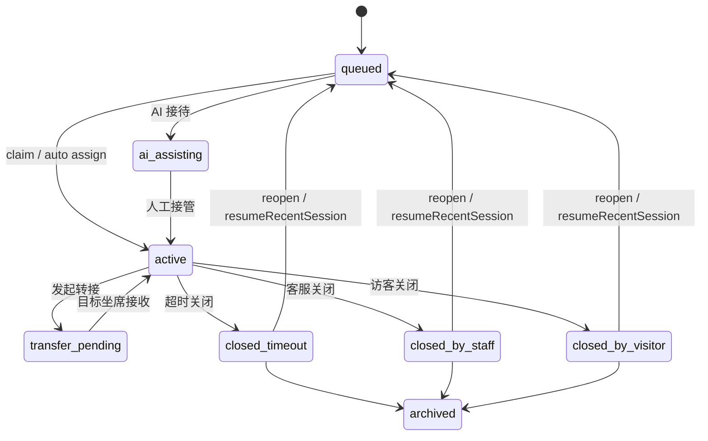

# PC 在线客服八项能力 DDD 与 UI/UX 设计

状态：设计草案，待评审  
日期：2026-06-10  
适用端：PC 客服客户端，必要时同步 App 和 Widget 的端侧边界  
适用角色：客服、管理员、所有者、访客客户  

## 1. 设计目标

本文承接 2026-06-10 新增的在线客服 8 项需求，把需求、领域模型、UI/UX、接口支撑和代码实现边界统一起来。本文只覆盖在线客服业务线，不把需求扩展到普通 IM 私聊、普通群聊或企业协作套件。

8 项能力为：

1. 历史对话，含统计与搜寻。
2. 转接对话给另一位客服。
3. 管理员和所有者实时监控客服对话。
4. 统计对话。
5. 查看客户正在输入的文字。
6. 查看客户是否已读及已读时间。
7. 客服静默撤回已发送信息，客户侧不可见。
8. 客户超时关闭对话后可继续对话。

参考文档：

- [在线客服八项能力接口说明](../api-contracts/customer-service-suite-2026-06-10.md)
- [客服配置、备注与复访续聊接口说明](../api-contracts/customer-service-config-notes-resume-2026-06-10.md)
- [需求规格说明书](../01-需求规格说明书.md)
- [功能矩阵和实现情况](../02-功能矩阵和实现情况.md)
- [技术方案](../03-技术方案.md)
- [UI 与交互设计说明](../07-UI与交互设计说明.md)

## 2. 边界说明

### 2.1 在线客服与普通 IM 分界

在线客服只包含两类客服业务线程：

| threadType | 业务含义 | 入口 |
| --- | --- | --- |
| `temp_session` | Widget 访客临时会话。 | PC `在线客服` 一级入口，Widget 客户端。 |
| `im_direct` | 注册客户与客服的客服直连线程。 | 客服中心、客户服务上下文或管理端客服会话，不进入 Widget 队列。 |

普通 IM 的 `direct` 和 `group` 不属于本文 8 项需求。普通 IM 撤回、普通 IM 已读、普通 IM 搜索和普通 IM 会话列表继续按 IM 文档处理。本文提到 `im_direct` 时，只表示有客服业务属性的注册客户客服线程，不等于普通好友私聊。

### 2.2 角色边界

| 角色 | 能力边界 |
| --- | --- |
| 客服 | 接待自己的会话、转接当前会话、查看客户输入预览、查看客户已读状态、静默撤回自己在客服会话内发送的消息、查看自己的接待历史。 |
| 管理员 | 查看和筛选全量在线客服会话、实时监控进行中会话、查看统计和报表、按权限改派/冻结/关闭、查看审计。 |
| 所有者 | 拥有管理员能力，并可进入全局配置、报表和治理入口。 |
| 访客客户 | 发起、继续、评价在线客服会话；不看到内部备注、转接备注、静默撤回痕迹和客服草稿内容。 |

管理员和所有者是实时监控能力的授权对象。本文不使用“主管”作为产品角色。

## 3. 信息架构

### 3.1 PC 一级导航

PC 主导航保持当前结构：

- `消息`：普通 IM，只展示 `direct/group`。
- `在线客服`：客服坐席高频工作区，只展示在线客服会话、客户上下文、快捷话术、转接、已读、输入预览和静默撤回。
- `数据中心`：统计、报表、导出和历史分析。
- `工作台`：按角色展示客服工具、客服中心、监控、配置和管理入口。
- `设置`：通知、桌面、诊断、安全和显示配置。

这 8 项能力不新增杂散一级入口。高频坐席动作放在 `在线客服`，管理和所有者动作放在 `工作台 > 客服中心` 或 `数据中心`。

### 3.2 坐席工作区

`在线客服` 页面采用高密度三栏：

| 区域 | 内容 |
| --- | --- |
| 左侧会话列表 | 当前接待、排队、AI 待接管、历史只读、搜索、来源、SLA、未读、转接状态。 |
| 中间聊天区 | 消息流、状态条、输入预览、已读状态、转接入口、静默撤回、终态只读和继续沟通状态。 |
| 右侧上下文 | 客户资料、历史对话摘要、工单、备注、快捷话术、AI 建议、当前线程时间线。 |

快捷话术双击行为：双击话术应直接插入当前会话输入框并聚焦输入框；单击只选中预览，按钮 `插入回复` 保留为显式动作。若会话终态只读或没有可写权限，双击不插入，并显示禁用原因。

### 3.3 管理员和所有者监控台

`工作台 > 客服中心 > 实时监控` 承载管理员/所有者能力：

- 顶部筛选：客服、状态、渠道、来源、SLA 风险、队列、关键字。
- 左侧列表：进行中会话、排队会话、AI 接待、转接中、超时风险。
- 主区域：支持 2 到 4 个会话详情并排查看。
- 右侧操作：改派、冻结、解冻、强制关闭、查看客服状态墙、查看审计。

监控默认只读。若产品允许管理员插话，必须明确显示 `管理员介入` 标识，并写入审计；不把它伪装成原坐席发言。

### 3.4 数据中心

`数据中心 > 在线客服 > 历史对话` 承载历史搜寻、统计和导出。统计与搜寻放在同一个页面，避免用户在“历史对话”和“统计分析”之间来回切换：

- 时间粒度：今日、昨日、近 7 天、近 30 天、自定义。
- 顶部统计摘要：对话总量、平均首次回复时长、平均处理时长、满意度评分、SLA 违约、来源分布、地区分布。
- 同页筛选搜寻：时间、客户 ID、访客 ID、注册客户 ID、关键字、渠道、状态、客服、来源、地区、语言。
- 历史列表：按筛选条件分页展示已结束会话，支持打开只读完整对话内容。
- 导出：按当前筛选条件导出会话明细 `cs_sessions` 和坐席日统计 `cs_staff_daily_stats`。

## 4. DDD 领域模型

### 4.1 限界上下文

| 上下文 | 职责 | 不负责 |
| --- | --- | --- |
| `CustomerServiceConversation` | 会话状态、线程详情、终态只读、重开、时间线。 | 普通 IM 会话排序。 |
| `CustomerServiceMessage` | 客服消息展示、发送状态、已读、静默撤回、消息事件归一。 | 普通群聊消息策略。 |
| `CustomerServiceHistorySearch` | 历史对话查询、过滤条件、统计摘要、详情回放、导出入口。 | 普通 IM 全局搜索。 |
| `CustomerServiceTransfer` | 转接目标、备注、转接事件、客户提示、坐席通知。 | 管理端企业成员治理。 |
| `TypingPreview` | 客户草稿预览、TTL、节流、隐私提示。 | 持久化消息内容。 |
| `ReadReceipt` | 客户已读序号、已读时间、未知态。 | 普通群已读成员列表。 |
| `Monitoring` | 管理员/所有者实时查看、筛选、多窗口并排和介入动作。 | 客服自己的接待状态配置。 |
| `Reporting` | 历史对话页内的多维统计、报表导出任务和下载状态。 | 前端本地假统计、独立统计页面。 |
| `ConfigurationAndNotes` | 开场白、自动发话、快捷回复管理、会话备注、复访续聊配置。 | 客户侧可见资料。 |

### 4.2 聚合与值对象

| 聚合/值对象 | 核心字段 |
| --- | --- |
| `CsThread` | `threadType`、`threadId`、`conversationId`、`status`、`assignedStaffUserId`、`customerUserId`、`visitorUserId`、`customerId`、`sourceChannel`、`country`、`region`、`createdAt`、`closedAt`。 |
| `CsMessage` | `messageId`、`conversationSeq`、`senderType`、`senderUserId`、`content`、`sentAt`、`deliveryState`、`isSilentRecalled`。 |
| `CsReadState` | `targetUserId`、`lastReadSeq`、`lastReadAt`、`source`。 |
| `CsTypingDraft` | `threadId`、`senderType`、`preview`、`isTyping`、`at`、`expiresAt`。 |
| `TransferRequest` | `fromStaffUserId`、`toStaffUserId`、`reason`、`threadType`、`threadId`。 |
| `HistorySearchFilter` | 见 5.1 的完整条件。 |
| `MonitorFilter` | `staffUserId`、`status`、`threadType`、`sourceChannel`、`slaRisk`、`keyword`。 |
| `ExportTask` | `taskId`、`exportType`、`filters`、`status`、`downloadUrl`、`createdAt`。 |

### 4.3 状态机

客服会话状态使用服务端状态为准。前端只做可视化和写操作门禁。



终态会话在 PC 坐席端默认只读。Widget 点击继续对话或 `resumeRecentSession=true` 重开后，PC 侧收到新状态并把会话重新放回队列或当前接待。

## 5. 八项能力设计矩阵

### 5.1 历史对话，含统计与搜寻

产品位置：

- 主入口：`数据中心 > 在线客服 > 历史对话`。
- 客服：在 `历史对话` 查看本人已结束会话和客户服务历史。
- 管理员/所有者：在 `历史对话` 查看全量历史、完整回放、统计摘要和导出。
- 工作台只放今日概览和跳转，不承载完整历史搜寻；在线客服接待页只放当前聊天内搜索，不承载全局历史统计。

查询条件必须包含：

| 条件 | 字段/API 参数 |
| --- | --- |
| 时间范围 | `from`、`to` |
| 客户 ID | `customerId` |
| 注册客户用户 ID | `customerUserId` |
| 访客用户 ID | `visitorUserId` |
| 关键字 | `keyword` |
| 渠道 | `threadType=temp_session/im_direct` |
| 会话状态 | `status` |
| 指派客服 | `assignedStaffUserId` |
| 曾参与客服 | `staffUserId` |
| 语言/地区语言 | `locale` |
| 会话 ID | `conversationId` |
| 发送人 | `senderUserId` |
| 来源 | `sourcePlatform`、`sourceChannel`、UTM |
| 地区 | `country`、`region` |
| 满意度 | `rating` 或导出字段 |
| SLA 风险 | SLA dashboard 或导出字段 |
| 处理时长 | `durationSeconds` 或导出字段 |

完整对话内容包含消息流、系统事件、转接记录、关闭原因、评分、备注和 AI 命中信息。历史回放是只读，不允许客服在历史线程里继续发消息。

API 支撑：

- `GET /api/admin/v1/customer-service/center/threads`
- `GET /api/admin/v1/customer-service/center/customers/service-history`
- `GET /api/admin/v1/customer-service/center/staff/{staffUserId}/service-history`
- `GET /api/admin/v1/customer-service/center/threads/{threadType}/{threadId}`
- `GET /api/admin/v1/messages/search`
- `GET /api/client/v1/customer-service/staff/service-history`
- `GET /api/client/v1/customer-service/customers/service-history`
- `POST /api/admin/v1/export-tasks`
- `GET /api/admin/v1/export-tasks`
- `GET /api/admin/v1/export-tasks/{taskId}/download`

### 5.2 转接对话给另一位客服

产品位置：

- 聊天区头部 `转接` 按钮。
- 会话列表右键菜单 `转接`。
- 客户资料侧栏的 `服务协作` 区域。

交互流程：

1. 客服点击 `转接`。
2. 弹窗选择目标客服，展示在线状态、当前负载、技能组、语言能力。
3. 填写转接备注，备注必填或按企业配置决定。
4. 确认后进入 `transfer_pending`。
5. 原客服看到转接中状态，目标客服收到通知并可预览完整记录。
6. 客户侧收到服务端系统消息，不显示内部备注。

API 支撑：

- `POST /api/client/v1/customer-service/im-direct/{threadId}/transfer`
- `POST /api/client/v1/customer-service/temp-sessions/{sessionId}/transfer`
- WS `customer_service.thread.transferred`
- WS `temp_session.transferred`
- WS `temp_session.assigned`

实现约束：

- 转接目标必须是客服角色且在职。
- 转接备注写入时间线和审计，不进入客户可见消息。
- 被转接客服打开会话前必须可预览历史，避免盲接。

### 5.3 管理员和所有者实时监控客服对话

产品位置：`工作台 > 客服中心 > 实时监控`。

能力：

- 筛选进行中会话。
- 并排查看多个会话。
- 查看客服状态墙。
- 查看 SLA 风险。
- 必要时改派、冻结、解冻、强制关闭。
- 若启用插话，消息必须带 `manager_intervention` 并进审计。

API 支撑：

- `GET /api/admin/v1/customer-service/center/threads`
- `GET /api/admin/v1/customer-service/center/threads/{threadType}/{threadId}`
- `POST /api/admin/v1/customer-service/center/threads/{threadType}/{threadId}/assign`
- `POST /api/admin/v1/customer-service/center/threads/{threadType}/{threadId}/force-close`
- `POST /api/admin/v1/customer-service/center/threads/{threadType}/{threadId}/freeze`
- `POST /api/admin/v1/customer-service/center/threads/{threadType}/{threadId}/unfreeze`
- `GET /api/admin/v1/customer-service/center/staff-statuses`
- `GET /api/admin/v1/customer-service/center/sla/dashboard`

权限约束：

- 只对管理员和所有者可见。
- 使用 admin token 和 `X-Tenant-Id`。
- 普通客服不能进入全量监控台。

### 5.4 统计对话

产品位置：`数据中心 > 在线客服 > 历史对话`，作为历史对话页面内的统计摘要和趋势区域，不单独拆页。

指标：

- 每日、每周、每月对话量。
- 各客服接待数量。
- 平均首次回复时长。
- 平均处理时长。
- 满意度评分。
- 来源渠道分布。
- 地区分布。
- SLA 违约和即将违约。
- 转接次数和转接率。

API 支撑：

- `GET /api/admin/v1/customer-service/temp-sessions/stats`
- `GET /api/admin/v1/customer-service/temp-sessions/dashboard`
- `POST /api/admin/v1/export-tasks`，`exportType=cs_sessions`
- `POST /api/admin/v1/export-tasks`，`exportType=cs_staff_daily_stats`

实现约束：

- 统计区域与历史列表共用同一套筛选条件，筛选变化后同步刷新统计摘要和列表。
- 离线聚合指标展示 `最近更新时间`。
- 接口无数据时显示空态，不用前端假数据补图表。
- 报表下载失败可重试，不能阻塞用户继续查看页面。

### 5.5 查看客户正在输入的文字

产品位置：聊天区输入栏上方的轻量提示条。

交互：

- 客服看到客户未发送文字，最多展示 2 到 3 行。
- 超过 500 字符按服务端截断结果展示。
- 5 秒未收到更新自动清除。
- 客服侧草稿发给客户时，客户只看到 `对方正在输入...`，不看到客服草稿内容。
- 历史、搜索、复制和报表均不包含输入预览内容。

API 支撑：

- Widget 上报：`POST /api/widget/v1/sessions/{sessionId}/typing`
- 客服上报：`POST /api/client/v1/customer-service/temp-sessions/{sessionId}/typing`
- IM 客服直聊上报：`POST /api/client/v1/direct-chats/{chatId}/typing`
- WS `temp_session.typing`
- WS `msg.typing`

隐私约束：

- 输入预览是瞬时信号，不落库。
- 客户端隐私条款需要覆盖“客服可看到未发送输入内容”的产品决策。

### 5.6 客户是否已读及已读时间

产品位置：客服自己发出的消息气泡下方或 hover 详情。

展示规则：

- `conversationSeq <= lastReadSeq` 显示 `已读`。
- 有 `lastReadAt` 时显示具体时间。
- `lastReadAt=null` 显示 `已读时间未知` 或只显示 `已读`，不得显示 1970。
- 客户未读显示 `未读`。
- 历史老数据按未知态处理。

API 支撑：

- `POST /api/widget/v1/sessions/{sessionId}/read`
- `GET /api/client/v1/customer-service/temp-sessions/{sessionId}/read-status`
- `POST /api/client/v1/direct-chats/{chatId}/read`
- `GET /api/client/v1/direct-chats/{chatId}/read-status`
- WS `msg.read`

### 5.7 客服静默撤回已发送信息

产品位置：

- 消息右键菜单 `撤回`。
- 对客服会话内自己的消息展示；对普通 IM 不展示静默撤回。

交互：

1. 客服右键自己的已发送消息。
2. 选择 `撤回`。
3. 二次确认文案说明：客户侧将不会看到该消息，也不会看到撤回提示；管理端审计仍可追溯。
4. 成功后本端消息消失。
5. 其他端收到 `msg.recalled silent=true` 后静默移除。

API 支撑：

- `POST /api/client/v1/messages/{messageId}/recall-silent`
- WS `msg.recalled`，`silent=true`

约束：

- 只允许客服会话。
- 普通单聊和群聊调用返回 `SILENT_RECALL_NOT_ALLOWED`。
- 管理角色如有 `message.recall_any` 可撤回，但必须写审计。

### 5.8 客户超时关闭后继续对话

产品位置：

- Widget 客户端：终态页展示 `继续对话`。
- PC 坐席端：会话状态从终态重新进入队列或进行中时刷新列表。
- 历史详情：展示 `reopened` 时间线事件。

API 支撑：

- `POST /api/widget/v1/sessions/{sessionId}/reopen`
- `POST /api/widget/v1/{tenantCode}/sessions`，`resumeRecentSession=true`
- WS `temp_session.closed`
- 会话时间线 `reopened`

实现约束：

- Widget 必须替换服务端返回的新 `visitorToken`。
- PC 端不主动调用 reopen，只响应会话状态变化。
- 同一访客识别依赖 `customerId`、`fingerprint`、`visitorMobile` 或 `visitorEmail`。

## 6. 代码实现方案

本文是设计方案，不直接改代码。后续实现应按以下边界落地。

### 6.1 分层边界

| 层级 | 职责 |
| --- | --- |
| API DTO | 只描述服务端响应和请求形状，兼容新增字段。 |
| Gateway adapter | 归一 WS 事件，处理 unknown 字段，输出领域事件。 |
| Gateway/Repository | 封装接口调用、分页、缓存 key 和错误码映射。 |
| Domain model | 会话状态、权限、终态只读、已读计算、输入预览 TTL、静默撤回规则。 |
| Application hooks | React Query、事件订阅、乐观刷新、并发请求和页面状态。 |
| UI components | 会话列表、聊天区、输入区、历史搜索、监控台、报表页。 |

UI 不直接读原始接口字段，不直接拼 endpoint，不直接计算权限。所有接口数据先经过 normalizer。

### 6.2 建议目录

PC 后续实现建议收敛到：

```text
lpp_pc_client/src/renderer/data/api/customer-service*
lpp_pc_client/src/renderer/data/gateway/customer-service*
lpp_pc_client/src/renderer/customer-service/models
lpp_pc_client/src/renderer/customer-service/hooks
lpp_pc_client/src/renderer/customer-service/components
lpp_pc_client/src/renderer/customer-service/pages
lpp_pc_client/tests/unit/customer-service-*.spec.ts
```

### 6.3 状态来源

| 状态 | 来源 |
| --- | --- |
| 服务端会话详情 | React Query，以 `threadType/threadId` 为 key。 |
| 当前接待列表 | React Query + Gateway 事件触发失效刷新。 |
| 输入预览 | 内存状态，带 TTL，不进持久化缓存。 |
| 已读状态 | 会话详情初始化 + `msg.read` 增量更新。 |
| 静默撤回 | `msg.recalled` 事件驱动本地移除，并失效消息查询。 |
| 报表任务 | React Query 轮询任务状态。 |
| UI 面板布局 | 本地 UI store，可保存栏宽和多窗口布局。 |

### 6.4 可拖拽布局规范

PC 工作台必须支持类似桌面 IM 的拖拽栏宽：

- 会话列表最小宽度：280px，默认 340px。
- 聊天区最小宽度：520px。
- 右侧上下文最小宽度：320px，默认 380px。
- 快捷话术/知识库侧栏最小宽度：360px。
- 拖拽命中区域至少 8px，视觉线可保持 1px。
- 拖拽时使用 `document` 级 pointer capture 或全局 pointermove，避免鼠标离开分隔线后失效。
- 宽度持久化到本地 UI store，窗口缩小时按最小宽度自动折叠右栏。

## 7. API 与事件映射

| 能力 | REST | WS |
| --- | --- | --- |
| 历史对话 | `center/threads`、`service-history`、`messages/search` | 可用 `customer_service.*` 触发刷新 |
| 转接 | `im-direct/{threadId}/transfer`、`temp-sessions/{sessionId}/transfer` | `customer_service.thread.transferred`、`temp_session.transferred`、`temp_session.assigned` |
| 实时监控 | `center/threads`、`center/threads/{threadType}/{threadId}`、`staff-statuses`、`sla/dashboard` | `customer_service.*` |
| 统计 | `temp-sessions/stats`、`temp-sessions/dashboard`、`export-tasks` | 无强依赖 |
| 输入预览 | `sessions/{sessionId}/typing`、`temp-sessions/{sessionId}/typing`、`direct-chats/{chatId}/typing` | `temp_session.typing`、`msg.typing` |
| 已读时间 | `sessions/{sessionId}/read`、`temp-sessions/{sessionId}/read-status`、`direct-chats/{chatId}/read-status` | `msg.read` |
| 静默撤回 | `messages/{messageId}/recall-silent` | `msg.recalled` |
| 继续对话 | `sessions/{sessionId}/reopen`、`sessions resumeRecentSession=true` | `temp_session.closed`、状态刷新 |
| 快捷回复配置 | `admin/customer-service/quick-replies` | 无强依赖 |
| 开场白/自动发话 | `admin/customer-service/temp-sessions/auto-replies` | 新会话按配置生效 |
| 会话备注 | `client/customer-service/temp-sessions/{sessionId}/notes` | 时间线刷新 |

## 8. UX 状态与文案

| 场景 | UI 状态 |
| --- | --- |
| 无历史结果 | 显示空态和当前筛选条件，提供清空筛选。 |
| 历史搜索接口失败 | 保留筛选条件，显示重试，不清空结果。 |
| 转接目标离线 | 允许选择但提示风险，或按企业配置禁止选择。 |
| 转接失败 | 弹出服务端错误，保留弹窗内容。 |
| 输入预览过期 | 自动淡出，不显示错误。 |
| 已读时间未知 | 显示未知态，不显示假时间。 |
| 静默撤回失败 | 保留消息，显示失败原因。 |
| 会话终态 | 输入区禁用，展示关闭原因和只读提示。 |
| 继续对话后重新排队 | PC 列表展示新队列状态，Widget 显示排队提示。 |
| 管理员/所有者无 admin token | 隐藏或禁用管理入口，引导重新获取管理权限。 |

## 9. 验收与测试方案

后续进入代码实现后，至少补以下自动化或合同测试：

| 测试 | 覆盖 |
| --- | --- |
| `customer-service-history-filter.spec.ts` | 搜索条件、空值、分页、历史只读。 |
| `customer-service-transfer.spec.ts` | 转接请求、事件归一、转接中状态、失败态。 |
| `customer-service-monitoring-permission.spec.ts` | 管理员/所有者可见，客服不可见。 |
| `customer-service-typing-preview.spec.ts` | TTL、节流、停止输入、不可持久化。 |
| `customer-service-read-receipt.spec.ts` | `lastReadSeq/lastReadAt` 计算和未知态。 |
| `customer-service-silent-recall.spec.ts` | `silent=true` 移除，普通撤回保留占位。 |
| `customer-service-resume.spec.ts` | reopen/resume 事件后列表和详情刷新。 |
| `customer-service-export-task.spec.ts` | 导出任务创建、轮询、下载失败重试。 |
| `customer-service-layout-resize.spec.ts` | 分栏拖拽、最小宽度、持久化和窗口缩放。 |

视觉验收必须覆盖：

- 1366x768、1440x900、1920x1080。
- 无头像、头像加载失败、渠道图标缺失。
- 长客户名、长快捷话术、长输入预览。
- 会话列表、聊天区、右侧栏拖拽到最小宽度。
- 管理员/所有者监控台 2 到 4 个窗口并排。

## 10. 实施阶段

| 阶段 | 范围 | 准入条件 |
| --- | --- | --- |
| P0-设计评审 | 本文评审，确认入口、角色、API、边界。 | 产品、前端、服务端确认无边界冲突。 |
| P0-模型与接口 | DTO、normalizer、gateway event adapter、领域测试。 | 不改 UI 主流程前先让合同测试通过。 |
| P0-坐席体验 | 转接、输入预览、已读时间、静默撤回、快捷话术双击插入、拖拽布局。 | PC 自动化和手工截图验收。 |
| P1-历史与续聊 | 历史筛选、完整回放、终态只读、reopen 状态刷新。 | 多端联调和 Widget token 替换确认。 |
| P1-管理监控 | 管理员/所有者监控台、多窗口并排、筛选和介入动作。 | admin token、权限和审计确认。 |
| P2-统计报表 | 数据中心统计、导出任务、报表下载和失败重试。 | 服务端聚合字段和导出文件确认。 |

## 11. 待确认问题

1. PC 客服客户端是否已经具备稳定签发 admin token 的链路，用于管理员/所有者监控台和数据中心。
2. 转接目标列表的数据源是否已包含在线状态、负载、技能组和语言能力。
3. 数据中心统计是否允许普通客服查看自己的个人数据，或仅管理员/所有者可见全量。
4. Widget 隐私条款是否已明确客户输入预览能力。
5. `resumeRecentSession=true` 是否需要前端按业务规则限制最近 N 天，还是一律交由服务端最近会话策略处理。

## 12. 效果图索引

总画板：[PC 在线客服八项需求效果图](PC在线客服八项需求效果图.html)

| 需求 | 效果图 |
| --- | --- |
| REQ-CS-20260610-001 历史对话、统计与搜寻 | [PC 在线客服需求 01 - 历史对话统计搜寻效果图](PC在线客服需求01-历史对话统计搜寻效果图.png) |
| REQ-CS-20260610-002 转接对话给另一位客服 | [PC 在线客服需求 02 - 转接对话效果图](PC在线客服需求02-转接对话效果图.png) |
| REQ-CS-20260610-003 管理员和所有者实时监控 | [PC 在线客服需求 03 - 管理员所有者实时监控效果图](PC在线客服需求03-管理员所有者实时监控效果图.png) |
| REQ-CS-20260610-004 统计对话 | [PC 在线客服需求 04 - 统计对话效果图](PC在线客服需求04-统计对话效果图.png) |
| REQ-CS-20260610-005 查看客户正在输入的文字 | [PC 在线客服需求 05 - 客户输入预览效果图](PC在线客服需求05-客户输入预览效果图.png) |
| REQ-CS-20260610-006 查看客户是否已读及已读时间 | [PC 在线客服需求 06 - 已读时间效果图](PC在线客服需求06-已读时间效果图.png) |
| REQ-CS-20260610-007 客服静默撤回已发送信息 | [PC 在线客服需求 07 - 静默撤回效果图](PC在线客服需求07-静默撤回效果图.png) |
| REQ-CS-20260610-008 客户超时关闭后继续对话 | [PC 在线客服需求 08 - 继续对话效果图](PC在线客服需求08-继续对话效果图.png) |
