# 企业级 PC IM + 在线客服系统架构蓝图

日期：2026-06-02

## 1. 结论

顶级 IM + 在线客服系统不是“长连接能收到消息”这么简单。它必须是一套可恢复、可观测、可演进、边界清晰的消息操作系统。

本方案以当前 PC 已有 API 为落地基础：`/ws/client` 长连接、IM 会话列表、IM 详情消息、在线客服 workbench、在线客服详情、`pc-im-conversations.tempSession` 过渡数据。当前 API 暂不具备全局 cursor 或会话级 afterSeq 精确补洞能力，因此本阶段不做假 cursor，也不宣称已经具备完整服务端级 gap sync。

最终目标：

- IM direct/group 与在线客服 temp session 共用底层 transport、delivery、发送 runtime、诊断能力。
- IM 与在线客服在业务归属、未读、已读、提醒、客服状态、权限和 UI 语义上严格隔离。
- 长连接 push 是实时主链路；主动查询同步承担初始化、当前 API 下的 refetch 补偿、校验和用户主动加载。
- 所有消息来源进入统一 ownership、幂等、seq/version、reconcile 规则，不允许 UI 或 query 结果直接覆盖业务状态。
- 系统能解释每一次消息延迟、未读变化、提醒决策和断线恢复过程。

## 2. 成熟系统完整能力域

### 2.1 IM 业务域

必须覆盖：

- 单聊 direct。
- 群聊 group。
- 会话列表、消息详情、历史消息、搜索。
- 文本、图片、文件、视频、语音、截图、名片、系统消息。
- 草稿、引用、转发、重发、失败标记。
- 撤回、编辑、删除本地记录。
- typing、在线状态、群成员变化。
- 发送状态：本地创建、上传中、发送中、已发送、服务端确认、失败、重试中。
- 已读状态：自己已读、对方已读、群已读人数或成员已读。

### 2.2 在线客服业务域

必须覆盖：

- 临时会话 temp session。
- 排队、接入、进行中、转接、结束、历史。
- SLA 倒计时、超时、优先级。
- 访客来源、渠道、客户资料、历史轨迹。
- 快捷话术、知识库、AI 起草、翻译。
- 客服自己消息、访客消息、系统排队消息、状态变更消息。
- 客服未读只统计访客消息。
- 点击在线客服菜单不等于读取某个临时会话。
- 只有打开具体线程并详情加载成功，才清该线程未读。

### 2.3 共享底层域

可以共享：

- Gateway transport。
- Message delivery。
- Ownership resolver。
- Idempotency / seq guard。
- Gap sync coordinator（当前 API 下先做 refetch/reconcile 补偿；真实 cursor/afterSeq 属于服务端增强）。
- Send runtime / outbox。
- Attachment upload / media cache。
- Diagnostics / metrics。
- Desktop notification adapter。

不能共享：

- IM unread state 与客服 unread ledger。
- IM read receipt 与客服 read clear。
- IM conversation cache 与客服 workbench/thread cache。
- IM badge 计算与客服 badge 计算。
- IM 业务权限与客服接待权限。

自建与开源复用原则：

- 连接协议、缓存库、桌面通知、HTTP、文件系统、上传基础能力优先复用当前代码已经采用的库或平台能力。
- 业务语义必须自建：归属、投递、幂等、seq guard、reconcile、IM read model、客服 unread ledger、提醒决策、发送状态机。
- 不能用通用库替代领域规则，也不能因为开源库方便就让 UI、缓存、提醒直接解释 raw 数据。
- 如果当前 API 不支撑某个成熟能力，例如 cursor/afterSeq gap sync，只能标为服务端缺口，不能在 PC 里伪造一个“看起来像”的实现。
- 技术选型默认沿用当前代码方案；如果要换库、换架构或重做模块，必须先说明当前方案的问题、替换收益、风险、迁移成本和回滚方案，并由你确认后才能执行。

## 3. 总体分层

### 3.0 DDD 边界原则

本方案按 DDD 的防腐层和限界上下文思路落地，避免外部协议污染内部领域模型，也避免内部模块互相穿透。

```text
外部 API / Gateway / HTTP Snapshot
  -> API Contract Guard / Anti-Corruption Mapper
  -> Domain Event / Value Object
  -> Application Service
  -> IM Domain / CustomerService Domain
  -> Effective View
  -> UI
```

硬边界：

- 外部 `payload`、HTTP response item、`pc-im-conversations.tempSession` 原始结构不得进入领域层。
- 防腐层只接受标准 API 字段，不做历史字段别名兼容。
- 字段不统一时先改服务端 API 或网关适配层，不在 PC 内部兜底猜字段。
- 归属判定基于领域事件和值对象，不基于字段名、对象路径、文案或 preview。
- IM Domain 不认识在线客服 API 结构；CustomerService Domain 不认识 IM API 原始结构。
- UI 不解释 raw unread、raw message、raw thread，只读取 effective view。

内部模块同样必须遵守 DDD 边界：

- 每个模块都是限界上下文：Transport、API 防腐、Delivery、IM Domain、CustomerService Domain、Read/Unread、Reminder、Snapshot Reconcile、Send Runtime、UI。
- 模块之间不能直接读写对方内部 store、cache、ledger、read state、outbox、React Query item。
- 模块之间只能通过明确接口交互：领域事件、值对象、应用服务命令、领域服务返回值、只读 effective view。
- IM Domain 不能调用 CustomerServiceUnreadLedger；CustomerService Domain 不能调用 ImReadView。
- Reminder 不能直接解释 IM message 或客服 thread，只能读取 IM/客服各自 effective notification view。
- Snapshot Reconcile 不能直接改 UI 或 badge，只能产出 domain merge command。
- Send Runtime 只管理发送状态和 outbox，不直接决定 IM/客服未读；未读影响由各自领域模型处理。
- UI 只能触发应用服务命令，例如 `openImConversation`、`openCustomerServiceThread`、`sendMessage`、`markVisibleRead`，不能直接改领域状态。

模块关系应按“命令/事件/查询视图”组织：

```text
Command
  UI / User Action
    -> Application Service
    -> Domain Service
    -> Domain State

Event
  Gateway / Refetch / Send Ack
    -> Anti-Corruption Mapper
    -> Domain Event
    -> Delivery / Reconcile
    -> Domain State

Query View
  Domain State
    -> Effective View
    -> UI / Badge / Notification
```

```text
Transport Layer
  SignalR/WebSocket, auth token, retry, reconnect, heartbeat, health state

API Contract / Anti-Corruption Layer
  standard API contract validation, boundary DTO, domain event conversion

Ownership Layer
  IM vs CustomerService classification, scope isolation

Delivery Layer
  idempotency, seq guard, gap detection, domain dispatch

Domain Layer
  IM domain
  CustomerService domain

Read / Unread / Reminder Layer
  IM read model
  CS unread ledger
  badge/reminder/desktop notification view

Snapshot Reconcile Layer
  startup snapshot, consistency check, stale snapshot protection

Send Runtime Layer
  outbox, upload, optimistic message, retry, status machine

UI Layer
  conversation list, thread list, chat pane, notification surfaces

Diagnostics Layer
  health, delivery, refetch compensation, read/unread, notification, latency trace
```

硬规则：

- Transport 不写业务 cache。
- API payload 不进入领域层。
- 防腐层只校验标准 API 契约并转换领域事件，不做历史字段别名兼容。
- Query result 不直接写 UI 状态。
- Delivery 之前不允许写 IM 或客服 domain。
- UI 只读 effective view。
- Reminder 数量不参与 unread badge 叠加。

### 3.1 按接收/发送入口整理的总体关系图

PC 端产品上有两个业务：**消息 IM** 和 **在线客服**。每个业务都有接收和发送两个方向，所以第一层应该拆成四个入口：IM接收、在线客服接收、IM发送、在线客服发送。

你提出的“长连接、主动查询同一层级”是合理的，但它们属于**接收侧数据通道**。发送侧也要有自己的发送通道：本地乐观消息、发送API、服务端确认/长连接回流。

需要调整的是中间顺序：**API 契约校验、防腐转换和归属必须在投递去重之前，合并必须在投递去重和顺序保护之后**。否则外部数据还没转换成领域事件、还没判定属于 IM 还是客服，就先合并，会重新引发串线和覆盖问题。

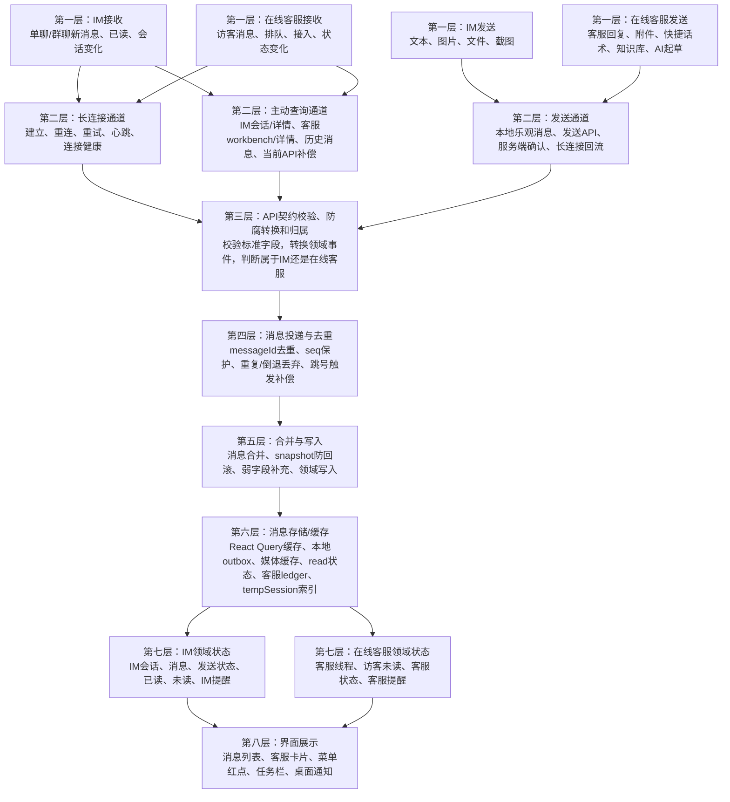

这张图的关键点：

- 第一层按业务和方向拆：IM接收、在线客服接收、IM发送、在线客服发送。
- 第二层是数据通道：接收侧是长连接和主动查询，发送侧是发送API与服务端回流。
- 第三层必须先做 API 契约校验、防腐转换和归属，否则无法稳定判断 IM/客服，也无法得到稳定的 `MessageId`、`Seq`、`Sender` 等领域值对象。
- 第四层做投递与去重，保证同一消息不重复写，旧 seq 不覆盖新状态。
- 第五层才做合并与写入，分别处理消息型数据和 snapshot/摘要型数据。
- 第六层是消息存储/缓存，当前主要是 React Query 缓存、本地 outbox、媒体缓存、read 状态、客服 ledger、tempSession index。
- 第七层由 IM 和在线客服各自解释未读、已读、提醒和业务状态。
- 第八层 UI 只读最终领域状态，不直接解释 raw unread，也不直接覆盖缓存。

注意：这张图是**模块关系图**，不是所有场景的完整时序图。发送场景里存在两条方向相反的路径：

- 本地发送路径：用户 -> 发送模块 -> 本地乐观消息 -> UI 立即展示。
- 服务端回流路径：服务端确认/长连接回流/主动查询回流 -> API 防腐转换/归属/去重 -> 合并本地乐观消息。

因此，具体数据流必须看下面的场景时序图，不能只用总体关系图理解所有流程。

### 3.1.1 场景时序图：IM 接收长连接消息

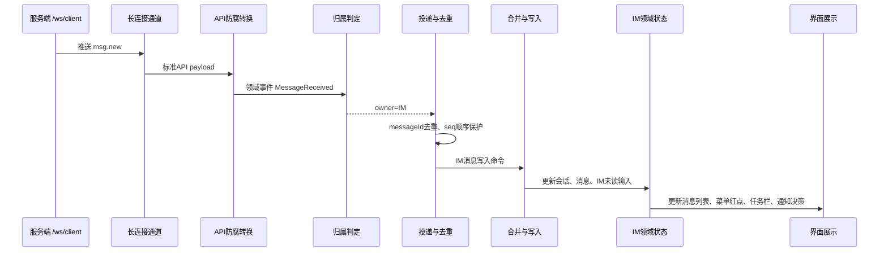

关键规则：

- 长连接不直接写 UI。
- 归属判定前不写 IM cache。
- 当前可见会话是否清未读，由 IM read model 判断，不由长连接判断。

### 3.1.2 场景时序图：在线客服接收访客消息

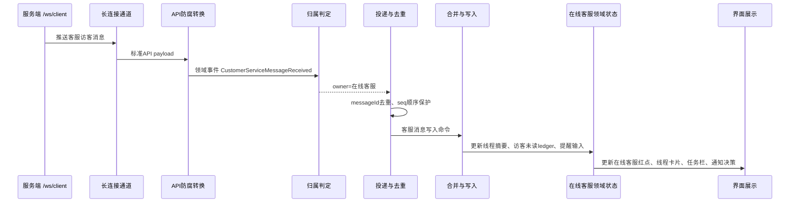

关键规则：

- 客服访客消息只进入在线客服，不进入 IM 会话列表。
- 客服自己消息不增加访客未读。
- 当前只是点击在线客服菜单时，不清临时会话未读。

### 3.1.3 场景时序图：IM 发送与服务端回流

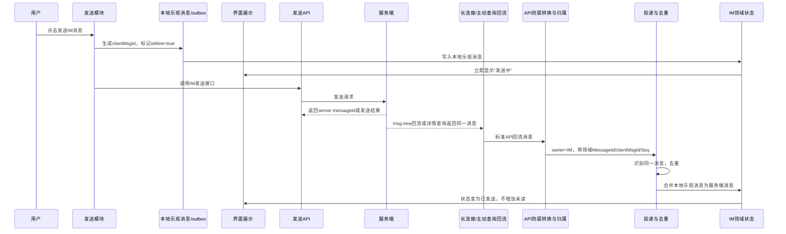

关键规则：

- 用户点击发送时当然知道是自己消息，直接标记 `isMine=true`。
- 公共防腐转换/去重模块处理的是服务端回流，保证回流还能识别为同一条自己消息。
- 自己消息回流不增加未读、不触发通知、不重复展示。

### 3.1.4 场景时序图：在线客服发送与服务端回流

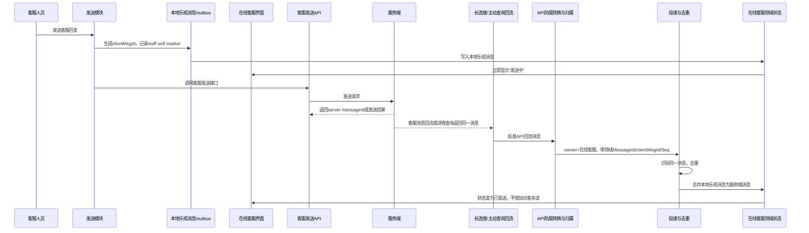

关键规则：

- 客服自己发送的消息必须记录 self marker。
- 回流消息如果缺 direction/sender，也不能直接算访客未读。
- 客服自己消息不触发在线客服提醒。

### 3.1.5 场景时序图：主动查询与长连接防冲突

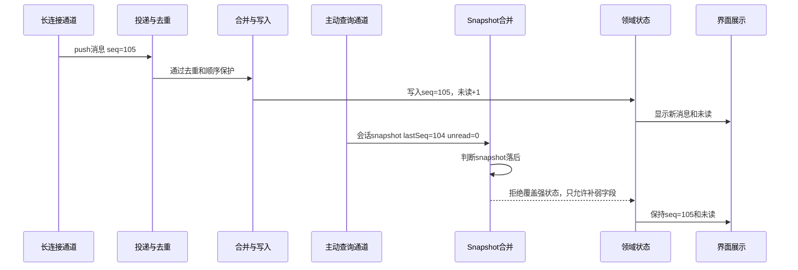

关键规则：

- 主动查询是补偿和校验，不是实时主链路。
- 旧 snapshot 不能覆盖新 push。
- 当前 API 没有 afterSeq 时，只能 refetch 补偿；精确补洞依赖服务端后续支持。

### 3.1.6 场景时序图：点击在线客服菜单与点击具体线程

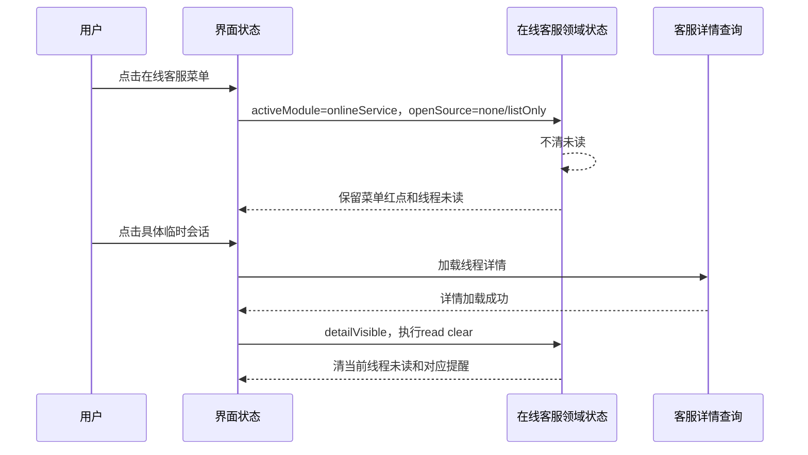

关键规则：

- 点击在线客服菜单只表示进入模块，不表示读了某个线程。
- 只有点击具体线程，并且详情加载成功，才清该线程未读。
- 只清当前 thread/conversation，不清其他临时会话。

### 3.1.7 场景时序图：长连接异常与恢复

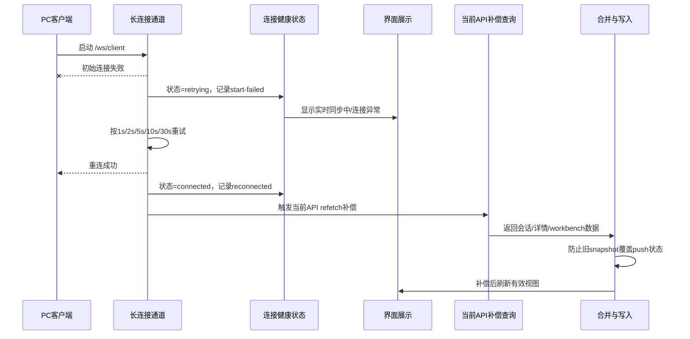

关键规则：

- 长连接异常不能静默退化为“靠轮询当实时”。
- 初始连接失败、运行中断线、重连失败都必须持续 retry，并写 `gateway-health.jsonl`。
- UI 必须显示同步中或连接异常，不能让用户误以为实时正常。
- 重连成功后，当前 API 下只能做 refetch 补偿；精确缺口补齐依赖服务端 cursor/afterSeq。
- 补偿查询结果仍要经过 snapshot 防回滚，不能覆盖更高 seq 的 push 状态。
- 补偿失败不能回滚当前已收到的 push，只记录失败并等待下次 retry/refetch。

### 3.1.8 场景时序图：长连接运行中断线

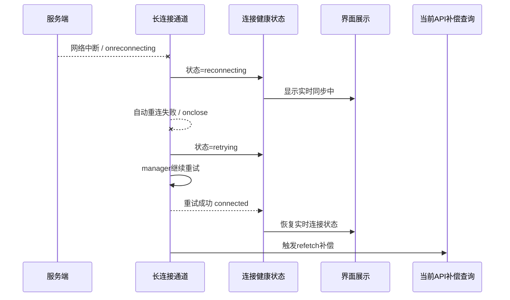

关键规则：

- SignalR 自动重连失败后，必须交给 `GatewayConnectionManager` 继续重试。
- session 切换时，旧连接的重试和回调必须失效，不能写新账号状态。
- 重连期间发送可以走 outbox；接收实时性由连接恢复和补偿查询兜底。

### 3.2 更细的中间处理链路

中间环节要拆清楚，否则很容易又出现 push 和查询互相覆盖。

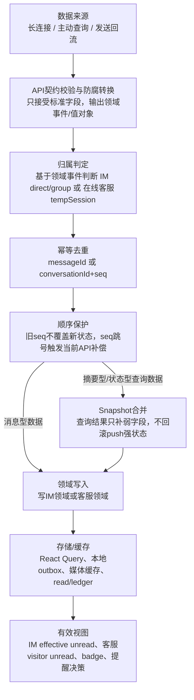

API 防腐层必须以 API 契约字段为准。目标是让 PC 内部只读取一套稳定领域事件/值对象，不允许 IM、在线客服、提醒、UI 各自读取 API payload 或猜字段。

这里的“防腐转换”不是让 PC 兼容各种历史字段名。PC 端只能做标准字段校验、结构整理、类型转换，并构造领域事件。若网关、IM API、在线客服 API 返回字段不一致，必须先在服务端 API 契约或网关适配层统一；PC 不写 `message_id/msgId/fromUserId` 这类字段别名兼容逻辑。

| API标准字段 | 转换后的领域概念 | 领域层读取方式 |
| --- | --- | --- |
| `messageId` | `MessageId` | 通过领域事件读取，不读 raw API |
| `conversationId` | `ConversationId` | 通过领域事件读取，不读 raw API |
| `threadId` | `CustomerServiceThreadId` | 通过领域事件读取，不读 raw API |
| `conversationType` | `ConversationKind` | 通过领域事件读取，不读 raw API |
| `threadType` | `CustomerServiceThreadKind` | 通过领域事件读取，不读 raw API |
| `seq` 或当前API中的 `conversationSeq` | `MessageSeq` | 通过领域事件读取，不读 raw API |
| `senderId` | `SenderId` | 通过领域事件读取，不读 raw API |
| `direction` / `isMine` | `MessageDirection` / `MineFlag` | 通过领域事件读取，不读 raw API |
| `serverTime` / `sentAt` | `ServerMessageTime` | 通过领域事件读取，不读 raw API |

API 不一致处理：

- PC 不做历史字段别名兼容；发现字段不一致时，先改 API 契约或网关适配层。
- PC 防腐层只接受标准字段，并输出领域事件/值对象。
- 业务模块、UI、提醒、未读模型不得读取 API payload 或非标准字段。
- 如果某接口暂时缺标准字段，该能力进入降级路径和诊断日志，不在 PC 里猜字段。

### 3.3 长连接层与主动查询层的关系

长连接和主动查询是同一层的数据来源，但职责不同：

| 来源 | 主要职责 | 不能做 |
| --- | --- | --- |
| 长连接 | 实时收到消息、已读、客服事件 | 不能直接写UI，不能绕过归属和去重 |
| 主动查询 | 首屏初始化、详情加载、历史消息、当前API补偿、低频校验 | 不能覆盖更新的push状态，不能直接清未读 |
| 用户发送 | 本地乐观消息、上传、失败重试、服务端确认 | 自己消息不能制造未读，回流必须去重 |

当前 API 不支持精确 `cursor/afterSeq` 补洞，因此：

- 长连接断开/重连后，当前只能触发 IM 会话/详情、客服 workbench/详情的 refetch 补偿。
- refetch 补偿必须经过合并规则，不能把旧 snapshot 覆盖 push 新状态。
- 真正按缺口区间补齐消息，需要服务端后续提供 cursor 或 afterSeq。

### 3.4 消息存储/缓存层说明

当前 PC 前端的消息存储更接近“前端缓存 + 本地辅助状态”，不是完整本地数据库事件溯源。

主要包括：

- React Query：IM会话、IM详情、客服workbench、客服详情等远端数据缓存。
- 本地 outbox：未完成发送、失败重试、附件上传状态。
- 媒体缓存：图片、视频封面、附件本地引用。
- IM read state：`myReadSeq`、`peerReadSeq`、effective unread。
- 客服 unread ledger：访客未读、客服自己消息 marker、read clear 水位。
- tempSession index：当前账号/工作区下 IM conversation 与客服 thread 的归属映射。

规则：

- 存储/缓存层只保存状态，不决定业务含义。
- IM 未读由 IM read model 解释。
- 客服未读由 CustomerServiceUnreadLedger 解释。
- UI 不直接读取 raw unread 作为最终 badge。

## 4. 当前 API 契约与服务端增强边界

### 4.0 当前可用 API 能力

当前方案优先使用已有能力，不设计当前 API 不支持的假能力：

| 能力 | 当前来源 | 本阶段用途 |
| --- | --- | --- |
| 实时事件 | `/ws/client`，`msg.new/msg.read/客服事件` | 实时主链路 |
| IM 会话列表 | `pc-im-conversations` | 启动首屏、弱字段补充、落后检测 |
| IM 详情消息 | `pc-im-messages` | 打开会话、历史消息、补偿查询 |
| 在线客服 workbench | `pc-cs-workbench-threads` | 线程列表、状态、摘要兜底 |
| 在线客服详情 | 客服 thread messages API | 打开线程、消息详情、访客未读重算 |
| tempSession 过渡数据 | `pc-im-conversations.tempSession` | 客服归属索引、preview 兜底、诊断 |

当前不具备或不稳定的能力：

- 全局 cursor sync。
- 会话级 afterSeq 精确补洞。
- Gateway 事件级稳定 eventId。
- 客服状态 statusVersion。
- 所有客服消息稳定 senderRole/direction/isMine。

因此，本阶段目标是：**push-first + 当前 API refetch 补偿 + stale snapshot protection + 明确服务端缺口**。

## 4.1 理想服务端协议契约（后续增强）

### 4.1.1 Gateway 事件信封

所有 gateway 事件由服务端或网关适配层输出时必须已经满足以下标准信封：

```ts
interface GatewayEventEnvelope<TPayload> {
  eventId: string;
  eventName: string;
  tenantId: string;
  workspaceId: string;
  accountId: string;
  ownerHint?: "im" | "customerService";
  cursor?: string;
  serverTime: string;
  payload: TPayload;
}
```

要求：

- `eventId` 全局唯一，用于事件级幂等。
- `cursor` 是全局单调游标，优先级高于会话级 seq。
- `serverTime` 必须服务端生成。
- `ownerHint` 只是提示，不能替代 ownership resolver。

### 4.1.2 消息事件

```ts
interface MessageCreatedEvent {
  messageId: string;
  clientMsgId?: string;
  conversationId: string;
  conversationType: "direct" | "group" | "temp_session";
  threadId?: string;
  threadType?: "temp_session" | "customer_service";
  seq: number;
  cursor?: string;
  senderId: string;
  senderRole?: "user" | "visitor" | "staff" | "system";
  direction?: "in" | "out";
  isMine?: boolean;
  messageType: "text" | "image" | "file" | "video" | "audio" | "system" | "card";
  body: unknown;
  sentAt: string;
}
```

要求：

- IM 消息必须有 `conversationId + conversationType + seq`。
- 客服消息必须有 `threadId`，或能通过明确 temp session 索引得到 `threadId`。
- 客服访客/客服自己消息必须能通过 `senderRole/direction/isMine/senderId` 判定。
- 没有 sender/direction 的客服消息不能直接贡献访客未读。

### 4.1.3 Read Receipt

```ts
interface ReadReceiptEvent {
  conversationId: string;
  conversationType: "direct" | "group";
  readerId: string;
  readerRole?: "user" | "visitor" | "staff";
  readSeq: number;
  readAt: string;
}
```

规则：

- 当前用户 read receipt 推进 `myReadSeq`。
- 对方 read receipt 只更新 `peerReadSeq`。
- 客服线程已读不复用 IM read receipt，使用客服 read clear 事件或详情加载成功后的本地清理。

### 4.1.4 客服状态事件

```ts
interface CustomerServiceThreadEvent {
  eventId: string;
  threadId: string;
  conversationId?: string;
  threadType: "temp_session";
  status:
    | "queued"
    | "claimed"
    | "active"
    | "transferred"
    | "closed"
    | "sla_warning"
    | "sla_timeout";
  statusVersion: number;
  actorId?: string;
  serverTime: string;
}
```

规则：

- 客服状态事件按 `threadId + statusVersion` 幂等。
- 状态事件可以提醒，但不能算访客消息未读。
- 排队数量、进行中数量、SLA 数量与消息未读分开计算。

### 4.1.5 Gap Sync 接口

首选全局 cursor：

```ts
GET /api/client/v1/messages/sync?afterCursor=...

interface MessageSyncResponse {
  events: GatewayEventEnvelope<unknown>[];
  nextCursor: string;
  hasMore: boolean;
  serverTime: string;
}
```

备选会话级 afterSeq：

```ts
GET /api/client/v1/conversations/{conversationId}/messages?afterSeq=...&limit=...

interface ConversationGapResponse {
  conversationId: string;
  messages: MessageCreatedEvent[];
  readReceipts?: ReadReceiptEvent[];
  serverLastSeq: number;
  hasMore: boolean;
}
```

要求：

- Gap sync 返回事件继续走 `MessageDeliveryService`。
- 已处理消息由 delivery guard 跳过。
- Gap sync 失败要记录、重试、可见，不阻塞当前 push。

## 5. 长连接与主动查询协作

### 5.1 职责划分

```text
长连接 push
  实时主链路，负责消息即时到达、read receipt、客服状态事件。

主动查询同步
  初始化、重连后 refetch 补偿、seq gap 后 refetch 补偿、低频一致性校验、用户主动打开详情。

轮询
  最低优先级降级方案，只能辅助校验，不能作为实时消息设计。
```

### 5.2 合并原则

所有来源必须进入统一合并模型：

```text
gateway push -> MessageDeliveryService
gap sync/refetch compensation result -> MessageDeliveryService 或 domain merge guard
history/detail messages -> MessageDeliveryService 或同等 domain merge guard
conversation/workbench snapshot -> SnapshotReconcileService -> domain/effective view
```

禁止：

- query result 直接覆盖 UI。
- snapshot 直接清 unread。
- workbench raw unread 直接写客服 badge。
- history/detail 绕过 messageId/seq 幂等。

### 5.3 覆盖规则

```text
incomingSeq > localSeq
  可以更新强状态。

incomingSeq === localSeq
  只补弱字段。

incomingSeq < localSeq
  丢弃强状态。

incomingSeq 缺失
  弱数据，只能补展示字段，不能覆盖强状态。
```

强状态：

- lastMessageSeq。
- latest message preview。
- unread 输入。
- readSeq。
- send status。
- cursor。

弱状态：

- avatar。
- displayName。
- source label。
- 无 seq preview。
- UI 补充字段。

### 5.4 冲突示例

push 先到，snapshot 后到旧数据：

```text
push: seq=105 unread=1
snapshot: lastSeq=104 unread=0
结果：保留 push，snapshot 不覆盖。
```

当前 API refetch 补偿或后续 gap sync 返回重复消息：

```text
本地已有 messageId=A seq=105
refetch 返回已存在的 seq=105，或后续 afterSeq 返回 seq=101..105
结果：已存在消息跳过；当前 API 能补多少取决于详情/列表 refetch，精确补齐 101..104 依赖服务端 afterSeq。
```

客服 gateway 与 workbench 冲突：

```text
gateway: visitor message unread +1
workbench: unread=0 preview=null
结果：保留 ledger unread 和 gateway preview。
```

tempSession raw unread：

```text
tempSession rawUnread=5
lastMessage 缺 sender/direction
结果：只做诊断/preview 兜底，不进最终客服 badge。
```

## 6. Transport 设计

### 6.1 状态机

```text
idle -> connecting -> connected
connecting -> retrying
connected -> reconnecting -> connected
reconnecting -> retrying
retrying -> connecting
* -> stopped
```

规则：

- 初始连接失败持续 retry。
- Retry backoff：`1s, 2s, 5s, 10s, 30s`，之后维持 30s。
- 一个 session scope 只能有一个有效 connection。
- session 切换递增 generation，旧回调不写新状态。
- `connected/reconnected` 必须触发 gap sync。
- UI 显示实时连接状态。

### 6.2 心跳与健康

- connected 后每 30s heartbeat。
- heartbeat 失败进入 reconnecting/retrying 观察。
- `gateway-health.jsonl` 记录所有状态变化。
- 健康状态参与诊断，不参与业务未读。

## 7. Delivery 设计

### 7.1 投递流程

```text
received
  -> contractMapped
  -> ownershipResolved
  -> guardChecked
  -> domainWritten
  -> effectiveViewResolved
  -> notificationDecision
```

### 7.2 幂等 key

- 消息：`scopeKey + owner + messageId`。
- 无 messageId：`scopeKey + owner + conversationId/threadId + seq`。
- IM read receipt：`scopeKey + conversationId + readerId + readSeq`。
- 客服状态事件：`scopeKey + threadId + statusVersion/eventId`。
- 客服提醒：`scopeKey + threadId + messageId`。

### 7.3 Seq guard

- `seq <= highestSeq`：跳过，不写 cache。
- `seq = highestSeq + 1`：正常写入。
- `seq > highestSeq + 1`：写当前 push，同时触发 gap sync。
- `seq` 缺失：允许写入弱状态，但日志标记，不作为强一致依据。

## 8. Ownership 设计

### 8.1 IM 归属

明确 IM：

- `direct`
- `group`
- `im_direct`
- `im_group`

默认 IM：

- 无客服高置信证据的 `msg.new`。

### 8.2 客服归属

明确客服：

- eventName 是客服事件。
- `threadType=temp_session`。
- `conversationType=temp_session`。
- 防腐层从标准 API `tempSession.sessionId` 输出 `CustomerServiceThreadOwnership`。
- `conversationId` 命中同 scope 下明确 temp session 索引。

不能单独作为客服证据：

- `direct_customer`
- `customer_direct`
- 任意字段名包含 `service/customer`
- `pc-im-conversations.unreadCount`

说明：

- 归属判定只能基于 API 契约明确枚举、明确 `tempSession` 数据、或同 scope 下由明确 `tempSession` 建立的归属索引。
- 不允许通过字段名、对象路径、文案、来源标签、preview 内容猜测归属。
- `tempSession` 是当前 API 明确返回的过渡数据源；进入客服领域前必须转换为 `CustomerServiceThreadOwnership`，领域层不直接读取 `pc-im-conversations.tempSession`。

## 9. IM Domain 设计

### 9.1 会话状态

IM conversation view 由以下输入合成：

- 服务端会话 snapshot。
- Gateway push message。
- Gap sync message。
- Read receipt。
- 本地 send optimistic record。
- 本地 read state。

### 9.2 未读模型

清未读只允许：

- 当前用户 read receipt。
- 用户真实可见会话：`paneVisible && messagesLoaded`。
- 自己发送成功推进本地 read state。

禁止：

- 默认选中清未读。
- query 存在清未读。
- snapshot unread=0 清掉更高 seq push。
- 对方 read receipt 清当前未读。

### 9.3 IM 提醒

- 当前可见会话不弹桌面通知。
- 非当前会话收到对方消息更新 IM badge、任务栏、提醒中心。
- 自己消息不提醒。
- 同一 messageId 只提醒一次。

## 10. 在线客服 Domain 设计

### 10.1 Thread 状态

客服 thread view 由以下输入合成：

- Workbench server thread。
- Gateway visitor/staff message。
- Detail messages。
- tempSession preview 过渡输入。
- CustomerServiceUnreadLedger。
- Thread status events。

### 10.2 Unread Ledger

输入：

- `gatewayVisitorUnread`
- `detailVisitorUnread`
- `workbenchServerUnread`
- `tempSessionTrustedUnreadCandidate`
- `tempSessionRawUnread` 诊断字段
- `localStaffSentSeqs`
- `readClearSeq/readClearAt`

优先级：

```text
detailVisitorUnread
  > gatewayVisitorUnread
  > workbenchServerUnread
  > tempSessionTrustedUnreadCandidate
  > 0
```

规则：

- 客服自己消息不增加 unread。
- 系统状态消息不增加 unread。
- raw unread 不可信，不直接进 badge。
- read clear 按 `threadId + conversationId + scopeKey` 清理。

### 10.3 客服已读

可见性：

```text
hidden
listOnly
detailVisible
```

`detailVisible` 必须满足：

- 当前模块是 onlineService。
- 当前 thread id 匹配。
- 打开来源是 `user/reminder/claim`。
- 详情消息加载成功。

点击在线客服菜单、自动选中、workbench 刷新都不能清未读。

### 10.4 客服提醒

- 访客消息提醒在线客服。
- 客服自己消息不提醒。
- 当前 detailVisible 的线程不弹桌面通知。
- listOnly 状态仍保留菜单和线程未读。
- badge 数字只读 effective unread，不叠加 realtime reminder。

## 11. Send Runtime 设计

### 11.1 公共能力

`ChatSendRuntime` 负责：

- `clientMsgId/localMessageId`。
- outbox。
- 附件 blob/poster。
- 上传进度。
- 发送状态。
- 失败重试。
- 诊断日志。

### 11.2 IM 发送

IM 发送 use case 负责：

- direct/group 目标校验。
- IM endpoint。
- optimistic IM message。
- server ack merge。
- read model 影响。
- 失败/重发。

### 11.3 客服发送

客服发送 use case 负责：

- thread 是否可发送。
- 客服 endpoint。
- optimistic CS message。
- staff self marker。
- server ack merge。
- 不增加访客未读。

## 12. Notification / Badge 设计

### 12.1 Badge 来源

IM badge：

- IM effective unread。

客服 badge：

- CustomerService effective visitor unread。
- 排队数和 SLA 可以独立展示，但不能混入访客未读 badge，除非 UI 明确分区。

任务栏：

- 可以显示 IM + 客服总有效未读。
- 不能叠加 realtime reminder 条数。

### 12.2 桌面通知

通知触发条件：

- 消息不是自己发送。
- 同一 messageId 未通知过。
- 当前目标不可见。
- 用户设置允许。

通知跳过条件：

- 当前 IM 会话 paneVisible。
- 当前客服线程 detailVisible。
- 窗口焦点和设置要求不弹。

## 13. Cache / Storage 设计

### 13.1 Scope 隔离

所有本地状态必须按 scope 隔离：

```text
tenantId + workspaceId + accountId
```

包括：

- conversation index。
-客服 thread index。
- read state。
- unread ledger。
- outbox。
- reminder dedupe。
- media cache key。

### 13.2 本地状态分类

强状态：

- seq/cursor。
- unread/readSeq。
- send status。
- messageId mapping。

弱状态：

- avatar。
- nickname。
- source label。
-无 seq preview。

强状态必须受 seq/version 保护。弱状态可以被 snapshot 补充。

## 14. 多端、弱网与异常恢复

### 14.1 多端同步

- 当前用户在其他端 read receipt 到达 PC 后，应清 PC 对应 IM 未读。
- 当前客服在其他端打开线程后，是否清 PC 客服未读必须由后端客服 read clear 事件确认。
- 多端发送同一 `clientMsgId` 回流时合并本地 optimistic 消息。

### 14.2 弱网

- gateway retry 可见。
- send outbox 保留失败任务。
- 上传失败可重试。
- gap sync 失败不阻塞当前 push。
- snapshot 失败不回滚本地状态。

### 14.3 异常恢复

- force logout 清 auth、query、gateway、ledger、outbox session scope。
- 客户端重启后恢复 outbox 和 read state。
- 明确记录恢复来源：startup、gateway、gap-sync、snapshot。

## 15. 可观测性

### 15.1 日志文件

- `gateway-health.jsonl`
- `message-delivery.jsonl`
- `message-gap-sync.jsonl`
- `im-read.jsonl`
- `customer-service-reminder.jsonl`
- `send-state-machine.jsonl`

### 15.2 Trace 字段

每条消息应能串起：

```text
gatewayReceivedAt
domainEventCreatedAt
ownershipResolvedAt
guardCheckedAt
domainWrittenAt
viewResolvedAt
notifiedAt
```

必要字段：

- `messageId`
- `conversationId/threadId`
- `seq/cursor`
- `owner`
- `source`
- `decision`
- `reason`
- `latencyMs`

### 15.3 性能目标

- Push received -> domain write：P95 < 100ms。
- Domain write -> badge render：P95 < 300ms。
- Push received -> user visible：P95 < 500ms。
- Gateway initial retry：<= 1s。
- Reconnected -> gap sync trigger：<= 500ms。

## 16. 安全与隐私

- 诊断默认脱敏。
- 明文诊断只允许本地排查期打开。
- 不记录 token、手机号、完整用户 ID、消息正文。
- 多租户数据必须 scope 隔离。
- 旧 session 回调不得写新 session。
- 桌面通知不得泄露敏感内容，需遵循用户设置。

## 17. 测试矩阵

### 17.1 单元测试

- Gateway retry/reconnect/session cleanup。
- Delivery dedupe/seq guard/gap trigger。
- Ownership IM/CS 分类。
- IM read model。
- CustomerService unread ledger。
- Snapshot reconcile。
- ChatSendRuntime。
- Notification decision。

### 17.2 集成测试

- push + snapshot 冲突。
- push + gap sync 重复。
- gateway 断线重连。
- IM 当前会话/非当前会话。
- 客服菜单/listOnly/detailVisible。
- 客服自己消息和访客消息混合。
- 多账号切换。

### 17.3 手动验收

- IM 正常收消息 <500ms。
- Gateway 断开后 UI 显示同步中，恢复后补齐消息。
- 临时会话不进入 IM。
- 客服访客消息提醒客服。
- 客服自己消息不增加未读。
- 点击在线客服菜单不清未读。
- 点击具体线程详情加载后清未读。

## 18. 分阶段落地

### Phase 1：前端地基

- Gateway 强主链路。
- Delivery guard。
- IM read view。
- CS unread ledger。
- Badge effective view。
- Diagnostics。

### Phase 2：当前 API 补偿同步与服务端 gap sync 增强

- 当前先用 conversation/message/workbench/detail refetch 做补偿。
- 明确记录全局 cursor 或 afterSeq 缺口。
- 服务端补齐后再接入真实 gap sync。
- Fallback refetch 降级为兜底。

### Phase 3：发送状态机

- IM/CS send use case 全接入 ChatSendRuntime。
- optimistic/ack/retry/failed 统一。
- staff self marker 完整闭环。

### Phase 4：高级能力

- 撤回、编辑、typing、引用、群已读。
- 客服转接、结束、SLA、评价。
- 线上性能指标和告警。

## 19. 最终验收标准

- 所有实时消息优先通过 gateway push。
- gateway 异常持续重试并可见。
- 重连后当前先做 refetch 补偿；服务端补齐后再按 cursor/seq 精确补洞。
- 主动查询不覆盖更新的 push 状态。
- 重复消息不重复写、不重复提醒。
- IM 和客服不串线。
- IM 未读只由 IM read model 解释。
- 客服未读只由 visitor unread ledger 解释。
- 当前可见会话不产生错误未读。
- 未查看会话不被自动清未读。
- 所有 badge 读取 effective view。
- 所有关键链路有日志可追。

## 20. 当前 API 下的关键字段映射

PC 不能替后端兼容字段。当前只能对已经符合标准契约的 API 字段做校验、防腐转换和领域事件构造；不符合契约的字段必须先由服务端 API 或网关适配层统一。

### 20.1 Gateway push 字段

现有来源：

- `/ws/client`
- `msg.new`
- `msg.read`
- 客服 message/thread/queue/status 事件

API 标准字段：

| API标准字段 | 用途 | 缺失处理 |
| --- | --- | --- |
| `messageId` | 消息幂等 | 缺失时退化为 `conversationId + seq`；如果两者也缺失，只能弱合并 |
| `conversationId` | IM 会话定位 | 缺失时不能写 IM 会话强状态 |
| `threadId` | 客服线程定位 | 缺失时只能用明确 temp session index 映射 |
| `conversationType` | 归属判定 | 缺失时默认保护 IM |
| `threadType` | 客服归属判定 | 缺失时不能单独判客服 |
| `seq` 或 `conversationSeq` | 顺序与补偿检测 | 防腐层转换为领域 `MessageSeq`；缺失时只作为弱数据 |
| `senderId` | 判断自己/对方/访客 | 缺失时客服 raw unread 不可信 |
| `direction` / `isMine` | 自己消息与访客消息判定 | 缺失时不能增加客服访客未读 |
| `serverTime` / `sentAt` | 延迟诊断与弱排序 | 缺失时只记录客户端观察时间 |

字段契约处理：

- PC 端不处理 `message_id`、`msgId`、`chatId`、`thread_id`、`sessionId`、`fromUserId`、`platformUserId`、`lppId` 等历史别名。
- 如果现有 API 返回这些非标准字段，必须先由服务端 API 或网关适配层统一为标准字段，再进入 PC 消息系统。
- PC 防腐层只做标准字段校验、类型整理、缺失诊断和降级决策。
- 不允许在 IM read model、客服 ledger、提醒、UI 中读取非标准字段。

### 20.2 主动查询 API 字段

当前来源：

- IM 会话列表：`pc-im-conversations`
- IM 消息详情：`pc-im-messages`
- 在线客服 workbench：`pc-cs-workbench-threads`
- 在线客服详情消息
- temp session 过渡数据：`pc-im-conversations.tempSession`

统一处理：

| 查询来源 | 允许更新 | 禁止更新 | 必须进入 |
| --- | --- | --- | --- |
| IM 会话列表 | 首屏会话、弱字段、落后检测 | 直接覆盖更高 seq push 未读/摘要 | `SnapshotReconcileService` |
| IM 详情消息 | 消息列表补齐、历史翻页 | 重复展示、绕过幂等 | domain merge guard / delivery guard |
| 客服 workbench | 线程列表、状态、可信 server unread | 覆盖 gateway visitor unread | `SnapshotReconcileService` + ledger |
| 客服详情消息 | 详情展示、访客未读重算、read clear 条件 | 点击菜单即清未读 | CS detail merge + read visibility |
| IM tempSession 过渡项 | 客服归属、preview 兜底、诊断 | 直接写 IM、直接写客服最终 unread | CS tempSession bridge |

### 20.3 服务端后续必须补齐字段

PC 不做字段兼容，因此服务端或网关适配层必须补齐并统一：

- 全局 `cursor` 或会话级严格递增 `seq`。
- Gateway 事件级 `eventId`。
- 客服线程状态 `statusVersion`。
- 客服消息明确 `senderRole/direction/isMine`。
- Gap sync 接口：全局 `afterCursor` 或会话级 `afterSeq`。

## 21. Push 与主动查询协作时序图

### 21.1 正常 push 收消息

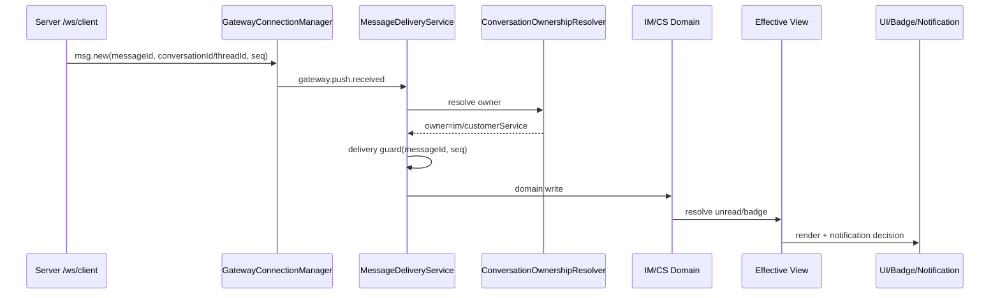

### 21.2 Push 先到，旧 snapshot 后到

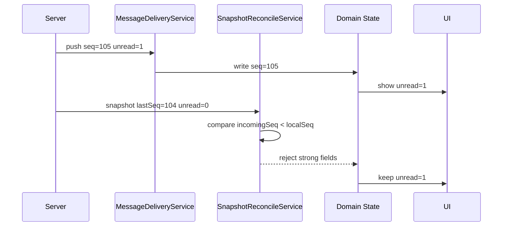

### 21.3 Seq 跳号触发 gap sync

```mermaid
sequenceDiagram
  participant S as Server
  participant D as MessageDeliveryService
  participant GS as MessageGapSyncCoordinator
  participant API as Current API refetch / future gap sync
  participant M as Domain State

  S->>D: push seq=105, localSeq=100
  D->>D: detect gap 101-104
  D->>M: write current seq=105
  D->>GS: trigger push-seq-gap
  GS->>API: current API refetch; future afterSeq if supported
  API-->>GS: messages 101-105
  GS->>D: deliver compensation messages
  D->>D: skip duplicate 105
  D->>M: write 101-104
```

### 21.4 在线客服访客消息与 workbench 冲突

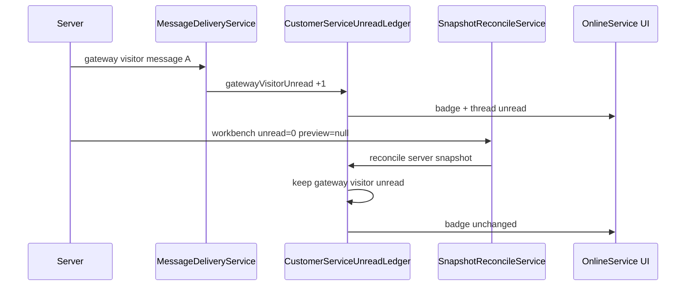

### 21.5 点击在线客服菜单与点击具体线程

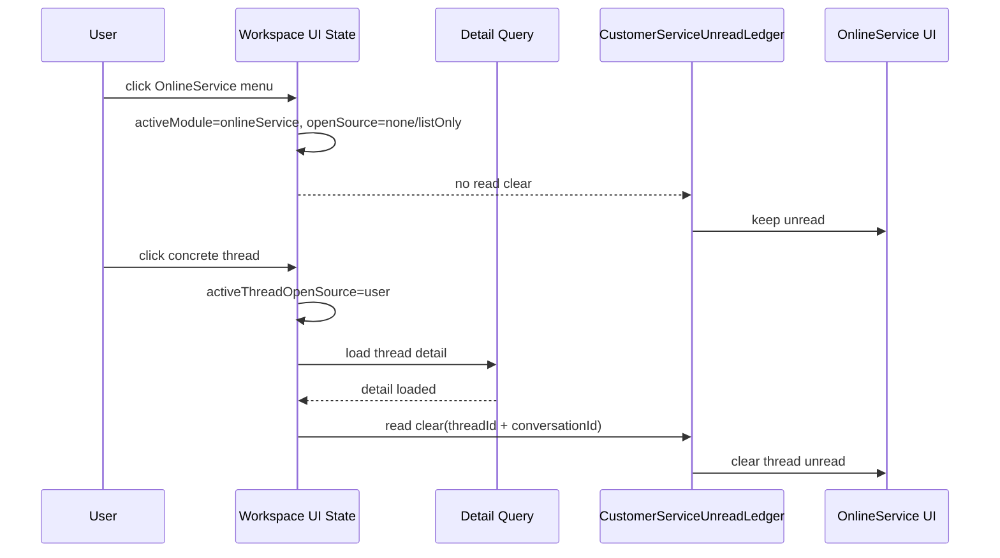

## 22. 消息提醒保证机制

提醒不是从 raw event 直接弹出来，而是从 effective view 和 reminder decision 派生。

### 22.1 IM 提醒规则

输入：

- owner=IM 的对方消息。
- delivery guard 未跳过。
- 当前会话不可见。
- 用户通知设置允许。

幂等：

- `scopeKey + conversationId + messageId`
- 无 messageId 时用 `scopeKey + conversationId + seq`

跳过：

- 自己消息。
- 当前会话 `paneVisible && messagesLoaded`。
- 重复 messageId。
- 用户设置禁止。

### 22.2 在线客服提醒规则

输入：

- owner=customerService 的访客消息。
- ledger 判定为访客未读。
- 当前线程不是 `detailVisible`。
- 用户通知设置允许。

幂等：

- `scopeKey + threadId + messageId`

跳过：

- 客服自己消息。
- 系统状态消息。
- 当前线程 detailVisible。
- 重复 messageId。

### 22.3 Badge 规则

```text
IM badge = IM effective unread
在线客服 badge = CustomerService visitor effective unread
任务栏 badge = IM effective unread + CustomerService visitor effective unread
```

禁止：

- reminder 数量叠加到 badge。
- workbench raw unread 直接覆盖客服 badge。
- snapshot unread 直接覆盖 IM read view。

## 23. IM 与在线客服共享核心但互不干扰

### 23.1 共享核心

```text
GatewayConnectionManager
MessageDeliveryService
ConversationOwnershipResolver
MessageGapSyncCoordinator
ChatSendRuntime
Diagnostics
DesktopNotificationAdapter
AttachmentUploadRuntime
```

共享的是底层能力，不共享业务状态。

### 23.2 隔离边界

| 能力 | IM | 在线客服 |
| --- | --- | --- |
| 归属 | direct/group | temp_session/customer_service |
| Domain cache | IM conversation/message cache | CS workbench/thread/detail cache |
| 未读 | `ImReadView` | `CustomerServiceUnreadLedger` |
| 已读 | read receipt + visible read command | detailVisible + read clear |
| 提醒 channel | messages | serviceQueue |
| 自己消息 | 不产生 IM 未读 | 不产生访客未读 |
| Snapshot | IM reconcile | CS workbench/detail reconcile |
| 权限 | IM 会话权限 | 客服接待/线程状态权限 |

### 23.3 防串线机制

- 所有消息先 ownership，再写 domain。
- temp session 从 IM 会话列表过滤。
- `direct_customer/customer_direct` 没有 tempSession 证据时不归客服。
- 客服 tempSession 归属索引按 `scopeKey` 隔离。
- IM 与客服 badge 分别从各自 effective view 计算。
- `MessageDeliveryService` 只负责投递，不把 IM 和客服状态合并成一个大对象。

## 24. 其他必须覆盖的关键场景

### 24.1 乱序消息

```text
先到 seq=105，后到 seq=104
处理：104 不覆盖强状态；如果消息列表缺 104，可作为历史补齐，但不能回滚摘要/未读。
```

### 24.2 撤回和编辑

- 撤回/编辑事件必须有 `messageId + seq/version`。
- 如果目标消息不存在，记录 pending mutation，等待 gap sync/detail 补齐后应用。
- 撤回自己消息不增加未读。
- 撤回访客消息是否影响未读，需要以后端 read/unread 契约为准。

### 24.3 Typing

- typing 是短生命周期 UI 状态。
- 不进入 message list。
- 不影响未读。
- 不进入 gap sync。

### 24.4 多端已读

- IM 多端当前用户 read receipt 可以清 PC 未读。
- 客服多端清未读必须由客服 read clear/status 事件确认，不能只靠另一个端打开推断。

### 24.5 客服状态事件

- 排队、接入、转接、结束、SLA 是 thread status，不是访客消息未读。
- 可以独立提醒或更新状态计数。
- 不混入 visitor unread badge。

### 24.6 离线发送和重试

- outbox 按 scope 保存。
- 重启后可恢复未完成任务。
- server ack 回流后按 `clientMsgId/messageId` 合并 optimistic 消息。
- 自己消息回流不产生未读。

### 24.7 多账号切换

- scopeKey 必须包含 tenant/workspace/account。
- 旧 gateway、旧 ledger、旧 tempSession index、旧 outbox 不能污染新账号。
- force logout 必须清理当前 scope 的 auth/query/gateway 状态。
