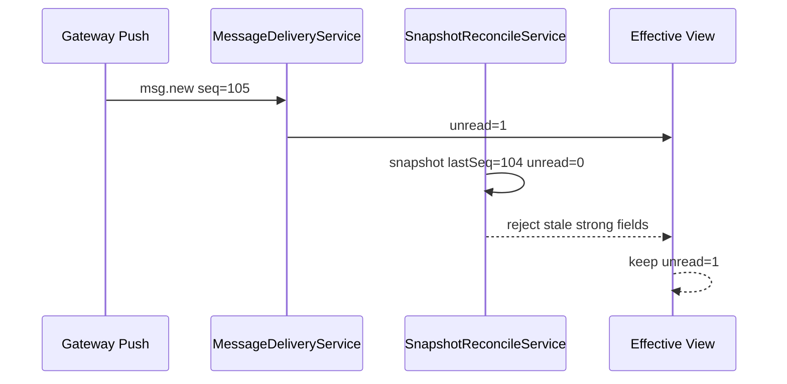
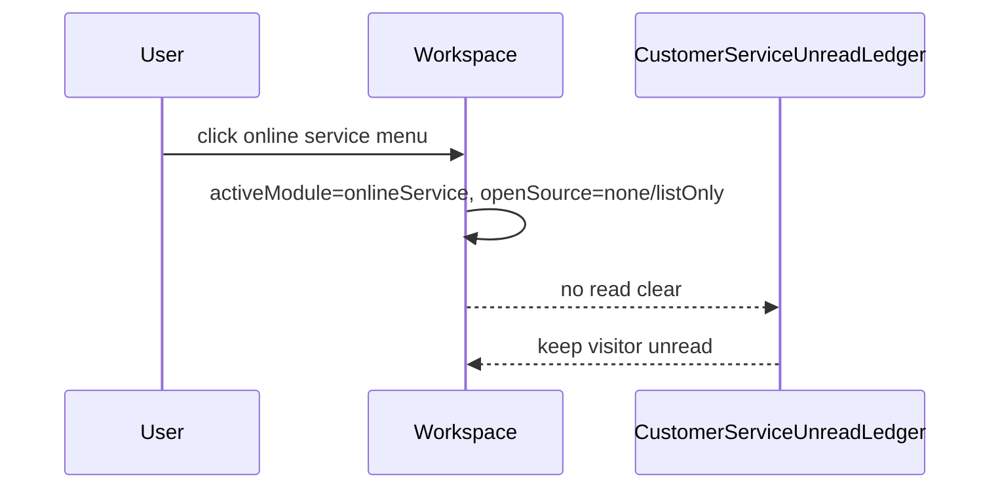
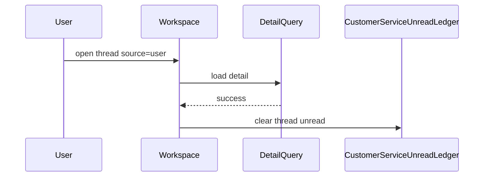

# PC IM + 在线客服消息系统闭环交付方案

日期：2026-06-02

## 1. 这份文档的定位

这不是再做一次“大而全重构”。这份文档用于把 IM + 在线客服消息系统做成一个可交付闭环：设计有边界、实现有入口、状态有不变量、测试有矩阵、验收有标准、线上问题有日志可追。

最终执行关系：

- `01-企业级IM与在线客服架构蓝图.md` 是完整架构蓝图。
- 本文档是落地闭环方案，回答“怎么做完、怎么证明做完、怎么避免再返工”。

## 2. 核心结论

成熟且不过度设计的方案只需要守住 6 个核心模型：

1. `GatewayConnectionManager`：唯一长连接生命周期管理器。
2. `MessageDeliveryService`：所有实时消息和当前 API 补偿消息的统一投递入口。
3. `SnapshotReconcileService`：所有主动查询 snapshot 的统一合并入口。
4. `ConversationOwnershipResolver`：唯一归属判定入口。
5. `ImReadView`：IM 未读/已读唯一解释模型。
6. `CustomerServiceUnreadLedger`：在线客服访客未读唯一解释模型。

其他 UI、列表、badge、任务栏、桌面通知、提醒中心都只能读取这 6 个模型派生出的 effective view，不能自己解释 raw 数据。

这 6 个模型之间也不能互相穿透内部状态。它们通过应用服务、领域事件、命令和只读 view 协作，而不是互相 import store/cache/ledger。

## 3. 不变量

这些规则任何实现都不能违反：

- IM direct/group 永远属于“消息”。
- 在线客服 temp session 永远属于“在线客服”，不能进入 IM 会话列表。
- 未知 `msg.new` 默认保护 IM，不能被客服 tempSession 过渡逻辑劫持。
- Gateway push 是实时主链路。
- 主动查询只做初始化、补偿、校验、用户主动加载。
- Push、当前 API refetch 补偿、history/detail 查到的消息都必须走 delivery guard 或同等 domain merge guard。
- Snapshot/workbench/conversation list 不能绕过 reconcile 直接覆盖 domain 状态。
- 同一 `messageId` 或 `conversationId + seq` 只处理一次。
- seq 倒退不能覆盖本地状态。
- seq 跳号必须触发当前 API 下的 refetch 补偿；真实缺口拉取依赖服务端 cursor/afterSeq。
- IM 未读只由 IM read model 解释。
- 客服未读只由 visitor unread ledger 解释。
- 客服自己发送不增加访客未读。
- 点击在线客服菜单不清临时会话未读。
- 当前可见会话不弹桌面通知。
- Badge 数字不叠加 realtime reminder 数。
- 旧 session 的 gateway 回调不能写新 session 状态。
- 模块之间不能直接读写对方内部状态，只能通过公开应用服务、领域事件、命令和值对象交互。
- UI 不直接写 IM read state、客服 ledger、gateway state、outbox、React Query item。
- Reminder 不直接读取 raw message/thread；只读取 notification effective view。
- SnapshotReconcileService 不直接写 badge/UI；只产出 domain merge command。
- Send Runtime 不直接清未读、不直接发提醒；只产出 send state / ack / self message domain event。

## 4. 最小完整架构

```text
/ws/client
  -> GatewayConnectionManager
  -> API contract guard / anti-corruption mapper
  -> ConversationOwnershipResolver
  -> MessageDeliveryService
       -> delivery guard
       -> seq gap detection
       -> IM domain writer
       -> CS domain writer
  -> Effective view
       -> IM unread badge
       -> CS unread badge
       -> taskbar
       -> desktop notification

HTTP query
  -> SnapshotReconcileService
       -> ownership
       -> seq/version compare
       -> weak field merge
       -> gap detection
       -> never overwrite newer push state
```

不要再增加更多抽象，除非能移除真实重复或解决明确一致性问题。

### 4.1 模块间 DDD 交互规则

实现时按三类接口组织模块关系：

| 交互类型 | 允许对象 | 禁止事项 |
| --- | --- | --- |
| Command | `openImConversation`、`openCustomerServiceThread`、`sendMessage`、`markVisibleRead` | UI 直接改 read state / ledger / cache |
| Domain Event | `MessageReceived`、`MessageRead`、`CustomerServiceVisitorMessageReceived`、`SendAckReceived` | 传 raw gateway payload 或 HTTP item |
| Query View | `ImConversationEffectiveView`、`CustomerServiceBadgeView`、`NotificationDecisionView` | UI / Reminder 自己解释 raw unread |

模块依赖方向：

```text
UI
  -> Application Service
  -> Domain Service / Domain Model
  -> Infrastructure Adapter

Infrastructure Adapter
  -> Anti-Corruption Mapper
  -> Domain Event
  -> Application Service

Domain Model
  -> Effective View
  -> UI / Notification Adapter
```

禁止依赖：

- IM 模块 import 客服 ledger。
- 客服模块 import IM read view。
- Reminder 模块 import raw messages client response。
- Sidebar 直接读取 React Query raw unread。
- Gateway router 直接写 IM/客服 cache。
- Send Runtime 直接写 badge 或清未读。

### 4.2 模块设计覆盖、API 支撑与自建/开源决策

这张表用于回答三个问题：

- 这个模块是否已经有设计边界。
- 当前 API 是否支撑落地。
- 应该自建，还是复用开源/现有库。

| 模块 | 设计覆盖 | 当前 API 支撑 | 自建/开源决策 | 说明 |
| --- | --- | --- | --- | --- |
| Transport / GatewayConnectionManager | 已覆盖 | 支撑 `/ws/client`、SignalR 连接；健康心跳细节需确认服务端 | 复用 SignalR client，自建连接治理 | SignalR 是基础库；重试、scope、健康态、日志是业务治理，必须自建 |
| API Contract Guard / Anti-Corruption Mapper | 已覆盖 | 依赖 API 标准字段；字段不一致时必须由服务端/API/网关先统一 | 自建 | 这是业务防腐层，不能用通用库替代，也不能在领域层做字段兼容 |
| ConversationOwnershipResolver | 已覆盖 | 支撑 direct/group/temp_session/tempSession；不支持靠模糊字段猜测 | 自建 | IM/客服归属是业务核心，必须自建并单测锁死 |
| MessageDeliveryService | 已覆盖 | 支撑 gateway push、当前 API refetch/detail 补偿；精确 gap 依赖服务端 | 自建 | 幂等、seq guard、投递到 IM/客服领域是业务逻辑 |
| MessageGapSyncCoordinator | 有设计，当前只能过渡 | 当前 API 不支持全局 cursor / afterSeq 精确补洞 | 自建协调器；服务端需补接口 | 当前只能 refetch 补偿；成熟 gap sync 必须服务端提供 cursor/afterSeq |
| SnapshotReconcileService | 已设计，需补实现 | 当前 API 支撑 snapshot 输入，但缺统一 reconcile 入口 | 自建 | 这是当前最大缺口；用于防止 query 覆盖 push |
| IM Domain / ImReadView | 已覆盖 | 支撑 msg.new、msg.read、conversation/detail snapshot；群已读等高级能力需补 API/事件 | 自建 | IM 未读/已读是领域规则，不能依赖 UI 或通用库 |
| CustomerService Domain / UnreadLedger | 已覆盖 | 支撑 workbench、detail、tempSession 过渡数据；客服状态事件完整度需确认 | 自建 | 客服访客未读、菜单不清未读、detailVisible 清未读都是业务规则 |
| ChatSendRuntime / Outbox | 已覆盖 | 支撑当前发送 API、附件上传、ack 回流；撤回/编辑/失败原因需按 API 补齐 | 自建业务状态机，复用上传/HTTP基础库 | 发送状态机是业务闭环；网络请求和上传能力可复用现有基础设施 |
| Attachment / Media Cache | 部分覆盖 | 支撑当前图片/文件接口；预览、断点续传取决于现有上传 API | 复用现有上传/浏览器能力，自建业务索引 | 文件上传可复用基础库；消息附件状态和 media key 要自建 |
| Notification / Badge View | 已覆盖 | 支撑桌面通知与任务栏 badge；具体通知权限取决于 Electron/系统能力 | 复用 Electron/系统通知，自建提醒决策 | 通知展示用平台能力；提醒口径必须自建 |
| Effective View / UI ViewModel | 已覆盖 | 支撑现有 UI；需要逐步移除 UI 读 raw 数据 | 自建 | UI view 是领域状态的只读投影，不能交给通用库 |
| Diagnostics / JSONL Writer | 已覆盖 | 支撑本机落盘；线上指标/告警需要后续接入 | 自建 writer，可复用 Node fs | 诊断字段和 reason 是业务可观测性，自建；文件 IO 用平台能力 |
| Architecture Boundary Tests | 已设计，需补测试 | 不依赖后端 API | 自建测试 | 用单测/静态 import 规则防止模块互相穿透 |

结论：

- **核心业务模块必须自建**：归属、投递、幂等、reconcile、IM read model、客服 unread ledger、提醒决策、发送状态机。
- **基础设施能力复用开源/现有库**：SignalR、React Query、Electron 通知/任务栏、HTTP client、文件系统、上传基础能力。
- **当前 API 不能完整支撑成熟 gap sync**：没有全局 cursor、afterSeq、eventId 时，前端只能做 refetch 补偿和 stale snapshot protection，不能宣称精确补洞。
- **API 字段不统一不是 PC 自建兼容的理由**：必须先由服务端 API 或网关适配层统一字段，再进入 PC 防腐层。

### 4.3 每个模块的完整设计模板

每个模块都必须按同一套模板补齐设计，不能只写一句“已覆盖”。模块设计不满足以下字段时，视为未完成：

| 设计项 | 必须回答的问题 |
| --- | --- |
| 领域职责 | 这个模块解决哪个业务问题，不解决什么问题 |
| 输入 | 接收哪些领域事件、命令、query view，不接收哪些 raw 数据 |
| 输出 | 输出哪些领域事件、状态、命令、只读 view |
| 公开接口 | 其他模块只能调用哪些函数/服务/命令 |
| 内部状态 | 自己维护哪些 state/cache/ledger/outbox，禁止谁读取 |
| 不变量 | 永远不能违反的规则 |
| 当前 API 支撑 | 当前 API 能支持到什么程度，哪些能力只能降级 |
| 服务端缺口 | 需要服务端/API/网关补齐什么字段或事件 |
| 技术选型 | 当前沿用什么代码/库，是否需要替换 |
| 测试 | 至少有哪些单测、边界测试、场景测试 |
| 诊断 | 关键日志、reason、耗时字段 |

当前阶段的设计目标只承诺“当前 API 可支持的方案”：

- 支持 `/ws/client` push 主链路。
- 支持当前 API refetch 补偿。
- 支持 stale snapshot protection。
- 支持 IM/客服归属隔离、未读隔离、提醒隔离。
- 不承诺当前 API 不具备的精确 cursor/afterSeq gap sync。
- 不承诺服务端尚未提供的高级事件，例如完整撤回/编辑/群已读/客服转接状态版本等。

### 4.4 技术选型与替换门禁

默认策略：

- 先使用当前代码已经采用的方案。
- 先修正边界、职责、测试和诊断，不轻易换库或重写。
- 开源库只解决基础设施问题，不替代业务领域规则。

以下变更必须先找你确认，不能直接做：

- 替换 SignalR 或长连接实现。
- 替换 React Query 或主要缓存体系。
- 替换发送 runtime / outbox 方案。
- 引入新的消息存储库、本地数据库或事件溯源框架。
- 把 IM/客服领域模型重写成另一套架构。
- 为了绕过 API 字段不统一，在 PC 内写字段兼容层。

提案必须包含：

- 当前代码方案的问题证据。
- 为什么现有方案不能通过收敛边界和补测试解决。
- 新方案收益。
- 新方案风险。
- 迁移范围。
- 回滚方案。
- 对现有 IM/客服场景的测试影响。

## 5. 数据源与合并规则

### 5.1 Gateway push

来源：

- `msg.new`
- `msg.read`
- 客服 message/thread/status/queue 事件

规则：

- 先做 API 契约校验和防腐转换，再 ownership。
- 再 delivery guard。
- 再写 IM 或客服 domain。
- 不允许 router 直接写 cache。

### 5.2 当前 API 下的补偿同步

来源：

- gateway 首次连接成功。
- gateway 重连成功。
- push seq 跳号。
- snapshot 发现本地落后。

规则：

- 当前 API 没有 cursor/afterSeq 时，用 IM conversation/message refetch、客服 workbench/detail refetch 做过渡补偿，并记录 `fallback-refetch`。
- 如果后续服务端提供 cursor/afterSeq，再拉缺口区间。
- 补偿得到的消息继续走 `MessageDeliveryService` 或同等 domain merge guard。
- 重复消息跳过。

### 5.3 Conversation snapshot

来源：

- IM 会话列表。
- 在线客服 workbench。
- 启动首屏。
- 低频一致性校验。

规则：

- 只能进入 `SnapshotReconcileService`。
- `incomingSeq > localSeq` 才能更新强状态。
- `incomingSeq === localSeq` 只补弱字段。
- `incomingSeq < localSeq` 丢弃强状态。
- 没有 seq/version 的数据只能补弱字段。

### 5.4 Detail/history query

来源：

- 打开 IM 会话详情。
- 打开客服线程详情。
- 加载更早消息。
- 搜索结果。

规则：

- 消息列表合并必须按 `messageId` 或 `conversationId + seq` 幂等。
- 打开详情不必然清未读。
- IM 只有 `paneVisible && messagesLoaded` 才允许 read command。
- 客服只有 `detailVisible` 且线程打开来源是 `user/reminder/claim` 才允许 read clear。

## 6. IM 闭环设计

### 6.1 IM 输入

- IM gateway message。
- IM gateway read receipt。
- IM conversation snapshot。
- IM detail/history messages。
- IM local optimistic send。
- IM send ack/fail/retry。

### 6.2 IM 状态输出

- Conversation item。
- Message list。
- Send status。
- `myReadSeq`。
- `peerReadSeq`。
- Effective unread。
- Notification decision。

### 6.3 IM 完成标准

- 当前打开且可见的会话收到对方消息，不显示未读。
- 非当前会话收到对方消息，显示未读并提醒。
- 自己发送消息不产生未读闪烁。
- 对方 read receipt 不清当前账号未读。
- Snapshot 旧 unread 不覆盖 push 新 unread。
- 重连后通过当前 API refetch 做补偿；若无法精确补齐，必须明确记录服务端 gap sync 缺口。

## 7. 在线客服闭环设计

### 7.1 客服输入

- 客服 gateway visitor message。
- 客服 gateway staff/self message。
- 客服 thread/status/queue event。
- Workbench thread snapshot。
- Detail messages。
- tempSession preview 过渡输入。
- Local staff optimistic send。

### 7.2 客服状态输出

- Thread card。
- Thread detail。
- Visitor unread ledger。
- Service badge。
- Taskbar badge。
- Desktop notification。
- Queue/SLA/status view。

### 7.3 客服完成标准

- 临时会话不进入 IM 会话列表。
- 访客消息更新在线客服 badge、线程卡片和任务栏。
- 客服自己消息只更新摘要，不增加未读、不提醒。
- 点击在线客服菜单不清未读。
- 点击具体线程且详情加载成功后清未读。
- Workbench 空摘要时可用 tempSession preview 兜底。
- 不可信 tempSession raw unread 不进入最终 badge。

## 8. 发送闭环设计

### 8.1 公共部分

`ChatSendRuntime` 负责：

- `clientMsgId/localMessageId`。
- Outbox record。
- 上传状态。
- 附件 blob/poster。
- 发送状态。
- 失败重试。
- 诊断日志。

### 8.2 IM 专属部分

- IM endpoint。
- Direct/group 目标。
- IM optimistic message。
- IM cache merge。
- IM read model 影响。

### 8.3 客服专属部分

- 客服 endpoint。
- Thread 可发送权限。
- Staff self marker。
- 客服 detail/workbench merge。
- 不影响 visitor unread。

### 8.4 完成标准

- 文本、图片、文件、截图发送都走统一 runtime。
- 失败状态可见且可重试。
- 成功 ack 能合并 optimistic message。
- 自己消息回流不会算未读。

## 9. Badge 与通知闭环

### 9.1 Badge

- IM 菜单 badge = IM effective unread。
- 在线客服菜单 badge = 客服 visitor effective unread。
- 任务栏 badge = IM effective unread + 客服 visitor effective unread。
- Queue/SLA 可以独立展示，但不能混入访客消息未读，除非 UI 明确分区。

### 9.2 桌面通知

触发：

- 对方/访客消息。
- 当前目标不可见。
- 未重复通知。
- 用户设置允许。

跳过：

- 自己消息。
- 当前 IM paneVisible。
- 当前客服 detailVisible。
- 重复 messageId。

### 9.3 完成标准

- Reminder 条数不参与 badge 数字。
- 当前会话不错误弹通知。
- 非当前会话正常提醒。
- 连续多条消息按 messageId 去重，不重复同一条。

## 10. Reconcile 闭环设计

必须补一个明确的 `SnapshotReconcileService`。这是基于当前 API 避免 push/query 冲突的关键缺口。

职责：

- 接收 IM conversation snapshot。
- 接收客服 workbench snapshot。
- 接收 detail/history snapshot。
- 做 ownership。
- 比较 seq/version。
- 合并弱字段。
- 触发 gap sync。
- 拒绝旧 snapshot 覆盖 push。

禁止：

- 直接弹通知。
- 直接清未读。
- 直接相信 raw unread。
- 直接覆盖更高 seq 的本地状态。

完成标准：

- push 后 1 秒内到达旧 snapshot，不会清掉新未读。
- workbench 返回 0 unread 不会覆盖 gateway visitor unread。
- detail/history 重复消息不会重复展示。

## 11. 诊断闭环

必须能从日志回答以下问题：

- Gateway 有没有连上？
- 消息是否通过 push 到达？
- 是 IM 还是客服？
- 是否被 delivery guard 跳过？
- 是否发现 seq gap？
- 写入了哪个 domain？
- 未读为什么增加或清零？
- 为什么弹或不弹通知？
- UI badge 为什么是当前数字？

日志文件：

- `gateway-health.jsonl`
- `message-delivery.jsonl`
- `message-gap-sync.jsonl`
- `im-read.jsonl`
- `customer-service-reminder.jsonl`
- `send-state-machine.jsonl`

完成标准：

- 任意一条测试消息可以串起全链路。
- 任意一次未读变化有 reason。
- 任意一次通知决策有 reason。
- Gateway 异常有 retry 和状态日志。

## 12. 测试闭环

### 12.1 单元测试必须覆盖

- Ownership 分类。
- Delivery dedupe。
- Seq guard。
- Gap trigger。
- Snapshot reconcile。
- IM read model。
- CS unread ledger。
- ChatSendRuntime。
- Badge view。
- Notification decision。

### 12.2 集成场景必须覆盖

| 场景 | 期望 |
| --- | --- |
| IM 非当前会话收消息 | IM badge +1，桌面通知按设置触发 |
| IM 当前可见会话收消息 | 不显示未读，不弹通知 |
| IM 自己发送 | 不产生未读闪烁 |
| 对方 read receipt | 不清当前账号未读 |
| 客服访客消息 | 在线客服 badge +1，线程卡片更新 |
| 客服自己消息 | 摘要更新，未读不变 |
| 点击在线客服菜单 | 不清临时会话未读 |
| 点击具体客服线程 | 详情加载成功后清未读 |
| temp session 进入 IM snapshot | 被过滤，不进入 IM 列表 |
| push 后旧 snapshot 到达 | 不覆盖 push |
| 当前 API refetch 补偿返回重复消息 | 不重复展示、不重复提醒 |
| gateway 初始失败 | 持续 retry，UI 显示同步状态 |

### 12.3 手动验收必须覆盖

- 正常 IM 实时消息。
- 正常客服实时消息。
- 断线重连补偿。
- 多条连续消息。
- 自己与对方交替发送。
- 当前会话与非当前会话。
- 在线客服菜单与具体线程。
- 任务栏 badge。
- 桌面通知。

## 13. 落地顺序

### Gate 0：当前状态固化

- 跑全量单测、typecheck、build。
- 保留现有诊断。
- 记录当前已知服务端 gap sync 缺口。

### Gate 1：补 SnapshotReconcileService

- 所有 conversation/workbench/detail snapshot 统一进 reconcile。
- 增加 stale snapshot protection。
- 补 push/snapshot 冲突测试。

### Gate 2：当前 API 补偿同步与服务端缺口记录

- 当前先使用 IM conversation/message refetch、客服 workbench/detail refetch 做补偿。
- 明确记录服务端 cursor/afterSeq 缺口，不做假 cursor。
- 如果后续服务端有 cursor/afterSeq，再接入真实缺口拉取。
- 补重连、seq gap、fallback refetch 不覆盖 push 的测试。

### Gate 3：发送 runtime 收敛

- IM/客服发送 use case 全接入 `ChatSendRuntime`。
- Optimistic/ack/fail/retry 统一。
- 客服 self marker 与回流闭环。

### Gate 4：UI effective view 收敛

- Sidebar、任务栏、列表 badge 全部读 effective view。
- 移除 UI 自行解释 raw unread 的逻辑。

### Gate 5：验收与稳定

- 明文诊断切回脱敏。
- 保留关键指标。
- 形成手动验收清单。

## 14. 不做的事情

为避免过度设计，本轮不做：

- 不做独立本地数据库事件溯源。
- 不做复杂 CRDT。
- 不做离线多天全量同步策略。
- 不做服务端无法支持的假 cursor。
- 不把所有 UI 一次性重写。
- 不把 IM 与客服 domain 合并成一个巨大状态对象。

## 15. 最终完成定义

同时满足以下条件，才算这次重构真正完成：

- 代码中所有实时消息入口都经过 delivery。
- 所有主动查询入口都经过 reconcile 或 domain merge guard。
- IM 未读只有 IM read model 一个解释源。
- 客服未读只有 CS unread ledger 一个解释源。
- Badge、任务栏、通知读取 effective view。
- Push/query/gap sync 冲突有测试。
- Gateway 断线恢复有测试。
- 自己消息不产生未读有测试。
- 临时会话不进 IM 有测试。
- 全量单测、typecheck、build 通过。
- 手动验收矩阵通过。
- 文档记录服务端 gap sync 是否已真实接入。

## 16. 当前 API 下的收口落地规则

当前后端 API 尚未完全达到最终协议契约，但 PC 不能在内部做字段兼容。所有进入 PC 消息系统的数据，必须先经过 API 契约校验和防腐转换，输出稳定领域事件；再用 guard + reconcile 收口所有数据源。

### 16.1 消息来源必须收口

消息来源分 4 类：

1. 长连接 push：`/ws/client` 的 `msg.new/msg.read/客服事件`。
2. 当前 API refetch 补偿：重连、seq gap、snapshot 发现落后后的补偿消息。
3. 主动详情查询：IM detail/history、客服 detail/history。
4. Snapshot 查询：IM conversation list、客服 workbench、tempSession 过渡数据。

收口规则：

| 来源 | 入口 | 能否直接写 UI | 说明 |
| --- | --- | --- | --- |
| Gateway push | `MessageDeliveryService` | 否 | 实时主链路 |
| 当前 API refetch compensation result | `MessageDeliveryService` 或同等 domain merge guard | 否 | 补偿消息与 push 同规则；真实 afterSeq 属于服务端增强 |
| Detail/history messages | domain merge guard 或 `MessageDeliveryService` | 否 | 必须按 messageId/seq 幂等 |
| Conversation/workbench snapshot | `SnapshotReconcileService` | 否 | 只能 reconcile，不能当实时 |
| tempSession 过渡数据 | CS tempSession bridge + reconcile | 否 | 只做归属/preview/候选 |

### 16.2 API 防腐层与统一领域事件

所有入口都必须先按 API 标准字段转换为以下领域事件元数据。这里的防腐转换只做标准字段校验、结构整理和类型转换，不做历史字段别名兼容。若网关、IM API、在线客服 API 返回字段名不一致，必须先在服务端 API 契约或网关适配层统一，PC 不写字段兼容逻辑。

```ts
interface MessageDomainEventMeta {
  scopeKey: string;
  messageId?: string;
  conversationId?: string;
  threadId?: string;
  conversationType?: string;
  threadType?: string;
  seq?: number;
  cursor?: string;
  senderId?: string;
  direction?: "in" | "out";
  isMine?: boolean;
  serverTime?: string;
  source: "gateway" | "refetch-compensation" | "snapshot" | "detail" | "history" | "tempSession";
}

interface OwnedMessageDomainEventMeta extends MessageDomainEventMeta {
  owner: "im" | "customerService";
  ownershipReason: string;
}
```

规则：

- API 已提供标准字段时，直接使用标准字段。
- PC 端不读取 `message_id/msgId/fromUserId/sessionId` 等历史别名。
- IM read model、客服 ledger、提醒、UI、发送状态机只读取 `MessageDomainEventMeta` 或更具体的领域事件。
- `owner` 只能由 `ConversationOwnershipResolver` 基于领域事件和值对象生成，不能由外部 payload 或防腐层猜测写入。
- 如果某接口缺少标准字段，记录诊断并进入降级路径；不能在 PC 代码里新增字段猜测。
- 需要支持旧接口字段时，必须先改服务端 API 或网关适配层，让进入 PC 的 payload 已经是标准字段。
- 领域层不得直接读取 gateway payload、HTTP response item、`pc-im-conversations.tempSession` 原始结构。

缺失处理：

- 无 `messageId`：退化到 `conversationId/threadId + seq`。
- 无 `seq/cursor`：不能覆盖强状态，只能补弱字段。
- 无 `sender/direction`：客服消息不能直接增加访客未读。
- 无客服高置信证据：默认 IM。

### 16.3 Push 与主动查询不冲突的算法

伪代码：

```ts
function mergeIncoming(input) {
  const event = antiCorruptionMap(input);
  const owner = resolveOwnership(event);
  const local = readLocalState(owner, event.targetId);

  if (isDuplicate(event, local)) return skip("duplicate");
  if (isStaleSeq(event, local)) return skip("stale-seq");

  if (hasSeqGap(event, local)) {
    writeCurrent(event);
    triggerGapSync(event);
    return accept("gap-detected");
  }

  if (input.source === "snapshot") {
    return reconcileSnapshot(event, local);
  }

  return writeDomain(event);
}
```

关键点：

- push 和 refetch 补偿消息都走同一个 dedupe/seq guard。
- snapshot 不走实时通知，不直接清未读。
- detail/history 只能补消息列表，不能绕过 read visibility 清未读。
- 所有写入后重新计算 effective view。

### 16.4 当前 API 对应实现位置

| 能力 | 当前/目标实现位置 |
| --- | --- |
| 长连接生命周期 | `GatewayConnectionManager` |
| Gateway push 入口 | `GatewayBridge` |
| Gateway 路由 | `gateway-event-router` |
| 归属判定 | `ConversationOwnershipResolver` |
| Push/gap 消息投递 | `MessageDeliveryService` |
| 补偿触发 | `MessageGapSyncCoordinator`，当前 API 下执行 refetch/reconcile，真实 gap sync 依赖服务端增强 |
| Snapshot 合并 | `SnapshotReconcileService`，当前需补实现 |
| IM 已读未读 | `ImReadView` / IM read model |
| 客服访客未读 | `CustomerServiceUnreadLedger` |
| IM/客服发送底座 | `ChatSendRuntime` |
| Badge 计算 | IM effective view + CS badge view |

## 17. 关键时序验收

### 17.1 Push 与旧 snapshot



验收：

- `message-delivery.jsonl` 有 push。
- `SnapshotReconcileService` 日志 reason=`stale-snapshot-rejected`。
- UI 未读不消失。

### 17.2 Push seq gap

```mermaid
sequenceDiagram
  participant P as Gateway Push
  participant D as MessageDeliveryService
  participant G as MessageGapSyncCoordinator
  participant API as API

  P->>D: seq=105, localSeq=100
  D->>D: write seq=105
  D->>G: trigger push-seq-gap
  G->>API: current API refetch; future afterSeq if supported
  API-->>G: seq=101..105
  G->>D: deliver compensation
  D->>D: skip duplicate seq=105
```

验收：

- 当前 push 不被阻塞。
- 缺失消息补齐。
- 重复消息不重复展示。

### 17.3 客服菜单不清未读



验收：

- 在线客服菜单 badge 保留。
- 临时会话卡片未读保留。
- 没有 `cs.thread.read.clear`。

### 17.4 点击具体客服线程清未读



验收：

- 必须 detail query success 后清。
- 只清当前 thread/conversation。
- reminder 同步 dismiss。

## 18. 必补关键场景

除现有矩阵外，实现时必须特别关注：

- Push 先到，snapshot 后到旧数据。
- Snapshot 先到，push 后到新数据。
- 当前 API refetch 补偿返回重复消息。
- Detail/history 返回重复消息。
- 客服 gateway 有访客 unread，workbench 返回 0。
- 客服 tempSession rawUnread 有值但缺 sender/direction。
- 自己发送通过 gateway 回流。
- 旧 session gateway 回调晚到。
- 多账号切换后旧 tempSession index 不污染新账号。
- Gateway start 失败、reconnecting、最终 close、retry 成功。
