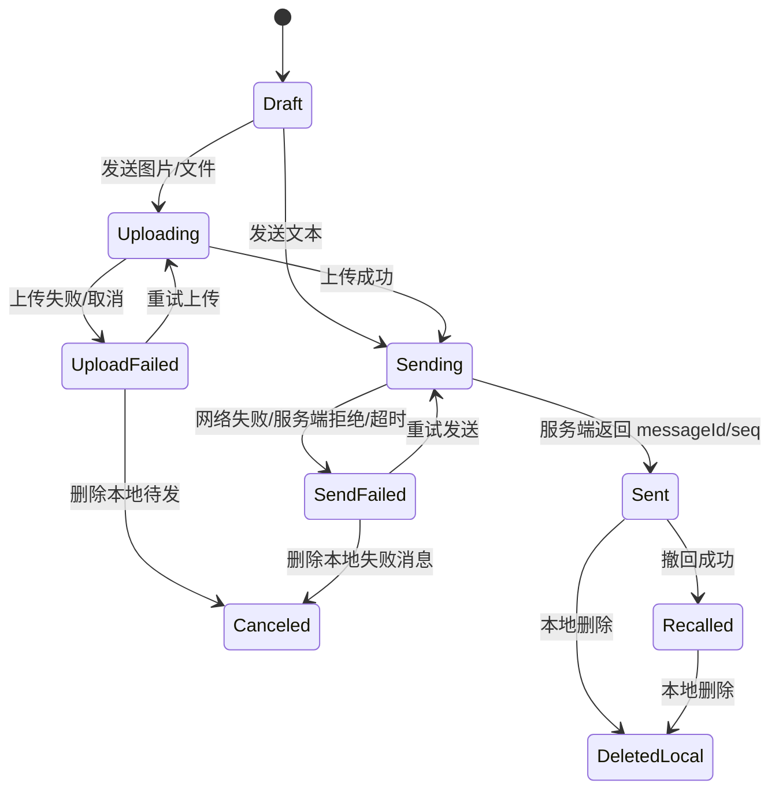
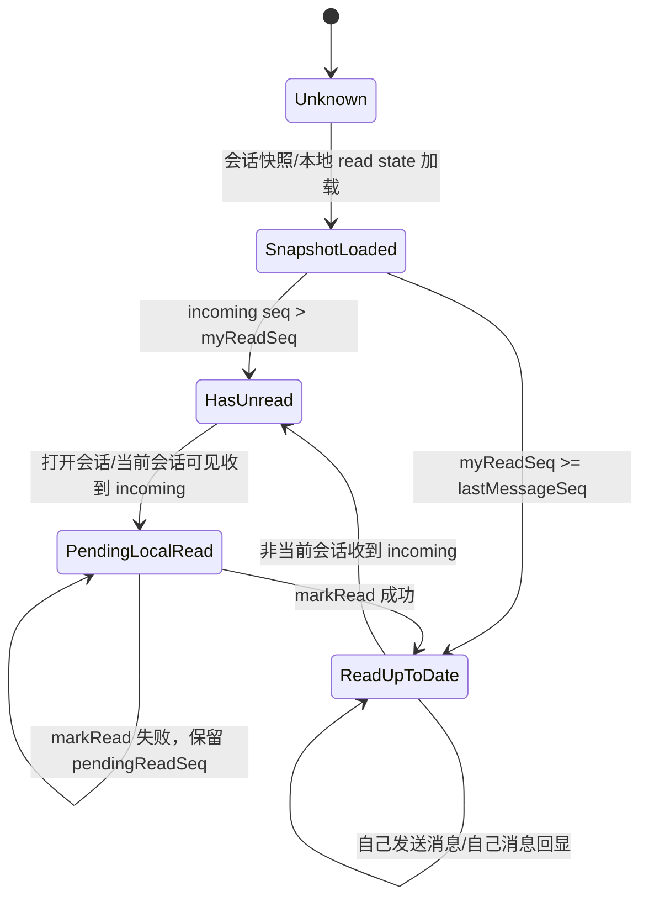
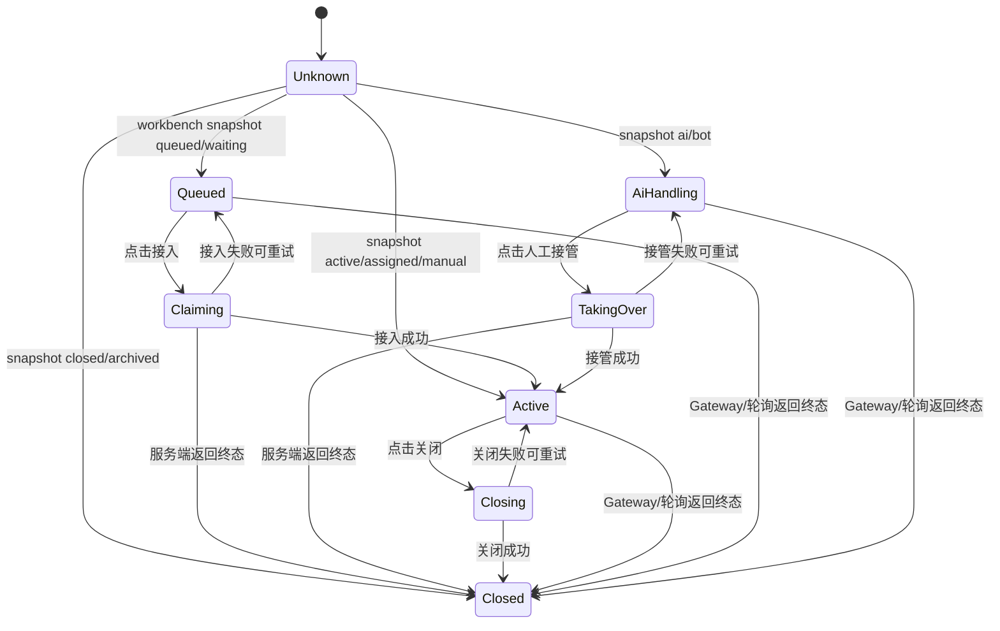
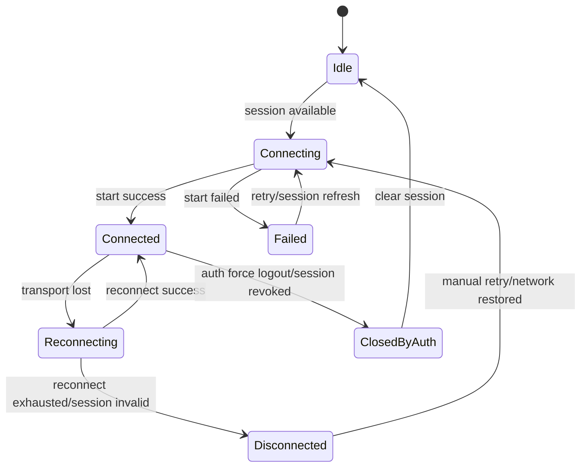
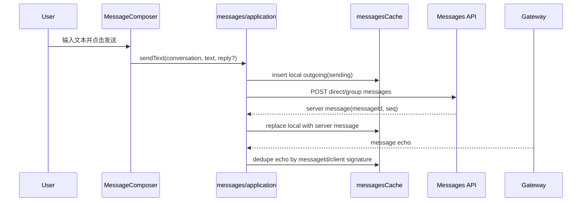
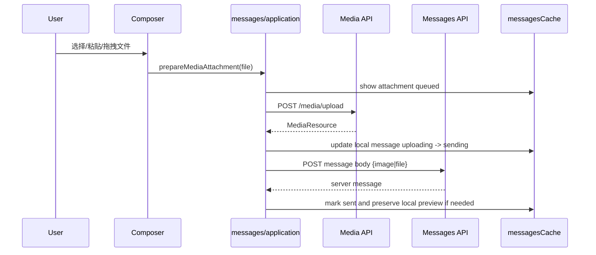
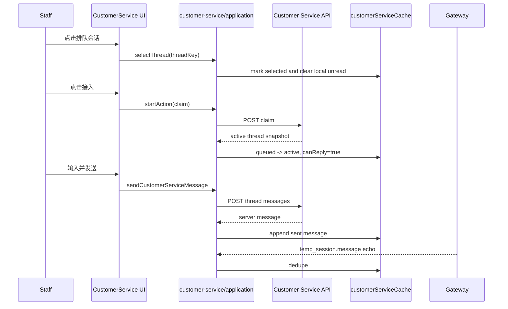
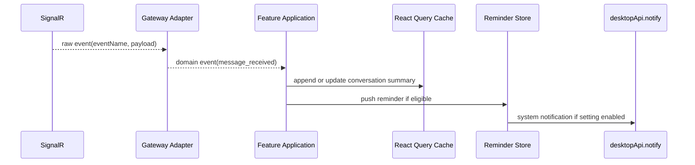

# PC 端核心架构技术方案

状态：重构主方案

日期：2026-05-29

适用范围：`lpp/lpp_pc_client`

目标读者：后续参与 PC 客服 IM 客户端重构、功能开发、测试验收和代码审查的工程师与 agent。

---

## 1. 结论

PC 客户端继续采用 `Electron + React + TypeScript + Vite + React Query + Zustand + SignalR`。技术路线本身成立，当前问题不是选型错误，而是业务复杂度已经超过现有实现的架构承载能力。

后续重构以本文档为 PC 端主依据；`lpp/docs/03-技术方案.md` 继续作为 App 技术方案、业务口径和接口规则参考，不再作为 PC 端重构主方案。

PC 端重构目标：

1. 核心链路稳定：登录、空间、普通 IM、在线客服、Gateway、媒体、通知、诊断和 Electron 能力有明确状态流与测试保护。
2. 模块边界清晰：IM、在线客服、联系人、账号设置、桌面能力分域；React 组件不拥有协议解析、状态机和缓存合并规则。
3. 可以持续加功能：后续新增 AI 助手、工单、数据中心、多窗口、音视频、质检审计时，不再把逻辑继续堆进 `MessageCenter`、`ChatWorkspace`、`GatewayBridge` 或全局 store。

推荐策略：渐进式架构迁移。不推倒重写，不一次性大搬家，不在重构中新增无关功能。

---

## 2. 当前方案问题判断

### 2.1 原 `03-技术方案.md` 的定位问题

`lpp/docs/03-技术方案.md` 是以 Flutter 移动端为主体的技术方案。它对业务规则、接口、token 域、在线客服状态、App/PC 职责拆分有价值，但它没有定义 PC 端 React/Electron 的工程分层、状态职责、Gateway 适配、IPC 安全和桌面性能策略。

因此，它适合回答：

- App 和 PC 的业务口径是否一致。
- `temp_session` 是否应进入普通消息。
- admin token 和 tenant token 如何区分。
- 客服接待状态、AI 接管、终态只读、缺接口空态等产品规则。

它不适合回答：

- PC React 组件如何分层。
- React Query 和 Zustand 各自管什么。
- SignalR 事件如何转 domain event。
- Electron preload 暴露哪些能力。
- token 在桌面端如何安全存储。
- 消息列表长数据如何渲染。
- 后续重构如何分阶段落地。

### 2.2 当前 PC 实现暴露的问题

当前 PC 端已经进入功能扩张期，主要问题集中在以下文件和职责：

| 文件 | 当前问题 | 影响 |
| --- | --- | --- |
| `src/renderer/components/MessageCenter.tsx` | 普通 IM 页面承载会话选择、查询、发送、已读、媒体、菜单、历史、转发、群成员、布局等多重职责。 | 改一个 IM 功能容易影响未读、发送、媒体和 UI；难以单测。 |
| `src/renderer/components/ChatWorkspace.tsx` | 在线客服页面承载客服线程、消息、媒体、通知、状态判断、客户资料、动作权限。 | 客服状态机分散，排队/接入/接管/关闭容易不一致。 |
| `src/renderer/components/GatewayBridge.tsx` | 同时负责 SignalR 连接、事件识别、IM 缓存更新、客服缓存更新、提醒、已读命令。 | 实时主链路无法作为独立模块测试，字段兼容逻辑过度集中。 |
| `src/renderer/data/store.ts` | 登录态、布局、设置、IM 已读、客服状态、提醒混合。 | 全局状态过宽，模块间容易形成隐式耦合。 |
| `src/main/main.ts` | 主进程承担窗口、IPC、截图、媒体、本地文件、通知等能力，部分窗口安全配置不一致。 | Electron 安全边界不够硬，后续能力扩展风险变大。 |
| `src/renderer/styles/app.css` | 单文件样式体量过大。 | 视觉迭代和模块拆分时易产生样式串扰。 |

### 2.3 架构根因

当前问题不是某个组件写得长，而是已有局部模块化基础尚未形成 PC 端统一主架构约束：

1. 已有 `composer`、`media`、`messages` 等局部业务目录，但核心链路仍主要集中在 `components/data/lib` 旧结构中。
2. 已有部分 domain/runtime/hook 抽象，但全局尚未稳定执行 domain/application/infrastructure/presentation 的职责边界。
3. Gateway 已有 read model 测试辅助函数，但事件入口仍依赖 `GatewayBridge` 内部函数，没有独立 adapter/dispatcher/handler 模块。
4. 普通 IM 和在线客服都在复用消息展示能力，但状态机和业务入口没有被清晰区分。
5. 已有 `PcAvatar` 等公共能力基础，但头像、空态、错误态、媒体预览等能力仍存在局部重复实现，尚未形成统一公共能力治理。
6. Electron 能力通过 `desktopApi` 暴露，但缺少输入校验、权限分层和安全存储策略。
7. TypeScript 已开启 strict，工程质量脚本可跑核心测试，但缺少 lint、format、coverage、bundle 分析、Electron 安全检查。

---

## 3. 产品与技术目标

### 3.1 产品目标

PC 客户端是客服主力工作台，不是移动端简单放大版。

首要体验：

- 客服可以稳定处理普通 IM 和在线客服会话。
- 多会话切换、消息收发、图片文件、未读已读、接入接管、客户上下文不出错。
- 弱网、重连、服务端字段变化、终态会话、权限不足时有明确降级。
- 桌面通知、托盘、文件打开、截图、诊断包等能力可控可靠。

### 3.2 技术目标

1. 核心链路可测试
   - Gateway 原始事件必须能单测归一化结果。
   - 消息 normalize、local echo、server echo、read model、客服状态机必须能单测。
   - UI 只验证交互和装配，不承担核心业务规则测试。

2. 状态流可追踪
   - 服务端快照、Gateway 事件、用户操作、本地缓存、Electron 事件都必须进入明确 adapter。
   - 状态变化必须能追溯输入来源。

3. 分层边界稳定
   - 组件不直接解释接口字段。
   - 组件不直接改 React Query 缓存。
   - 组件不直接决定未读数、客服动作权限、发送状态终态。
   - Electron 主进程能力必须通过 typed + validated IPC adapter 使用。

4. 可渐进迁移
   - 每一阶段都保持可运行。
   - 每一阶段都能通过相关测试。
   - 不为了目录美观一次性重排所有文件。

### 3.3 技术治理原则

PC 端重构不是单纯拆文件，必须同时治理技术选型、公共能力、文档和任务状态。

1. 技术栈合理性评估
   - 现有 `Electron + React + TypeScript + Vite + React Query + Zustand + SignalR` 默认继续沿用，但每个核心技术都必须说明使用边界。
   - 如果发现当前技术不适合继续承担某类职责，必须先形成评估结论，再找项目负责人确认，不能在代码中直接替换。
   - 新增依赖必须说明：解决什么问题、为什么现有能力不够、是否有成熟社区方案、维护成本、包体影响、安全影响、替代方案。

2. 不重复造轮子
   - 优先使用项目已有能力，例如 React Query 管服务端快照、Zustand 管客户端 UI/会话状态、SignalR 管实时连接、已有 normalizer 管字段兼容。
   - 对成熟通用问题优先采用成熟库或框架能力，例如虚拟列表、日期处理、schema 校验、错误边界、表单管理；确需自研时必须说明原因。
   - 禁止为同一能力在不同页面各写一套实现。

3. 公共能力抽象
   - 头像、消息气泡、用户标识、时间格式、空态、错误态、媒体预览、上传状态、权限动作、通知提醒等属于公共能力，不应散落在多个页面重复实现。
   - 公共能力必须按稳定程度分层：纯 UI 放 `shared/ui`，业务实体展示放 `entities/*`，业务用例放 `features/*/application`。
   - 公共组件不得反向依赖具体业务页面。

4. 文档和状态可查
   - 总体方案可查：架构原则、边界、阶段、验收标准必须在主方案中记录。
   - 总体步骤可查：从地基到 Gateway、Store、API、客服、IM、Electron、性能的阶段顺序必须明确。
   - 具体任务可查：每个重构任务必须有编号、范围、风险、验收方式。
   - 任务状态可查：每个任务必须有状态，阶段结束必须更新矩阵和遗留问题。

5. 职责优先于行数
   - 后续治理不以“单独降低文件大小”为目标，而以职责边界清晰、修改路径稳定、核心 IM 行为可验证为目标。
   - 文件大小只是预警信号：页面/组件 700 行以上、data/main/preload/shared 450 行以上、CSS 2000 行以上进入审查。
   - 超过阈值的文件必须先判断 owner、变化原因、层级边界和稳定入口；职责单一可以登记例外，职责混杂才拆分。
   - 具体执行规则见 `PC端代码职责治理规范.md`。

### 3.4 执行规范与 skills 映射

本文档不仅是重构方案，也是 PC 端后续开发、重构、测试、审查的执行依据。后续任何 PC 端任务默认遵守本节，不需要每次重复口头提醒。

当前可用于约束前端任务的能力分为两类：

1. 本文档内置规范
   - 架构分层：domain/application/infrastructure/presentation/app/main/preload。
   - 技术栈边界：React Query、Zustand、SignalR、Electron IPC 各自职责。
   - 公共能力治理：头像、空态、错误态、时间、badge、媒体预览、通知等不得重复散落实现。
   - 验收门禁：类型检查、单测/集成测试、核心链路手工验证、必要 E2E/性能/安全检查。

2. Codex 执行时可参考的技能类型
   - 前端架构/组件实现：`frontend-patterns`、`design-taste-frontend`、`impeccable`。
   - UI/交互/可访问性：`web-design-guidelines`、`accessibility-compliance`。
   - 性能：`performance`。
   - 测试：`tdd-workflow`、`test-driven-development`、`e2e-testing`、`webapp-testing`。
   - 安全：`security-and-hardening`、`error-handling`。
   - 质量审查：`code-review-and-quality`、`differential-review`。
   - 文档和决策记录：`documentation-and-adrs`、`architecture-decision-records`。

任务执行时不要求机械调用所有技能，而是按任务类型选择最小必要集合：

| 任务类型 | 必须遵守的规范 | 推荐参考技能 |
| --- | --- | --- |
| Gateway/实时链路 | typed event、adapter、dispatcher、handler、异常隔离、测试闭环 | `error-handling`、`tdd-workflow`、`code-review-and-quality` |
| Store/状态边界 | 客户端状态与服务端快照分离，持久化 key 可迁移，禁止扩大单一 store | `frontend-patterns`、`code-review-and-quality` |
| API/数据模型 | DTO -> Domain -> ViewModel，字段降级规则可查，不在页面拼协议字段 | `api-design-principles`、`error-handling`、`tdd-workflow` |
| 页面瘦身 | 页面只做装配和交互，业务规则下沉，公共能力优先复用 | `frontend-patterns`、`impeccable`、`web-design-guidelines` |
| 公共 UI 能力 | 不重复造轮子，组件不反向依赖业务页面，具备空态/错误态/可访问性 | `design-taste-frontend`、`accessibility-compliance` |
| Electron/IPC/Token | payload 校验、最小能力暴露、敏感信息不落 renderer 明文长期存储 | `security-and-hardening`、`error-handling` |
| 性能治理 | 先测量再优化，明确预算，避免无证据优化 | `performance`、`webapp-testing` |
| 任务完成审查 | diff 审查、测试证据、文档同步、风险登记 | `code-review-and-quality`、`differential-review` |

如果某任务需要引入新库、替换技术、扩大公共抽象或删除核心链路旧逻辑，必须先进入“待确认”状态，由项目负责人确认后执行。

### 3.5 单任务执行契约

每个重构任务必须自带执行要求。任务矩阵中的每个任务默认继承以下契约：

1. 任务开始前
   - 确认任务编号、阶段、目标、文件范围、风险等级、验收等级。
   - 检查是否涉及新增依赖、替换技术、自研成熟能力、公共能力抽象、核心链路旧代码删除。
   - 如果涉及关键风险点，先标记为“待确认”。

2. 实现过程中
   - 优先复用已有项目能力和成熟库，不重复造轮子。
   - 不把 Gateway raw payload、API raw DTO、复杂 cache merge 写进页面组件。
   - 不扩大 `GatewayBridge`、`MessageCenter`、`ChatWorkspace`、全局 store 的职责。
   - 新代码必须落到对应层：domain/application/infrastructure/presentation/shared/entities。

3. 验收时
   - 至少满足任务矩阵中的验收等级。
   - P0/P1 任务必须有测试或明确手工验证记录。
   - 文档、任务状态、遗留问题必须同步更新。
   - 未执行的验证命令必须说明原因。

4. 任务完成后
   - 更新任务状态。
   - 记录修改范围、验证命令、验证结果、遗留风险。
   - 如果发现后续任务，需要新增任务编号，不在当前任务里顺手扩大范围。

---

## 4. 目标架构

### 4.1 总体架构

```text
Electron Main
  Window / Tray / Notification / File / Screenshot / Secure Storage
        |
        v
Electron Preload
  Typed desktopApi + payload validation + capability boundary
        |
        v
Renderer App
  Providers / QueryClient / Error Boundary / Layout Shell
        |
        v
Feature Applications
  messages / customer-service / contacts / account / settings
        |
        v
Domain Models
  message / conversation / read model / thread state / media / identity
        |
        v
Infrastructure Adapters
  HTTP API / Gateway / React Query cache / local storage / desktop IPC
        |
        v
Presentation
  React components, hooks for view model binding, CSS modules by feature
```

### 4.2 推荐目录结构

```text
src/
  main/
    app/
    ipc/
    media/
    screenshot/
    security/
    windows/
  preload/
    desktop-api/
  shared/
    desktop-api.ts
    contracts/

  renderer/
    app/
      App.tsx
      queryClient.ts
      errorBoundary.tsx
      appShell/

    features/
      messages/
        domain/
        application/
        infrastructure/
        presentation/
        tests/
      customer-service/
        domain/
        application/
        infrastructure/
        presentation/
        tests/
      contacts/
      account/
      settings/
      workbench/

    entities/
      message/
      conversation/
      customer/
      identity/
      media/

    shared/
      api/
      gateway/
      ipc/
      storage/
      diagnostics/
      ui/
      lib/
      styles/
```

这是目标形态，不要求一次性迁移。迁移时遵循“新模块进新结构，旧模块按切片迁移”的原则。

### 4.3 分层职责

| 层 | 可以做 | 禁止做 |
| --- | --- | --- |
| `domain` | 纯业务状态机、字段归一、派生规则、权限判断、状态转换。 | 调 React、React Query、Zustand、window、desktopApi、fetch。 |
| `application` | 编排用例，例如发送消息、标记已读、接入会话、关闭会话、处理 Gateway domain event。 | 直接解析后端脏字段；直接渲染 UI。 |
| `infrastructure` | HTTP client、Gateway client、React Query cache adapter、storage adapter、IPC adapter。 | 决定业务规则；把原始后端字段直接传给 UI。 |
| `presentation` | React 组件、用户交互、视觉状态、无障碍、局部 UI state。 | 直接改缓存、决定未读数、决定客服动作权限、拼协议字段。 |
| `app` | 全局 provider、ErrorBoundary、模块路由/装配、全局样式和布局。 | 写具体业务状态机。 |
| `main/preload` | Electron 窗口和受控桌面能力。 | 把 Node 能力直接暴露给 renderer。 |

文件角色补充约束：

1. 页面文件只保留页面装配、布局、hook 连接和局部 UI 状态。
2. 组件文件只保留展示、用户交互、事件抛出和无障碍状态。
3. hook/controller 处理异步行为、命令编排、mutation 和副作用隔离。
4. model 处理纯规则、状态派生和格式化前的数据判断。
5. data/api 处理 DTO、client、contract 和错误模型。
6. data/cache/store 处理状态 owner、缓存更新、持久化和迁移。
7. main/preload 处理 Electron 能力、安全校验和受控 IPC 边界。

---

## 5. 核心业务域

### 5.1 普通 IM 域

普通 IM 只承载 `direct` 和 `group`。

核心能力：

- 会话列表
- 会话筛选：全部、未读、好友、群聊
- 文本、emoji、图片、文件、视频只读预览、语音只读预览
- 回复、转发、撤回、删除、收藏、翻译
- 草稿
- 消息搜索和类型筛选
- 未读已读
- Gateway 实时消息和 read receipt
- local outgoing 与 server echo 合并

普通 IM 不承载：

- 在线客服临时访客会话 `temp_session`
- 客服接入、接管、关闭
- 客服 SLA 和队列状态
- 管理端只读监管

### 5.2 在线客服域

在线客服只承载 `temp_session` 和明确归属客服工作台的数据。

核心能力：

- 队列、进行中、历史
- 接待状态：在线、忙碌、暂停、离线
- 会话状态：排队、AI 接待、人工接待、关闭、历史只读
- 接入、人工接管、关闭
- 客服消息收发
- 客户画像、来源渠道、临时订单、工单摘要
- SLA 和超时展示
- 队列提醒、新消息提醒、终态同步

在线客服不承载：

- 普通好友/群聊未读
- 企业群发
- 完整管理后台
- 客户详情全量交易报表

### 5.3 联系人与组织域

核心能力：

- 好友
- 好友申请
- 企业成员
- 部门与组织
- 群聊列表
- 客户列表入口
- 创建单聊/群聊入口

联系人域可以发起会话创建，但不拥有消息发送状态机。

### 5.4 账号与空间域

核心能力：

- 登录
- 租户/空间选择
- token 刷新
- 退出登录
- 当前身份
- 平台 token、tenant token、admin token 作用域
- 线路切换

账号域必须为其他域提供只读 identity/session context，不允许其他域自行解析 token 权限。

### 5.5 桌面能力域

核心能力：

- 系统通知
- 托盘
- 本地文件打开/保存
- 媒体缓存
- 截图
- 诊断包导出
- 后续自动更新、多窗口、全局快捷键

桌面能力通过 `desktopApi` 暴露给 renderer，但 renderer 只能调用受控能力，不能直接使用 Node。

---

## 6. 状态管理方案

### 6.1 状态来源分类

| 状态类型 | 示例 | 归属 |
| --- | --- | --- |
| 服务端事实 | 会话列表、消息历史、客服线程、客户画像、好友、组织。 | React Query |
| 本地业务补偿 | local outgoing、pending read、草稿、本地已读补偿。 | domain state + storage adapter |
| UI 临时状态 | 弹窗、菜单坐标、输入框高度、筛选面板打开。 | component local state |
| 全局客户端偏好 | 主题、密度、字体、托盘偏好、通知偏好。 | Zustand settings slice |
| 账号会话 | 当前登录身份、空间、token 引用、权限摘要。 | account/session store + secure storage |
| 桌面能力状态 | 托盘状态、窗口状态、截图流程。 | Electron main + IPC adapter |

### 6.2 React Query 职责

React Query 只管理服务端数据缓存：

- query key 必须包含空间/租户隔离维度。
- mutation 成功后不得在组件里随意拼缓存；应调用 feature application service 或 cache adapter。
- Gateway 更新缓存也必须通过对应 feature 的 cache adapter。
- 不在 query cache 里存 UI 打开状态、菜单状态、草稿编辑器状态。

推荐：

```ts
messagesCache.applyEvent(queryClient, event)
customerServiceCache.applyEvent(queryClient, event)
```

不推荐：

```ts
queryClient.setQueriesData(...复杂业务合并逻辑...)
```

直接写在 React 组件中。

### 6.3 Zustand 职责

Zustand 用于低频、跨页面、客户端级状态：

- 当前模块
- 当前会话 ID
- 当前在线客服线程 ID
- 布局宽度和密度
- 客户端设置
- 本地提醒列表
- 当前登录 session 摘要

Zustand 不应承载：

- 后端会话列表
- 后端消息列表
- 复杂消息状态机
- 客服线程完整详情
- API 原始返回数据

### 6.4 本地持久化职责

本地持久化必须通过 storage adapter：

```text
shared/storage/
  authSessionStorage.ts
  imReadStateStorage.ts
  draftStorage.ts
  pcSettingsStorage.ts
```

禁止在 feature 组件中直接散落 `localStorage.getItem/setItem`。

敏感 token 不应长期保存在 renderer `localStorage`；后续迁移到 Electron main 的安全存储。

---

## 7. 普通 IM 核心链路方案

### 7.1 核心状态模型

普通 IM 使用会话级 read cursor 和消息 timeline 模型。

核心实体：

```ts
type ImConversationType = "direct" | "group";

interface ImConversationIdentity {
  conversationType: ImConversationType;
  conversationId: string;
  conversationKey: string;
}

interface ImReadState {
  conversationKey: string;
  myReadSeq: number;
  peerReadSeq: number;
  lastMessageSeq: number;
  unreadCount: number;
  pendingReadSeq?: number;
  updatedAt: number;
}

interface ImTimelineState {
  conversationKey: string;
  messages: ImMessageState[];
  localOutgoing: ImMessageState[];
  hasMoreBefore?: boolean;
  diagnostics: ImDiagnostic[];
}
```

### 7.2 消息发送链路

```text
User input
  -> MessageComposer presentation
  -> sendMessage use case
  -> create local outgoing message
  -> media upload if needed
  -> API send
  -> merge server response
  -> update query cache through messages cache adapter
  -> Gateway echo dedupe
```

规则：

1. local message 必须有 `localId/clientMsgId`。
2. server message 返回后，以 server `messageId/conversationSeq/sentAt` 收敛。
3. server echo 和 local outgoing 通过 `clientMsgId`、messageId 或稳定签名去重。
4. 发送失败保留消息，允许重试或删除。
5. 自己发送的消息不产生当前用户未读。
6. 媒体上传和消息发送是两个阶段，UI 必须能区分上传失败和发送失败。

### 7.3 已读未读链路

普通 IM 以后续已有 `PC IM 已读未读模型重构方案` 为准，并归入本文档架构。

原则：

- 未读数不直接等于服务端原始 `unreadCount`。
- `myReadSeq` 只能前进。
- 打开会话是读行为，但只推进到已知可读位置。
- Gateway read receipt、HTTP read status、polling snapshot 都进入同一个 read reducer。
- UI 只展示 read model 派生结果。

### 7.4 消息展示链路

消息 body 归一化在 domain 层完成：

- text
- markdown-lite
- image
- file
- video
- voice
- location
- contact
- call
- event/system
- unsupported

React 组件只按 normalized part 渲染，不自己猜字段。

### 7.5 普通 IM 禁止项

- 禁止在 `MessageCenter` 中新增大块业务规则。
- 禁止组件直接根据后端原始字段推导 unread。
- 禁止 `temp_session` 混入普通 IM 列表。
- 禁止前端伪造置顶、免打扰、隐藏等跨端持久化能力。
- 禁止把服务端缺字段伪装成确定展示。

---

## 8. 在线客服核心链路方案

### 8.1 核心状态模型

在线客服以后续已有 `PC 在线客服核心机制重构方案` 为核心依据，并归入本文档架构。

核心实体：

```ts
type CustomerServiceThreadType = "temp_session" | "im_direct";

type CustomerServiceBucket =
  | "queued"
  | "active"
  | "ai_handling"
  | "closed"
  | "history";

interface CustomerServiceThreadState {
  key: string;
  threadType: CustomerServiceThreadType;
  threadId: string;
  conversationId?: string;
  status: string;
  bucket: CustomerServiceBucket;
  title: string;
  source?: string;
  unreadCount: number;
  canReply: boolean;
  action: "claim" | "takeover" | "close" | "none";
  messages: CustomerServiceMessageState[];
  diagnostics: CustomerServiceDiagnostic[];
}
```

### 8.2 在线客服状态规则

| 服务端状态 | bucket | 主动作 | 输入区 |
| --- | --- | --- | --- |
| `queued` / `waiting` / `pending` | `queued` | 接入 | 禁用 |
| `ai` / `ai_handling` / `bot` | `ai_handling` | 人工接管 | 禁用 |
| `active` / `assigned` / `serving` / `manual` | `active` | 关闭 | 启用 |
| `closed*` / `archived` / `ended` | `closed` 或 `history` | 无 | 禁用 |

状态判断集中在 `customer-service/domain`，UI 不写自己的状态字符串判断。

### 8.3 接入/接管/关闭链路

```text
UI click
  -> customerServiceApplication.startThreadAction
  -> optimistic pending state
  -> API action
  -> domain reduce action result
  -> cache adapter update
  -> UI view model update
```

失败策略：

- 权限失败：显示无权限，刷新线程。
- 已关闭：切换只读，禁用输入。
- 已被他人接入：刷新线程，展示当前接待人/状态。
- 网络失败：保留原状态，允许重试。

### 8.4 客服消息链路

客服消息和普通 IM 共享消息展示、媒体、上传组件，但不共享会话状态机。

共享：

- message body normalize
- media domain
- upload state
- message bubble presentation
- image/video/file components

不共享：

- read model
- conversation list reducer
- customer service thread action
- claim/takeover/close
- SLA/status badge

### 8.5 在线客服禁止项

- 禁止把 `temp_session` 放进普通消息中心。
- 禁止终态会话继续允许发送。
- 禁止 UI 自己决定接入/接管/关闭按钮。
- 禁止从当前页列表数量推断全局客服统计。
- 禁止缺服务端字段时伪造 SLA、风险、客户等级。

---

## 9. Gateway 实时链路方案

### 9.1 目标

Gateway 是 PC 客户端核心链路，不是页面附属逻辑。后续必须从 `GatewayBridge` 中抽离成独立模块。

目标结构：

```text
shared/gateway/
  gatewayClient.ts
  gatewayConnectionState.ts
  gatewayEvent.ts

features/messages/infrastructure/
  imGatewayAdapter.ts
  imRealtimeCacheAdapter.ts

features/customer-service/infrastructure/
  customerServiceGatewayAdapter.ts
  customerServiceRealtimeCacheAdapter.ts

features/messages/application/
  handleImRealtimeEvent.ts

features/customer-service/application/
  handleCustomerServiceRealtimeEvent.ts
```

### 9.2 Gateway 事件处理流程

```text
SignalR raw event
  -> gatewayClient emits GatewayRawEvent
  -> feature adapter parses raw payload
  -> Domain event
  -> application service reduces event
  -> cache adapter updates React Query
  -> store adapter updates local/global state when needed
  -> notification service emits reminders/system notifications
```

### 9.3 事件分类

| 事件域 | 示例 | 处理模块 |
| --- | --- | --- |
| 普通 IM 消息 | `msg.new`, `message.new`, `im.message.new` | `messages` |
| IM 已读/撤回 | `msg.read`, `msg.recalled` | `messages` |
| 在线客服队列 | `temp_session.created`, `customer_service.queued` | `customer-service` |
| 在线客服消息 | `temp_session.message`, `customer_service.message.new` | `customer-service` |
| 在线客服状态 | `temp_session.assigned`, `temp_session.closed`, `customer_service.status_changed` | `customer-service` |
| 好友/通讯录 | `friend.request.*`, `presence.changed` | `contacts` / `messages` |
| 强制退出 | `auth.force_logout`, `auth.session.revoked` | `account` |
| 空间通知 | `space.notice` | `app` / `messages` / `workbench` |

### 9.4 Gateway 降级策略

1. Gateway 断开时，页面仍能通过 polling 使用。
2. 重连成功后刷新普通 IM 和在线客服关键 query。
3. 如果服务端支持 `/sync`，由 application service 执行增量补偿。
4. Gateway 原始字段缺失时，adapter 输出 diagnostic，不让 UI 猜测。
5. CORS/Origin 等环境问题必须记录到服务端支持文档，不能用 mock 结果宣称实时链路可用。

---

## 10. API 与接口合同方案

### 10.1 API client 分层

目标结构：

```text
shared/api/
  baseClient.ts
  apiError.ts
  envelope.ts
  trace.ts

features/account/infrastructure/
  accountApi.ts

features/messages/infrastructure/
  messagesApi.ts

features/customer-service/infrastructure/
  customerServiceApi.ts

features/contacts/infrastructure/
  contactsApi.ts
```

### 10.2 token 域

| token | 用途 | PC 要求 |
| --- | --- | --- |
| platform token | 登录、租户、空间、签发 admin token。 | 不能调 client/admin 业务写接口。 |
| tenant token | `/api/client/v1/*`、`/ws/client`。 | 普通业务和 Gateway。 |
| admin token | `/api/admin/v1/*`。 | 只能通过 admin API client 使用。 |
| refresh token | 刷新会话。 | 不暴露给普通 UI 组件。 |

### 10.3 错误处理

API 层必须统一抛出 `ApiError`：

- `code`
- `message`
- `requestId`
- `status`
- `traceId`
- `retryable`

UI 只展示脱敏后的错误文案；诊断和日志保留 requestId/traceId。

### 10.4 接口字段兼容原则

字段兼容可以在 adapter 中做，不能散落在组件中。

示例：

```ts
normalizeThreadSource(raw, ["source", "from", "channel", "sourceChannel"])
```

允许兼容读取多个历史字段，但必须输出稳定 domain 字段。

---

## 11. Electron 安全与桌面能力方案

### 11.1 安全原则

1. Renderer 不直接使用 Node。
2. Renderer 不持有任意文件系统能力。
3. Preload 只暴露白名单 API。
4. IPC payload 必须校验。
5. 主进程执行本地能力前必须校验来源、参数和路径。
6. token 不长期存 renderer localStorage。
7. 外部链接只允许安全协议和可信打开方式。

### 11.2 `desktopApi` 能力分组

目标 API 分组：

```ts
window.desktopApi = {
  notification: {},
  media: {},
  file: {},
  screenshot: {},
  diagnostics: {},
  shell: {},
  auth: {},
  window: {},
}
```

当前平铺 API 可以渐进迁移，但新增 API 必须按分组设计。

### 11.3 token 存储

阶段目标：

1. 当前阶段：减少 token 在日志、诊断、URL、错误中的暴露。
2. 下一阶段：把 auth session 持久化迁移到 main process。
3. 稳定阶段：renderer 只持有运行期短期 session 摘要；refresh token 和长期 token 通过 main/preload adapter 获取。

### 11.4 媒体和文件安全

媒体下载必须校验：

- 协议：默认只允许 `https:`
- host：默认限制在当前 API base host 或服务端签名 URL allowlist
- size：大文件上限
- content-type：图片/视频/文件类型
- path：本地缓存目录必须在 app userData 下

本地文件打开必须校验：

- 路径来自受控缓存或用户显式选择
- 不允许消息体直接传本地绝对路径并打开
- 不允许 renderer 要求主进程打开任意目录或执行任意命令

### 11.5 截图窗口

截图 overlay 不应使用 `nodeIntegration: true`。目标方案：

- 独立 screenshot preload
- `contextIsolation: true`
- `nodeIntegration: false`
- 只暴露 `sendSelectionResult` 和 `onScreenshotSource`

---

## 12. 性能方案

### 12.1 必须优化的场景

| 场景 | 风险 | 方案 |
| --- | --- | --- |
| 单会话 1000/10000 消息 | 全量 DOM 渲染卡顿。 | 虚拟列表。 |
| 多图片/视频聊天 | 解码、缓存、网络并发过高。 | 懒加载、预取限流、本地缓存。 |
| 会话列表 500/2000 项 | 排序/筛选重算和 DOM 过多。 | memoized selector + virtualization。 |
| 客服队列高频刷新 | 轮询和 Gateway 重复 invalidation。 | 事件合并、cache adapter 精准更新。 |
| CSS 单文件过大 | 样式串扰和维护困难。 | feature CSS 分割、设计 token。 |
| Vite chunk 不受控 | 首屏 bundle 过大。 | manualChunks + bundle analyzer。 |

### 12.2 消息虚拟列表

目标：

- `ChatTimeline` 使用虚拟列表。
- 支持新消息追加到底部。
- 支持跳转未读/搜索结果。
- 支持图片加载后高度变化。
- 支持粘底策略。

推荐库：`@tanstack/react-virtual`。

迁移顺序：

1. 先抽 `ChatTimeline`，保持普通 map 渲染。
2. 加入稳定 row key 和估算高度。
3. 开启 virtualization。
4. 加搜索跳转和新消息跳转适配。

### 12.3 网络与缓存

原则：

- Gateway 能精确更新就不全量 invalidation。
- mutation 成功后优先局部合并，再按需后台 refetch。
- 高频查询设置合理 `staleTime` 和 `refetchInterval`。
- 当前窗口不可见时降低轮询频率。

### 12.4 Bundle 策略

建议 Vite 配置：

- React 基础包独立 chunk。
- Lexical 编辑器独立 chunk。
- SignalR 独立 chunk。
- 二维码、AI、知识库、数据中心等低频模块 lazy chunk。
- 增加 bundle 分析脚本。

---

## 13. 工程质量方案

### 13.1 必备脚本

`package.json` 应补齐：

```json
{
  "scripts": {
    "lint": "eslint .",
    "format": "prettier --write .",
    "format:check": "prettier --check .",
    "test:coverage": "vitest run tests/unit --coverage",
    "audit": "npm audit --audit-level=moderate",
    "analyze": "vite build --mode analyze"
  }
}
```

实际引入 ESLint、Prettier、coverage 和 analyzer 时，应单独提交，避免和业务重构混在一起。

### 13.2 测试分层

| 测试类型 | 覆盖对象 | 示例 |
| --- | --- | --- |
| Unit | domain reducer、adapter、normalize、selectors。 | read model、customer service core、media state。 |
| Integration | application service + cache adapter。 | Gateway event 更新 query cache。 |
| Browser E2E | 关键用户路径。 | 登录后消息、发送、未读、客服接入。 |
| Electron E2E/人工 | 桌面能力。 | 文件打开、系统通知、托盘、截图。 |
| Contract | API 字段和错误码。 | Gateway payload、thread detail、message body。 |

### 13.3 重构验收规则

每个重构切片必须满足：

1. 行为不变或变更明确记录。
2. 有新增或调整的单元测试。
3. 相关 browser test 通过。
4. 不引入无关功能。
5. 不扩大组件职责。
6. 不把服务端缺口用前端假逻辑掩盖。

### 13.4 代码审查红线

禁止合入：

- 新增 500 行以上页面组件且无拆分计划。
- 在组件中新增协议字段兼容逻辑。
- 在组件中直接 `setQueriesData` 写复杂业务合并。
- 在多个位置重复判断客服终态或接待动作。
- 在 renderer 直接写敏感 token 到 localStorage。
- 新增 Electron IPC 但无 payload 校验。
- Gateway 新事件只在 UI 里临时处理，无 adapter 测试。

---

## 14. 迁移路线

### 阶段 0：基线审计与方案冻结

目标：

- 本文档成为 PC 重构主依据。
- 明确 `03-技术方案.md` 不再承担 PC 主架构职责。
- 梳理当前已有专项方案、当前代码状态、技术栈合理性、已有公共能力。
- 冻结阶段路线、任务矩阵、验收规则和关键风险确认规则。

产出：

- `docs/refactor/PC端核心架构技术方案.md`
- `docs/refactor/PC端第一阶段重构详细方案.md`
- `docs/refactor/PC端重构任务矩阵.md`
- 后续可补 ADR：`ADR-PC-001: Adopt layered feature architecture for PC client`

验收：

- 技术栈评估规则明确。
- 不重复造轮子和公共能力治理规则明确。
- 总体方案、总体步骤、任务清单、任务状态均可查。

### 阶段 1：标准地基 + Gateway 试点

目标：

- 建立 Gateway 事件入口边界。
- 建立 typed event、adapter、dispatcher、handler 的最小闭环。
- 第一轮只覆盖普通 IM 收消息事件和未读更新。
- 形成类型检查、单测/集成测试、核心链路手工验证闭环。

新增模块：

```text
src/renderer/data/gateway/gateway-event-types.ts
src/renderer/data/gateway/gateway-event-adapter.ts
src/renderer/data/gateway/gateway-dispatcher.ts
src/renderer/data/gateway/im-gateway-handler.ts
src/renderer/data/gateway/im-gateway-cache.ts
```

验收：

- 普通 IM 新消息进入消息 cache。
- 非当前会话未读更新。
- `msg.read` 更新 read model。
- temp_session/客服消息不进入普通 IM handler。
- `GatewayBridge` 保留连接生命周期，业务处理开始迁出。

### 阶段 2：Store 边界治理

目标：

- 拆分全局 Zustand store 的职责边界。
- auth、ui layout、settings、IM read、CS status、realtime reminders 不再混在单一 workspace store 中持续扩张。
- 保持持久化 key 迁移可控。

迁移顺序：

1. auth session 边界。
2. settings store/service。
3. workspace-ui store。
4. im-read state/repository。
5. customer-service status store。
6. realtime reminders store。

验收：

- 登录、切换模块、IM 当前会话、客服状态、设置持久化行为保持不变。
- Gateway 新模块不再扩大旧 store 职责。
- 每个 store 有明确 owner 和持久化边界。

### 阶段 3：API 合同与数据模型治理

目标：

- 建立 DTO -> Domain -> ViewModel 的固定路径。
- 普通 IM、在线客服、联系人、媒体接口字段依赖可查。
- 页面不直接解释服务端脏字段。

迁移顺序：

1. 普通 IM 会话列表合同。
2. 普通 IM 消息列表合同。
3. 普通 IM 写接口合同。
4. 客服线程列表/详情合同。
5. Gateway payload 合同。
6. API error model 和用户可见错误映射。

验收：

- 字段缺失、降级、阻断规则明确。
- 页面拿到 ViewModel，而不是 raw DTO。
- 关键接口有合同测试或 fixture。

### 阶段 4：统一消息底座

目标：

- 统一 message、conversation、read model、media、send queue。
- 让普通 IM 和在线客服共享底层消息能力，但保留各自业务状态机。
- 避免消息展示、媒体、发送状态在两个业务中重复实现。

迁移顺序：

1. `entities/message`
2. `entities/conversation`
3. `entities/media`
4. `features/messages/application/sendMessage`
5. `features/messages/application/applyRealtimeEvent`
6. `features/messages/infrastructure/messagesCache`

验收：

- local echo、server echo、sending、sent、failed、retry 状态一致。
- readSeq/localRead/peerRead 规则可测试。
- 媒体消息展示和上传状态可复用。

### 阶段 5：普通 IM 页面瘦身

目标：

- `MessageCenter` 抽出 view model 和 application service。
- 会话列表、消息列表、composer、菜单、转发、群成员、资料面板逐步从大页面迁出。
- 普通 IM 作为统一消息底座的第一条完整验证链路。

迁移顺序：

1. `useMessageCenterViewModel`
2. `ConversationListContainer`
3. `MessageListContainer`
4. `MessageComposerContainer`
5. `MessageActions`
6. `ConversationInfoPanel`

验收：

- 普通 IM 已读测试通过。
- 图片/文件发送测试通过。
- 转发/撤回/删除/收藏 refetch 一致。
- `MessageCenter` 不再直接拥有复杂 cache merge。
- 页面只负责装配和交互，不解释 Gateway raw payload。

### 阶段 6：在线客服核心重构

目标：

- `ChatWorkspace` 和 `ThreadList` 使用 customer-service core。
- 接入、接管、关闭、终态只读、未读提醒统一状态机。
- 客服 Gateway 消息事件和线程状态事件进入 typed event。

迁移顺序：

1. `customer-service/domain/threadState`
2. `customer-service/domain/threadPermission`
3. `customer-service/application/applyThreadSnapshot`
4. `customer-service/application/sendCustomerServiceMessage`
5. `customer-service/infrastructure/customerServiceCache`
6. `customer-service/presentation/ChatWorkspacePage`

验收：

- queued 只能接入不能发消息。
- AI 接待只能人工接管不能直接发。
- active 可发消息。
- closed/history 只读。
- 当前会话消息不产生全局未读。

### 阶段 7：公共能力与 UI 体系收敛

目标：

- 收敛头像、用户展示、时间、空态、错误态、badge、媒体预览、上传状态、通知提醒。
- 已有 `PcAvatar` 等能力优先复用和升级，不重复造轮子。
- `app.css` 中可按业务归属拆分的样式逐步迁出。

迁移顺序：

1. 公共能力清单和重复实现登记。
2. Avatar/Identity 展示统一。
3. EmptyState/ErrorState/Badge 统一。
4. Message media preview 统一。
5. Feature style 分层。

验收：

- 同一公共能力不再多处重复实现。
- 公共组件不依赖具体业务页面。
- 视觉和交互行为保持一致。

### 阶段 8：Electron 安全、性能与工程门禁

目标：

- 截图 overlay 安全化。
- IPC payload 校验。
- token 存储迁移设计落地。
- 媒体 URL 和本地文件能力收紧。
- 消息列表虚拟化、包体分析、启动性能、lint/format/coverage/audit/CI 门禁落地。

优先文件：

```text
src/main/main.ts
src/main/media-storage.ts
src/preload/preload.cts
src/shared/desktop-api.ts
src/renderer/shared/ipc/
package.json
vite.config.ts
tests/unit/*
tests/browser/*
```

验收：

- renderer 无新增 Node 能力。
- screenshot overlay 禁用 nodeIntegration。
- 不允许打开任意本地路径。
- 诊断包不含 token。
- 1000 条消息滚动稳定。
- 500 会话列表筛选不卡顿。
- 多图片会话不明显阻塞首屏。
- 首屏 chunk 可解释。
- `npm run typecheck`、`npm run test:unit`、`npm run build`、browser smoke tests 通过。

---

## 15. 新功能开发规则

后续任何 PC 新功能必须先回答：

1. 属于哪个 feature？
2. 是否需要 domain 规则？
3. 是否需要 application use case？
4. 是否需要 infrastructure adapter？
5. 是否会影响 Gateway？
6. 是否会影响 Electron IPC？
7. 是否需要服务端接口合同更新？
8. 是否有最小测试？

新增代码默认位置：

- 纯规则：`features/<feature>/domain`
- 用例：`features/<feature>/application`
- API/Gateway/cache/storage：`features/<feature>/infrastructure`
- UI：`features/<feature>/presentation`
- 跨功能基础能力：`shared`
- 跨业务实体：`entities`

---

## 16. 与现有文档关系

| 文档 | 后续定位 |
| --- | --- |
| `lpp/docs/03-技术方案.md` | App 主技术方案 + 业务口径总览。 |
| `lpp/docs/17-PC端准备与复用方案.md` | PC 产品定位和首版范围参考。 |
| `lpp/lpp_pc_client/docs/superpowers/specs/2026-05-28-pc-im-read-model-design.md` | 普通 IM 已读模型专项设计。 |
| `lpp/lpp_pc_client/docs/superpowers/specs/2026-05-28-pc-customer-service-core-design.md` | 在线客服核心机制专项设计。 |
| 本文档 | PC 端架构和重构主方案。 |

如果文档冲突，PC 端工程架构以本文档为准；业务口径冲突时，先对照 `03-技术方案.md` 和服务端接口合同，再更新本文档。

---

## 17. 最终验收标准

PC 重构完成不是看目录是否漂亮，而是看以下结果：

1. `MessageCenter` 和 `ChatWorkspace` 退回页面装配职责。
2. `GatewayBridge` 只负责连接生命周期和事件分发装配。
3. 普通 IM 和在线客服都有独立 domain/application。
4. React Query cache 更新集中在 cache adapter。
5. Zustand 不再承载后端事实数据和复杂业务状态机。
6. Electron IPC 有类型和校验，危险能力不暴露给 renderer。
7. token 不再以长期明文方式保存在 renderer localStorage。
8. 消息列表支持大数据场景。
9. Gateway、消息发送、已读、客服状态机有稳定单测。
10. 后续新增功能能清楚落到某一层，而不是继续堆进大组件。

---

## 18. 审查清单

每次重构 PR 或 agent 任务完成后，用以下清单自查：

- 是否保持业务行为不变？
- 是否新增或更新测试？
- 是否把业务规则从 UI 下沉到 domain/application？
- 是否避免把普通 IM 和在线客服状态混用？
- 是否避免在组件里直接解析 Gateway 原始 payload？
- 是否避免在组件里直接写复杂 React Query cache merge？
- 是否按空间/token 维度隔离 query key 和本地缓存？
- 是否没有新增敏感信息落 localStorage、日志或诊断包？
- 是否没有新增无校验 IPC？
- 是否没有用假数据掩盖服务端缺口？
- 是否更新了对应文档？

---

## 19. 推荐下一步

下一步不应该继续泛泛审计，而应按本文档进入执行：

1. 以本文档和任务矩阵冻结 PC 端 0-8 阶段路线。
2. 执行第一阶段详细方案：标准地基 + Gateway 试点。
3. 第一轮只覆盖普通 IM 收消息事件和未读更新，形成测试闭环。
4. 阶段结束后更新任务状态、验收记录和后续阶段风险。

第一轮建议任务：

```text
重构 GatewayBridge：
1. 新增 data/gateway gateway-event-types。
2. 新增 gateway-event-adapter。
3. 新增 gateway-dispatcher。
4. 新增 im-gateway-handler 和 im-gateway-cache。
5. 为 adapter/dispatcher/handler 写单测。
6. GatewayBridge 只保留连接生命周期和新入口装配。
```

这一刀风险低、收益高，能把实时主链路从组件大分支中拆出第一道可测试边界，并为后续 Store、API、消息底座、`MessageCenter` 和 `ChatWorkspace` 重构打基础。

---

## 20. 核心状态机

本节定义 PC 端必须稳定收敛的核心状态机。后续代码实现可以拆分文件，但状态转换口径不能散落在 UI 组件中。

### 20.1 普通 IM 消息发送状态机



规则：

- `Draft` 只存在于输入区或草稿存储，不进入消息 timeline。
- `Uploading` 表示媒体资源未完成上传，不能调用消息发送接口。
- `Sending` 表示消息体已经具备服务端可接收结构。
- `Sent` 必须具备服务端 `messageId`，有条件时必须具备 `conversationSeq`。
- `UploadFailed` 和 `SendFailed` 必须区分，UI 文案和重试动作不同。
- `Canceled` 和 `DeletedLocal` 都是本机视觉状态，不代表服务端事实。
- `Recalled` 是服务端事实，刷新后必须仍可恢复。

### 20.2 普通 IM 已读状态机



规则：

- `myReadSeq` 只能前进。
- `pendingReadSeq` 表示本地已经认为读到，但服务端未确认。
- UI 不能直接把 `serverUnreadCount` 展示为最终未读；必须经过 read model 派生。
- 自己发送的消息必须推进本端 read cursor 到该消息 seq。
- 当前会话可见时收到 incoming，应生成幂等 mark read command。

### 20.3 在线客服线程状态机



规则：

- `Queued` 只能接入，不能发送人工消息。
- `AiHandling` 只能人工接管，不能直接人工发送。
- `Active` 可以发送，可以关闭。
- `Closed` 永远只读。
- 所有点击动作进入 pending 状态，防止重复点击。
- 任何写操作返回终态错误时，线程立即进入只读并触发 refetch。

### 20.4 Gateway 连接状态机



规则：

- Gateway 是实时加速器，不是唯一数据源；断开时 UI 仍使用 HTTP。
- `Connected` 后必须 heartbeat 或保持服务端要求的活跃机制。
- `Reconnecting -> Connected` 后必须刷新 IM 和客服关键 query，必要时执行 `/sync`。
- `ClosedByAuth` 必须清理 QueryClient、session、敏感本地状态。

---

## 21. 核心链路时序图

### 21.1 普通 IM 文本发送



必须满足：

- local outgoing 先出现，提升响应速度。
- 服务端返回后收敛为服务端事实。
- Gateway echo 不重复显示。
- API 成功但 Gateway 丢失时不影响最终显示。

### 21.2 普通 IM 媒体发送



必须满足：

- 上传失败不丢附件。
- 发送失败不重复上传已成功的媒体。
- 图片本地预览优先，服务端资源回填后仍能展示。
- 文件名、大小、mimeType 来自稳定 media model。

### 21.3 在线客服接入并发送



必须满足：

- 接入成功前输入区禁用。
- 接入失败不应本地伪造成 active。
- 接入后服务端状态为准。
- 当前会话的自己消息不产生未读。

### 21.4 Gateway 收到非当前会话消息



必须满足：

- Adapter 对原始字段兼容，但输出稳定 domain event。
- 当前会话和非当前会话提醒规则不同。
- 系统通知必须走统一 notification service，不在 adapter 中直接调用。

---

## 22. API 合同与字段依赖矩阵

本节列出 PC 核心链路的最低字段要求。字段缺失不是 UI 小问题，而是会直接影响状态机能否安全运行。

### 22.1 普通 IM 会话列表

接口：

- `GET /api/client/v1/conversations`

最低字段：

| 字段 | 必需 | 用途 | 缺失降级 |
| --- | --- | --- | --- |
| `conversationId` | 是 | 会话主键。 | 阻断该会话展示，记录 diagnostic。 |
| `conversationType` | 是 | 区分 direct/group/temp_session。 | 无法确定入口，阻断或过滤。 |
| `title` / 可用名称字段 | 否 | 列表标题。 | 使用兜底标题，但记录字段缺失。 |
| `lastMessage` | 否 | 摘要展示。 | 显示空摘要。 |
| `lastMessageSeq` | 强建议 | read cursor 和排序。 | 不能精确处理 read cursor，只能降级。 |
| `lastReadSeq` | 强建议 | 我的已读游标。 | 使用本地 read state，跨端不保证。 |
| `unreadCount` | 强建议 | 未读条数输入。 | 不能精确显示未读，只能用已加载消息推导。 |
| `updatedAt` / `lastMessageAt` | 是 | 排序。 | 排序降级，记录 diagnostic。 |

### 22.2 普通 IM 消息历史

接口：

- `GET /api/client/v1/direct-chats/{conversationId}/messages`
- `GET /api/client/v1/groups/{conversationId}/messages`

最低字段：

| 字段 | 必需 | 用途 | 缺失降级 |
| --- | --- | --- | --- |
| `messageId` | 是 | 去重、操作、key。 | 使用临时 key 展示，撤回/删除/收藏不可用。 |
| `conversationId` | 是 | 归属校验。 | 阻断写入该 timeline。 |
| `conversationSeq` | 强建议 | 排序和 read cursor。 | 只能按时间排序，read 功能降级。 |
| `messageType` | 是 | body normalize。 | 按 body 推断，失败则 unsupported。 |
| `body` | 是 | 渲染内容。 | 显示 unsupported。 |
| `senderUserId`/`senderId`/身份字段 | 强建议 | 判断自己/对方。 | 使用 direction/isSelf；仍缺则标记 unknown。 |
| `sentAt` | 是 | 排序和展示。 | 使用接收时间，记录 diagnostic。 |

### 22.3 普通 IM 写接口

接口：

- `POST /api/client/v1/direct-chats/{conversationId}/messages`
- `POST /api/client/v1/groups/{conversationId}/messages`
- `POST /api/client/v1/media/upload`

返回最低字段：

| 字段 | 必需 | 用途 | 缺失降级 |
| --- | --- | --- | --- |
| `messageId` | 是 | 将 local outgoing 收敛为 server message。 | 保留 sending/unknown，触发 refetch。 |
| `conversationSeq` | 强建议 | read cursor 和排序。 | 触发 refetch，read 降级。 |
| `sentAt` | 是 | 展示和排序。 | 使用客户端时间，标记 provisional。 |
| `body` / `media resource` | 强建议 | 服务端事实回显。 | 保留本地 body，后台 refetch。 |

### 22.4 在线客服线程列表

接口：

- `GET /api/client/v1/customer-service/workbench/threads`
- `GET /api/client/v1/customer-service/staff/service-history`

最低字段：

| 字段 | 必需 | 用途 | 缺失降级 |
| --- | --- | --- | --- |
| `threadId` | 是 | 线程主键。 | 阻断该线程。 |
| `threadType` | 是 | 区分 temp_session/im_direct。 | 不能进入客服 core。 |
| `status` | 是 | 状态机。 | 输入区禁用，记录 blocking diagnostic。 |
| `title` / `visitorName` | 否 | 展示。 | 使用“访客”。 |
| `conversationId` | 否 | 消息链路辅助。 | 仅使用 threadId。 |
| `unreadCount` | 强建议 | 客服未读。 | 使用本地增量，等待 snapshot 收敛。 |
| `lastMessagePreview` | 否 | 摘要。 | 空摘要。 |
| `lastMessageAt` | 强建议 | 排序。 | 排序降级。 |
| `source` / `channel` | 否 | 来源渠道。 | 显示未知来源，不伪造。 |

### 22.5 在线客服线程详情

接口：

- `GET /api/client/v1/customer-service/workbench/threads/{threadType}/{threadId}`
- `GET /api/client/v1/customer-service/workbench/threads/{threadType}/{threadId}/profile-card`

最低字段：

| 字段 | 必需 | 用途 | 缺失降级 |
| --- | --- | --- | --- |
| `threadId` | 是 | 归属校验。 | 阻断详情合并。 |
| `threadType` | 是 | 归属校验。 | 使用请求参数兜底并记录。 |
| `status` | 是 | 输入区/动作权限。 | 输入区禁用。 |
| `messages` | 是 | 聊天详情。 | 显示空消息和错误态。 |
| `profile-card` 基础身份 | 否 | 右侧客户上下文。 | 显示空态，不造假。 |
| 临时订单/工单摘要 | 否 | 客服上下文。 | 对应区域显示空态。 |

### 22.6 Gateway 事件合同

最低要求：

| 事件 | 必需字段 | 用途 |
| --- | --- | --- |
| IM 新消息 | conversationId、messageId、messageType、body、sender、sentAt、seq 推荐 | 追加 timeline、更新摘要、计算未读。 |
| IM 已读 | conversationId、reader identity、readSeq | 更新 peer/my read cursor。 |
| 客服新消息 | threadId 或 sessionId、message、sender、sentAt | 追加客服消息、提醒。 |
| 客服状态变化 | threadId、status、threadType | 更新接待状态和输入权限。 |
| 强制退出 | eventName、reason | 清 session。 |

Gateway adapter 必须能接受历史别名字段，但输出 domain event 时字段名称稳定。

---

## 23. 迁移执行任务表

本表把第 14 节路线变成可执行任务。每个任务应单独提交或形成独立 PR，避免把重构和功能扩展混合。

| 阶段 | 任务 | 主要文件 | 测试 | 完成标准 |
| --- | --- | --- | --- | --- |
| 0 | 冻结方案与任务矩阵 | `docs/refactor/*` | 文档审查 | 总体方案、步骤、任务、状态可查。 |
| 1 | 抽 Gateway event 类型 | `data/gateway/gateway-event-types.ts` | unit | 第一阶段 typed event 有稳定类型。 |
| 1 | 抽 Gateway adapter | `data/gateway/gateway-event-adapter.ts` | adapter unit | 多种普通 IM 消息事件归一为同一 typed event。 |
| 1 | 抽 Gateway dispatcher | `data/gateway/gateway-dispatcher.ts` | unit | handler 分发和异常隔离可测。 |
| 1 | 抽 IM gateway handler/cache | `data/gateway/im-gateway-*.ts` | unit/integration | 普通 IM 收消息和未读更新走新入口。 |
| 2 | 拆 auth/settings/ui/read/reminder 边界 | `data/store.ts`、新 store/service | unit + smoke | 全局 store 职责收敛。 |
| 3 | 建 API 合同矩阵 | `data/api/*`、contract tests | unit/contract | 页面不直接解释 raw DTO。 |
| 4 | 建统一消息底座 | `entities/message`、`features/messages/application` | unit | message/read/media/send queue 规则可复用。 |
| 5 | 抽 MessageCenter view model | `features/messages/presentation/*` | unit + browser | 普通 IM 页面退回装配职责。 |
| 6 | 抽客服 thread domain/cache/actions | `features/customer-service/*` | unit + browser | 客服状态机和动作权限稳定。 |
| 7 | 收敛公共能力 | `shared/ui`、`entities/*` | visual smoke | 头像、空态、错误态、媒体预览等不重复实现。 |
| 8 | IPC、安全、性能和工程门禁 | `main/*`、`preload/*`、`package.json` | unit/manual/perf | Electron 安全、性能预算、lint/coverage/CI 落地。 |

### 23.1 第一轮推荐任务定义

第一轮只做 Gateway 事件入口试点，不动 UI 大结构：

1. 新增 `src/renderer/data/gateway/gateway-event-types.ts`。
2. 新增 `src/renderer/data/gateway/gateway-event-adapter.ts`。
3. 新增 `src/renderer/data/gateway/gateway-dispatcher.ts`。
4. 新增 `src/renderer/data/gateway/im-gateway-handler.ts`。
5. 新增 `src/renderer/data/gateway/im-gateway-cache.ts`。
6. 为 adapter/dispatcher/handler 增加单元测试。
7. `GatewayBridge` 改为优先调用新入口，unsupported 事件继续走旧逻辑。

第一轮不做：

- 不拆 `MessageCenter`。
- 不重写 `ChatWorkspace`。
- 不引入虚拟列表。
- 不改视觉。
- 不改服务端 API。

---

## 24. 测试矩阵与验收门禁

### 24.1 必跑命令分层

| 场景 | 命令 | 什么时候跑 |
| --- | --- | --- |
| 类型检查 | `npm run typecheck` | 每次代码改动。 |
| 单元测试 | `npm run test:unit` | domain/application/infrastructure 改动。 |
| 构建 | `npm run build` | 合并前、发布前。 |
| 浏览器 E2E | `npm run test:browser` 或定向 Playwright | UI、流程、缓存改动。 |
| Electron 人工/E2E | 启动 Electron dev 或打包态 | IPC、文件、通知、截图、托盘。 |
| 安全检查 | `npm audit`、IPC 清单审查 | 依赖或 Electron 能力改动。 |

### 24.2 核心链路测试矩阵

| 链路 | Unit | Integration | Browser | Electron/Manual |
| --- | --- | --- | --- | --- |
| 登录/空间 | session storage、token 域 | QueryClient clear | 登录进入主界面 | 安全存储 |
| 普通 IM 发送文本 | send use case | cache merge | UI 发送和回显 | 系统通知点击 |
| 普通 IM 发送媒体 | upload state | media + message send | 选择/粘贴/拖拽 | 文件选择、打开目录 |
| IM 已读未读 | read reducer | markRead command | 红点、跳转提示 | 双端真实确认 |
| Gateway 新消息 | adapter | cache update | mock push 后 UI 更新 | 真实 SignalR |
| 客服接入 | thread reducer | action API result | queued -> active | 多客服并发 |
| 客服关闭 | thread reducer | 终态 cache merge | 输入区只读 | 真实终态 |
| 诊断导出 | redaction unit | payload builder | 设置页导出 | 文件保存 |

### 24.3 发布阻断门禁

以下任一情况未关闭，不允许宣布 PC 核心链路完成：

- 普通 IM 误清未读。
- 当前用户自己发送消息产生未读。
- Gateway echo 造成重复消息。
- `temp_session` 出现在普通消息列表。
- 终态客服会话仍能发送。
- queued/AI 状态下输入区可发送。
- token 出现在诊断包、日志、URL 或 localStorage 长期持久化中。
- Renderer 可以打开任意本地路径。
- 1000 条消息滚动出现明显卡顿且无虚拟化方案。
- 服务端字段缺失被前端假数据掩盖。

---

## 25. 性能预算与压测方案

### 25.1 性能预算

以下是 PC 客户端重构后的目标预算。具体数值可在真实设备基线后调整，但必须有预算意识。

| 指标 | 目标 | 说明 |
| --- | --- | --- |
| 应用冷启动到登录页 | 2s 内 | 开发机和普通办公 Windows 设备。 |
| 登录后主界面可交互 | 3s 内 | 不等待所有低频模块加载。 |
| 会话列表首屏 | 1s 内 | 100 会话。 |
| 会话切换到首屏消息 | 1s 内 | 1000 历史消息中加载最后页。 |
| 消息发送本地回显 | 100ms 内 | 不含网络往返。 |
| 文本发送服务端确认 | 2s 内 | 正常网络。 |
| 图片/文件上传进度出现 | 300ms 内 | 选择文件后。 |
| 1000 条消息滚动 | 无明显掉帧 | 必须虚拟化或分段渲染。 |
| 500 会话筛选 | 300ms 内 | 输入防抖后。 |
| Renderer 初始 JS | 可解释并分包 | 不把低频模块全部进首屏。 |

### 25.2 数据规模

| 数据 | 中规模 | 大规模 | 压测重点 |
| --- | --- | --- | --- |
| 会话数 | 500 | 2000 | 筛选、排序、未读红点。 |
| 单会话消息 | 1000 | 10000 | 渲染、跳转、图片高度变化。 |
| 图片消息 | 200 | 1000 | 缓存、懒加载、内存。 |
| 客服队列 | 200 | 1000 | 刷新、提醒、筛选。 |
| 联系人/客户 | 1000 | 10000 | 搜索、分组、虚拟列表。 |

### 25.3 压测方法

1. 建立本地 mock 数据生成器或 Playwright route mock。
2. 用 browser performance API 记录：
   - first render
   - conversation switch
   - scroll FPS
   - memory snapshot
   - diagnostics 导出后使用 `npm run perf:samples -- <diagnostics.json>` 计算 P50/P75/P95。
3. Electron 打包态补人工压测：
   - 长时间在线 2 小时
   - 多会话切换 100 次
   - 图片/文件连续发送
   - Gateway 断线重连

### 25.4 性能红线

- 冷启动到首个可交互界面 P75 目标不超过 2500ms；超过预算必须进入 `window.__lppStartupDiagnostics` 并能随诊断包导出。
- renderer entry 预算目标不超过 800ms；超过预算优先检查首屏同步 chunk、阻塞初始化和主进程启动等待。
- 禁止在消息区一次性渲染 1000+ 复杂消息 DOM。
- 禁止搜索输入每个字符都触发重查询和重排序。
- 禁止 Gateway 高频事件每条都全量 invalidate 所有消息 query。
- 禁止图片预取无并发限制。
- 禁止低频模块进入首屏同步 chunk。

---

## 26. Electron 安全威胁模型

### 26.1 威胁清单

| 威胁 | 风险 | 防线 |
| --- | --- | --- |
| XSS 读取 token | 攻击者通过消息内容或富文本执行脚本。 | 不使用危险 HTML；token 不长期在 renderer；CSP。 |
| IPC 滥用 | Renderer 调用主进程打开任意文件或 URL。 | 白名单 API、payload 校验、路径限制。 |
| 任意文件打开 | 消息体携带本地路径诱导打开。 | 只允许受控缓存和用户选择路径。 |
| 媒体 URL SSRF/滥用 | 下载任意 URL 到本地。 | 协议、host、size、content-type 校验。 |
| token 泄露到日志 | 诊断包、错误日志含 Authorization。 | redaction 统一处理。 |
| 不安全外链 | 打开 `file:`、`javascript:` 等危险协议。 | 只允许 http/https/mailto/tel，必要时 host allowlist。 |
| 截图窗口 Node 暴露 | overlay 开启 nodeIntegration。 | 独立 preload，禁用 nodeIntegration。 |
| 依赖漏洞 | Electron/前端依赖存在已知 CVE。 | audit、定期升级、最小依赖。 |

### 26.2 安全设计要求

1. 所有 IPC handler 必须有：
   - channel 常量
   - TypeScript payload 类型
   - runtime validator
   - 错误脱敏
   - 测试或人工验证记录

2. 所有来自消息体的数据默认不可信：
   - URL 不可信
   - 文件名不可信
   - mimeType 不可信
   - markdown 文本不可信
   - profile/card 字段不可信

3. 所有日志默认脱敏：
   - `Authorization`
   - `token`
   - `refreshToken`
   - `password`
   - `captcha`
   - `cookie`
   - 手机号、邮箱按场景脱敏

### 26.3 安全验收

安全专项完成前必须确认：

- `BrowserWindow` 主窗口 `nodeIntegration=false`、`contextIsolation=true`。
- screenshot overlay 同样满足隔离要求。
- preload 不暴露 `ipcRenderer` 原始对象。
- renderer 不调用 Node API。
- 诊断导出包搜索不到 token。
- 外链打开函数拒绝危险协议。
- 媒体下载拒绝非 allowlist URL。

---

## 27. 诊断与可观测性方案

### 27.1 诊断目标

PC 客户端要能回答这些问题：

- 这条消息为什么没发出去？
- 这条消息为什么重复了？
- 这个会话为什么未读数不对？
- 客服为什么不能回复？
- Gateway 是否连上？是否重连过？
- 服务端返回了哪个 requestId？
- 当前用户、空间、会话、线程上下文是什么？

### 27.2 Trace 上下文

所有核心请求和事件应携带或关联：

```ts
interface PcTraceContext {
  sessionId: string;
  traceId: string;
  requestId?: string;
  apiBaseUrl: string;
  tenantId?: string;
  userId?: string;
  activeModule?: string;
  conversationId?: string;
  conversationType?: string;
  threadId?: string;
  threadType?: string;
}
```

### 27.3 Breadcrumbs

至少记录以下事件：

| 事件 | 字段 |
| --- | --- |
| `app.login_succeeded` | tenantId、userId |
| `gateway.connected` | connectionId 可选 |
| `gateway.reconnecting` | reason |
| `gateway.event_received` | eventName、domain |
| `message.send_started` | conversationId、localId、type |
| `message.send_succeeded` | messageId、requestId |
| `message.send_failed` | code、requestId |
| `im.mark_read_started` | conversationId、readSeq |
| `im.mark_read_failed` | code、requestId |
| `cs.thread_action_started` | threadId、action |
| `cs.thread_action_failed` | code、requestId |
| `desktop.ipc_failed` | channel、safeCode |

### 27.4 诊断包内容

诊断包应包含：

- app version
- platform
- sessionId
- traceId
- active module
- recent breadcrumbs
- recent safe errors
- recent API requestId
- Gateway connection state
- feature diagnostics

诊断包不包含：

- token
- refreshToken
- password
- captcha
- full Authorization header
- 原始大消息 body
- 未脱敏客户敏感字段

### 27.5 告警级别

| 级别 | 示例 | 处理 |
| --- | --- | --- |
| blocking | 关键字段缺失导致无法判断状态。 | UI 保守禁用写操作，提示刷新。 |
| error | API 写失败、Gateway 断线超过阈值。 | 用户可见错误 + 诊断。 |
| warning | 字段降级、旧快照覆盖被拒绝。 | 不打扰用户，记录诊断。 |
| info | 连接成功、普通 refetch。 | 仅开发/诊断记录。 |

---

## 28. Definition of Done

### 28.1 单个重构任务 DoD

一个重构任务完成必须满足：

1. 改动范围和阶段目标一致。
2. 没有混入无关功能。
3. 关键逻辑有单元测试。
4. 相关 UI 有 browser smoke 或人工验证说明。
5. `npm run typecheck` 通过。
6. 相关测试通过。
7. 没有新增安全红线。
8. 没有新增服务端假数据。
9. 文档或注释更新到位。
10. 遗留风险明确记录。

### 28.2 一个阶段 DoD

一个迁移阶段完成必须满足：

- 阶段目标文件完成迁移。
- 旧路径没有继续新增同类复杂逻辑。
- 测试矩阵中对应行通过。
- 代码审查清单无阻断项。
- 性能或安全相关阶段有专项验证记录。

### 28.3 整体 PC 架构重构 DoD

整体重构完成必须满足：

1. 普通 IM 主链路稳定：
   - 文本、图片、文件发送闭环。
   - local echo/server echo/Gateway echo 不重复。
   - 未读已读规则一致。
   - 当前会话、非当前会话、自己消息行为正确。

2. 在线客服主链路稳定：
   - queued/AI/active/closed 状态正确。
   - 接入、接管、关闭可测。
   - 终态只读。
   - 客服消息和客户上下文一致。

3. Gateway 主链路稳定：
   - adapter 覆盖主事件。
   - 断线重连可降级。
   - 强制退出安全清理。

4. 桌面能力安全：
   - IPC 有校验。
   - token 安全策略落地。
   - 截图、媒体、本地文件能力受控。

5. 工程可持续：
   - 新增功能能按 feature/layer 落位。
   - 巨型组件不再继续增长。
   - 质量脚本和测试成为合并门禁。
   - 文档和 ADR 记录重大决策。

### 28.4 不算完成的情况

以下情况不能宣称完成：

- 只是移动了文件，但业务规则仍在 UI 中。
- 只是增加了目录，但 Gateway 仍由组件直接处理。
- 只是 mock 通过，但真实 API/Gateway 链路未验证。
- 只是浏览器通过，但 Electron IPC/文件/通知未验证。
- 只是没有报错，但缺字段时靠前端假数据展示。
- 只是当前账号可用，但多账号、多空间、权限边界未验证。

---

## 29. 文档维护规则

本文档是 PC 端架构主方案，必须随重构持续维护。

需要更新本文档的情况：

- 新增或调整核心状态机。
- 新增 Electron IPC 能力。
- 修改 token 存储策略。
- 修改 Gateway 事件处理方式。
- 修改普通 IM 或在线客服的状态边界。
- 引入新的性能策略或虚拟列表方案。
- 阶段迁移顺序发生变化。

不需要更新本文档的情况：

- 纯视觉微调。
- 单个文案调整。
- 不改变架构边界的小 bugfix。

重大决策应另外写 ADR，并在本文档第 16 节或相关章节引用。
