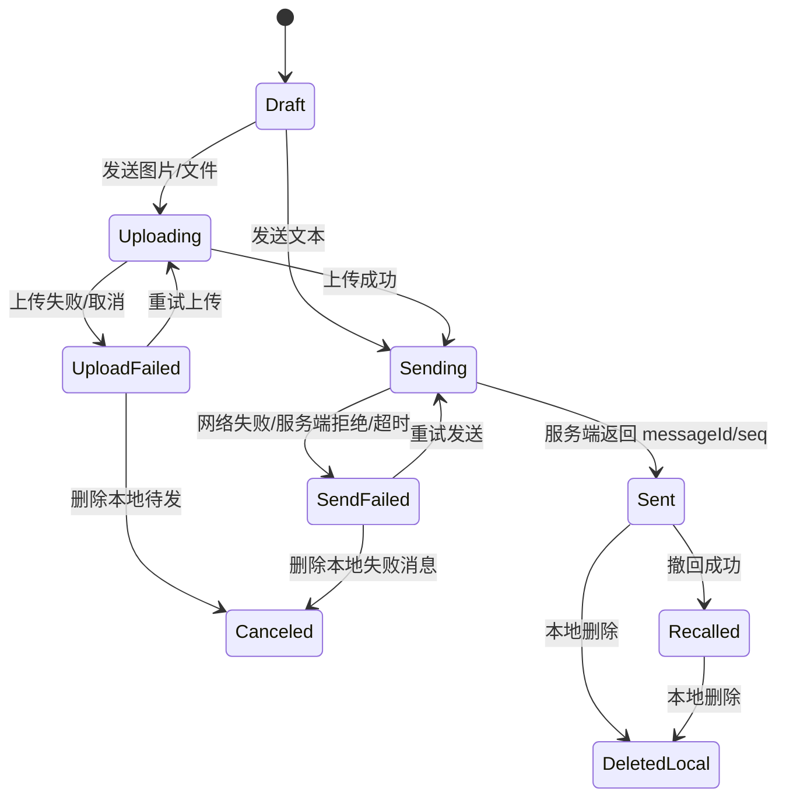
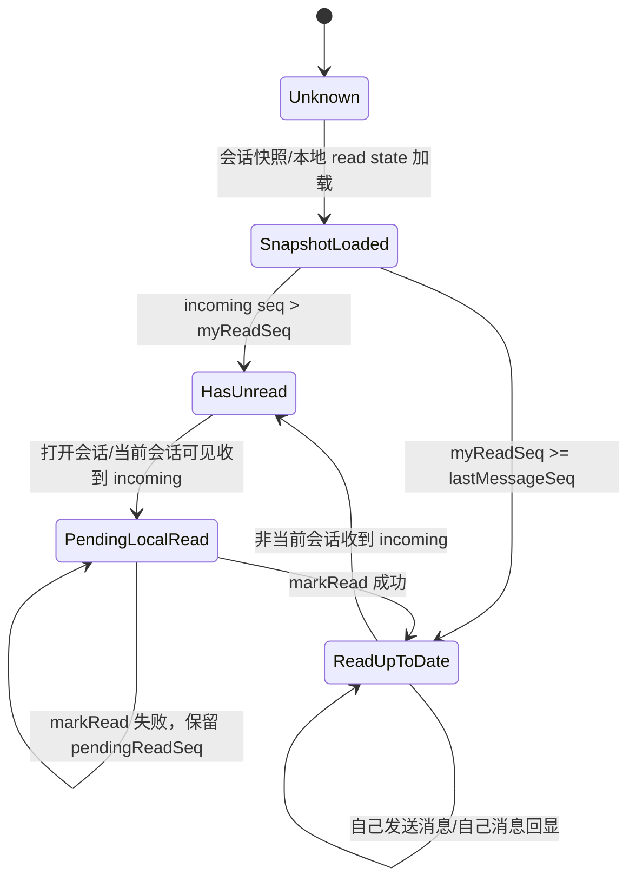
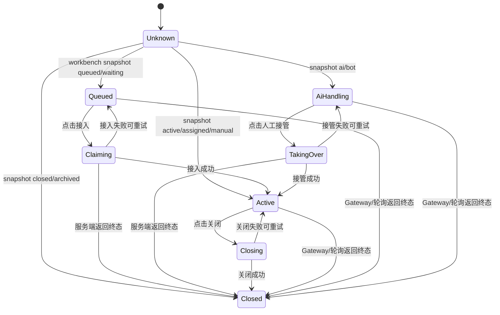
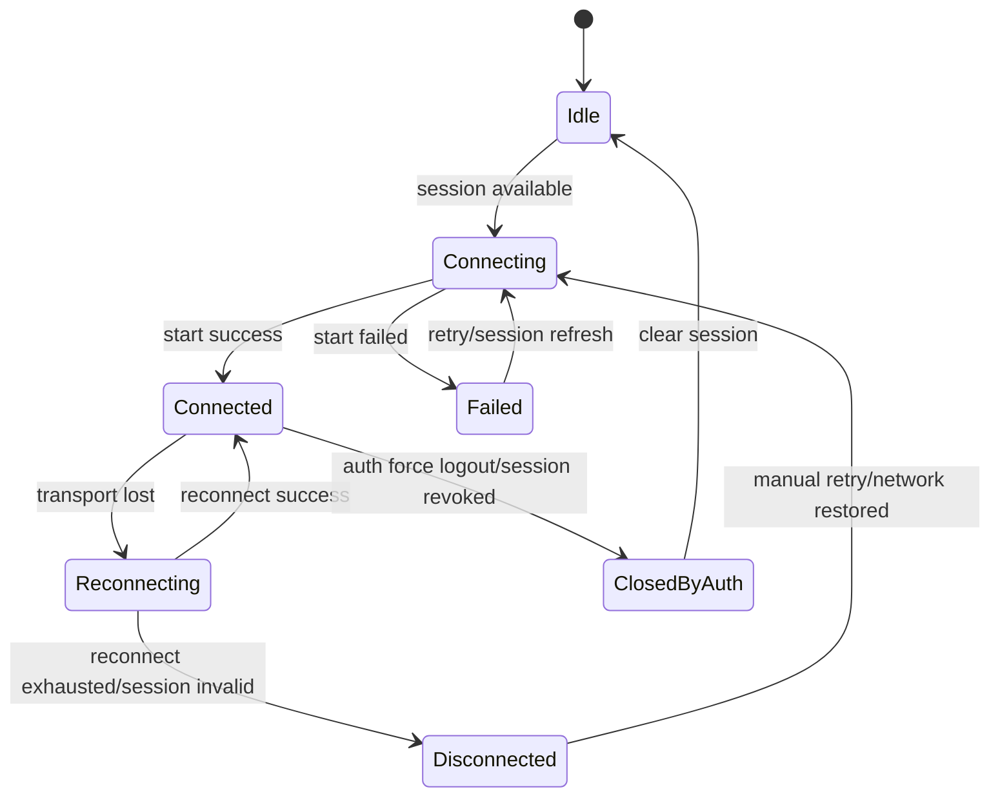
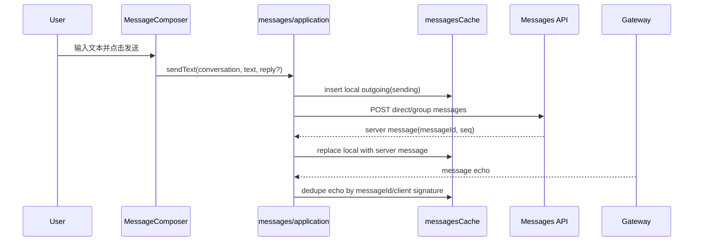
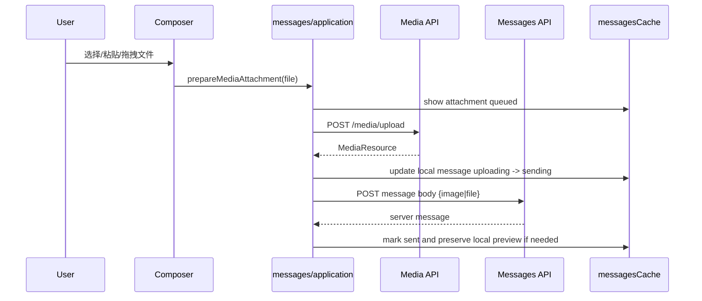
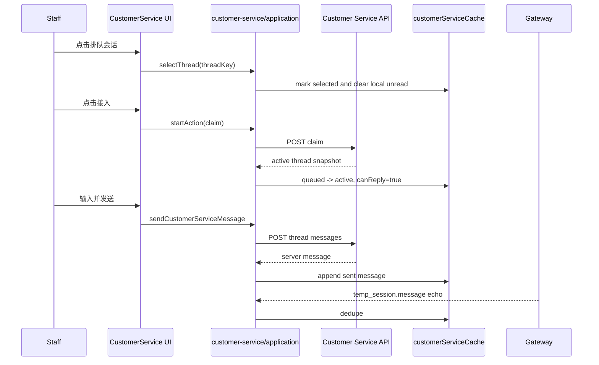
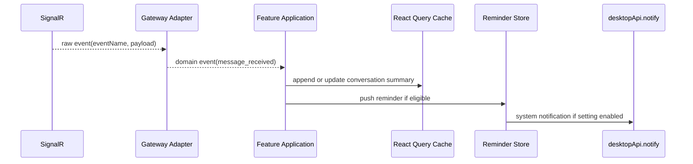

# PC 端核心链路状态机与时序

状态：冷参考

来源：从 `PC端核心架构技术方案.md` 拆出，供 L2/L3 核心链路任务按需读取。

适用范围：普通 IM、在线客服、Gateway 的状态机和时序判断。

---

## 20. 核心状态机

本节定义 PC 端必须稳定收敛的核心状态机。后续代码实现可以拆分文件，但状态转换口径不能散落在 UI 组件中。

### 20.1 普通 IM 消息发送状态机

规则：

- `Draft` 只存在于输入区或草稿存储，不进入消息 timeline。
- `Uploading` 表示媒体资源未完成上传，不能调用消息发送接口。
- `Sending` 表示消息体已经具备服务端可接收结构。
- `Sent` 必须具备服务端 `messageId`，有条件时必须具备 `conversationSeq`。
- `UploadFailed` 和 `SendFailed` 必须区分，UI 文案和重试动作不同。
- `Canceled` 和 `DeletedLocal` 都是本机视觉状态，不代表服务端事实。
- `Recalled` 是服务端事实，刷新后必须仍可恢复。

### 20.2 普通 IM 已读状态机

规则：

- `myReadSeq` 只能前进。
- `pendingReadSeq` 表示本地已经认为读到，但服务端未确认。
- UI 不能直接把 `serverUnreadCount` 展示为最终未读；必须经过 read model 派生。
- 自己发送的消息必须推进本端 read cursor 到该消息 seq。
- 当前会话可见时收到 incoming，应生成幂等 mark read command。

### 20.3 在线客服线程状态机

规则：

- `Queued` 只能接入，不能发送人工消息。
- `AiHandling` 只能人工接管，不能直接人工发送。
- `Active` 可以发送，可以关闭。
- `Closed` 永远只读。
- 所有点击动作进入 pending 状态，防止重复点击。
- 任何写操作返回终态错误时，线程立即进入只读并触发 refetch。

### 20.4 Gateway 连接状态机

规则：

- Gateway 是实时加速器，不是唯一数据源；断开时 UI 仍使用 HTTP。
- `Connected` 后必须 heartbeat 或保持服务端要求的活跃机制。
- `Reconnecting -> Connected` 后必须刷新 IM 和客服关键 query，必要时执行 `/sync`。
- `ClosedByAuth` 必须清理 QueryClient、session、敏感本地状态。

---

---

## 21. 核心链路时序图

### 21.1 普通 IM 文本发送

必须满足：

- local outgoing 先出现，提升响应速度。
- 服务端返回后收敛为服务端事实。
- Gateway echo 不重复显示。
- API 成功但 Gateway 丢失时不影响最终显示。

### 21.2 普通 IM 媒体发送

必须满足：

- 上传失败不丢附件。
- 发送失败不重复上传已成功的媒体。
- 图片本地预览优先，服务端资源回填后仍能展示。
- 文件名、大小、mimeType 来自稳定 media model。

### 21.3 在线客服接入并发送

必须满足：

- 接入成功前输入区禁用。
- 接入失败不应本地伪造成 active。
- 接入后服务端状态为准。
- 当前会话的自己消息不产生未读。

### 21.4 Gateway 收到非当前会话消息

必须满足：

- Adapter 对原始字段兼容，但输出稳定 domain event。
- 当前会话和非当前会话提醒规则不同。
- 系统通知必须走统一 notification service，不在 adapter 中直接调用。

---
