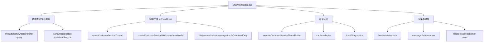

# P6-CS-005A CS Workspace 职责图

日期：2026-05-29

## 当前边界

## 判断

- 页面组件仍承担 React Query 的请求启停、mutation 生命周期和弹层状态，这是当前阶段的安全边界。
- 线程选择、详情装配、消息列表、回复门禁和只读状态已从页面散落判断迁入 `cs-workspace-view-model.ts`。
- 客服接入、接管、关闭命令已经通过 `cs-action-service.ts` 统一执行和记录，不再由页面直接拼业务规则。

## 后续可拆点

- 若 `ChatWorkspace.tsx` 继续增长，下一步应拆 `useCustomerServiceWorkspaceQueries` 与 `useCustomerServiceWorkspaceCommands`。
- 空态、错误态、终态文案进入 P6-CS-006 统一处理。
